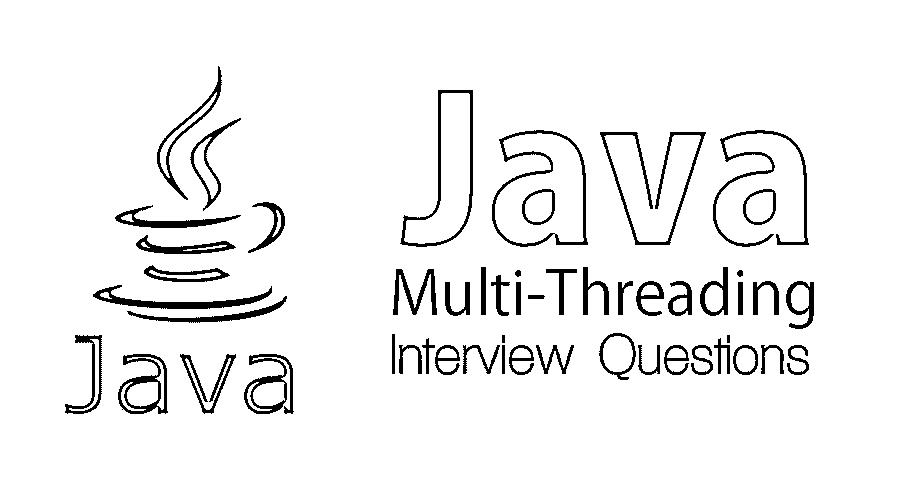

# Java 多线程面试问题

> 原文：<https://www.educba.com/java-multi-threading-interview-questions/>

## Java 多线程面试问答介绍

由于其独立的平台，Java 现在正蓬勃发展。它可以在任何地方运行，因此被广泛用于各种即将到来的技术。为了做好准备，多线程是面试中的一个重要话题。你终于在 Java 多线程领域找到了你的理想工作，但是想知道如何通过面试，以及 2022 年 Java 多线程面试可能会有哪些问题。每次面试都不一样，工作范围也不一样。让我们来看几个重要的 Java 多线程面试问题，这些问题可能会在您要参加的 Java 多线程面试中被问到。

### 第 1 部分——Java 多线程面试问题(基础)

第一部分包括基本的面试问题和答案

<small>网页开发、编程语言、软件测试&其他</small>

#### 1.JAVA 中的 Thread 是什么，怎么实现的？

**答:**
线程有助于促进程序内的多任务和多处理。它有效地利用了 CPU，有助于提高应用程序的性能。Java 允许用户一次使用多个线程。它可以与其他程序并行运行，没有任何中断。这有助于减少该过程的时间。例如，如果一个程序需要 60 秒来执行，我们可以使用 6 个线程，这将在 10 秒内给出结果。

Java 提供了两种在程序中实现线程的方法。接口 java.lang.Runnable 有一个实例 java.lang.A thread，需要通过实例执行任务。Thread 类已经实现了 Runnable，因此用户可以通过扩展 Thread 类或实现 Runnable 接口来直接覆盖 run()方法。

#### 2.Java 中什么时候用 Runnable，什么时候用 Thread？

**回答:**
Java 不支持一个类的多重继承，但是允许我们一次实现多个接口。所以实现 Runnable 会比扩展 Thread 类更好。

#### 3.如何区分线程和进程？

**回答:**
线程是进程的子集。一个进程可以有多个线程运行。线程可以运行进程的任何部分。一个进程有自己的存储地址，而线程共享创建它的进程的地址。创建一个进程是一个忙碌的过程，而线程可以很容易地创建。线程通常被称为轻量级进程。进程间通信很困难，而线程可以使用 Java 的 wait()和 notify()方法轻松通信。流程是独立的；因此，对流程所做的任何更改都不会影响子流程。相反，如果一个线程发生了变化，其他线程也有可能受到影响。

#### 4.为什么说线程的行为是不可预测的？

**答案:**
之所以这样，是因为线程调度器处理线程的执行。调度程序在不同的平台(Windows、UNIX、LINUX 等)上可能具有不同的性能。而在不同的平台上，有时甚至在相同的平台上，执行相同的线程可能给出不同的输出。为了解决这个问题，用户可以创建同一个 Runnable 对象，在两个线程中创建 run()循环，并一起启动两个线程。理想情况下，调度程序应该同时选择两个线程，性能应该不会受到影响，但是两个线程都会匿名进入循环。

#### 5.什么是 Java 中的 volatile 变量，它的意义是什么？

**答案:**
Java 方便用户共享存在于不同线程中的变量。可变变量充当只能用于实例变量的特殊修饰符。因为这个变量是共享的，所以会有一致的变化。线程必须确保它拥有对这些变量的独占访问权，并且为共享变量的互斥强制锁。它确保写操作在任何后续读操作之前发生。Java 内存模型确保了这个变量的一致性。Volatile 方法不能存在，因为它们只能以变量的形式使用。

### 第 2 部分——Java 多线程面试问题(高级)

第一部分包括高级面试问题和答案

#### 6.synchronized 关键字有什么用？synchronized 和 volatile 关键字有什么区别？

**答:**
synchronized 关键字用在目的是在适当的代码段一次只运行一个线程的时候。它可用于显示如下四种不同类型的块:

*   实例方法
*   静态方法
*   实例方法中的代码块
*   静态方法中的代码块

它可以声明为:

公共同步 void 示例(){}

volatile 和 synchronized 关键字的区别在于 synchronized 可以用于变量和方法，而 volatile 不能用于方法。易变变量不存储在高速缓冲存储器中；同步变量存储在高速缓存中。一个可变变量永远不会陷入死锁，因为它不需要获得任何锁。而在同步变量中，如果处理不当，可能会导致死锁。

#### 7.为什么像 wait()、notify()和 notify all()这样的方法出现在 object 类中而没有出现在 Thread 类中？

**答:**
对象类有监视器，允许线程锁定一个对象，而线程没有任何监视器。当调用上述任何方法时，它等待另一个线程释放对象，并通过调用 notify()或 notify all()通知监视器。当调用 notify()方法时，它会通知所有等待对象被释放的线程。对象类的监视器检查对象是否可用。拥有这些方法的线程类没有帮助，因为一个对象上存在多个线程，反之亦然。

#### 8.解释 sleep()和 wait()方法的区别。

**答案:**

*   sleep()方法是在线程而不是对象上调用的。对对象调用 Wait()方法。
*   当调用 wait()方法时，监视器将线程从运行状态转移到等待状态。一旦线程处于 wait()状态，那么只有当它拥有该对象的 notify()或 notifyall()时，它才能转移到 runnable。调度程序在这之后改变状态。而在 sleep()方法中，状态变为 wait，并且只有在睡眠时间结束后才会返回 runnable。
*   Wait()方法是 java.lang.Object 类的一部分，sleep()是 java.lang.Thread 类的一部分。
*   Wait()总是与 synchronized 块一起使用，因为它需要锁定一个对象，而 sleep()可以从 synchronized 块外部使用。

#### 9.如何在 Java 中强制启动一个线程？

**答案:**
在 Java 中，多线程不能强制启动一个线程。只有线程调度器可以控制线程，它们不暴露给任何 API 进行控制。

#### 10.调用 wait()和 sleep()方法时，线程是否保持对象锁？

**答案:**
当一个线程处于 sleep()方法时，它不离开锁，转到等待状态。线程等待睡眠时间结束。当使用 wait()方法时，线程离开对象锁并进入等待状态。一旦调用了 notify()，它将再次进入运行状态并获得锁。

### 推荐文章

这是一个 Java 多线程面试问题和答案的列表指南，以便候选人可以轻松地解决这些面试问题。您也可以阅读以下文章，了解更多信息——

1.  [Java 开发者面试问题](https://www.educba.com/java-developer-interview-questions/)
2.  [Java 应用开发](https://www.educba.com/java-app-development/)
3.  [Maven 面试问题](https://www.educba.com/maven-interview-questions/)
4.  [AngularJS 面试问题](https://www.educba.com/angularjs-interview-questions-for-experienced/)

