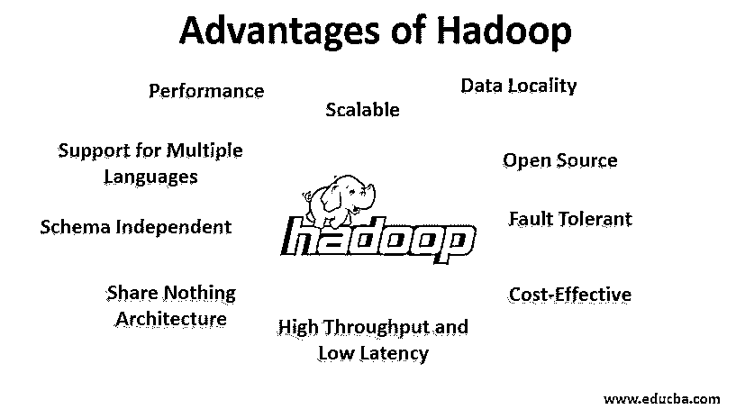
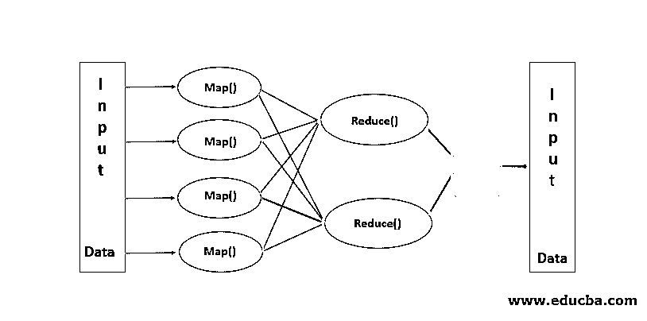

# Hadoop 的优势

> 原文：<https://www.educba.com/advantages-of-hadoop/>

## Hadoop 优势介绍

Hadoop 是大数据处理范式，可以有效地应对大数据的挑战(如数据的多样性、容量和速度)，因为它具有分布式存储、并行处理的属性，因此它具有开源、可扩展、容错、模式独立、高吞吐量和低延迟、数据局部性、性能、无共享架构、支持多语言、高性价比、抽象、兼容性和支持各种文件系统等多重优势。

### Hadoop 是什么？

Hadoop 是一种大数据处理范式，为数据存储和处理提供了一个可靠、可扩展的地方。Hadoop 是由 Doug Cutting 创建的，他被认为是“Hadoop 之父”。Hadoop 是他儿子的玩具大象的名字。Hadoop 源于 Nutch 搜索引擎项目。Hadoop 是一个处理框架，它极大地改变了我们处理数据和存储数据的方式。与 RDBMS 等传统处理工具相比，Hadoop 证明了我们可以有效应对大数据的挑战，例如，

<small>Hadoop、数据科学、统计学&其他</small>

**多种数据:** Hadoop 可以存储和处理结构化以及半结构化和非结构化格式的数据。

**数据量** : Hadoop 是专门为处理 Pb 级的海量数据而设计的。

**数据速度**:与 RDBMS 等其他处理[工具](https://www.educba.com/hadoop-tools/)相比，Hadoop 可以高速处理数 Pb 的数据，即 Hadoop 中的处理时间非常少。

**Hadoop 的显著特性**

*   Hadoop 本质上是开源的。
*   它在一组机器上工作。集群的大小取决于需求。
*   它可以在普通的商用硬件上运行。

### Hadoop 的优势

在本节中，我们将讨论 Hadoop 的优势。现在让我们一个一个地看看它们:

#### 1.开放源码

Hadoop 本质上是开源的，即其源代码是免费提供的。我们可以根据我们的业务需求修改源代码。甚至像 Cloudera 和 Horton works 这样的 Hadoop 的专有[版本也是可用的。](https://www.educba.com/hadoop-versions/)

#### 2.可攀登的

Hadoop 在机器集群上工作。Hadoop 具有高度的可扩展性。我们可以根据需要添加新节点来增加集群的规模，而无需停机。这种向集群添加新机器的方式被称为水平扩展，而增加组件(如将硬盘和 RAM 增加一倍)被称为垂直扩展。

#### 3.容错的

容错是 Hadoop 的显著特征。默认情况下，HDFS 的每个数据块的复制因子都是 3。对于每个数据块，HDFS 会再创建两个副本，并将它们存储在集群中的不同位置。如果任何数据块由于机器故障而丢失，我们仍然有同一个数据块的两个以上的副本，并且这些副本被使用。这样就在 Hadoop 中实现了容错。

#### 4.模式独立

Hadoop 可以处理不同类型的数据。它足够灵活，可以存储各种格式的数据，既可以处理有模式的数据(结构化的)，也可以处理无模式的数据(非结构化的)。

#### 5.高吞吐量和低延迟

吞吐量意味着单位时间内完成的工作量，而低延迟意味着无延迟或少延迟地处理数据。由于 Hadoop 是由分布式存储和并行处理的原则驱动的，因此处理是在每个数据块上同时进行的，并且相互独立。此外，不是移动数据，而是将代码移动到集群中的数据。这两点有助于实现高吞吐量和低延迟。

#### 6.数据局部性

Hadoop 的工作原理是“移动代码，而不是数据”。在 Hadoop 中，数据保持静止，而对于数据处理，代码以任务的形式移动到数据，这称为数据局部性。由于我们要处理 Pb 级的数据，跨网络移动数据变得既困难又昂贵，数据局部性可确保集群中的数据移动最少。

#### 7.表演

在 RDBMS 等传统系统中，数据是按顺序处理的，但在 Hadoop 中，处理是在所有数据块上同时开始的，因此提供了并行处理。由于并行处理技术，Hadoop 的性能远远高于 RDBMS 等传统系统。2008 年，Hadoop 甚至打败了当时在场最快的超级计算机。

#### 8.无共享架构

Hadoop 集群中的每个节点都是相互独立的。它们不共享资源或存储，这种体系结构称为无共享体系结构(SN)。如果集群中的一个节点发生故障，不会导致整个集群瘫痪，因为每个节点都独立工作，从而消除了单点故障。

#### 9.支持多种语言

尽管 Hadoop 主要是用 Java 开发的，但它扩展了对其他语言的支持，如 Python、Ruby、Perl 和 Groovy。

#### 10.性价比高

Hadoop 本质上是非常经济的。我们可以使用普通的商用硬件构建 Hadoop 集群，从而降低硬件成本。根据云时代，与传统 ETL 系统相比，Hadoop 的数据管理成本(即硬件和软件以及其他费用)非常低。

#### 11.抽象

Hadoop 提供了不同层次的抽象。这使得开发人员的工作更加容易。一个大文件被分成大小相同的块，存储在群集的不同位置。在创建 map-reduce 任务时，我们需要考虑块的位置。我们给出一个完整的文件作为输入， [Hadoop 框架](https://www.educba.com/hadoop-framework/)负责处理位于不同位置的各种数据块。Hive 是 Hadoop 生态系统的一部分，它是 Hadoop 之上的一个抽象。由于 Map-Reduce 任务是用 Java 编写的，全球的 SQL 开发人员都无法利用 Map Reduce。因此，Hive 被引入来解决这个问题。我们可以在 Hive 上编写类似 SQL 的查询，进而触发 Map reduce 作业。因此，由于 Hive，SQL 社区也能够处理 Map Reduce 任务。

#### 12.和睦相处

在 Hadoop 中，HDFS 是存储层，Map Reduce 是处理引擎。但是，并没有硬性规定 Map Reduce 应该是默认的处理引擎。像 Apache Spark 和 Apache Flink 这样的新处理框架使用 HDFS 作为存储系统。即使在 Hive 中，我们也可以根据需要将执行引擎更改为 Apache Tez 或 Apache Spark。Apache HBase 是 NoSQL 列数据库，使用 HDFS 作为存储层。

#### 13.支持各种文件系统

Hadoop 本质上非常灵活。它可以接收各种格式的数据，如图像、视频、文件等。它还可以处理结构化和非结构化数据。Hadoop 支持各种文件系统，如 JSON、XML、Avro、Parquet 等。

### Hadoop 的工作原理

以下几点展示了 Hadoop 的工作原理:

#### 1.分布式存储和并行处理

这是包括 Apache Spark 在内的 Hadoop 生态系统所有框架的驱动原则。为了理解 Hadoop 和 Spark 的工作原理，首先，我们应该理解什么是“分布式存储和并行处理”。

#### 2.分布式存储

Hadoop 不在单个机器中存储数据，而是将巨大的数据分成大小相等的块(默认情况下为 256MB ),并将这些块存储在集群的不同节点(工作节点)中。它将这些块的元数据存储在主节点中。这种在集群中的分布式位置存储文件的方式被称为 Hadoop 分布式文件系统 This。

#### 3.并行处理

这是一种处理模式，对存储在 HDFS 的数据块同时进行处理。并行处理的工作原理是“移动代码，而不是数据”。数据在 HDFS 保持静止，但代码被移到数据中进行处理。简而言之，如果我们的文件被分成 100 个数据块，那么就会创建 100 个作业拷贝，这些拷贝将通过群集传输到数据块所在的位置，同时开始处理 100 个数据块(映射阶段)。收集所有模块的输出数据，并缩减为最终输出(缩减阶段)。Map Reduce 被认为是“Hadoop 的心脏”。

### 结论

在这个数据时代，Hadoop 为应对大数据带来的挑战铺平了道路。当我们说 Hadoop 时，我们不仅仅指 Hadoop，它还包括 Hadoop 生态系统工具，如 Apache Hive，它在 Hadoop 上提供类似 SQL 的操作，Apache Pig，用于列存储数据库的 Apache HBase，用于内存处理的 Apache Spark 等等。虽然 Hadoop 有自己的缺点，但它具有很强的适应性，并且随着每个版本的发布而不断发展。

### 推荐文章

这是一个关于 Hadoop 优势的指南。这里我们讨论什么是 Hadoop，以及 Hadoop 的顶级优势。您也可以浏览我们的其他相关文章，了解更多信息——

1.  [什么是 Hadoop 集群？](https://www.educba.com/what-is-hadoop-cluster/)
2.  [Hadoop 数据库](https://www.educba.com/hadoop-database/)
3.  [什么是 Hadoop？|应用和功能](https://www.educba.com/what-is-hadoop/)
4.  [Hadoop 命令|前 23 条命令](https://www.educba.com/hadoop-commands/)

