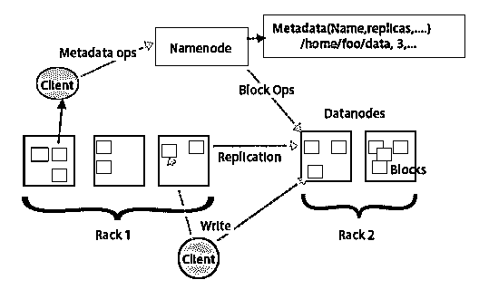
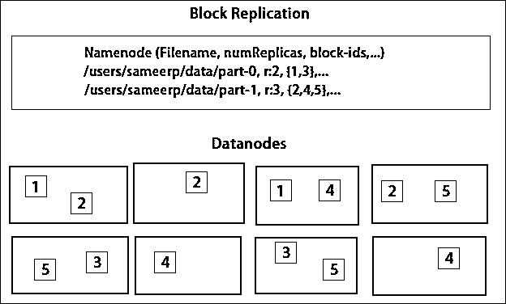

# Hadoop 架构

> 原文：<https://www.educba.com/hadoop-architecture/>

## Hadoop 架构简介

Hadoop 架构是一个开源框架，用于使用分布式计算概念快速处理大量数据，其中数据分布在集群的不同节点上。这种架构遵循主从结构，分为处理和存储数据两个步骤。MapReduce 执行这些步骤和 HDFS，其中 MapReduce 执行处理，而 HDFS 执行存储。

### Hadoop 架构

*   这种体系结构的基本思想是，整个存储和处理分两步以两种方式完成。第一步是处理，减少编程，第二步是存储在 HDFS 上完成的数据。
*   它具有存储和数据处理的主从架构。Hadoop 中数据存储的主节点是名称节点。还有一个主节点通过使用 [Hadoop Map Reduce](https://www.educba.com/what-is-mapreduce-in-hadoop/) 来监控和并行数据处理。
*   从机是 Hadoop 集群中帮助存储数据和执行复杂计算的其他机器。每个从节点都分配有一个任务跟踪器，一个数据节点有一个作业跟踪器，它有助于运行进程并有效地同步它们。这种类型的系统可以安装在云上或内部。
*   当名称节点不在高可用性模式下运行时，它是一个单点故障。Hadoop 架构还提供了维护袖手旁观名称节点的功能，以防止系统丢失。以前，当主名称节点出现故障时，有辅助名称节点充当备份。

<small>Hadoop、数据科学、统计学&其他</small>

### FSimage 和编辑日志

*   FSimage 和 Edit Log 确保文件系统元数据的持久性以跟上所有信息，name node 将元数据存储在两个文件中。这些文件是 FSimage 和编辑日志。FSimage 的工作是在给定时间保存文件系统的完整快照。系统中不断发生的变化需要记录下来。这些增量更改(如重命名或向文件追加细节)存储在编辑日志中。
*   该框架提供了一个比每次创建一个新的 FSimage 更好的选择，一个更好的机会来存储数据，同时为 FSimage 创建一个新的文件。每次进行更改时，FSimage 都会创建一个新的快照。如果名称节点出现故障，它可以恢复到以前的状态。只要 FSimage 和编辑日志中有更改，辅助名称节点也可以更新其副本。因此，它确保即使名称节点关闭，在存在辅助名称节点的情况下也不会有任何数据丢失。名称节点不要求必须在辅助名称节点上重新加载这些映像。

### 数据复制

*   HDFS 旨在快速处理数据并提供可靠的数据。它跨机器和大型集群存储数据。所有文件都存储在一系列块中。复制这些块是为了容错。块大小和复制因子可由用户决定，并根据用户要求进行配置。默认情况下，复制因子为 3。复制因子可以在创建文件时指定，以后也可以更改。
*   名称节点做出关于这些副本的所有决定。名称节点定期为群集中的所有数据节点发送心跳和数据块报告。心跳的接收意味着数据节点工作正常。数据块报告指定数据节点上存在的所有数据块的列表。

### 副本的放置

*   在 Hadoop 中，副本的放置对于可靠性和性能来说是一项关键任务。所有不同的数据块都放在其他机架上。可以根据可靠性、可用性和网络带宽利用率来实施副本放置。计算机群集可以分布在不同的机架上。同一机架上最多只能放置两个节点。第三个副本应放在单独的架子上，以确保数据更加可靠。
*   机架上的两个节点通过不同的交换机进行通信。名称节点具有每个数据节点的机架 id。但是，将所有节点放在其他机架上可以防止任何数据丢失，并允许多个机架使用带宽。它还减少了机架间的流量，提高了性能。此外，与节点故障相比，机架故障的可能性要小得多。当从两个不同的机架(而不是三个)读取数据时，它减少了总网络带宽。

### mapreduce

Map Reduce 用于处理存储在 HDFS 上的[数据。它跨分布式应用程序写入分布式数据，确保高效处理大量数据。它们在大型集群上进行处理，需要一个可靠且容错的产品。Map-reduce 的核心可以是三个操作，如映射、收集对和重组结果数据。](https://www.educba.com/what-is-hdfs/)

### 结论–Hadoop 架构

Hadoop 是一个有助于容错系统的开源框架。它可以存储大量数据，并有助于存储可靠的数据。在 HDFS 中存储数据和通过 map-reduce 处理数据这两个部分有助于正确高效地工作。它的体系结构有助于管理所有数据块，并通过将其存储在 FSimage 和编辑日志中来获得最新副本。复制因素也有助于获得数据的副本，并在出现故障时取回这些副本。HDFS 还将删除的文件移动到垃圾箱目录，以优化空间的使用。

### 推荐文章

这是 Hadoop 架构的指南。这里，我们讨论了体系结构、映射缩减、副本放置和数据复制。您也可以浏览我们推荐的其他文章，了解更多信息——

1.  [成为 Hadoop 开发人员](https://www.educba.com/career-in-hadoop/)
2.  [安卓简介](https://www.educba.com/introduction-to-android/)
3.  [Hadoop 中的 MapReduce 是什么？](https://www.educba.com/what-is-mapreduce-in-hadoop/)
4.  [Hadoop 命令](https://www.educba.com/hadoop-commands/)

