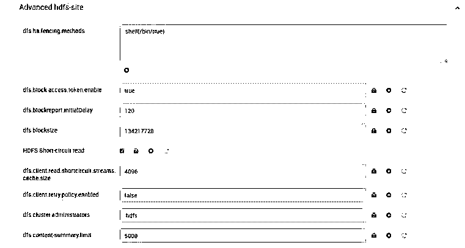
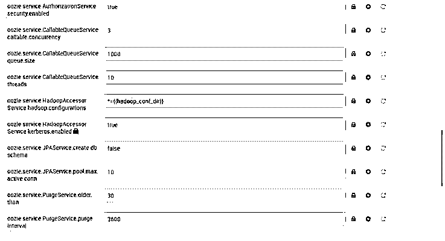

# Hadoop 配置

> 原文：<https://www.educba.com/hadoop-configuration/>

## **Hadoop 配置简介**

在 Hadoop 堆栈中，我们拥有多种服务，如 HDFS、Yarn、Oozie、MapReduce、Spark、Atlas、Ranger、Zeppelin、Kafka、NiFi、Hive、HBase 等。每个服务都有自己的功能和工作方法。正如我们已经说过的，不同服务的工作方法不同，配置也不同。在进行 Hadoop 配置之前，我们还需要考虑操作系统配置。在 Hadoop 生态系统中，Hadoop 配置将出现在第二部分。在主要部分，我们需要调整操作系统配置，使操作系统符合标准。因此，操作系统将能够处理 Hadoop 生态系统的负载。

**Hadoop 配置的语法:**

<small>Hadoop、数据科学、统计学&其他</small>

因此，Hadoop /没有特定的语法。一般来说，我们使用它的服务数量。根据要求或需要，我们将安装 Hadoop 服务并配置参数。在 Hadoop 堆栈中，大多数时候我们只在 UI 级别进行配置。但是对于故障排除或一些不同的配置，我们也将使用 CLI。

### 不同的 Hadoop 配置

下面给出了不同的 Hadoop 配置:

#### 1.Hadoop 配置:HDFS

在 Hadoop 环境中，Hadoop 配置命令非常常见。它的应用非常广泛。这将有助于我们列出 HDFS 级别的文件数量。

**配置属性:**

*   **client.https.need-auth:** 这将有助于检查客户端和服务器通信是否需要 SSL 客户端证书认证。
*   **client . cached . conn . retry:**从缓存中，该值将定义 HDFS 客户端能够获得套接字的次数。如果超过套接字尝试次数，HDFS 客户端将尝试创建新的套接字。
*   **https . server . Keystore . resource:**这将是我们将从中提取 SSL 服务器密钥库证据的同一资源文件。
*   **client . https . Keystore . resource:**这将是我们将从中获取 SSL 服务器密钥库证据的同一个资源文件，该证据将根据 https 通信进行提取。
*   **datanode.https.address:** 是 datanode 安全 https 服务器地址和端口信息的配置参数。
*   **namenode.https-address:** 是 namenode 安全 https 服务器地址和端口信息的配置参数。
*   **q journal . queued-edits . limit . MB:**在仲裁日志编辑方面，它将有助于定义队列大小。该值将以 MB 为单位定义。
*   **q journal . select-input-streams . time out . ms:**对于日志管理器来说，是接受流的超时值。该值将以毫秒为单位。
*   **q journal . start-segment . time out . MB:**该配置值将有助于定义仲裁超时。该值将以毫秒为单位。

**配置截图:**

**

** 

#### 2.Hadoop 配置:Yarn

就 Hadoop 生态系统中运行的作业的资源分配而言，yarn 非常重要。

**配置属性:**

*   **资源类型:**是资源的添加。我们需要用逗号分隔的值来定义。它不包括配置参数，如内存(Mb 或 GB)或 vcores 值。
*   **资源类型。<资源>。单位:**这将是纱线配置中指定资源类型的默认单位。
*   **资源类型。<资源>。minimum-allocation:** 我们可以为明确的资源类型设置最小请求的值。
*   **资源类型。<资源>。maximum-allocation:** 我们可以为确定的资源类型设置最大请求值。
*   **app . MapReduce . am . resource . MB:**这将有助于配置应用程序主容器所请求的内存。该值将以 MB 为单位。该配置的默认值为 1536。
*   **app . MapReduce . am . resource . memory:**它将帮助配置应用程序主容器所请求的内存。该值将以 MB 为单位。该配置的默认值为 1536。
*   **app . MapReduce . am . resource . memory-MB:**这将有助于设置应用程序主机请求的内存。该值将以 MB 为单位。该配置的默认值为 1536。
*   **app . MapReduce . am . resource . cpu-v cores:**这将有助于将应用程序主容器请求的 CPU 配置为值。该值将以 CPU 计数为单位。该配置的默认值为 1。

**配置截图:**

**

** 

#### 3.Hadoop 配置:Oozie

在 Hadoop 中，我们使用 Oozie 服务来调度 Hadoop 级别的作业。

**配置属性:**

*   这将有助于设置 tomcat 服务器。这将有助于运行 oozie java 配置或属性。oozie 属性将根据变量提供。此配置没有默认值。
*   **OOZIE_CONFIG_FILE:** 在这个配置属性的帮助下，我们将在系统中加载 OOZIE 配置文件。这个配置的值是 oozie-site.xml。
*   **OOZIE_LOGS:** 它将有助于将 OOZIE 日志信息存储到特定的目录中。在安装 oozie 服务器时，它会自己定义值。
*   **OOZIE_LOG4J_FILE:** 借助这个配置属性，我们将在系统中加载 oozie Log4J 配置文件。这个配置的值是 oozie-log4j.properties。
*   **OOZIE_LOG4J_RELOAD:** 它将有助于在特定的时间间隔重新加载 LOG4J 配置文件。该值将以秒为单位。默认值为 10。
*   OOZIE_HTTP_PORT: 它将帮助定义 OOZIE 服务器的端口。默认端口值是 11000。
*   这将有助于定义 OOZIE 服务器的管理端口。默认端口值是 11001。
*   OOZIE_HTTP_HOSTNAME: 它将帮助定义 OOZIE 服务器运行的主机名。按照 Hadoop 架构，我们需要为它定义特定的主机或节点。
*   OOZIE_BASE_URL: 这将有助于定义到 OOZIE 服务器的回调操作 URL 的基本 URL。该属性的默认配置值是 http://$ {oozie 服务器主机名} : $ {oozie 服务器 http 端口} / oozie。

**配置截图:**

### 结论

我们已经看到了“Hadoop 配置”的完整概念，以及适当的示例、解释和配置输出。就服务级别调优而言，Hadoop 配置非常重要。在进行 Hadoop 配置时，我们还需要考虑其他 Hadoop 级别的服务。在进行 Hadoop 配置之前，我们还需要调整操作系统。

### 推荐文章

这是 Hadoop 配置指南。这里我们分别讨论简介和不同的 Hadoop 配置。您也可以看看以下文章，了解更多信息–

1.  [Hadoop 版本](https://www.educba.com/hadoop-versions/)
2.  [Hadoop 命令](https://www.educba.com/hadoop-commands/)
3.  [Hadoop 中的 Yarn 是什么？](https://www.educba.com/what-is-yarn-in-hadoop/)
4.  [Hadoop 管理员](https://www.educba.com/hadoop-administrator/)

