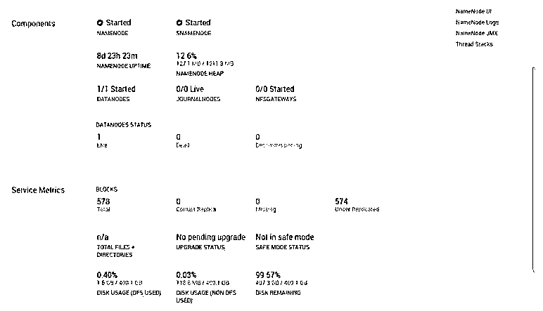

# HDFS 文件系统

> 原文：<https://www.educba.com/hdfs-file-system/>

## HDFS 文件系统简介

在 Hadoop 堆栈中，我们使用 HDFS 服务来管理 Hadoop 的完整存储部分。它是一个分布式文件系统。它有能力处理大量的数据。HDFS 文件系统的一个主要优点是，它可以在商用硬件上运行。也就是说，对任何特定的硬件都没有要求。在单个 Hadoop 集群环境中，我们可以添加数千个数据节点来存储 HDFS 文件系统中的数据。在 Hadoop 中，大多数服务都依赖于 HDFS 文件系统来存储数据。

**语法:**

<small>Hadoop、数据科学、统计学&其他</small>

因此，没有特定的语法可用于 HDFS 文件系统。一般来说，我们使用它的服务数量。根据要求或需要，我们可以使用必要的组件并使用适当的语法。

### HDFS 文件系统是如何工作的？

Hadoop 文件系统是一个分布式文件系统。该文件系统是可伸缩和可移植的。它是用 Java 语言为 Hadoop 框架编写的。在 Hadoop 中，有两个主要的东西，第一是 HDFS，第二是 MapReduce。HDFS 或 HDFS 文件系统用于存储数据。MapReduce 部分用于数据处理。

在 HDFS，以下是使其更具可伸缩性、可移植性、健壮性等的服务。

*   名称节点
*   数据节点
*   辅助 namenode
*   工作跟踪
*   任务跟踪器

#### 1.名称节点

在 HDFS 文件系统中，namenode 是主守护进程或服务或节点。所有主服务将相互通信。在 HDFS 文件系统中，它将由主动名称节点的单个实例组成。它被称为命名节点。namenode 将能够跟踪文件、数据块和管理文件系统。它还将管理 HDFS 文件系统元数据。

元数据具有文件的详细信息或 HDFS 级别的块级别信息。具体来说，namenode 具有数据节点上的块计数、文件或数据的位置的详细信息。它还将负责 HDFS 文件复制部分。HDFS namenode 与 HDFS 客户有直接联系。

#### 2.数据节点

datanode 是主守护进程、服务或节点。datanode 负责在 HDFS 级别存储实际文件。它将按块存储数据。当客户端请求数据时，实际数据将仅由 datanode 共享。(在这里，namenode 将只共享数据的信息或文件块信息)。datanode 是一个从属守护进程。默认情况下，每个 datanode 每 3 秒钟向 namenode 发送一次心跳信息。这将有助于 namenode 识别 datanode 是否处于活动状态。

同样的过程将会继续。如果在这种情况下，datanode 将无法发送心跳到 namenode(直到 2 分钟)，那么 namenode 将认为 datanode 将死亡。如果数据节点将失效，那么我们就无法从失效的数据节点上获取数据。为了避免这种情况，我们有一个复制因子。在 HDFS，我们有复制因子 3。这意味着在 HDFS 文件系统上，我们在不同的 datanode 上有文件或数据的 3 个拷贝。如果一个或两个 datanodes 将失败，那么没有问题，我们将从数据的最后一个副本开始处理请求。它将全部由 namenode 管理。

#### 3.次要名称节点

在 Hadoop 文件系统中，辅助 namenode 是主守护进程或服务或节点。辅助 namenode 也称为检查点节点。它负责管理 HDFS 文件系统的元数据检查点。它将从活动的 namenode 获取元数据信息，并执行检查点操作。如果 namenode 上可能发生任何问题，并且 namenode 可能停机，那么辅助 namenode 将参与进来，并为 Hadoop 生态系统扮演 namenode 的角色。

编辑日志是与实时 namenode 和辅助 namenode 同步的关键点。编辑日志负责使第二个 namenode 成为活动 namenode。编辑日志将向辅助 namenode 提供详细信息，该 namenode 的最后一次更新是什么。辅助 namenode 将根据相同的信息开始工作并变为活动状态(作为 namenode)。

#### 4.工作跟踪

作业跟踪器是从属服务。从客户端，MapReduce 执行请求将接收作业跟踪器。作业跟踪器将与活动的 namenode 通信。namenode 将共享数据位置方面的信息。相同的数据位置信息将用于作业处理。活动 namenode 将对请求者要求的 HDFS 数据处理的块元数据信息做出响应。

#### 5.任务跟踪器

任务跟踪器是从属服务之一。作业跟踪器将与任务跟踪器共享与作业相关的信息。大多数情况下，任务跟踪器会从作业跟踪器获取与任务相关的信息。它还将负责获得在 HDFS 级别上运行的整个任务的概览。

### HDFS 文件系统概述

在 Hadoop 环境中，我们让系统以分布式模式存储数据。它也是可扩展和可移植的。

**语法:**

在 HDFS 夏天，我们可以得到 HDFS 的文件系统信息。

**说明:**

*   按照下面的命令，我们将获得 HDFS 文件系统的详细概述。

**输出:**

### 结论

我们已经看到了“HDFS 文件系统”的完整概念，以及正确的示例、解释和输出。这个系统是用来储存大量数据的。它可以扩展到数千个节点。默认情况下，我们有复制因子 3。

### 推荐文章

这是 HDFS 文件系统指南。在这里我们先介绍一下，HDFS 文件系统是如何工作的？和文件系统概述。您也可以看看以下文章，了解更多信息–

1.  [HDFS 联邦](https://www.educba.com/hdfs-federation/)
2.  [HDFS 命令](https://www.educba.com/hdfs-commands/)
3.  [HDFS 建筑](https://www.educba.com/hdfs-architecture/)
4.  什么是 HDFS？

