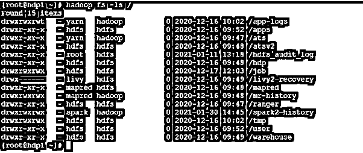
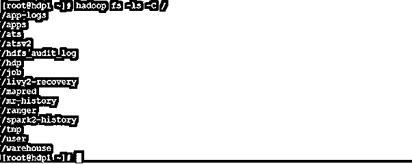
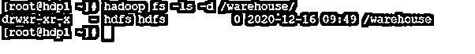
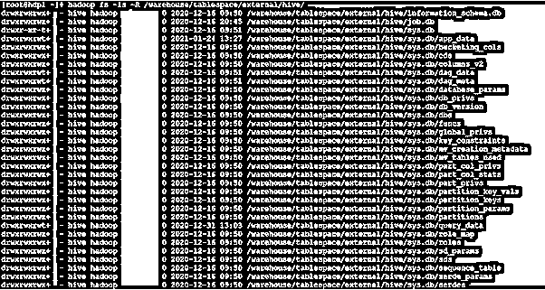

# HDFS ls

> 原文：<https://www.educba.com/hdfs-ls/>

## HDFS ls 简介

在 Hadoop 堆栈中，我们使用 HDFS 服务来管理 Hadoop 的完整存储部分。我们可以使用多种命令组合。Hadoop ls 命令对于列出 HDFS 路径或位置上可用的文件非常有用。我们可以在 ls 命令中使用不同的选项。根据需求，我们可以在 ls 命令中使用不同的选项。ls 命令位于 HDFS 服务的文件系统下。ls 命令也支持 HDFS 文件系统，它们也支持 S3 文件系统、网络 HDFS、本地文件系统等。

**HDFS ls 的语法**

<small>Hadoop、数据科学、统计学&其他</small>

`hadoop fs [-ls [-C] [-d] [-h] [-q] [-R] [-t] [-S] [-r] [-u] [-e] [<path> ...] ]`

1.Hadoop:我们可以在语法或命令中使用 Hadoop 关键字。它会将不同的参数作为选项和命令。因此，我们可以列出 Hadoop HDFS 级别的文件数量。

2.fs:在 HDFS ls 命令下的文件系统类型。因此，我们需要在 Hadoop ls 命令中将文件系统定义为文件系统。

3.选项:我们可以提供不同的标志作为与 Hadoop ls 命令兼容的选项。我们需要使用不同的兼容关键字，比如[-C][-d][-h][-q][-R][-t][-S][-R][-u][-e]。

4.路径:根据需求，我们可以定义 hdfs 路径来列出文件的数量。

### HDFS ls 是如何工作的？

正如我们已经讨论过的，在 Hadoop 环境中，我们有多个组件或服务。Hadoop ls 命令处理 Hadoop HDFS 服务。为了使用 Hadoop ls 命令，我们可以以不同的方式触发命令，如 hdfs shell、Hue UI、Zeppelin UI、第三方应用工具等。

Hadoop ls 命令将从 hdfs shell 窗口或任何其他工具中触发。hdfs 编译器将首先验证该命令。如果命令是有效的，那么它将通过进一步的进程，或者它将通过一个错误消息。一旦命令生效，请求就会发送到 hdfs namenode。包含 hdfs 块详细信息的 namenode。它将检查请求是否有可用的块信息。如果块信息可用，那么它将给出必要的输出。如果块信息不存在，则会显示一条错误消息。

以下是与 Hadoop ls 命令兼容的选项列表。

-C:它将只打印或显示文件和目录的 HDFS 路径。

-d:将目录作为普通文件打印会有所帮助。

-h:它将以人类可读的方式格式化文件大小

例如:如果在-h 选项的帮助下将尺寸打印为 67108864，它将打印 64 m。

-问:会有助于显示还是打印？而不是不可打印的字符。

-R:它将递归打印子目录中遇到的文件列表。

-t:这将有助于按修改时间对文件进行排序。它将打印最近修改或更新的文件。

-S:它将按文件大小打印输出。

-r:这将有助于颠倒排序顺序。

-u:将按访问时间而不是修改时间列出文件进行排序和显示。

-e:它将有助于仅显示目录和文件的擦除编码策略。

### HDFS ls 的例子

下面是下面提到的例子

**Hadoop ls 命令**

在 Hadoop 环境中，HDFS ls 命令非常常见。它的应用非常广泛。这将有助于我们列出 HDFS 级别的文件数量。

**语法:**

`hadoop fs -ls /`

**说明:**

按照上面的命令，我们得到了“/”HDFS 级别的文件列表。它将只列出根 HDFS 级别的目录数量。它还会给出用户和组权限的信息。

**输出:**

**HDFS ls:只获取 HDFS 目录列表**

在 Hadoop 中，我们可以只用目录名列出目录的编号。它不会打印权限和用户组信息。

**语法:**

`hadoop fs -ls -C /`

**说明:**

按照上面的命令，我们使用了-C 选项。这将有助于只列出 HDFS 目录。它不会打印 HDFS 目录的用户权限状态。

**输出:**

**HDFS ls:获取具体目录**

在 Hadoop ls 命令中，我们拥有仅打印特定目录的功能。它不会打印任何其他目录。

**语法:**

`Hadoop fs -ls -d /warehouse/`

**说明:**

按照上面的命令，我们在 Hadoop ls 命令中使用了-d 选项。只打印仓库目录会有所帮助。这种类型的命令将有助于 shell 或应用程序作业级别。

**输出:**

**HDFS ls:以递归方式列出文件的数量**

根据 Hadoop ls 命令的默认特性，我们可以打印当前工作目录中的文件数量。但是如果我们需要递归地打印文件的数量，我们也可以借助“-R”选项来完成。

**语法:**

`hadoop fs -ls -R /warehouse/tablespace/external/hive/`

**说明:**

按照上面的命令，我们列出了来自“/warehouse/tablespace/external/hive/”位置的文件编号。为了一次性获取所有文件，我们在 Hadoop ls 命令中使用了“-R”选项。

**输出:**

### 结论

我们已经看到了“HDFS ls”的完整概念，以及正确的例子、解释和输出。就 Hadoop 环境而言，HDFS ls 非常重要。根据需求，我们可以用不同的选项递归地列出文件的数量，如大小、修改、人类可读的格式等。

### 推荐文章

这是 HDFS 旅游指南。在这里，我们讨论了“HDFS 最小二乘”的完整概念，以及适当的例子、解释和输出。您也可以看看以下文章，了解更多信息–

1.  [HDFS 命令](https://www.educba.com/hdfs-commands/)
2.  [HDFS 联邦](https://www.educba.com/hdfs-federation/)
3.  什么是 HDFS？
4.  [HDFS 建筑](https://www.educba.com/hdfs-architecture/)

