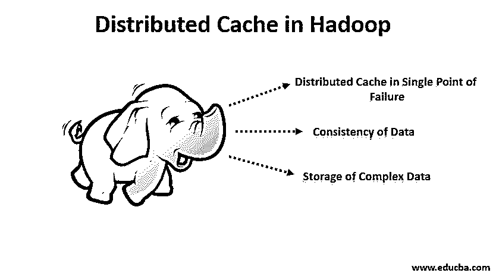

# Hadoop 中的分布式缓存

> 原文：<https://www.educba.com/distributed-cache-in-hadoop/>

## Hadoop 中的分布式缓存是什么？

Hadoop 中的分布式缓存被定义为减少 Hadoop 网络延迟的机制，因为 Hadoop 框架使用分布式存储并使用 HDFS 和 MapReduce 处理巨大的数据集，它包含各种节点来存储元数据和实际数据，因此当需要对大量数据进行处理时，用户编写程序从存储中获取这些实际数据，而不是一次从 HDFS 中读取一个文件，它可以一次复制并发送到所有数据节点，从而减少延迟。

### 分布式缓存在 Hadoop 中的工作

*   当作业启动时，Hadoop 会将由–files、-libjars 和–archives 等选项指定的文件复制到 HDFS。然后，节点管理器将文件从 HDFS 复制到缓存中，这样当任务运行时，它就可以访问这些文件。当文件被复制到缓存或本地磁盘时，它们可以被称为是本地化的。
*   在缓存中，使用每个文件的任务数量的计数由节点管理器作为参考来维护。在任务运行之前，文件的引用计数变为 1。但是在任务运行之后，计数减 1。当计数变为 0 时，该文件可以被删除，因为它没有被使用。当节点的缓存达到一定大小时，就会删除一个文件，以便容纳新文件。缓存的大小可以在配置属性中更改。Hadoop 中分布式缓存的大小默认为 10GB。
*   如果有开销，MapReduce 会比进程内缓存慢。为了克服这种情况，分布式缓存可以序列化对象，但即使这样也没什么问题。反射是一个用于在运行时调查信息类型的过程，这个过程非常慢。此外，在存储完整的集群名、类名以及对成员变量中存在的其他实例的引用时，序列化变得非常困难。

### Hadoop 在分布式缓存中的实现

*   要为应用程序使用分布式缓存，我们需要确保为了跨节点分发文件；该文件应该首先可用。因此，我们需要将文件复制到 HDFS，还需要检查该文件是否可以通过 URIs 访问，可以通过访问 core-site.xml 找到该文件。然后，MapReduce 作业将缓存文件复制到所有节点，然后任务才开始在这些节点上运行。
*   因此，为了实现分布式缓存，我们需要将文件复制到 HDFS，我们可以通过 HDFS DFS–put/path/sample file . jar 命令检查是否完成了此操作。此外，需要为应用程序设置作业配置，这需要添加到驱动程序类中。
*   只有所有者可读的文件进入私有缓存，而共享缓存则拥有全球可读的文件。添加到缓存中的文件作为本地文件在集群中的所有机器上不受任何限制地使用。以下 API 调用可用于将文件添加到缓存中。

**代码:**

<small>Hadoop、数据科学、统计学&其他</small>

`DistributedCache.addCacheFile(URI,conf);
DistributedCache.setCacheFiles(URIs,conf);`

从属节点上分布式缓存文件的共享取决于分布式缓存文件是私有的还是公共的。私有分布式缓存文件缓存在用户的本地目录中，该目录对用户是私有的，并且这些文件是用户的作业所需要的。对于公共分布式缓存文件，文件缓存在全局目录中。在公共缓存的情况下，文件的访问是以对所有用户可见的方式设置的。此外，根据文件系统上的权限，分布式缓存文件会变为私有或公共。

### Hadoop 中分布式缓存的优势

随着分布式缓存的使用，Hadoop 框架增加了许多有利的特性。以下是使用分布式缓存的优势:

#### 1.单点故障中的分布式缓存

在一个节点发生故障的情况下，它不会使整个缓存发生故障。因为分布式缓存作为独立或独立的进程在各个节点上运行。因此，如果一个节点发生缓存故障，并不意味着整个缓存也会发生故障。

#### 2.数据的一致性

通过使用哈希算法，可以确定哪些键值对属于哪个节点。此外，Hadoop 中的分布式缓存会监控或跟踪对缓存文件所做的时间戳修改，并报告在作业执行之前，文件不应发生更改。因此，数据不会因为缓存集群的单一状态而变得不一致。

#### 3.复杂数据的存储

Hadoop 框架中的分布式缓存提供了缓存只读文件(如文本文件、jar 文件等)的优势，然后将它们广播到数据节点。因此，文件的副本存储在每个数据节点中。有了分布式缓存特性，复杂文件如 jar 等。被分发和存储。

### 结论

分布式缓存提高了效率，因为每个作业只拷贝一次文件。此外，它还能够缓存从服务器上未归档的归档。分布式缓存的使用是一个额外的好处，这取决于开发人员如何充分利用这一特性。

### 推荐文章

这是 Hadoop 中分布式缓存的指南。在这里，我们讨论什么是 Hadoop 中的分布式缓存，它的工作、实现以及好处。您也可以浏览我们的其他相关文章，了解更多信息——

1.  [Hadoop 的优势](https://www.educba.com/advantages-of-hadoop/)
2.  [安装 Hadoop](https://www.educba.com/install-hadoop/)
3.  [Git 中的 Head 是什么？](https://www.educba.com/what-is-head-in-git/)
4.  [Apache Hadoop 生态系统](https://www.educba.com/apache-hadoop-ecosystem/)
5.  [JavaScript 中的变量](https://www.educba.com/variables-in-javascript/)
6.  [3 个版本的 Hadoop 软件](https://www.educba.com/hadoop-versions/)

