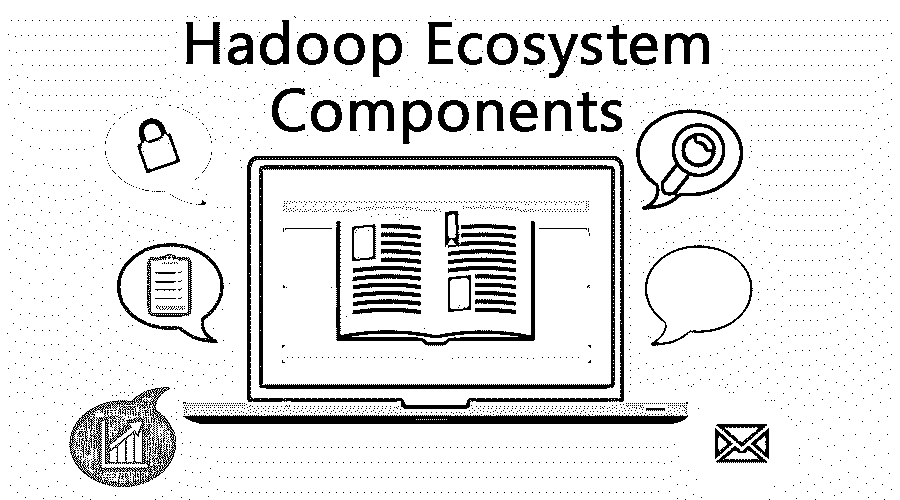

# Hadoop 生态系统组件

> 原文：<https://www.educba.com/hadoop-ecosystem-components/>

## Hadoop 生态系统简介

Hadoop 生态系统是一个帮助解决大数据问题的框架。Hadoop 生态系统的核心组件是一个 [Hadoop 分布式文件系统](https://www.educba.com/what-is-hdfs/) (HDFS)。HDFS 是一个分布式文件系统，能够存储大量数据集。在 shell 命令的帮助下，HADOOP 与 HDFS 交互。Hadoop 分解非结构化数据，并将其分配到不同的部分进行数据分析。生态系统提供了许多组件和技术，能够解决复杂的业务任务。此外，该生态系统包括开源项目和示例。

### Hadoop 生态系统概述

众所周知，互联网在电子行业中发挥着至关重要的作用，通过节点产生的数据量非常巨大，并导致了数据革命。数据量非常大，因此需要一个平台来管理它。Hadoop 架构最大限度地减少了劳动力，有助于作业调度。要处理这些数据，我们需要强大的计算能力。随着数据急剧增长，它需要大量内存和更快的速度来处理万亿字节的数据，以应对分布式系统的挑战，分布式系统使用多台计算机来同步数据。为了解决这个处理系统，必须发现处理数据相关问题的软件平台。为了解决大数据问题，Hadoop 应运而生。

<small>Hadoop、数据科学、统计学&其他</small>

### Hadoop 生态系统的组件

我们已经了解了 Hadoop 生态系统的概况和众所周知的开源示例，现在我们将分别讨论 Hadoop 组件列表及其在大数据处理中的具体角色。Hadoop 生态系统的组件包括:

#### 1.HDFS

Hadoop 分布式文件系统是 Hadoop 的主干，运行于 java 语言之上，存储 Hadoop 应用中的数据。它们充当与 Hadoop 交互的命令接口。HDFS 的两个组成部分—数据节点和名称节点。名称节点管理文件系统，操作所有数据节点，并维护元数据更新记录。如果数据被删除，它们会自动记录在编辑日志中。由于读写操作，数据节点(从节点)需要巨大的存储空间。它们根据名称节点的指令工作。数据节点是分布式系统中的硬件。

#### 2.HBASE

它是一个存储所有类型数据的开源框架，不支持 SQL 数据库。它们运行在 HDFS 之上，用 java 语言编写。大多数公司使用它们是因为它们的特性，比如支持所有类型的数据、高安全性和 HBase 表。它们在分析处理中起着至关重要的作用。HBase 的两个主要组件是 HBase 主服务器和区域服务器。HBase master 负责 Hadoop 集群中的负载平衡，并控制故障转移。他们负责执行管理角色。区域服务器的角色是一个工作节点，负责读取、写入缓存中的数据。

#### 3.故事

它是生态系统中的重要组件，在 Hadoop 中称为操作系统，提供资源管理和作业调度任务。这些组件是资源和节点管理器、应用程序管理器和容器。他们还在 [Hadoop 集群](https://www.educba.com/what-is-hadoop-cluster/)中充当守卫。它们有助于集群资源的动态分配，增加数据中心处理，并允许多个访问引擎。

#### 4.Sqoop

这是一个工具，有助于在 HDFS 和 MySQL 之间的数据传输，并给予手动输入和输出数据，他们有一个连接器获取和连接数据。

#### 5.阿帕奇火花

它是一个用于数据分析的开源集群计算[框架](https://www.educba.com/what-is-data-analytics/)和一个重要的数据处理引擎。它是用 Scala 编写的，附带打包的标准库。许多公司使用它们的高处理速度和流处理。

#### 6.阿帕奇水槽

它是一种分布式服务，从源(web 服务器)收集大量数据，然后移回其原点并传输到 HDFS。这三个组件是源、接收器和信道。

#### 7.hadoop mapreduce

它负责数据处理，充当 Hadoop 的核心组件。Map Reduce 是一个处理引擎，它在同一集群的多个系统中进行并行处理。这种技术基于分而治之的方法，并且是用 java 编程编写的。由于并行处理，它有助于在快速的过程中避免拥挤的交通和有效地改善数据处理。

#### 8.阿帕奇猪

Hadoop 的数据操作由 Apache Pig 执行，并使用 Pig 拉丁语。它有助于代码的重用，并且易于读写代码。

#### 9.储备

它是一个执行数据仓库概念的开源平台；它设法查询存储在 HDFS 的大型数据集。它构建在 Hadoop 生态系统之上。Hive 使用的语言是 Hive 查询语言。用户提交带有元数据的 hive 查询，元数据将 SQL 转换为 Map-reduce 作业，并提供给 Hadoop 集群，该集群由一个主服务器和多个从服务器组成。

#### 10.阿帕奇演习

Apache Drill 是一个处理非关系数据库和文件系统开源 SQL 引擎。它们旨在支持云存储中的半结构化数据库。它们有很好的内存管理能力来维护垃圾收集。增加的特性包括列表示和使用分布式连接。

#### 11.阿帕奇动物园管理员

它是一个有助于分布式协调的 API。这里，Hadoop 集群中的一个应用程序创建了一个名为 Znode 的节点。他们提供同步、配置等服务。它解决了 Hadoop 生态系统中耗时的协调问题。

#### 12.驭象者

Oozie 是一个 java web 应用程序，在 Hadoop 集群中维护许多工作流。让 Web 服务 API 控制一项工作可以在任何地方完成。它因能有效处理多项工作而广受欢迎。

### 例子

关于 map-reduce，我们可以看到一个示例和用例。一个这样的例子是 Skybox，它使用 Hadoop 来分析大量数据。Hive 可以在脸书找到简单。使用 map-reduce 的句子中的字数频率。MAP 通过将计数作为输入来执行，并执行过滤和排序等功能，reduce()合并结果。使用各种 DML 命令从学生数据库中提取不同州的学生的 Hive 示例

### 结论

关于 Hadoop 生态系统的简短介绍到此结束。Apache Hadoop 因其分析堆栈数据、并行处理和容错等特性而广受欢迎。生态系统的核心组件包括 Hadoop Common、HDFS、Map-reduce 和 Yarn。建立有效的解决方案。需要学习一套组件；每个组件都有自己独特的工作，因为它们是 Hadoop 功能。

### 推荐文章

这是关于 Hadoop 生态系统组件的指南。在这里，我们详细讨论了 Hadoop 生态系统的组件，并给出了有效的示例。您也可以浏览我们推荐的其他文章，了解更多信息——

1.  [Hadoop 中的职业范围](https://www.educba.com/career-in-hadoop/)
2.  [Hadoop 有哪些用途？](https://www.educba.com/uses-of-hadoop/)
3.  [Java 中的 AWT 是什么？](https://www.educba.com/what-is-awt-in-java/)
4.  [学习数据仓库 vs Hadoop](https://www.educba.com/data-warehouse-vs-hadoop/)
5.  [了解 23 条 Hadoop 命令](https://www.educba.com/hadoop-commands/)

