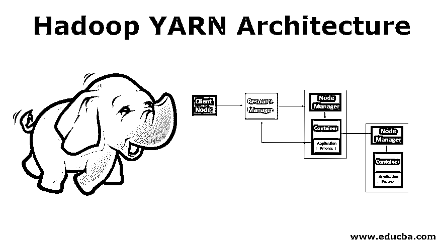
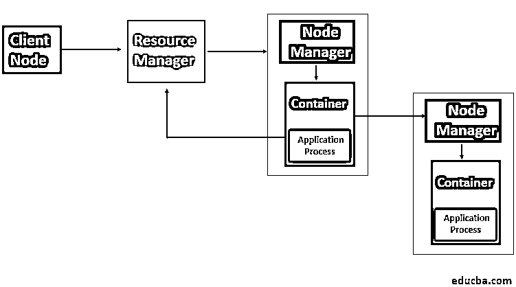

# Hadoop 纱线架构

> 原文：<https://www.educba.com/hadoop-yarn-architecture/>

## Hadoop YARN 架构简介

Hadoop YARN 架构是 Hadoop 框架组件资源管理的参考架构。YARN 是 Hadoop 2.0 的集群管理组件，也被称为另一个资源协商器。它包括资源管理器、节点管理器、容器和应用程序主控器。资源管理器是管理批处理的应用程序管理和作业调度的主要组件。节点管理器是管理集群中每个数据节点的任务分配的组件。容器是通过 YARN 管理的节点的硬件组件，如 CPU、RAM。Application Master 用于监控和管理 Hadoop 集群中的应用生命周期。

### 用图表解释 Hadoop YARN 架构

<small>Hadoop、数据科学、统计学&其他</small>

**【Hadoop YARN 架构】**

YARN 在 Hadoop 2.0 中引入了资源管理器和应用主机的概念。资源管理器查看整个 Hadoop 集群的资源使用情况，而在特定集群上运行的应用程序的生命周期由应用程序主管理。基本上，我们可以说，对于集群资源，应用主机与资源管理器进行协商。这个任务由拥有明确内存限制的容器来执行。然后，这些容器用于运行特定于应用程序的进程，并且这些容器由在集群中的节点上运行的节点管理器监管。这将确认应用程序使用的资源不超过分配的资源。

### 纱线的各种成分

下面是纱线的各种成分。

#### 1.资源管理程序

YARN 通过每个节点一个的资源管理器和在所有节点上运行的节点管理器工作。资源管理器管理集群中使用的资源，节点管理器午餐并监控容器。调度程序和应用程序管理器是资源管理器的两个组件。

*   **调度器**:根据应用对资源的需求进行调度。YARN 提供了很少的调度器可供选择，它们是公平和容量调度器。在任何硬件或应用程序失败的情况下，调度程序不确保重新启动失败的任务。此外，调度程序根据容量和队列将资源分配给正在运行的应用程序。
*   **应用管理器**:管理集群中应用主机的运行，在应用主机容器出现故障时，帮助重启。此外，它还负责接受作业的提交。

#### 2.节点管理器

节点管理器负责每个数据节点中任务的执行。默认情况下，YARN 中的节点管理器向资源管理器发送心跳，该心跳携带运行容器的信息以及关于新容器的资源可用性的信息。它负责单独查看集群上的节点，并管理特定节点上的工作流和用户作业。它主要管理由资源管理器分配的应用程序容器。节点管理器通过创建被请求的容器进程来启动容器，并且它还按照资源管理器的要求终止容器。

#### 3.容器

容器是单个节点上的一组资源，如 RAM、CPU 和内存等，它们由资源管理器调度，由节点管理器监控。容器生命周期通过使用容器启动上下文来管理 YARN 容器，并提供对特定主机中资源的特定使用的应用程序的访问。

#### 4.应用程序主机

它监控任务的执行，还管理集群上运行的应用程序的生命周期。当作业提交给框架时，单个应用程序主机与作业相关联。它的主要职责是协商来自资源管理器的资源。它与节点管理器一起监控和执行任务。

为了通过 YARN 运行应用程序，需要执行以下步骤。

*   客户端联系请求运行应用程序进程的资源管理器，即它提交 YARN 应用程序。
*   下一步是资源管理器搜索节点管理器，节点管理器将依次启动容器中的应用程序主机。
*   应用程序主机可以在它当前运行的容器中运行执行，并将结果提供给客户端，或者它可以从资源管理器请求更多的容器，这可以称为分布式计算。
*   然后，客户端联系资源管理器来监控应用程序的状态。

在 Hadoop 版本 1.0(MRV1)的 MapReduce 中，每个节点定义了映射和 Reduce 槽的数量。此外，在 Hadoop 集群中，由于硬件功能各不相同，需要手动限制特定节点上的任务数量。但是使用 YARN，这个缺点被克服了，因为这里资源管理器知道每个节点的容量，因为它与运行在每个节点上的节点管理器通信。

### 结论

YARN 有助于克服 Hadoop 1.0 中 MapReduce 的可扩展性问题，因为它划分了作业跟踪器的工作，包括作业调度和任务进度监控。此外，可用性问题也得到了解决，因为在早期的 Hadoop 1.0 中，作业跟踪器故障导致了任务的重新启动。YARN 带来了许多额外的好处，例如更好的资源利用率，因为它提供了集中的资源管理，没有固定的任务槽。因此，有了 YARN，早期版本的 Hadoop 面临的许多问题都得到了解决，因为它有助于将数据处理与调度和资源管理分离开来。使用 YARN，可以独立运行交互式查询，并提供更好的实时分析。

### 推荐文章

这是 Hadoop YARN 架构的指南。这里我们讨论 YARN 的各种组件，包括资源管理器、节点管理器、容器以及架构。您也可以浏览我们推荐的其他文章，了解更多信息——

1.  [Apache Hadoop 生态系统](https://www.educba.com/apache-hadoop-ecosystem/)
2.  [Hadoop 生态系统组件](https://www.educba.com/hadoop-ecosystem-components/)
3.  [Hadoop 组件](https://www.educba.com/hadoop-components/)
4.  [Hadoop 生态系统](https://www.educba.com/hadoop-ecosystem/)

