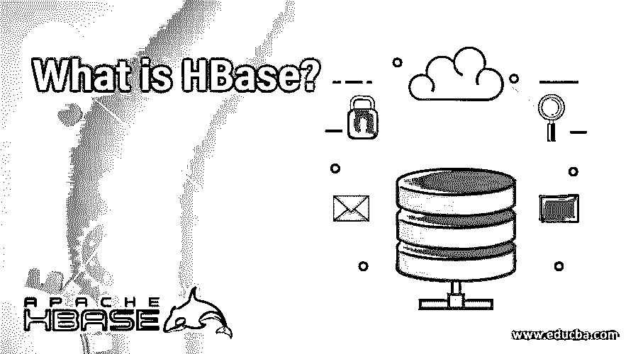

# HBase 是什么？

> 原文：<https://www.educba.com/what-is-hbase/>

## HBase 简介

HBase 是一个开源的 NoSQL 数据库，是 Hadoop 框架的一部分，用于重要的数据实现。它在 Hadoop 分布式文件系统(HDFS)上运行，用于存储大量数据。它是 Hadoop 集群中高度可扩展的数据库，对于结构化数据的存储和处理非常有效。它使用带有预写日志(WAL)的日志存储。它支持快速随机存取和重型写作能力。它处理大规模数据集中的聚合函数，如求和、计数和平均计算。一些大型组织，如脸书和 Twitter，实施 HBase 作为其大容量数据处理技术堆栈的一部分。

**例如**–h base 是结构化数据的最佳处理环境。脸书是最突出的例子之一，它使用拥有数十亿行和数百万列的消息传递平台。

<small>Hadoop、数据科学、统计学&其他</small>

数据一致性是读/写操作期间的一个重要因素；HBase 极大地影响了一致性。为了管理每个区域的服务器，首先需要 HBase 的架构。它在 Java 上大量编码，打算在 2010 年推出一个顶级的 Apache 项目。

### HBase 是什么？

HBase 使用区域服务器复制自动处理故障转移和负载平衡。它还可以捕获元数据分片是 HBase 中主要使用的概念。正如我们已经知道的，HBase 将由区域服务器为其供电的区域组成，每个部分都将在完全不同的数据节点上的区域服务器的帮助下进行拆分。它可以手动或自动进行拆分。

为了扩展集群，我们可以向集合中添加 n 台机器，而不是让服务器变得更强大。此外，我们可以动态创建多个集群。当区域服务器节点运行时，该组开始自行重新平衡。它有一个独特的特性，即单独存储每一列，不像任何其他关系数据库那样基于行进行存储。它还支持简单的操作，只需使用命令行工具。

### 它是如何让工作变得如此简单的？

唯一的原因是因为存储机制。从根本上说，它是一个分段排列的数据库。此外，其中的表格是按列排列的。这里，表结构只描述了区段族，它们是键-尊重集。尽管如此，可以想象一个表有不同的区段族，这里每个区段族可以有任意数量的区段。此外，在这里的板块，导致部分 esteems 被搁置毗邻。此外，该表的每个单元格估计都有一个时间戳。

在 HBase 中，表指的是列的累积。该线表示截面族的集合。截面族指的是管段组。该部分提到了键尊重集的集合。

### 你能用 HBase 做什么？

虽然我们需要对大数据进行不定期的、持续的读/写访问，但我们使用 Apache HBase。可以想象，使用 Apache HBase 在项目设备组上放置非常大的表。Google 的 Bigtable 之后，演示的是非社交数据库。从根本上说，由于 Bigtable 在谷歌文件系统上行为不端，以同样的方式，HBase 在 Hadoop 和 HDFS 的顶部开了一枪。

### 使用 HBase

假设一个表的记录放在内存页面中。这些页面被传送到基本存储器，万一它们没有正式显示在存储器中。万一一行拥有一页，我们需要所有特定的部分，例如，补偿或热情率从一些调查的每一行，每一页包含段必须获得内存；因此，这个页面输入和页面输出将导致大量的 I/O，这可能会导致处理时间的延迟。

在分段式数据库中，每一段都将放在页面中。万一我们必须获得某个特定的特性，I/O 将会减少，因为只有包含预定段的页面应该被带到主内存中并被读取。我们不需要获得并仔细阅读包含行/记录的每一页。

因此，我们必须获得显式片段而不是完整记录或集合的查询最好在详细定位的数据库中进行，这对于我们可以获得几个部分并进行一些数值活动的调查是有价值的。

### 应用

1.  要编写大量的应用程序，我们可以使用 Apache HBase。
2.  此外，当我们需要提供对可用数据的快速随机访问时，我们使用 HBase。
3.  一些公司也在内部使用 HBase，如脸书、Twitter、雅虎和 Adobe 等。

### 优势

*   它有助于提高生产率和缓解信息压力。
*   这支持快速信息恢复。
*   组织和设计是分开的。它可以很好地向外扩展，因此很难扩展。
*   这对于 elite 的总计问题(计数、总计、AVG、最小值和最大值)非常有用。
*   这有助于分配，因为它突出了编程分片工具，将更重要的区域传达给小区域。

### 为什么要用 HBase？

*   它有一个完全循环的工程，可以处理惊人的大规模信息。
*   它适用于难以置信的任意阅读和编写活动。
*   它安全性高，信息管理简单。
*   它给出了非常高的合成吞吐量。
*   满足额外先决条件的扩展是一致且快速的。
*   它可以用于有组织和半组织的信息类型。
*   当你不需要为 RDBMS 的全部容量而烦恼时，这是很棒的。
*   它有一个无可挑剔的测量和直接的适应性亮点。
*   信息仔细阅读和撰写可靠。
*   可以有效地安排和自动化表分片。
*   不同的服务器被给予编程的故障转移支持。
*   HBase 表可以支持 MapReduce 部署。
*   客户得到的与 Java APIs 一致。

### 我们为什么需要 HBase？

HBase 是一个动态的 [NoSQL 数据库](https://www.educba.com/what-is-nosql-database/),在这个被大数据压倒的时代，它正在不断膨胀。它有非常简单的 Java 编程基础，可以用来大规模扩展它。在许多业务情况下，我们只处理不充分的信息，也就是搜索一堆信息字段，这些字段与信息句柄中数十亿的特定标准相协调。它非常缺乏和强大，可以处理不同种类的信息，使其对变化的业务情况有价值。

这是一个分段排列的表，使得在数十亿个信息字段中搜索正确的信息变得简单。通过适当的设置和自动化，您可以毫不费力地将数据分割成表格。它完全适合于系统地准备信息。由于解释性准备需要大量的知识和措施，它使得查询超过了在一个单独的服务器上可以想象的临界点。这就是分散的库存进入画面的点。

同样，需要处理大量的阅读和写作，这对于 RDBMS 数据库来说是不现实的；因此，HBase 是这种应用的理想选择。这项创新的读/写限制甚至可以扩展到百万/秒，这使它成为一个非凡的首选。脸书将其广泛用于连续通知应用程序，Pinterest 将其用于每秒运行多达 500 万个任务的大量任务。

### 学习这些技术的合适受众？

*   软件开发人员和大型机专业人员。
*   项目经理、大数据分析师和测试专业人员。
*   Java 开发人员，数据管理专家。

### 范围和职业发展

正如我们可能意识到的那样，Hadoop 环境正在崛起，我们可以说 HBase 是处理 HDFS (Hadoop 分布式文件系统)顶层的理想舞台。随后，截至目前，学习它将在开发中有用。事实上，即使是组织也在寻找能够在由生产设备组成的庞大 Hadoop 集群上大规模发送 HBase 信息模型的竞争对手。按照这些思路，学习 HBase 创新将帮助我们执行一些任务，发送 Load 实用程序来堆叠文档，用 Hive 协调它，并了解 API 和 HBase Shell。因此，学习它将把我们的职业带到下面的维度。

### 结论

学习 HBase 后，您将主要执行不同的任务，发送 Load 实用程序来堆叠记录，将其与 Hive 合并，了解 HBase API 和 HBase Shell。这可以极大地帮助你在你的职业中把你的职业带到下面的维度。

### 推荐文章

这是什么是 HBase 的指南？这里我们讨论了 HBase 的概念、工作、应用和优点。您也可以浏览我们推荐的其他文章，了解更多信息——

1.  [什么是数据处理？](https://www.educba.com/what-is-data-processing/)
2.  [什么是数据仓库？](https://www.educba.com/what-is-data-warehouse/)
3.  [数据挖掘的定义是什么？](https://www.educba.com/marketing/courses/retail-management-course/)
4.  [什么是数据科学？](https://www.educba.com/what-is-data-science/)

