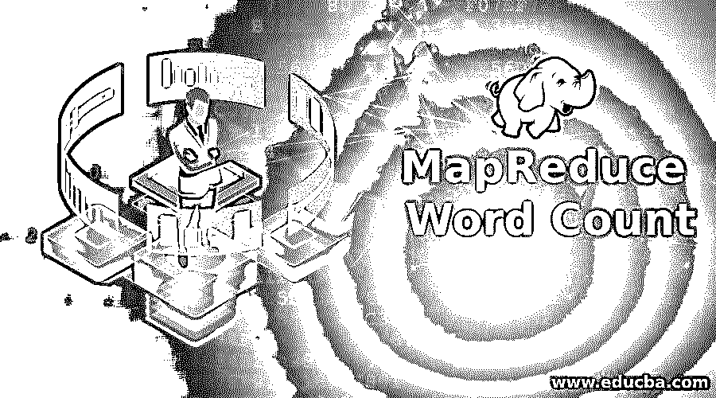
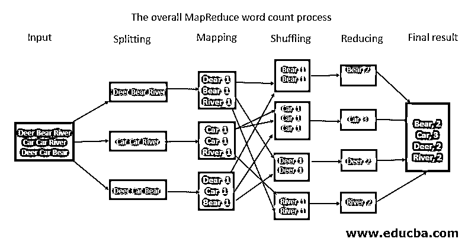
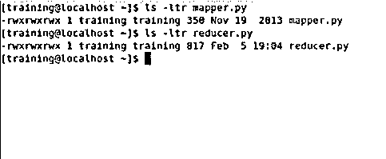
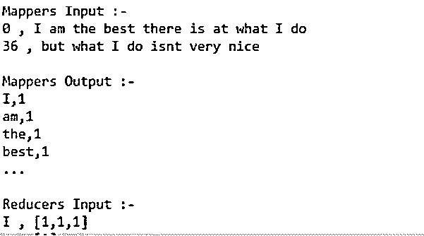
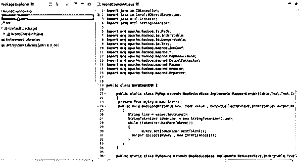
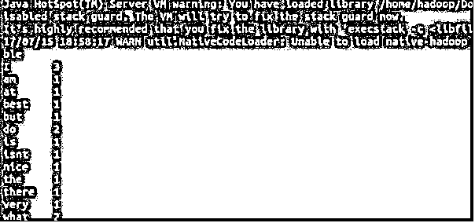

# mapreduce 字数

> 原文：<https://www.educba.com/mapreduce-word-count/>

## MapReduce 字数统计简介

Hadoop 可以用 Python 和 C++这样的编程语言开发。MapReduce Hadoop 是一个软件框架，用于编写处理大量数据的软件应用程序。MapReduce Word Count 是一个框架，它分割数据块，对地图输出和输入进行排序，以减少任务。文件系统存储作业的输出和输入。失败任务的重新执行、调度和监控是框架的任务。我们将学习如何在 MapReduce 中用 Hadoop 编写代码，而不涉及 python 将代码翻译成 Java。

### Python BeautifulSoup 的安装

安装说明:

<small>Hadoop、数据科学、统计学&其他</small>

**解释:**接收 STDIN 和 STDOUT(标准输入和标准输出)有助于在 Reduce 和 Map 代码之间传递数据。Python 中使用 sys.stdout 打印输出，sys stdin 读取输入。

**拆分**:拆分器的参数可以是任意值。用逗号、空格、换行符或分号。

**映射:**如下所述。

**洗牌/中间拆分:**该过程通常在集群键上并行进行。映射的输出进入 Reducer 阶段，所有相似的数据键在一个集群中对齐。

**减少:**这是按照下面的解释完成的。最终结果——所有数据被聚集或组合在一起以显示结果的综合形式。

给定的输入被转换成字符串。然后它把它们变成单词，就好像需要把它们分解一样。映射器将在每个单词后附加一个数字，映射器输出如上所示。一旦我们以键-值对的形式获得输出，一旦我们将偏移地址作为输入传递给映射器，值的输出将是键-值对。

输出进入排序和洗牌阶段。当我们根据关键字进行排序时，所有的关键字都会出现在一个特定的位置。完成了对键的排序和洗牌。一个单词将被传递给一个缩减器。缩减器的输入是键值对。一旦我们将输出作为输入传递给 reducer，reducer 就会将所有的值累加到 key 中。

也就是说，它将所有相似的键组合在一起，输出将是串联的键-值对。缩减器将从 temp 路径中选取结果，并到达最终结果。当我们执行 map-reduce 时，应该在 HDFS 创建输入和输出。这就是为什么要导入大量有助于字数统计的文件。我们使用一种叫做作业客户端的东西来进行配置。扩展配置和实现工具。

### 实现 MapReduce 字数统计的示例

下面是提到的例子:

#### 1.Map()函数

创建和处理导入数据。接收数据，将其转换为一组其他数据，在这些数据中，将单个元素分解为元组。没有 API 合同要求一定数量的输出。

#### 2.Reduce()函数

映射器的输出被传递到 reduction。将数据处理成有用的东西。每个映射器都被传递到简化的函数中。新的输出值被保存到 HDFS 中。使用 MapReduce 在 Python 中编写字数统计代码时使用了一个称为流的概念。让我们看看 mapper Python 代码和 Reducer Python 代码，以及如何使用流 jar 文件执行它们。该 API 对此任务有一个技术名称，即洗牌和排序阶段。

MapReduce 将所有东西都作为键值对，即 mapper 输入的值、输出的值和 reducer 输入的值，输出是键值。

**输入:**
我在我所做的事情上是最棒的，但是我做的不太好。

将此视为输入，这就是使用地图获取输入并减少输入的方式。

**输出:**

We need to know the datatypes of mapper and reducer inputs and outputs.
Lately, all the input is taken and is read one by one by the mapper and then passed the output to the reducer. In this case, first comes I and then am and so on. Importing a few files and other libraries for running the program will help you get done with the word count.

### 结论

假设您有许多文档，这是一个巨大的数据。您需要计算每个单词在文档中出现的次数。我可能看起来像一个任意的任务，但基本思想是，让我们说你有很多网页，你想让它们可用于搜索查询。数据的聚合是由 reducer 完成的，它由所有键组成，并将它们组合成类似的键值对，这就是 Hadoop 洗牌过程。

### 推荐文章

这是一个 MapReduce 字数指南。在这里，我们讨论一个介绍 MapReduce 字数与安装和例子与解释。您也可以浏览我们的其他相关文章，了解更多信息——

1.  [Mapreduce 合并器](https://www.educba.com/mapreduce-combiner/)
2.  【MapReduce 的工作原理
3.  [MapReduce 算法](https://www.educba.com/mapreduce-algorithms/)
4.  [什么是 MapReduce？](https://www.educba.com/what-is-mapreduce/)

