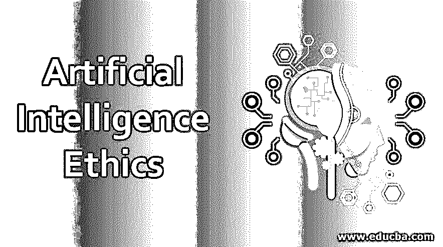

# 人工智能伦理

> 原文：<https://www.educba.com/artificial-intelligence-ethics/>

## 人工智能伦理学导论

在今天的场景中，我们将人工智能视为一种通过推荐系统、物流优化、欺诈检测、自动化等来缓解事物并给我们的生活带来舒适的方式。但它也带来了某些挑战，如失业、人工智能对人类的行为(反之亦然)、人工智能故障和愚蠢、安全和机器人权利。我们每天都在快速前进，法律很难跟上人工智能的步伐。为了所有生物的可持续发展，定义极限是非常重要的。我们知道人工智能系统是肤浅的，处理它们并不简单，但引入人工智能伦理将为未来的人工智能世界提供正确的方向。

### 什么是人工智能伦理？

伦理通常是指一个人从事不同生活活动的道德行为。同理，人工智能中的伦理是指 AI 系统和机器人的活动。我们的生活被基于人工智能的软件所包围，例如，谷歌的搜索引擎，Youtube 网飞上的 Alexa 不同建议，自动驾驶汽车和面部识别系统。

<small>Hadoop、数据科学、统计学&其他</small>

这引发了人们对这些算法如何提供建议或如何为不同客户定义信贷限额的担忧。对于某些算法，很容易理解流程，但对于[深度学习算法](https://www.educba.com/deep-learning-algorithms/)，我们无法解释它们是如何理解的。我们现在有不断进化的算法，日夜不停地学习；从某种意义上说，很难说这些结论是根据什么参数得出的。

例如，一家银行使用人工智能系统为不同的人批准贷款。算法可以选择任何参数，甚至种族/宗教/种姓/地位。这违反了我们平等对待所有人的道德法律，使用人工智能系统的公司可能不知道歧视，但看到前一年的数据，它显示某些种族/宗教没有获得与其他宗教同等地位的贷款。在这里，银行不能被指责为歧视，但它影响了人们的道德，所以它必须受到法律的约束，人工智能系统应该有道德规范。

我们正在快速进步，甚至我们能够创造出显示类似人类结果的系统，现在的问题是如何定义类似人类？人类的决定可以被影响和操纵，对吗？在这里，我们面临一个障碍，人们如何能相信这些人工智能系统是公平的？

### 解释人工智能中的伦理

为了解释伦理，我们需要考虑人工智能可能不道德的这些情况。

1.  来应对失业，当 AI 抢走工作。
2.  财富创造的不平等:人工智能机器所有者 vs 其他人
3.  人工智能错误和愚蠢
4.  安全问题/个人隐私

作为人类，我们也根据个人的选择来选择，比如衣服/风格/食物和我们想成为朋友的人的类型，我们在选择生活伴侣时会看到优点和缺点，一些人相信血统，另一些人相信种姓/地位。所以人类的道德是多样化的。

我们为道德选择的参数并没有具体定义，当我们建立人工智能系统时，它也从我们提供的数据中学习。现在理解这里的年表，当我们向 AI 系统提供万亿字节的数据时(从我们指的是所有人类有意或无意地不断向谷歌搜索引擎/ Alexa 和其他应用程序提供数据)。它不能像我们应该喂什么数据喂多少数据那样被监督，而且 AI 深度学习算法非常复杂，而且不断学习。强化学习，是的，它改进了模型，但它肯定是基于我们提供的数据。

如今，我们已经建造了像人类一样的人工智能机器人，它们看起来像人类，说话像人类，拥有像人类一样的表情和情感。比如霓虹 AI 三星创造了 AI 人类。这才刚刚开始，现在他们与人类互动并学习；很有可能产生有影响的结果。

这些让我们想到了人工智能伦理的概念——它只不过是管理人工智能系统或人工智能机器人行为的个人或群体的道德原则。我们可以说人工智能不仅仅是技术，但它影响了普通人，为人工智能定义伦理也很重要。

这里我们关心的是这些系统的训练方式，以及它们做出什么样的预测，提供什么样的结果。偏见是人工智能系统的主要问题之一，我们无法制造完全中立的人工智能，这使得人工智能领域与其发展一样至关重要。

是的，肯定是这样的，反之亦然；此外，人类也必须以同样的方式对待机器人，从而赋予人工智能自己的权利，人类可以在它不能使用的地方使用它。假设一个人命令机器人杀死其他人，这当然是错误的，但机器人必须有能力在那个时候做出决定，并确保它我们今天必须定义人工智能伦理。

我们都知道，这可能是好事，也可能是坏事，如果恐怖分子可以操纵人类的智力，制造圣战分子，那么训练这些像机器人一样的人类来制造人造恐怖分子来伤害他人呢，这是一个严重的问题。

为了处理这些问题，人工智能伦理必须得到阐述。甚至一些像谷歌这样的大公司也定义了他们自己的道德行为准则，即人工智能将只用于道德目的，而永远不会被设计成武器。

### 结论

随着技术的进步，为人工智能机器对人类的道德行为定义一些方向是非常重要的，反之亦然。在上面的文章中，我们已经讨论了人工智能伦理发挥非常重要作用的各种场景。我们讨论了人工智能对我们影响最大的领域，如安全/隐私/失业/不平等等。为了解决上述问题，大公司都有自己的道德行为准则，以便朝着正确的方向前进。

### 推荐文章

这是一本人工智能伦理指南。这里我们讨论人工智能中伦理的介绍和解释。您也可以浏览我们的其他相关文章，了解更多信息——

1.  [人工智能软件](https://www.educba.com/artificial-intelligence-software/)
2.  [人工智能技术](https://www.educba.com/artificial-intelligence-techniques/)
3.  [人工智能中的智能体](https://www.educba.com/agents-in-artificial-intelligence/)
4.  [人工智能问题](https://www.educba.com/artificial-intelligence-problems/)

