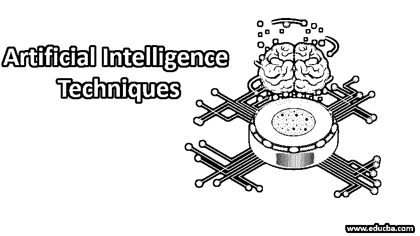
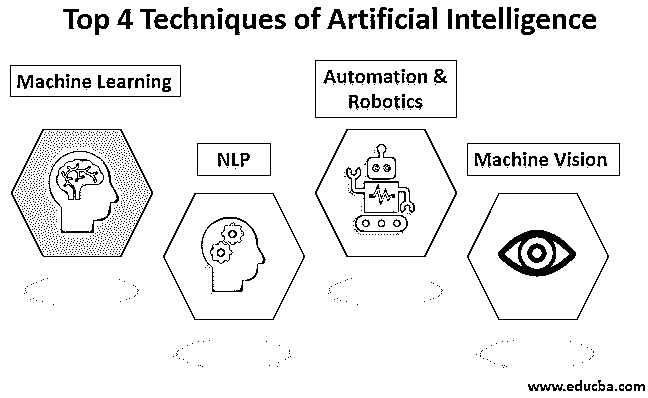

# 人工智能技术

> 原文：<https://www.educba.com/artificial-intelligence-techniques/>

## 什么是人工智能入门？

人工智能指的是机器，主要是像人一样工作的计算机。在人工智能中，机器执行语音识别、解决问题和学习等任务。如果有足够的信息，机器可以像人一样工作和行动。所以在人工智能中，知识工程起着至关重要的作用。建立对象和属性之间的关系，实现知识工程。以下是人工智能的技术。

### 人工智能的四大技术

根据机器利用过去的经验预测未来决策的能力、记忆和自我意识，人工智能可以分为不同的类别。IBM 开发了深蓝，这是一个可以识别棋盘中棋子的国际象棋程序。但它没有预测未来行动的记忆。这个系统虽然有用，但它不能适用于另一种情况。另一种类型的人工智能系统，利用过去的经验，并具有有限记忆的优势来预测决策。这种人工智能系统的一个例子可以在自动驾驶汽车的决策功能中找到。在这里，观察有助于很快采取行动，由于观察经常变化，这些行动不会被永久存储。与此同时，随着技术的进步，有可能拥有具有感知或意识的机器，这些机器可以理解事物的当前状态，这可以用来推断要做什么。但是这样的系统并不存在。

<small>Hadoop、数据科学、统计学&其他</small>

以下是人工智能的各种类别:

#### 1.机器学习

它是人工智能的应用之一，机器没有明确地被编程来执行某些任务；相反，他们从经验中自动学习和提高。深度学习是基于人工神经网络进行预测分析的机器学习的子集。有各种机器学习算法，如无监督学习、监督学习和强化学习。在无监督学习中，算法不使用分类信息，在没有任何指导的情况下对其进行操作。在监督学习中，它从训练数据中推导出一个函数，该函数由一组输入对象和期望输出组成。机器使用强化学习来采取适当的行动以增加奖励，从而找到应该考虑的最佳可能性。

#### 2.自然语言处理

正是计算机和人类语言之间的交互，计算机被编程来处理自然语言。机器学习是自然语言处理从人类语言中获取意义的可靠技术。在自然语言处理中，人类谈话的音频被机器捕获。然后进行音频到文本的转换，然后处理文本，将数据转换成音频。然后机器用音频来回应人类。[自然语言处理](https://www.educba.com/what-is-natural-language-processing/)的应用可以在呼叫中心使用的 IVR(交互式语音应答)应用、Google Translate 等语言翻译应用以及 Microsoft Word 等文字处理器中找到，以检查文本中语法的准确性。然而，人类语言的性质使得自然语言处理变得困难，因为使用自然语言传递信息时涉及到规则，并且这些规则不容易被计算机理解。因此，NLP 使用算法来识别和抽象自然语言的规则，其中来自人类语言的非结构化数据可以转换为计算机可以理解的格式。

#### 3.自动化和机器人

自动化的目的是让单调和重复的任务由机器来完成，这也提高了生产率，并获得成本效益和更有效的结果。许多组织在自动化中使用机器学习、[神经网络](https://www.educba.com/what-is-neural-networks/)和图形。这种自动化可以通过使用验证码技术来防止在线金融交易中的欺诈问题。机器人过程自动化被编程来执行大量重复的任务，这些任务可以适应不同环境的变化。

#### 4.计算机视觉

机器可以捕捉视觉信息，然后进行分析。这里，摄像机用于捕捉视觉信息，模数转换用于将图像转换为数字数据，数字信号处理用于处理数据。然后将结果数据输入计算机。在机器视觉中，两个至关重要的方面是灵敏度和分辨率，灵敏度是机器感知微弱脉冲的能力，分辨率是机器区分物体的范围。机器视觉的应用可以在签名识别、[模式识别](https://www.educba.com/pattern-recognition/)和医学图像分析等方面找到。

### 人工智能的应用

下面是人工智能的各种应用。

*   人工智能用于金融行业，在那里收集个人数据，这些数据可以在以后用于提供金融建议。
*   人工智能被用于教育领域，在该领域中，评分系统可以自动化，并且可以评估学生的表现，基于此可以改进学习过程。
*   在医疗保健领域，人工智能用于进行更好的诊断，这些技术用于理解自然语言并对所提问题做出回应。此外，像聊天机器人这样的计算机程序被用来帮助顾客安排约会和简化结帐过程等。
*   人工智能在商业中被用于在机器人流程自动化的帮助下自动化由人类执行的重复任务。为了提高客户满意度，机器学习算法与分析相结合，以收集有助于了解客户需求的信息。
*   人工智能用于智能家居设备、安全和监控、导航和旅行、音乐和媒体流以及视频游戏等。

### 结论

人工智能正在大规模地影响我们的生活。组织也在采取措施适应人工智能技术，这可以为他们提供执行任务的新方法，以及理解数据模式以实现最大生产力。

### 推荐文章

这是一本人工智能技术指南。在这里，我们讨论什么是人工智能及其技术和应用。您也可以浏览我们推荐的其他文章，了解更多信息——

1.  [人工智能技术——优势](https://www.educba.com/artificial-intelligence-technology/)
2.  [人工智能的重要性——用途](https://www.educba.com/importance-of-artificial-intelligence/)
3.  [人工智能工具介绍](https://www.educba.com/artificial-intelligence-tools/)
4.  [十大人工智能面试问题](https://www.educba.com/artificial-intelligence-interview-questions/)

