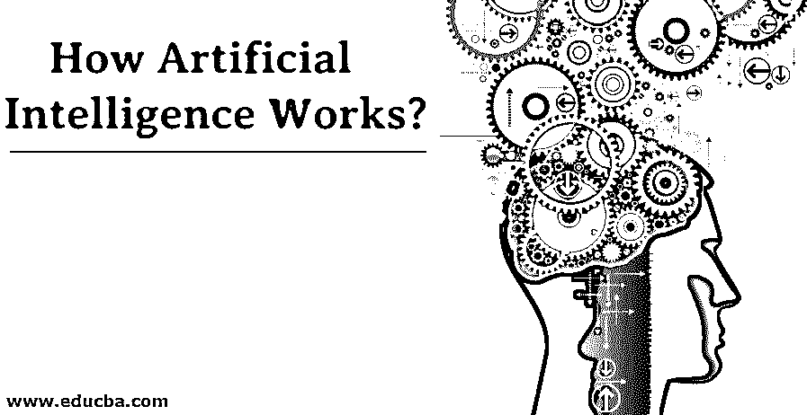
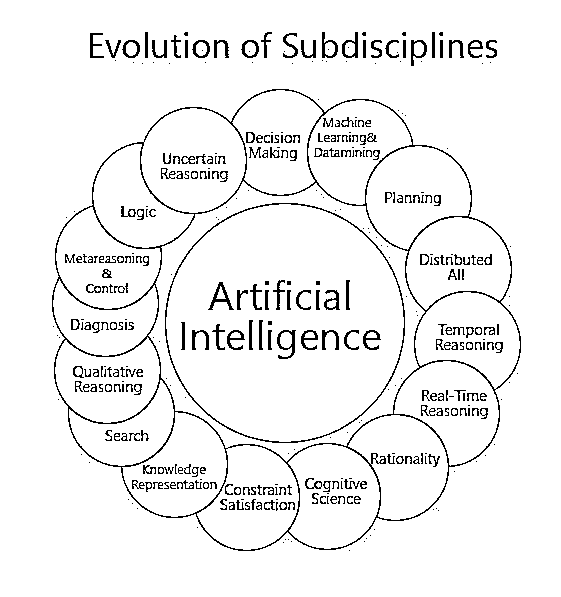
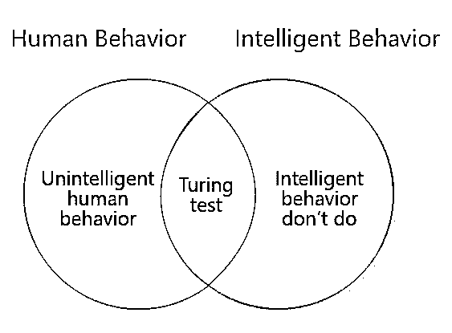

# 人工智能是如何工作的？

> 原文：<https://www.educba.com/how-artificial-intelligence-works/>

## 人工智能如何工作的介绍？

人工智能主要工作在三种技术上。它们是象征性的人工智能、数据驱动和未来发展。符号人工智能包括专家系统、模糊逻辑和人工智能的早期原理。在专家系统中，计算机被给定一个问题，并且很少进行实践来检查其逻辑解决问题的技能。他们给了一套规则，在约束的环境下他们会严格遵循最好的。在模糊逻辑中，这是一种主要用于判断真假的方法，并应用于控制系统中。在数据驱动的机器学习中，神经网络和深度学习算法通过数据挖掘和大数据来处理数据池，并应用于 NLP。区分不同的方法并根据它们的成熟程度应用正确的方法是很重要的。在这个主题中，我们将了解人工智能是如何工作的。

### 人工智能如何应用？

教育中的人工智能为人类做出了有价值的贡献。在这里，一个复杂的问题通过将问题分成子单元并找到每个子单元的解决方案来解决。这个子单元可能是一个系统，也可能是一个试图找到问题解决方案的人。提出的理论表明，教育中的认知科学通过给计算机编程开发了一个导师，而这个导师会观察学生解决问题的技能。导师会在学生落入陷阱之前，通过阻止他们来指导和建议他们解决问题的每一步。这种方法使学生从问题中吸取教训，并在将来有所认知。

<small>Hadoop、数据科学、统计学&其他</small>

专家系统广泛应用于人工技术中。流行的是拼写纠正和拼写检查。他们充当校对者，检查拼写和语法错误，并给出所有可能的建议，以获得最好的文章。自动化工业中的专家系统广泛应用于其 80%的制造过程中。它节省了劳动力成本，减少了错误，并在最短的时间内提供了最大的产量，因为机器人不需要午餐时间或休息时间。人类需要几个小时才能完成机器人几分钟就能完成的止痛任务。

应用人工智能的机器人最有吸引力，对人力资源最有利。机器人被编程来做重复的任务，这提高了生产率，并且它被有效地使用。机器人的独特之处在于拆弹、太空探索和编程完成所有人类难以完成的任务。机器人的先进研究通过实现碰撞传感器、摄像机和超声波传感器，使它们能够看到、听到和触摸。机器人用于太空探索，它们能适应环境和物理条件。

情绪拦截了人类的智力思维，对于人工思考者来说是一种干扰。除了情感处理，机器人还被编程为逻辑思考和做出有效的决定。

人工智能每天都在我们周围的通信、时间管理、教育、认知、健康、安全措施、交通控制、采购、营销、购物和规划中实施并成功发展。

利用谷歌地图通过 Digikstra 算法寻找最短可能距离，

人工智能在科学中用于设计实验、训练资源、解释数据、降低复杂性。

### 人工智能的基本组成部分

使人工智能成功的五个主要因素是:

**1。发现:**在没有任何人为干预的情况下，从可用资源中发掘数据，是智能系统的基本能力。然后，通过 ETL 算法对其进行处理，以探索大型数据库，并自动找到内容与问题所需解决方案之间的关系。这不仅解决了一个复杂的问题，还识别了紧急现象

**2。预测:**这种方法旨在通过分类、排名和回归来识别未来发生的事情。这里使用的算法是随机森林、线性学习器和[梯度推进](https://www.educba.com/gradient-boosting-algorithm/)。当有偏差时，预测很少在某些数值上出错。

**3。Justify:** 应用程序需要人工干预，以给出更可识别和可信的结果。因此，它需要理解和证明什么是错的和正确的，然后给人类一个正确的解决方案来处理这种情况。与自动化行业类似，它需要对机器有一个基本的了解，才能知道为什么要修理它，以及需要进一步做什么。

**4。Act:** 智能应用程序需要活跃并存在于公司中，以便发现、预测和调整

**5。智能系统有每天学习和更新自己的习惯，以适应世界的需求。**

### 例子

AI 中使用的大部分编程语言如下。

Python 是独一无二的，也是计算机程序员最喜欢的，因为它的语法简单而通用。它非常舒适，适用于所有操作系统，如 Unix、Linux、Windows 和 Mac。由于 Python 具有系统的层次性，所以它被应用于 OOPS、神经网络、NLP 开发和各种类型的编程中。它是如此的独特，并且具有多种多样的库函数。

C++主要应用于人工智能编程任务，因为它的时间敏感特性。它具有最短的响应时间和快速的执行过程，这对开发游戏和搜索引擎很重要。由于其继承和数据隐藏特性，它是可重用的。它被广泛用于解决人工智能统计技术。

Java 是另一种最常用的人工智能编程语言，由于虚拟机技术，它不需要任何特殊的平台来重新编译。它结合了 [C 和 C++](https://www.educba.com/c-vs-c-plus-plus/) 的特点，使其更加简单，易于调试。此外，Java 中的自动内存管理器减少了开发人员的工作。

LISP 在部分 AI 开发中使用。LISP 有一个特定的宏系统，可以减轻对多层次智能的实现和探索。它主要应用于解决逻辑任务和机器学习。它有利于程序员的自由和快速原型化，并使 LISP 成为人工智能中更标准和用户友好的语言。

PROLOG 用于基本算法自动回溯、基于树的结构化和模式匹配，这对于 AI 是强制性的。此外，它还广泛应用于医学。

### 结论

人工智能正在所有行业成功树立里程碑，如电子商务、生物技术、疾病诊断、军事、数学和物流、重工业、金融、交通、电信、航空、数字营销、电话客户服务、农业和游戏。

### 推荐文章

这是一本关于人工智能如何工作的指南？.在这里，我们用各自的例子详细讨论人工智能的基本组成部分。您也可以看看以下文章，了解更多信息–

1.  [人工智能简介](https://www.educba.com/introduction-to-artificial-intelligence/)
2.  [人工智能面试问题](https://www.educba.com/artificial-intelligence-interview-questions/)
3.  [人工智能问题概述](https://www.educba.com/artificial-intelligence-problems/)
4.  [人工智能未来指南](https://www.educba.com/future-of-artificial-intelligence/)
5.  [学习人工智能的用途](https://www.educba.com/uses-of-artificial-intelligence/)

