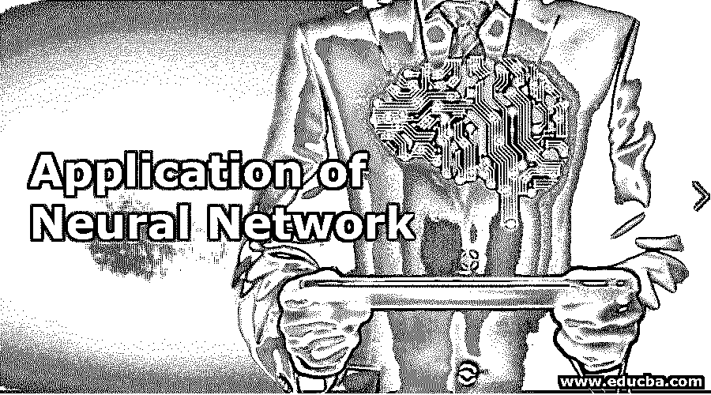
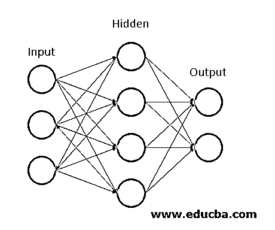

# 神经网络的应用

> 原文：<https://www.educba.com/application-of-neural-network/>

## 神经网络应用导论

下面的文章为神经网络的应用提供了一个详细的概要。我们脑海中出现的第一个问题是，人工神经网络意味着什么？为什么我们需要一个人工神经网络？人工神经网络是基于生物神经网络的计算模型。它们使解决问题变得更容易，而传统上我们需要为复杂的问题编写长代码。

[神经网络有助于解决](https://www.educba.com/dnn-neural-network/)问题，而不需要对特定问题的规则和条件进行大量编程。它们是用于许多类似问题的简化模型，在幕后有最复杂的数学计算。经过训练后，神经网络的预测速度比传统程序快得多。

<small>Hadoop、数据科学、统计学&其他</small>

不同类型的神经网络如下

*   卷积神经网络
*   前馈神经网络
*   递归神经网络
*   多层感知器

最广泛使用的神经网络模型是卷积神经网络(CNN)。

### 人工神经网络

让我们先来看看人工神经网络(ANN)。人工神经网络主要有三层。

**1。输入层:**输入层是包含负责特征输入的神经元的层。除了用于特征的神经元之外，还有一个用于偏置的神经元被添加到输入层。所以输入层总共有 n+1 个神经元。偏差负责直线或曲线从原点的转移。

**2。隐藏层:**隐藏层是介于输入层和输出层之间的层。隐藏层的数量可以根据应用和需要而变化。深度神经网络是包含不止一个隐藏层的网络。

**3。输出层:**输出层包含负责一个分类或预测问题输出的神经元。其中神经元的数量基于输出类的数量。

### 神经网络的应用

人工神经网络广泛应用于图像分类或标记、信号检测或语言翻译等领域，就像我们发现的 Google Translator 一样。可能是欺骗检测使用一些生物特征或信号或某种预测或预测，你可以发现所有这些事情都被人工神经网络所覆盖。

我们可以将应用程序大致分为以下几个领域:

*   形象
*   信号
*   语言

#### 1.图像中的安

人工神经网络目前广泛应用于图像和视频中。从图像处理和分类到图像的生成，我们都可以看到神经网络的应用。图像和视频标记也是神经网络的应用。如今，人工神经网络也广泛用于生物识别，如人脸识别或签名验证。

*   **字符识别:**我们一定找到了要求我们上传 KYC 文档图像的网站或应用程序，对吗？他们所做的只是识别我们 KYC 文件图像中的字符。这是神经网络的一个广泛应用，属于[模式识别](https://www.educba.com/pattern-recognition/)的范畴。可以使用字符识别将文档图像或旧文献数字化。在这里，文档的扫描图像被提供给模型，模型识别该扫描文档中的文本信息。通常用于此的模型是 CNN 或其他多层神经网络，如具有反向传播的神经网络。
*   **图像分类或标记:**当我们无法识别某些东西时，我们使用谷歌图像搜索，这种感觉多好啊！!这就是所谓的图像分类，或者说它对输入的图像进行标记。卷积神经网络或具有反向传播的前馈神经网络通常用于图像分类。还有许多其他模型，但是需要根据数据集和感兴趣的特征来选择模型。如果您的问题的数据集与您选择的预训练模型的数据集相似，则可以使用任何预训练模型来完成迁移学习。有许多预训练的图像分类模型，它们是在不同的成百上千个类别的数百万幅图像上训练的。一些模型是 ResNet，GoogLeNet，InceptionV3，VGG16，ImageNet 和更多可用的。
*   **目标检测:**图像中的目标检测广泛用于检测任何目标，并在此基础上对其进行分类。它需要大的训练数据集，并且清楚地指定感兴趣对象的所有坐标。广泛使用的对象检测模型是 YOLO(你只看一次)和 SSD(单次对象检测器)。
*   **图像生成:**图像生成有助于根据数据生成假图像。漫画生成也可以被认为是其应用之一。GAN(生成对抗网络)用于图像生成模型。它们由图像发生器和鉴别器组成。

#### 2.信号中的神经网络

人工神经网络是基于生物神经网络的系统，人工神经网络中的神经元类型之一是

*   **语音识别:**语音识别系统将语音信号转换并解码成文本或某种形式的意义。我们可以说这是虚拟助手或聊天机器人应用的直接例子。现在的谷歌智能家居，Alexa，Siri，谷歌助手或者 Cortana，我们大多数人都知道。

#### 3.语言中的安

这可以分为两种模式，主要是

*   **文本分类和归类:**文本分类是文档搜索和过滤、在线网页搜索以及语言识别和情感分析的基本部分。神经网络被积极地用于这种任务。命名实体识别和词性标注是自然语言处理(NLP)领域中的一些应用。广泛使用的模型是递归神经网络(RNN)和长短期记忆(LSTM)网络。尽管 CNN 也用于一些应用。
*   **语言生成和文档摘要:** 自然语言生成和释义以及文档摘要被广泛用于生成文档和摘要多文档。它们的应用可以在从数据表生成基于文本的报告、自动报告写作、总结医疗报告、生成故事和笑话等方面找到。

广泛用于文本生成的模型是递归神经网络(RNN)模型。

### 结论

神经网络有助于通过广泛的训练使困难的问题变得容易。它们被广泛用于分类、预测、对象检测以及图像和文本的生成。

### 推荐文章

这是神经网络应用的指南。这里我们也讨论一下关于神经网络应用的介绍。您也可以看看以下文章，了解更多信息–

1.  [神经网络的分类](https://www.educba.com/classification-of-neural-network/)
2.  [网络扫描工具](https://www.educba.com/network-scanning-tools/)
3.  [递归神经网络(RNN)](https://www.educba.com/recurrent-neural-networks-rnn/)
4.  [机器学习 vs 神经网络](https://www.educba.com/machine-learning-vs-neural-network/)
5.  [TensorFlow RNN | How RNN Works?](https://www.educba.com/tensorflow-rnn/)

