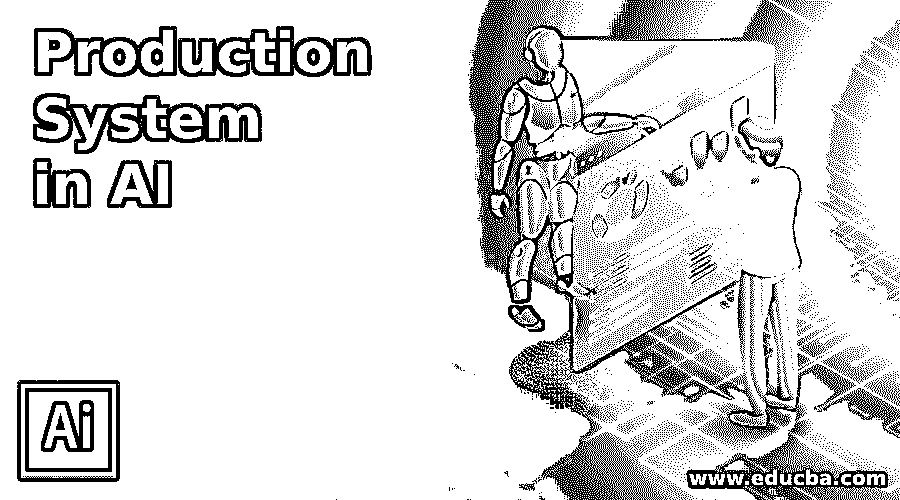

# 人工智能中的产生式系统

> 原文：<https://www.educba.com/production-system-in-ai/>

## 人工智能中的产生式系统简介

人工智能中的生产系统是一个系统程序，用于提供某种形式的人工智能。它包括一套设计特征行为的规则，并涉及一种遵守系统规则并作出相应反应的机制。这套规则被称为产生式，它是行动选择、专家系统和自动化计划的基本表示。文章接下来的部分解释了人工智能中生产系统的特性、生成规则、优势和局限性。

### 人工智能中产生式系统的特征

人工智能中生产系统的基本组件包括一个全局数据库、一组生产规则和一个控制系统。中央数据结构由用于生产系统操作的全局数据库提供，因为全局数据库提供一组预定义的规则。如果定义的前提条件被接受，则执行规则。但是规则的实现改变或更新了数据库。控制系统选择适用的规则，并继续进行进一步的计算，直到数据库上的终止规则被接受。如果同时执行多个规则，控制系统具有管理冲突的能力。

<small>Hadoop、数据科学、统计学&其他</small>

生产系统中每一句话的架构都是统一而简单的。整个系统是独一无二的，因为它们在每组执行中执行 IF-THEN 代码。它是知识表示的来源，增加了产生式规则的可读性。因此，它是用户友好的，并且可以在没有任何复杂性和困难的情况下进行管理，因为它们不太容易完成具有挑战性的任务。

产生式规则的代码及其相关知识在不同的单元中可用。因此，可以在没有任何依赖关系的情况下访问信息，它是一组可以轻松编辑的独立事实，在生产系统中没有反映。生产系统的模块化拥有一组有限的维度，可以很容易地灵活地对系统进行任何修改。

编辑或改变规则的适应性是容易的，并且能够增强骨架格式的产生式规则，然后选择完美且准确的应用程序来执行，而没有任何延迟或缺陷。

生产系统的知识库是密集的，不会发现任何损坏的数据或错误的信息。数据以纯格式存储，不包含任何控制策略或编程信息。产生式规则用简单的英语句子陈述。语义问题被表示的每一部分纠正。

### 人工智能中产生式系统的规则

产生式系统中的规则分为两大类，如溯因推理规则和演绎推理规则。规则在生产系统中的表示是一个重要的部分，整个系统的功能都依赖于规则。这些规则被输入到数据库和控制系统的操作中，并且可以写成如下:

它基于 IF-THEN 条件。

If(条件)then(条件):

它也被称为前因后果、一对反馈和结果、对条件和行动的反应、对模式和行动的行动、对情况的条件和反应。

### 生产系统的优点和缺点

下面提到了一些优点和缺点:

*   产生式系统中规则的表示是自然的，并且以简单的格式表达。对动作周期有快速反应，能根据控制和知识的分离进行识别和反应。数据或目标驱动是状态空间研究的自然映射。
*   产生式规则的模块性和适应性是高效且用户友好的。在不影响生产系统的情况下，对规则进行任何修改的灵活性很高。
*   生产系统执行比算法化控制适应性更强的模式导向控制。如果出现任何复杂情况，它能够以分层的方式对搜索进行探索性控制。
*   生产系统中的故障排除方法是可靠的，它可以用最少的时间找到受影响的部件，并提供简单的系统跟踪。它提供了一般控制和信息规则来管理具有挑战性的任务。
*   由于智能机器的状态驱动态度，它是一个可靠的模型，并表现为对人类决策和解决问题行为的合理设计。它是健壮的，并在实时应用中提供快速响应。
*   除此之外，生产系统的显著特征包括无能、不透明、缺乏学习能力和解决冲突。
*   不透明的出现是由于规则的优先级较低。当有两个或更多产生式规则的任何合并或组合时，它被执行。如果规则的优先级是预先确定的，那么不透明的可能性就较小。
*   大部分生产系统在应用环境中容易出现无能的情况。但是良好组装的控制方法可以最小化这种问题，特别是当一个程序被执行时，多个规则被激活并被执行。发生这种情况是因为在生产系统中有许多预定义的规则，并且在分层方法中，对于控制程序的每次迭代，在每组规则中都要进行复杂的搜索。
*   依赖于规则的生产系统不存储问题的结果，这有助于解决任何未来的问题。相反，它对同一特定问题的每一个新的解决方案都感兴趣，并且没有表现出任何类型的学习能力。因此，人工智能生产系统中学习能力的缺乏需要临时解决，以获得更好的效率和操作。
*   生产系统中的规则不应卷入任何冲突操作。如果用新规则更新数据库，系统应该检查在现有规则和新更新的规则之间不应该有任何冲突。

### 结论

生产系统的重要特征包括用户友好的态度、模块性、适应性和灵活性，以及丰富的知识，这些知识可以在实时环境中毫无差异地应用。

### 推荐文章

这是一个人工智能生产系统的指南。在这里，我们讨论了人工智能中生产系统的介绍，以及特征、规则、优点和缺点。您也可以浏览我们的其他相关文章，了解更多信息——

1.  [PostgreSQL 唯一约束](https://www.educba.com/postgresql-unique-constraint/)
2.  [数据库管理系统的类型](https://www.educba.com/types-of-dbms/)
3.  [物联网特性](https://www.educba.com/iot-features/)
4.  [物联网的组件](https://www.educba.com/components-of-iot/)

