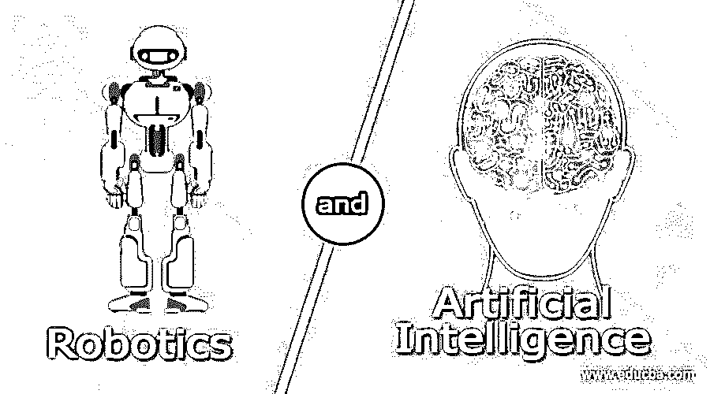
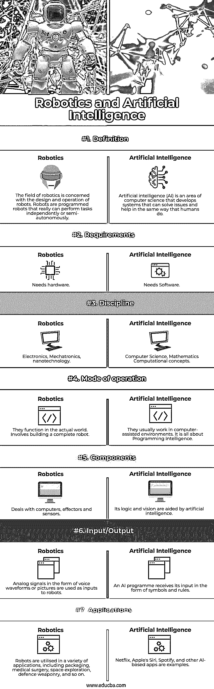

# 机器人和人工智能

> 原文：<https://www.educba.com/robotics-and-artificial-intelligence/>

## 机器人和人工智能的定义

由人工智能操作的机器人被称为人工智能机器人。人工智能是智力，机器人是身体。人工智能机器人是一项相对较新的技术。正在努力使用传感材料和机器学习算法。随机放置的传感器可以检测触摸和压力，并向机器学习系统提供数据，该系统在一个场景中分析信号。

### 机器人和人工智能导论

人工智能(AI)在机器人解决方案中越来越受欢迎，为以前僵化的应用程序带来了灵活性和学习能力。人工智能使现代机器人成为可能。作为人工智能的结果，流程变得更加通用和适应性更强。人工智能机器人是机器人和人工智能之间的纽带。这些是人工智能控制的机器人(AI)。每当我们希望机器人执行越来越复杂的任务时，就会设计人工智能算法。仓储机器人可以采用路径搜索方法来探索仓库。人工智能提出了不同类型思维所需信息的问题。另一方面，机器人技术将人工智能引入实际世界，并允许它与材料实时交互。

<small>Hadoop、数据科学、统计学&其他</small>

机器学习和人工智能(AI)帮助机器人以逐渐类似人类的方式看、走、说、闻和移动。人工智能和机器人是工程学的两个截然不同的分支，几乎没有重叠。虽然设计、创造和控制机器人是机器人技术的一部分，但人工智能并不局限于物理机器人。机器人技术和两种主要的人工智能是兼容的。第一个是软件智能(由微处理器和微控制器提供)，它指导硬件执行特定的操作并做出判断。通过实践，该计划学习和调整得更多。第二种是硬件智能，允许机器人使用学习电路来模仿人类处理信息的方式。人工智能可以有多种用途。

1.在机器人装配应用中，装配人工智能是非常有用的工具。当人工智能与先进的视觉系统结合使用时，它可以帮助实时校正航向，这在航空航天等复杂的制造领域非常有价值。

2.包装:为了更快、更低成本和更精确的包装，机器人包装经常使用人工智能。

3.客户服务:这些机器人中的大多数使用人工智能自然语言处理与客户进行更人性化的交流。

注意:在机器人技术中使用人工智能是基于这样一个事实，即计算机只能通过特定的输入来解决问题。因此，研究人员为机器人提供了训练数据集和各种输入，它们的人工智能会评估为训练样本提供的输入，并决定采取哪种方式。这使得计算机可以做出自己的选择。Alpha Go 就是一个很好的例子。

### 机器人和人工智能之间的面对面比较(信息图)

以下是机器人和人工智能之间的 7 大区别:

### 机器人和人工智能的主要区别

人工智能和机器人是两个截然不同的领域。只有几个共同点存在，但对比是很多的。毫无疑问，这两个领域近年来都在崛起，并将在未来许多年继续主导科技行业。让我们看看这里的区别:

1.人工智能(AI)是指机器或机器人通过使用搜索、逻辑、if-then 规则、决策树、深度学习等方法或算法所展示的智能(如解决问题和学习)。简而言之，人工智能可以帮助学习，解决问题，语言翻译和逻辑推理。

2.人工智能可以在手机、笔记本电脑甚至机器人中找到，它执行最常见的与系统、算法和数据相关的活动——分析和计算特定的结果。有一种机器人是不动的，没有身体，比如在程序中运行的流行聊天机器人。

3.虽然人工智能算法用于驱动机器人，但它们只是更大的机器人系统的一个组成部分，该系统还包括传感器、执行器和非人工智能编程。机器人只是通过计算机系统控制和处理信息，模拟人类活动，而不需要人类的参与。

4.机器人是不需要外部命令就能行动的机器。人工智能是指自主学习和进步的软件。

5.社会关怀是人工智能机器人最显著的优势之一。他们可以利用机器人的社交技能和强大的处理能力来帮助人们，尤其是老年人。只有通过比较外部环境的输入和存储的指令，机器人才能做出决定。人工智能应该用来让一个机器人理解，这就是人工智能和机器人技术碰撞的地方，产生了人工机器智能。

6.机器人采用人工智能来学习和提高它们的独立功能。由于它们被绑定到一组指令，重复的动作不是人工智能。机器人要做复杂的工作，就需要人工智能算法。

7.这完全是在机器人技术中一遍又一遍地复制已知的结果(除了 AI)。当外部情况和可能性发生巨大变化时，机器人会出现故障，特别是如果它们没有做好适当适应的准备。

### 比较机器人和人工智能

虽然机器人和人工智能可能共存，但由于这种结合所提供的内在潜力，科学家们正在将注意力集中在整合这两者上。我们来看几个他们之间的对比。

|  | **机器人技术** | **人工智能** |
| **定义** | 机器人领域涉及机器人的设计和操作。机器人是编程机器人，真正能够独立或半自动地执行任务。 | 人工智能(AI)是计算机科学的一个领域，它开发的系统可以像人类一样解决问题并提供帮助。 |
| **要求** | 需要硬件 | 需要软件。 |
| **学科** | 电子学、机电一体化、纳米技术 | 计算机科学，数学计算概念。 |
| **操作模式** | 它们在现实世界中发挥作用。包括建造一个完整的机器人。 | 他们通常在计算机辅助的环境中工作。这完全是关于编程智能。 |
| **组件** | 处理计算机、效应器和传感器 | 它的逻辑和视觉由人工智能辅助。 |
| **输入/输出** | 声音波形或图像形式的模拟信号被用作机器人的输入。 | 人工智能程序以符号和规则的形式接收输入。 |
| **应用程序** | 机器人有各种各样的应用，包括包装、医疗手术、太空探索、国防武器等等。 | 网飞、苹果的 Siri、Spotify 和其他基于人工智能的应用都是例子。 |

### 结论

尽管“机器人”和“人工智能”这两个词有时可以互换使用，但它们执行的是完全不同的功能。为了在消费者领域取得有意义的进展，人工智能承担了巨大的风险。

### 推荐文章

这是机器人和人工智能指南。这里我们分别讨论信息图和比较表的主要区别。您也可以看看以下文章，了解更多信息–

1.  [数据架构师和管理设计师](https://www.educba.com/data-architect-and-management-designer/)
2.  [决策树优缺点](https://www.educba.com/decision-tree-advantages-and-disadvantages/)
3.  [安卓电视 vs 智能电视](https://www.educba.com/android-tv-vs-smart-tv/)
4.  [Python 多处理 vs 线程](https://www.educba.com/python-multiprocessing-vs-threading/)

