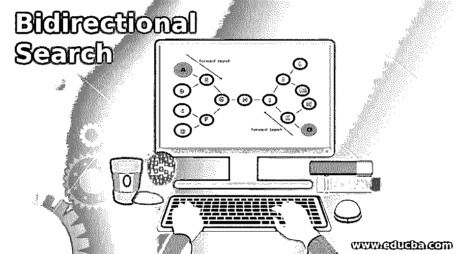
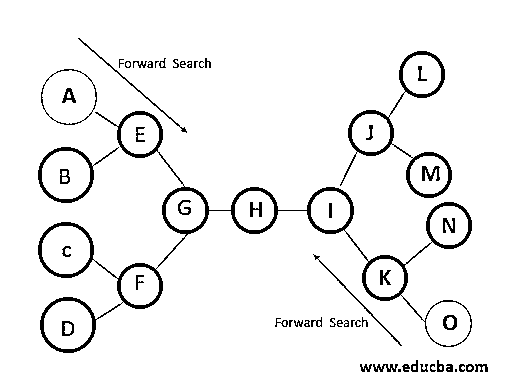
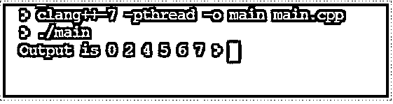

# 双向搜索

> 原文：<https://www.educba.com/bidirectional-search/>

## 双向搜索简介

双向搜索是一种图形搜索，与广度优先搜索和深度优先搜索不同，该搜索从源顶点和目标顶点同时开始，并在两个搜索在图形中的某处相遇时结束。因此，这尤其用于在 DFS 和 FS 搜索所花费的时间的一小部分内获得结果。从初始节点开始的搜索是向前搜索，而从目标节点开始的搜索是向后搜索。它也是基于启发式搜索，即寻找最佳的最短路径。

### 双向搜索算法

启发式是指寻找从图中的当前节点到目标节点的最短路径的概念。搜索总是采用到达目标节点的最短路径。这个原则用于双向启发式搜索。唯一的区别是从初始点和从目标顶点的两个同时搜索。双向搜索背后的主要思想是大幅减少搜索时间。

<small>Hadoop、数据科学、统计学&其他</small>

当两个搜索同时从初始节点深度或广度优先开始，并从图中某处相交的目标节点向后开始时，就会发生这种情况。现在，路径穿过初始节点，通过交叉点到达目标顶点，这是由于该搜索而找到的最短路径。这是最短的路径，用其他搜索算法的一小部分时间就能找到。

这可以通过下面的例子来简化。

**第一步**:比方说，A 是初始节点，O 是目标节点，H 是相交节点。

**第二步**:我们将从起点到目标节点同时开始搜索，从目标到起点节点反向搜索。

**步骤 3** :当正向搜索和反向搜索相交于一个节点时，搜索停止。

因此，当开始节点和目标节点都是已知的和唯一的，彼此分离时，这是可能的。此外，图中两个遍历的分支因子是相同的。此外，要注意的其他点是，如果广度优先搜索用于两个遍历，即从开始节点到交叉点和从目标节点到交叉点的两个路径，则双向搜索是完整的。

双向搜索的时间和空间复杂度由 O(b^{d/2}表示)

双向搜索的两种主要类型如下:

*   从前到后还是 BFEA
*   从前线到前线还是 BFFA

#### 1.从前到后还是 BFEA

在双向前端到前端搜索中，需要两个启发式函数。第一个是使用前向搜索从节点到目标状态的估计距离，第二个是使用反向动作从节点到起始状态的估计距离。这里 h 是算法中计算的，它是节点 n 到对向搜索树 s 或 t 的根的距离的启发式值，这是三种类型中应用最广泛的双向搜索算法。

#### 2.从前线到前线还是 BFFA

这里计算所有节点的距离，并且 h 被计算为从当前节点到相反战线上的节点的所有启发式距离的最小值。

**代码:**

`#include <bits/stdc++.h>
using namespace std;
class Bi_Graph
{
list<int> *j;
int v;
public:
Bi_Graph(int v);
int intersect(bool *a_marked, bool *b_marked);
void edge(int x, int y);
void route(int *a_head, int *b_head, int a, int b, int intersectPoint);
void bfs(list<int> *q, bool *marked, int *head);
int bi_search(int a, int b);
};
void Bi_Graph::bfs(list<int> *q, bool *marked,int *head)
{
int c = q->front();
q->pop_front();
list<int>::iterator i;
for (i=j[c].begin();i != j[c].end();i++) {
if (!marked[*i]) {
head[*i] = c;
marked[*i] = true;
q->push_back(*i);
}
}
};
void Bi_Graph::edge(int x, int y)
{
this->j[x].push_back(y);
this->j[y].push_back(x);
};
int Bi_Graph::intersect(bool *a_marked, bool *b_marked)
{
int intersectPoint = -1;
for(int i=0;i<v;i++)
{
if(a_marked[i] && b_marked[i])
return i;
}
return -1;
};
Bi_Graph::Bi_Graph(int v)
{
this->v = v;
j = new list<int>[v];
};
void Bi_Graph::route(int *a_head, int *b_head, int a, int b, int intersectPoint)
{
vector<int> pt;
pt.push_back(intersectPoint);
int i = intersectPoint;
while (i != a)
{
pt.push_back(a_head[i]);
i = a_head[i];
}
reverse(pt.begin(), pt.end());
i = intersectPoint;
while(i != b) {
pt.push_back(b_head[i]);
i = b_head[i];
}
vector<int>::iterator iterator;
cout<<"Output is ";
for(iterator = pt.begin();iterator != pt.end();iterator++)
cout<<*iterator<<" ";
};
int Bi_Graph::bi_search(int a, int b) {
bool a_marked[v], b_marked[v];
int a_head[v], b_head[v];
list<int> a_q, b_q;
int intersectPoint = -1;
for(int i=0; i<v; i++) {
a_marked[i] = false;
b_marked[i] = false;
}
a_q.push_back(a);
a_marked[a] = true;
a_head[a]=-1;
b_q.push_back(b);
b_marked[b] = true;
b_head[b] = -1;
while (!a_q.empty() && !b_q.empty()) {
bfs(&a_q, a_marked, a_head);
bfs(&b_q, b_marked, b_head);
intersectPoint = intersect(a_marked, b_marked);
if(intersectPoint != -1) {
route(a_head, b_head, a, b, intersectPoint);
exit(0);
}
}
return -1;
}
int main()
{
int total=11,a=0,b=7;
Bi_Graph bg(total);
bg.edge(0, 2);
bg.edge(1, 2);
bg.edge(2, 4);
bg.edge(3, 4);
bg.edge(4, 5);
bg.edge(5, 6);
bg.edge(6, 7);
bg.edge(6, 8);
bg.edge(8, 9);
bg.edge(8, 10);
if (bg.bi_search(a, b) == -1)
cout << "No path ";
return 0;
}`

**输出:**

### **双向搜索**的优缺点

下面给出了优点和缺点:

#### 优势

以下是优点:

*   双向搜索的主要优势之一是我们获得所需结果的速度。
*   通过同时搜索，它大大减少了搜索所花费的时间。
*   它还为用户节省了资源，因为它需要更少的存储容量来存储所有的搜索。

#### 不足之处

以下是缺点:

*   双向搜索的基本问题是用户应该知道使用双向搜索的目标状态，从而大大减少它的用例。
*   实现是另一个挑战，因为需要额外的代码和指令来实现该算法，并且还必须小心每个节点和步骤来实现这种搜索。
*   该算法必须足够健壮，以便在搜索结束时理解交叉点，否则可能会出现无限循环。
*   也不可能在所有状态中向后搜索。

### 结论

尽管双向搜索有几个缺点，但是当在搜索开始之前知道目标状态时，双向搜索是获得期望的搜索结果的最有效和最快的方式，因此是最广泛使用和研究的可用搜索算法之一。任何希望从事数据库管理系统“搜索”的人都应该掌握所有搜索算法的工作知识，双向搜索算法是最独特和最受欢迎的算法。

### 推荐文章

这是双向搜索的指南。在这里，我们讨论双向搜索的介绍以及算法，优点和缺点。您也可以看看以下文章，了解更多信息–

1.  [休眠版本](https://www.educba.com/hibernate-versions/)
2.  [自然语言处理的深度学习](https://www.educba.com/deep-learning-for-nlp/)
3.  [HTML 中的内嵌标签](https://www.educba.com/inline-tags-in-html/)
4.  [HTML 中的小标签](https://www.educba.com/small-tag-in-html/)

