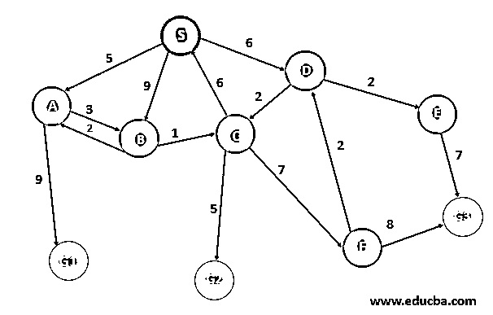
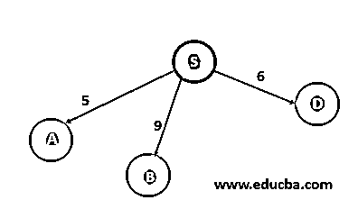
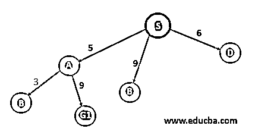
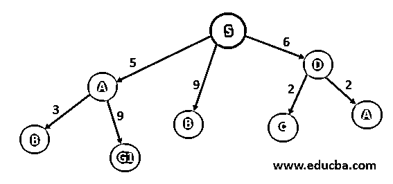
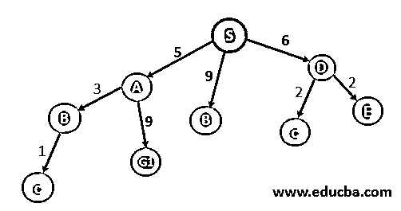
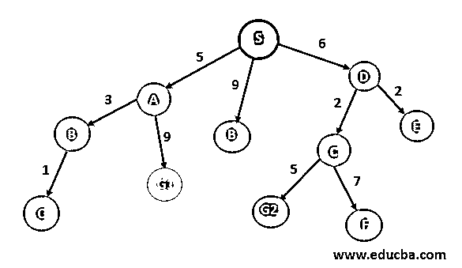
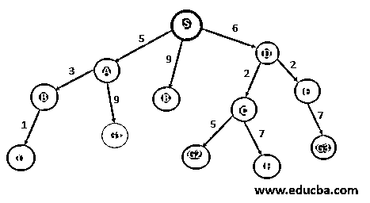
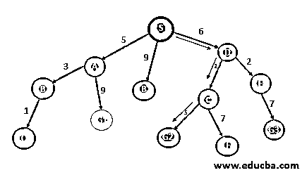

# 统一成本搜索

> 原文：<https://www.educba.com/uniform-cost-search/>

## 统一成本搜索简介

统一成本搜索是一种算法，用于在定向加权搜索空间中移动，以最小的累积成本从开始节点移动到结束节点之一。这种搜索是一种无信息搜索算法，因为它以强力方式操作，即它不考虑节点或搜索空间的状态。它用于在加权图中查找累积成本最低的路径，在加权图中，节点根据其从根节点开始的遍历成本进行扩展。这是使用优先级队列实现的，其中成本越低，优先级越高。

### 统一成本搜索算法

下面是人工智能中实现统一代价搜索的算法:-
centre；>**USC 算法**

<small>Hadoop、数据科学、统计学&其他</small>

*   将 RootNode 插入队列。
*   重复直到队列不为空:
*   从队列中移除下一个优先级最高的元素。
*   如果该节点是目的节点，则打印开销和路径并退出

否则，将被移除元素的所有子元素插入到队列中，并将它们的累积成本作为它们的优先级。

这里，rootNode 是路径的起始节点，并且维护一个优先级队列来维护下一次遍历所选择的成本最低的路径。如果两条路径具有相同的遍历成本，则按字母顺序考虑节点。

### 统一成本搜索示例

考虑下面的例子，其中我们需要从节点 s 开始到达任何一个目的节点{G1，G2，G3}，节点{A，B，C，D，E 和 F}是中间节点。我们的目的是找到从 S 到任何一个目的地州的累积成本最小的路径。每条有向边都代表了该路径允许的移动方向，其标签代表了通过该路径的成本。因此，路径的总开销是所有路径的总和。

例如，从 S 到 G1 的路径- {S->A -> G1}，其开销为 SA +AG1 = 5 + 9 = 14

这里，我们将维护一个与 BFS 相同的优先级队列，将路径的开销作为优先级，开销越低优先级越高。

我们将使用一棵树来显示所有可能的路径，并维护一个已访问列表来跟踪所有已访问的节点，因为我们不需要访问任何节点两次。

| **解释** | **流量** | **已访问列表** |
| **Step 1-**我们将从起始节点开始，并检查我们是否到达了任何目的地节点，即“否”,然后继续。 | 

 |  |
| **步骤 2**–我们到达从 S I . eA，B，d 可以到达的所有节点，因为节点 S 已经被访问过，因此被添加到已访问列表中。现在，我们首先选择最便宜的路径进行进一步扩展，即 A | 

 | 英语字母表的第 19 个字母 |
| **Step 3** – Node B and G1 can be reached from A and since node A is visited thus move to the visited list.既然 G1 达到了但为最优解，我们需要考虑每一种可能的情况；因此，我们将扩展下一个最便宜的路径，即 S->D。 | 

 | s，A |
| **步骤 4**–现在节点 D 已被访问，因此它进入已访问列表，现在由于我们有三条成本相同的路径，我们将按字母顺序选择，因此将展开节点 B | 

 | s，A，D |
| **步骤 5-** :从 B 出发，只能到达节点 C，现在权重最小的路径是 S- > D- > C，即 8。因此扩展了 c .且 B 现在已经访问了节点。 | 

 | s，A，D，B |
| **Step 6**:- From C we can reach G2 and F node with 5 and 7 weights respectively.因为 S 出现在访问列表中，所以我们不考虑 C->S 路径。

现在 C 将进入访问列表。现在下一个总路径最小的节点是 S->D->E，即 8。因此我们将扩展 e。

 | 

 | s、A、D、B、C |
| 第七步 :-从 E 我们只能到达 G3。e 将移动到已访问列表。 | 

 | 瑞典、美国、德国、英国、中国、英国 |
| **Step 8** – In the last, we have 6 active paths.s-> B–B 在已访问列表中；因此将被标记为死胡同。b.S->A->B->C 相同–C 已经被访问过，因此被认为是一个死胡同。剩下的S->A->G1S->D->C->G2S->D->C->F

S->D->E->G3

最小值是 S->D->C->G2

另外，G2 是目的节点之一。因此，我们找到了我们的道路。

 | 

 | 瑞典、美国、德国、英国、中国、英国 |

这样，我们可以找到从开始节点到结束节点的最小累积成本路径–S-> D-> C-> G2，总成本为 13(用绿色标记)。

### 统一成本搜索的优点和缺点

以下是优点和缺点:

#### 优势

*   它有助于在加权图中找到具有最低累积成本的路径，该加权图具有与其从根节点到目的地节点的每条边相关联的不同成本。
*   这被认为是最佳解决方案，因为在每个状态下，认为要遵循最少的路径。

#### 不足之处

*   要求开放列表保持排序，因为需要维护优先级队列中的优先级。
*   所需的存储是指数级的大。
*   该算法可能陷入无限循环，因为它考虑从根节点到目的节点的每一条可能的路径。

### 结论

统一成本搜索是一种无信息搜索算法，是在加权搜索空间中以最低累积成本找到从根节点到目的节点的路径的最佳解决方案，其中每个节点具有不同的遍历成本。它类似于启发式搜索，但是没有存储启发式信息，这意味着 h=0。

### 推荐文章

这是统一成本搜索指南。这里我们讨论统一成本搜索的介绍，算法，例子，优点和缺点。您也可以浏览我们的其他相关文章，了解更多信息——

1.  [不知情的搜索](https://www.educba.com/uninformed-search/)
2.  [知情搜索](https://www.educba.com/informed-search/)
3.  [人工智能中的搜索算法](https://www.educba.com/search-algorithms-in-ai/)
4.  [什么是遗传算法？](https://www.educba.com/what-is-genetic-algorithm/)

