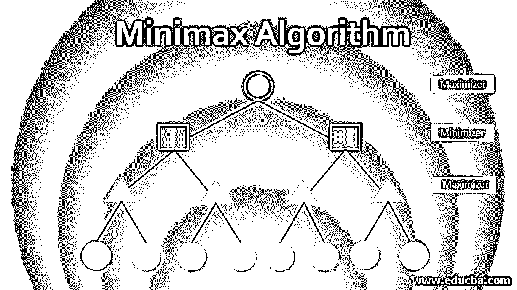
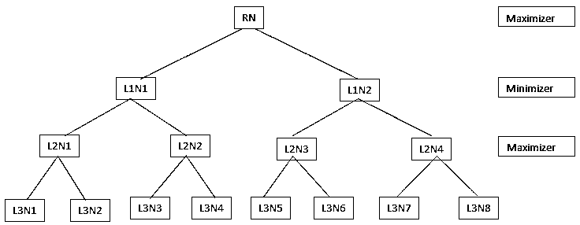

# 极大极小算法

> 原文：<https://www.educba.com/minimax-algorithm/>

## 极大极小算法简介

极大极小是一种回溯算法。极大极小算法在博弈论中找到一个最优的移动来做决定。极大极小算法考虑到对手也在最佳状态下玩，这使得它对双人游戏很有用，如跳棋、国际象棋、井字游戏、围棋和许多其他游戏。

一般来说，当两个人玩游戏时，他们必须在所有可能的走法中做出决定，然后选择他认为最好的走法。极大极小算法也是如此，但在这里，决定采取行动是使用回溯方法。为此，它选择两个玩家，一个是最小玩家，另一个是最大玩家，最小玩家的目标是选择最小值，另一方面，最大玩家的目标是选择最大值。

<small>Hadoop、数据科学、统计学&其他</small>

### **什么是极大极小算法？**

它是博弈论中使用的决策算法。它考虑了两个玩家 min 和 max，min 总是从游戏中获得最小值分数，max 总是获得最大值分数。每一步棋的价值是根据一些启发法决定的。

它使用了一些术语，如下所示:

*   **游戏树**:游戏棋步树，显示玩家在特定状态下所有可能的棋步。玩家做出了一个最优的决定并走了一步。

为了量化游戏移动，我们可以使用以下组件:

*   **初始状态**:游戏开始的状态。
*   **后继函数**:该函数用于定义玩家在当前状态下所有可用的招式。
*   **终端状态**:这是游戏的最后状态，决定游戏的胜负，游戏结束。
*   **效用函数**:是这个算法中最重要的函数。它是一种启发式的方法被用来为游戏的每一个结果赋值。这些值是根据游戏规则分配的。分配的值来自终端叶，如果是赢棋，高值将被分配给该棋，如果是输棋，低值将被分配给该棋。

### **极大极小算法的工作**

因为我们知道什么是极大极小算法，所以现在需要了解它是如何工作的。我们将举一个简单的例子，然后使用极大极小算法求解:

**Step1:** 我们以一个算法生成的 4 层树为例(如下图)。零级是根节点或初始状态，并被表示为 RN，其它相应的级有 L1、L2 和 L3。L1N1 代表一级和节点 1；以同样的方式，所有其他人也被代表。

第三级节点称为终端节点。效用函数为终端节点生成值。终端节点的值让我们考虑以下情况:

*   L3N1 = -2
*   L3N2 = 3
*   L3N3 = 1
*   L3N4 = 5
*   L3N5 = -4
*   L3N6 = -6
*   L3N7 = 0
*   L3N8 = 6

一般来说，目标是获得更多的分数，因此初始状态保持为最大化，此外，它取决于目标，但一般来说，它是最大化。所以我们把 Initial 作为 max 播放器。

一旦我们完成了树节点和移动的目标，算法就会做出决定。

**步骤 2:** 最初对于 maximizer，最坏的情况是有-∞，或者如果它是 minimizer，那么它将是+∞。下一个任务是通过比较选项来选择最佳可能的移动。在最大化器的终端节点，初始值为-∞。

为了获得从第 3 级或终端级到第 2 级的最大值，maximizer 会将每个节点的值与-∞进行比较。

*   对于 L2N1 : max(-2，-∞) => max(-2，4) = 4
*   对于 L2N2 : max( 1，-∞) => max( 1，5) = 5
*   对于 L2N3 : max(-4，-∞) => max(-4，-6) =-4
*   对于 L2N4 : max(0，-∞) => max( 0，6) = 4

**步骤 3:** 现在它的最小化器轮到了，所以用+∞对所有节点进行比较。

*   对于 L1N1 : min( 4，∞) => min( 4，5) = 4
*   对于 L1N2 : min(-4，∞) => min(-4，4) =-4

**第四步:**现在，它的最大化器又转了，所以在可用节点中，它会选择最大值。

*   对于 RN : max( 4，-∞) => max( 4，-4) = 4

所以，最后，根节点的值是 4。决定已经作出，下一步将会执行，同样的程序将会被考虑。

### **极大极小算法的局限性**

下面给出了一些限制。

*   它与终端节点中的每个数据进行比较，例如在 L2N3 中，最大值在-4、-∞和-6 之间为-4。但是赋值-4 后，会和-6 交叉校验，答案会是-4，这样就慢了。我们的例子只有两个节点，但是在井字游戏中，我们在每个节点分别有 8，7，6…步。并且在每个节点检查每个值是耗时的。
*   一些高级游戏的复杂性增加了，例如国际象棋和围棋，它们需要移动许多棋子和许多位置。这使得它非常复杂。不知何故，如果我们创造了树，就会产生巨大的分枝树。

这可以使用 Alpha-Beta 修剪来改善。简而言之，Alpha-Beta 剪枝是一种搜索算法，其目标是减少需要评估的节点数量，从而使其工作得更好，执行得更快。

### 结论

极大极小法是一种决策算法，用于博弈论。这个算法是针对两个人的游戏，它认为两个人都是最优的。该算法构造树并遵循向后的方法。这种方法已经在上面的文章中通过一个例子进行了讨论，我们已经讨论了与它相关的限制以及如何改进算法。

### 推荐文章

这是一个极大极小算法的指南。这里我们讨论什么是极大极小算法，以及它的工作原理和一些局限性。您也可以浏览我们的其他相关文章，了解更多信息——

1.  [KNN 算法](https://www.educba.com/knn-algorithm/)
2.  [对称算法](https://www.educba.com/symmetric-algorithms/)
3.  [层次聚类算法](https://www.educba.com/hierarchical-clustering-algorithm/)
4.  [Java 中的排序算法](https://www.educba.com/sorting-algorithms-in-java/)

