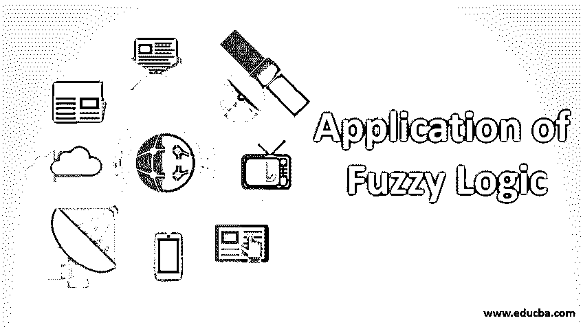

# 模糊逻辑的应用

> 原文：<https://www.educba.com/applications-of-fuzzy-logic/>

## 模糊逻辑应用导论

模糊逻辑是计算机响应真实度的方式，而不是传统的布尔逻辑方式。20 世纪 60 年代，加州大学的洛特菲·扎德博士发展了这一理念。FL 基于系统理解自然语言或人类语言，从而处理人类推理。我们不能轻易地将自然语言翻译成 0 和 1 的布尔逻辑。因此，我们可以说，外语的工作方式类似于人脑。该过程用于神经网络和人工智能。FL 的值介于完全真和假之间，所以它处理部分真。在本文中，我们将看到模糊逻辑的各种应用。

### 模糊逻辑的应用

这里我们讨论模糊逻辑的不同应用:

<small>Hadoop、数据科学、统计学&其他</small>

*   语音识别、面部特征识别是模糊逻辑的重要应用。
*   模糊逻辑在航空航天工业中用于控制飞机和卫星的高度。
*   在航班防冰除冰作业中，采用模糊逻辑来调节冰的流量和混合。同样，它们也有助于调节空调房间的气流。
*   模糊逻辑在汽车工业中用于控制交通。
*   为了在车辆运输中管理公路系统，使用了模糊逻辑。
*   汽车工业中的自动变速器可以通过模糊逻辑有效地管理[。此外，该逻辑还考虑了轮班时间表。](https://www.educba.com/what-is-fuzzy-logic/)
*   这些系统可以被训练成使用这种逻辑来控制车辆的速度。
*   模糊逻辑有助于企业家在其业务中的决策过程。
*   如果公司规模很大，并且该过程不能人工管理，则可以通过模糊逻辑容易地对雇员或工人进行评估。
*   使用模糊逻辑可以很容易地识别目标，无论它是在水下还是在国防部门的地面上。
*   人眼不容易捕捉到红外图像。这种目标识别很容易通过使用模糊逻辑来完成。
*   为了支持海军或任何其他防御机制，模糊逻辑充当它们的支持人员。
*   众所周知，模糊逻辑为北约的决策建立了模型。
*   使用模糊逻辑，我们可以很容易地控制拦截器的超高速。
*   摄像机被设置成自动曝光来自动捕捉场景。模糊逻辑帮助摄像机做到这一点。
*   如果房间保持得很好，很干净，但是很潮湿，模糊逻辑可以控制湿度。
*   在大多数房子里，家庭主妇们愉快地使用洗衣机，因为她们可以设定在洗衣机里洗衣服的时间。洗衣机的这一进步是通过模糊逻辑实现的。
*   模糊逻辑以人脑接收输入的方式感知事物。因此，模糊逻辑在大多数地方被用于股票市场预测。
*   在自动柜员机和其他政府服务机构中，为了流程的顺畅，必须转移钞票。这种将钞票转移到各个企业、清点钞票、供应钞票的操作可以通过模糊逻辑来完成。
*   我们发现很难管理日常所需的资金、假期、孩子的教育等等。如果我们以有效的方式管理模糊逻辑，我们可以让 FL 成为基金管理中孩子们的看护人。
*   对许多人来说，微波炉的工作原理仍然是个谜。一旦我们在烤箱里设置了时间，如果我们真的需要很快，模糊逻辑在这种情况下会帮你。它有助于设置机器的时间。
*   具有模糊逻辑机制的真空吸尘器随着灰尘量的增加而增加电机的速度，并且它有助于在灰尘量的情况下保持设备更长的时间。
*   FLC 用于水泥回转窑，以控制转子内部的热交换量。
*   FLC 在废水处理厂中用于控制处理的曝气，因为它集成了输入的氧气和氧化还原信息。
*   使用模糊逻辑可以很容易地测量影响水质的参数，因此可以对水进行相应的处理以净化水。
*   行业中有各种质量检查来对产品进行定性分析。这些参数是用 FLC 定量测量的。
*   在结构设计中，为了有效地进行设计，必须评估和满足各种约束。这可以用模糊逻辑很容易地做到。
*   此外，在水净化厂，曝气和氧气量是用这些控制器控制的。
*   在奶酪行业，使用 FLC 对奶酪进行优化。
*   另外，牛奶优化是在模糊逻辑的帮助下完成的。
*   模糊逻辑很容易用于船舶的控制，因为它可以测量不同的量，并利用自动驾驶仪机制操纵船舶的控制。
*   船只的路线有时会很棘手，很难人工管理。模糊逻辑可以用来为船只选择有效的航线。此外，它还有助于驾驶船只。
*   在模糊逻辑机制的帮助下，水下航行器的控制可以很容易地处理。
*   在医学领域，FLC 可以用作诊断支持系统。
*   麻醉在极少数情况下会致命。FLC 用于在麻醉时控制病人的动脉压。
*   此外，麻醉中的各种控制机制很容易由 FLC 处理。
*   使用 FLC 可以绘制各种神经病理模型，这有助于治疗老年痴呆症患者。
*   这在放射学领域对疾病的诊断很有帮助。
*   模糊诊断有助于糖尿病和癌症的治疗。
*   安全设备是用 FLC 制造的，所以这个系统是自动化的，当有大事发生时，它会发出警报。
*   在铁路上，火车的自动刹车和停车是在 FLC 的帮助下完成的。
*   地铁运营由 FLC 管理。
*   火车时刻表是在 FLC 的帮助下控制的。

信息是精确的，模糊逻辑在人类决策方法中是相似的。世界上的问题在这种机制的帮助下变得简单了。它有助于了解决策中的模糊性。

### 推荐文章

这是模糊逻辑应用的指南。这里我们分别讨论模糊逻辑的介绍和不同的应用。您也可以浏览我们推荐的其他文章，了解更多信息——

1.  [数据分析技术的类型](https://www.educba.com/types-of-data-analysis-techniques/)
2.  [什么是数据挖掘？](https://www.educba.com/what-is-data-mining/)
3.  [什么是桌面软件？](https://www.educba.com/what-is-desktop-software/)
4.  [什么是大数据技术？](https://www.educba.com/what-is-big-data-technology/)

