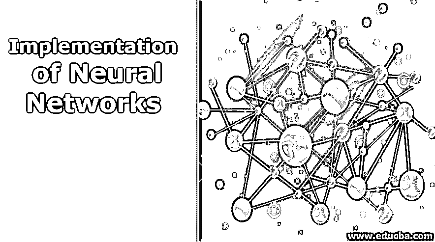
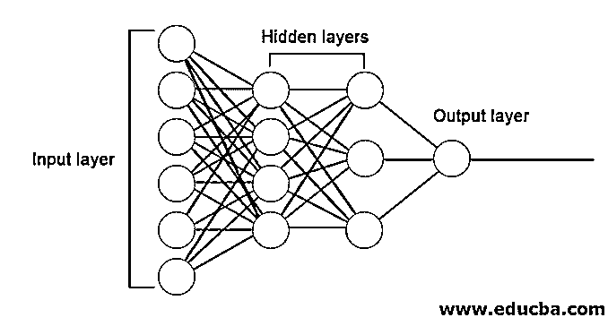
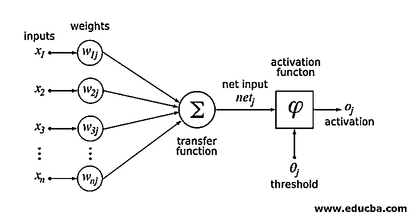
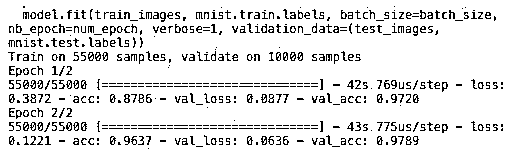

# 神经网络的实现

> 原文：<https://www.educba.com/implementation-of-neural-networks/>

## 神经网络实现概述

人工神经网络受到生物神经网络的启发。神经网络有助于解决问题，而不需要用特定于问题的规则和条件来编程。它们是通用模型，大多数复杂的数学计算都是黑盒。[不同类型的神经网络](https://www.educba.com/types-of-neural-networks/)像卷积神经网络、递归神经网络、前馈神经网络、多层感知器和许多其他网络。在本主题中，我们将学习神经网络的实现。

### 神经网络的体系结构

神经网络主要有三层。

<small>Hadoop、数据科学、统计学&其他</small>

*   输入层
*   隐藏层
*   输出层

**1。输入层:**输入层包含用于输入特征的神经元。除了特征之外，还有一个偏差被添加到输入层。所以如果有 n 个特征，那么输入层包含 n+1 个神经元。

**2。隐藏层:**隐藏层是输入层和输出层之间的中间层。可以有任意数量的隐藏层。具有一个以上隐层的网络称为深度神经网络。隐藏层中的神经元从输入层获得输入，并向输出层提供输出。

**3。输出层:**输出层包含基于输出类数量的神经元数量。如果是多类分类问题，那么它包含的神经元个数等于类的个数。对于二元分类，它包含一个神经元。

输入乘以权重，然后输入到下一个隐藏层。偏差也作为输入与加权输入一起给出。加权和通过一个称为激活函数的非线性函数。

### 实现示例

这是下面提到的实现示例

#### 库安装

在不同的编程语言中，有许多用于实现人工神经网络的内置库。这里我们将讨论两个著名的库 TensorFlow 和 Keras，它们使用 python 作为实现神经网络的编程语言。Keras 是一个基于 TensorFlow 或 theano 的高级 API。实现起来要容易得多。您可以为您的模型选择任何库。还有一些其他的，如 PyTorch，theano，Caffe 等等。

要使用 pip 安装 TensorFlow / Keras，请运行以下命令:

`pip install tensorflow
pip install Keras`

或者，可以使用 conda 命令安装它，

`conda install -c conda-forge tensorflow
conda install -c conda-forge keras`

#### 履行

这里我们将讨论用于深度学习模型生成的 Keras。它是一个开源的 Python 深度学习库。

*   导入可用的 MNIST 数据集。MNIST 是英文数字的手写数字的数据集。

`from tensorflow.examples.tutorials.mnist import input_data
train_images = mnist.train.images.reshape(mnist.train.images.shape[0], image_rows, image_cols, 1)
test_images = mnist.test.images.reshape(mnist.test.images.shape[0], image_rows, image_cols, 1)`

*   初始化模型所需的参数和超参数。
*   然后初始化深度学习模型。

`model = Sequential()`

*   为我们在输入和输出层(隐藏层)之间添加的每个卷积层添加卷积层、激活层和 max-pooling 层。这里我们添加了两个卷积层。

`model.add(Convolution2D(num_filters, conv_kernel_size[0], conv_kernel_size[1],  border_mode='valid', input_shape=imag_shape))
model.add(Activation('relu'))
model.add(MaxPooling2D(pool_size=max_pool_size))`

*   可以根据问题使用不同的激活功能。一些常见的激活函数有 relu 激活、tanh 激活、leaky relu 等。
*   然后是致密层之前的完全连接层。它们将前几层提取的数据进行编译，形成最终输出。
*   输出图层的尺寸取决于类的数量。用于输出图层的激活函数通常是针对二元分类的 sigmoid 激活和针对多类分类的 softmax 激活。

`model.add(Dense(num_classes))
model.add(Activation('softmax'))`

用于 MNIST 数据分类的深度卷积神经网络的完整代码如下。

`from tensorflow.examples.tutorials.mnist import input_data
from keras.models import Sequential from keras.layers import Dense, Dropout, Activation, Flatten from keras.layers import Convolution2D, MaxPooling2D
# we use TF helper function to pull down the data from the MNIST site mnist_data = input_data.read_data_sets("MNIST_data/", one_hot=True)
img_rows = 28
img_cols = 28
# Reshape training and test images to 28x28x1
train_images = mnist_data.train.images.reshape(mnist_data.train.images.shape[0], img_rows, img_cols, 1)
test_images = mnist_data.test.images.reshape(mnist_data.test.images.shape[0], img_rows, img_cols, 1)
num_of_filters = 32            # No. of conv filters maxPoolSize = (2,2)       # shape of max_pool convKrnSize = (3,3)        # conv kernel shape imgShape = (28, 28, 1) num_of_classes = 10
dropProb = 0.5
model = Sequential()
# define layers in NN
# Define 1st convolution layer.
model.add(Convolution2D(num_of_filters, convKrnSize[0], convKrnSize[1],  border_mode='valid', input_shape=imgShape))
model.add(Activation('relu'))
model.add(MaxPooling2D(pool_size=maxPoolSize))
# 2nd Convolution Layer
model.add(Convolution2D(num_of_filters, convKrnSize[0], convKrnSize[1])) model.add(Activation('relu'))
model.add(MaxPooling2D(pool_size=maxPoolSize))
#Fully Connected Layer model.add(Flatten())
model.add(Dense(128))    #Fully connected layer in Keras model.add(Activation('relu'))
# Dropout some neurons to reduce overfitting model.add(Dropout(dropProb))
#Readout Layer model.add(Dense(num_of_classes))
model.add(Activation('softmax'))
# Compile the model
model.compile(loss='categorical_crossentropy', optimizer='adam', metrics=['accuracy'])
# Training settings batch_size = 128
num_of_epoch = 2
# fit the training data to the model.
model.fit(train_images, mnist_data.train.labels, batch_size=batch_size,
nb_epoch=num_of_epoch, verbose=1, validation_data=(test_images, mnist_data.test.labels))
# predict the test_data using the model
test_labels_predicted = model.predict_classes(test_images)
# To get the predicted labels of all test images for i in range(len(test_images)):
print ("Image {} -> Label {}".format(i+1, test_labels_predicted[0]))`

##### 培养

模型的训练看起来像，

### 结论-神经网络的实施

当样本的特征空间非常大时，主要是对于大图像或其他多媒体或信号，神经网络为机器学习中的分类或回归问题提供了一种简单的方法。

### 推荐文章

这是一个神经网络的实现指南。在这里，我们讨论了带有训练模型和样本代码的神经网络的架构和实现。您也可以阅读以下文章，了解更多信息——

1.  [神经网络的分类](https://www.educba.com/classification-of-neural-network/)
2.  [什么是神经网络？](https://www.educba.com/what-is-neural-networks/)
3.  [卷积神经网络](https://www.educba.com/convolutional-neural-networks/)
4.  [神经网络算法](https://www.educba.com/neural-network-algorithms/)
5.  [Java 中的 2D 图形](https://www.educba.com/2d-graphics-in-java/)
6.  [神经网络的前三大应用](https://www.educba.com/application-of-neural-network/)
7.  [网络拓扑完整指南](https://www.educba.com/network-topologies/)

