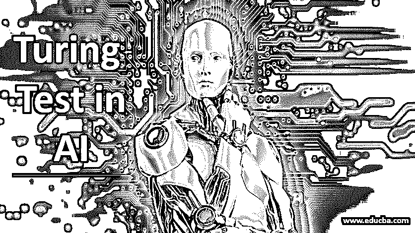

# 人工智能中的图灵测试

> 原文：<https://www.educba.com/turing-test-in-ai/>

## 人工智能中的图灵测试

本文将介绍人工智能中的图灵测试，该测试由著名数学家艾伦·图灵于 1950 年提出。该测试旨在检查机器在工作或思维过程中是否能表现出类似人类的智能。根据艾伦·图灵的研究论文，这项测试被称为“模仿游戏”。他认为，只有当计算机/机器能够模仿人类的反应时，它才能被认为是智能的。如果询问者(法官)不能确定响应是来自机器还是人，则机器通过测试。

### 图灵测试是如何进行的？

图灵测试是三个人一起玩的。它有一台计算机、一个人工应答器和一个人工询问器。电脑和人类应答者坐在两个独立的终端上，一个不知道他们身份的询问者向他们两人问了一系列问题。基于与这两方的对话，询问者必须决定哪一方是计算机，哪一方是人类应答者。如果询问者同样有可能选择这两者中的任何一个，或者无法区分这两者，我们可以说计算机已经成功地展示了类似人类的智能。按照图灵的说法，如果当应答者是计算机(游戏是用计算机玩的)时，询问者的错误决定与一个男人和一个女人玩游戏时一样多，那么计算机就被认为是成功的。

<small>Hadoop、数据科学、统计学&其他</small>

以下是应答者(计算机或人类)和询问者之间的对话示例。

**审讯者:**你是电脑吗？

**响应者:**否

请给我写一首莎士比亚的十四行诗。

**响应者:**不好意思，我不太喜欢诗歌。

**询问器:**添加 20957 到 46707。

**应答者:**(短暂停顿约 20 秒后)67664。

**审讯者:**你喜欢下棋吗？

**响应者:**对！

**审讯者:**我只剩下我的王了，在 K1 广场。你只剩下国王和车，国王在 K6 广场，车在 R1 广场。你会怎么做？

回应者:(短暂停顿后)车到 R8，将死。

根据这个对话，询问者必须决定应答者是人还是计算机。

### 现代图灵测试

这个游戏的最新版本只有一个应答者，询问者必须弄清楚这个应答者是计算机还是人。为了减少人为错误，现代图灵测试有多个人工询问器。如果在五分钟的交流后，30%的裁判认为计算机是人类，那么机器就被认为是成功的。图灵测试的另一个突出形式是罗布纳奖，这是一年一度的图灵测试竞赛，始于 1991 年。比赛有额外的规则，计算机程序需要与四名主审法官进行 25 分钟的对话。获胜者(不需要通过图灵测试)是其计算机获得最多票数的人，不管是否有 30%的法官投票支持它。艾伦·图灵曾预言，到 2000 年，机器将通过图灵测试。然而，机器直到 2014 年才通过。2014 年，名为 Eugene Goostman 的聊天机器人通过了图灵测试，当时它获得了 33%的法官投票，认为聊天机器人是人类。这个聊天机器人模仿了一个 13 岁男孩的个性。

### 清除人工智能中图灵测试的要求

以下是机器通过图灵测试必须具备的一些关键特性。

**1。自然语言处理:**机器必须能够理解并合成询问者正在交流的自然/人类语言。

**2。知识表示:**机器必须能够实时存储和检索信息，以便与询问器有效通信。

**3。自动推理:**机器应该能够根据先前存储的信息得出合理的、合乎逻辑的推论。这种逻辑推理可以欺骗询问者，使其相信自己正在与人交谈。

**4。机器学习:**机器应该从过去的错误中学习，应该有能力识别对话中的模式，以类似人类的方式做出回应。

(清除总图灵测试需要剩余的两个特征)

**5。视觉:**机器应该具有识别询问者的动作和其他周围物体的能力。

**6。电机控制:**机器应能按照要求移动和执行动作。

### 人工智能中图灵测试的特点

*   该测试为评估[人工智能应用](https://www.educba.com/artificial-intelligence-applications/)提供了关键依据。
*   图灵测试不直接测试智力；相反，它检查计算机的行为与人类有多相似。
*   该测试对机器像人类一样行为或执行动作的能力给出了一个公正的概念。
*   它消除了对人类的任何偏见，因为人类谈判者只关注回答者提供的内容。

### 图灵测试的批评者

虽然图灵测试在人工智能行业有很多接受者。有许多人不相信这个测试。反对图灵测试的最著名的论点是“中国房间论点”。它是由约翰·塞尔在 1980 年提出的。他认为，通过给计算机编程，我们可以让它理解语言的语义，但它永远无法理解构成人类思维的良知，因为人类的真正智能是由不同的复杂神经细胞组合而成的，这是机器很难模仿的。他进一步补充说，像帕里和伊莱扎这样的机器已经通过操纵审讯者提问语言的符号成功通过了图灵测试。尽管他们不懂提问所用的语言。因此，通过图灵测试并不是机器像人类一样思考的具体证明。

### 结论

尽管有大量的批评和反对意见，图灵测试为人工智能领域的创新和发现开辟了许多新的途径。到目前为止，它仍然是一个突出的测试，以找出机器是否可以模仿和执行类似人类的行动。

### 推荐文章

这是人工智能中的图灵测试指南。在这里，我们讨论了在人工智能中清除图灵测试的不同要求及其特性。您也可以浏览我们推荐的文章，了解更多信息——

1.  [人工智能技术](https://www.educba.com/artificial-intelligence-techniques/)
2.  [人工智能的种类](https://www.educba.com/types-of-artificial-intelligence/)
3.  [人工智能应用](https://www.educba.com/artificial-intelligence-applications/)
4.  [机器学习 vs 人工智能](https://www.educba.com/machine-learning-vs-artificial-intelligence/)

