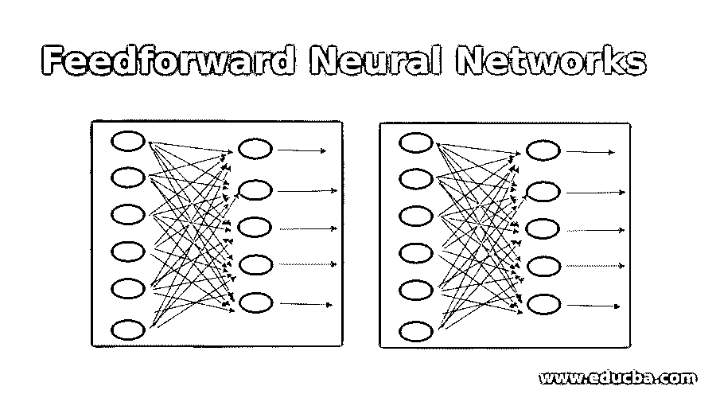
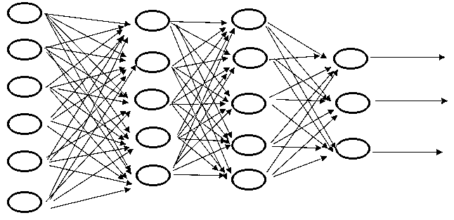
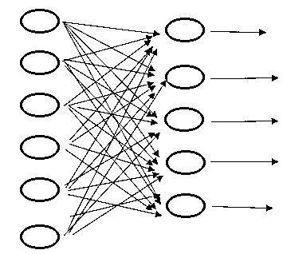

# 前馈神经网络

> 原文：<https://www.educba.com/feedforward-neural-networks/>

## 前馈神经网络简介

前馈神经网络是人工神经网络，其中节点之间的连接不形成循环。在这个网络中，信息仅在一个方向上移动，并通过完全不同的层移动，以便北美国家推动输出层。它通过输入层，然后是隐藏层，最后到达输出层，只要我们想得到想要的输出。

这个区域单元主要用于监督学习，只要我们倾向于已经理解所需的操作。

<small>Hadoop、数据科学、统计学&其他</small>

### 前馈神经网络的应用

这些神经网络区域单元用于许多应用。其中一些地区单位提到如下。

*   生理前馈系统:在此期间，前馈管理集中体现为在运动前由中枢自主神经系统对心跳进行常规的预先调节
*   基因调节和前馈:在此期间，一个主要的基序似乎完全是杰出的网络，并且该基序已经被证明是一个用于检测大气的非暂时性改变的前馈系统。
*   自动化和机器管理:前馈控制可能是自动化控制领域中的一门学科
*   带导数的并行前馈补偿:这是一种相当新的技术，它将非最小部分系统的开环传递操作部分变为最小部分。

前馈网络的主要原因是近似操作。如果我们倾向于将来自最后一个隐藏层的反馈添加到主隐藏层，这将代表一个重复的神经网络。

前馈神经网络还被称为多层感知器。它是一个网络，在这个网络中，建立相互联系的有向图没有封闭的路径或回路。这些网络具有重要的处理能力；然而没有内部动力。

为了提出一个前馈神经网络，我们需要一些面积单位用于提出算法的部分。

*   优化器-优化器用于减少操作值；这在每个训练周期更新一次权重和偏差的值，直到该值操作到达世界。
*   随机梯度下降:这是一种优化具有适当平滑特性的目标操作的不变方法。
*   阿达格拉德
*   圣经》和《古兰经》传统中）亚当（人类第一人的名字
*   RMS prop

该优化算法规则有 2 种算法形式；

*   一阶优化算法-这个一阶导数告诉北美国家，如果功能是减少或增加在一个选定的目的。它提供了与曲面相切的道路。
*   二阶优化算法——这个二阶副产品给北美国家提供了一个二次曲面，这个二次曲面接触到了误差曲面的曲率。

**成本函数:**

一个成本运作也许是一个活的形象化；无论神经网络在训练和预期输出方面有多聪明。它甚至依赖于权重和偏差。一些可行的价值函数有:

*   二次值
*   交叉熵值
*   指数值
*   海灵格距离

值运算应该满足两个性质。它们是:

*   值 operate 应该能够写成中值。
*   价值运营不应该热衷于输出层之外的网络的任何激活价值。

### 前馈神经网络的体系结构

前馈神经网络体系结构解释如下:

图的顶部表示多层前馈神经网络的设计。它表示隐藏层以及从输入层到输出层的每一层的隐藏单元。

隐藏神经元的操作是在输入和输出网络之间进行干预。通过向网络添加大量的隐藏层来提取高阶统计区域单元。

图顶部的代表一层前馈神经规范。在此期间，输入通过输出层中的权重和神经元传递到输出层，以计算输出信号。

在每个图中，在图的顶部，每个网络的面积单元是完全连接的，因为每一层中的每个营养细胞都连接到下一层中相对的营养细胞。如果有任何连接丢失，那么它将被称为部分连接。

神经网络的必要特征是它区别于传统 pc 的地方在于它的学习能力。

### 结论

在这里，我们讨论了前馈神经网络。

*   关于前馈神经网络
*   前馈神经网络的应用
*   神经网络的体系结构
*   价值函数

### 推荐文章

这是前馈神经网络的指南。在这里，我们也讨论了前馈神经网络的介绍和应用以及架构。您也可以看看以下文章，了解更多信息–

1.  [神经网络机器学习](https://www.educba.com/neural-network-machine-learning/)
2.  [深度学习网络](https://www.educba.com/deep-learning-networks/)
3.  [神经网络的实现](https://www.educba.com/implementation-of-neural-networks/)
4.  [神经网络的应用](https://www.educba.com/application-of-neural-network/)

