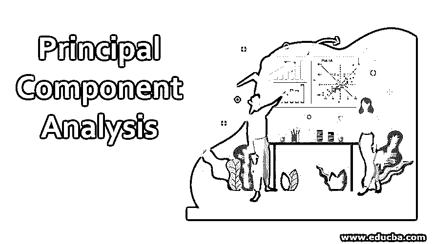
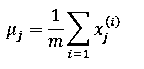
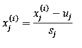
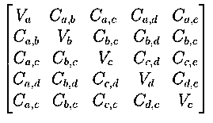
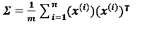

# 主成分分析

> 原文：<https://www.educba.com/principal-component-analysis/>

## 主成分分析导论

在数据科学中，我们通常要处理包含多种要素的大型数据集。如果你的模型的计算变得足够慢，或者你的系统不够强大，无法执行如此庞大的计算，那么你可能最终会寻找替代品。这就是 PCA 发挥作用的地方。在主成分分析的帮助下，您可以降低包含许多彼此高度相关的特征或独立变量的数据集的维度，同时最大限度地保持数据集中的变化。通过组合相关特征而创建的新特征被称为主成分。这些主分量是从协方差矩阵分解的特征向量；因此它们是正交的。

### 我们为什么需要 PCA？

PCA 主要用于面部识别、计算机视觉、图像压缩等领域的降维，以及金融、心理学、数据挖掘等领域的模式发现。PCA 用于通过组合冗余特征从数据集中提取重要信息。这些特征以称为主成分的新变量的形式表示。由于数据集中特征的可视化是有限的，我们还可以使用 PCA 将数据集的维度减少到 2 或 3 个主成分，然后可视化以更好地了解它。

<small>Hadoop、数据科学、统计学&其他</small>

### PCA 是如何工作的？

PCA 的工作包括以下步骤:

*   数据标准化
*   计算协方差矩阵
*   从协方差矩阵计算特征值和向量
*   选择前 k 个特征向量，其中 k 是所需的维数。
*   将数据点转换为 k 维

#### 1.数据标准化

在数据集上运行 PCA 之前执行数据缩放非常重要。因为如果我们使用不同尺度的数据，那么我们最终会错过主要成分。为此，您需要执行均值归一化，也可以选择执行要素缩放

假设我们有 m 个数据集，即:x1，x2，…..n 维的 XM。

然后使用以下公式计算每个特征的平均值:

其中:

*   **u j :** 表示 j th 特性
*   **m:** 数据集大小
*   **x(I)j:**j数据样本 I 的第个特征

一旦你知道了每个特征的含义，然后用 x(I)j–uj更新每个 x (i) j 。

请注意，如果要素的比例不同，则必须使用以下等式来归一化数据:

其中:

*   **x(I)j:**j数据样本 I 的第个特征
*   **sj:**jth特征的最大和最小元素之差

#### 2.计算协方差矩阵

假设读者知道协方差和方差，我们将看到协方差矩阵表示的是什么。

假设我们有一个 4 维(a，b，c，d)的数据集，每个维的方差表示为 Va，Vb，Vc，Vd，协方差表示为 Ca，b 表示 a 和 b 上的维，Cb，c 表示 b 和 c 上的维，依此类推。那么协方差矩阵给出如下:

数据集的方差是协方差矩阵中的对角元素，而数据集的协方差是非对角元素。

如果我们有一个 m*n 维的数据集 X，其中 m 是数据点数，n 是维数，那么协方差矩阵σ由下式给出:

#### 

#### 3.从协方差矩阵计算特征值和向量

现在我们需要分解协方差矩阵来得到特征向量和值。这是使用单一矢量分解来完成的。我不会深入研究 svd 的细节，因为这超出了本文的范围。尽管值得注意的是，在 MATLAB、python 等流行的[编程语言](https://www.educba.com/best-programming-languages/)中有计算 svd 的函数。在 octave 中，可以使用 svd()函数获得特征值和向量。

**[U, S, V] = svd()**

其中:

*   **σ:**协方差矩阵(σ)
*   **U:** 包含特征向量的矩阵
*   **S:** 包含特征值的对角矩阵。

#### 4.选择前 k 个特征向量，其中 k 是所需的维数

一旦我们有了包含特征向量的矩阵，我们就可以选择它的前 k 列。其中 k 是所需的尺寸。

**Ureduce = U(:,1:k)**

U reduce 是执行数据压缩所需的特征向量的矩阵。

#### 5.将数据点转换为 k 维

通过对 U reduce 矩阵进行转置，然后将其与数据集相乘，将数据集 X n*m 从 n 维转换到 k 维。

**z = UreduceT * x;**

其中:

*   **z:** 它的新特性
*   结果你会从 m*n 得到一个 m*k 维的数据集。

### 主成分分析的性质

以下是五氯苯甲醚所具有的特性列表:

1.  在使用高维数据集训练模型之前，它将高维数据集转换为低维数据集。
2.  主成分分析的主成分是原始特征的线性组合，从协方差矩阵中找到的特征向量满足最小二乘原则。
3.  它有助于确定解释协变所需的特征。

### 主成分分析的优势

PCA 的主要优点是由于维数减少，它对噪声的敏感度较低。以下是 PCA 的其他优点:

1.  它加速了学习算法。
2.  由于尺寸更小，提高了效率。
3.  它减少了存储数据所需的空间。
4.  数据可视化
5.  对噪声敏感度低。
6.  删除多余的变量

### 结论

PCA 方法是无监督[机器学习技术](https://www.educba.com/machine-learning-techniques/)的一部分。这些技术最适合没有类别标签的图像。提供了对 PCA 及其工作的介绍。如上所述，本文也讨论了 PCA 的优点。

### 推荐文章

这是一个主成分分析的指南。在这里，我们讨论为什么我们需要主成分分析，它如何与适当的步骤以及主成分的优势。您也可以浏览我们的其他相关文章，了解更多信息——

1.  [Matlab 命令](https://www.educba.com/matlab-commands/)
2.  [C 中的多维数组](https://www.educba.com/multidimensional-array-in-c/)
3.  [统计分析软件](https://www.educba.com/statistical-analysis-softwares/)
4.  [统计分析回归](https://www.educba.com/statistical-analysis-regression/)

