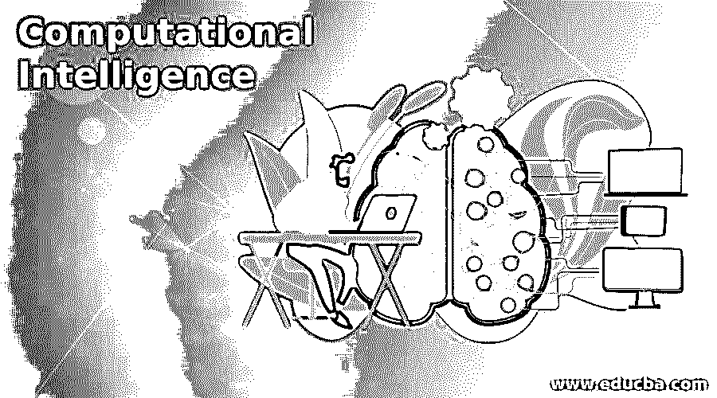

# 计算智能

> 原文：<https://www.educba.com/computational-intelligence/>

## 计算智能导论

计算智能有时也被称为软计算，这是一个特定的研究领域，其任务是让计算机从实验数据或观察结果中学习一些现实生活或复杂的问题。在计算智能中，有一套用于解决现实生活或复杂问题的方法或方法论。通常，由于复杂性、不确定性或没有正确定义的问题，使用传统的计算方法不可能解决现实生活中的问题。

因此，将这些问题转换成计算机可理解的二进制格式(0 和 1)是复杂且不可行的。在这种情况下，我们拥有计算智能，可以将这些问题用计算机可理解的格式表达出来。计算智能使用一些试图模仿人类提问和推理方式的技术。

<small>Hadoop、数据科学、统计学&其他</small>

### 什么是计算智能？

计算智能是模仿人类智能的推理过程并完成这一过程的一种方式；一些竞争情报方法结合使用。实现人类智能是复杂的，但它推理或质疑手头问题的方式是可以复制的，使用 CI 方法也可以做到这一点。

CI 中使用的方法如下:

*   模糊逻辑
*   神经网络
*   进化计算
*   学习理论
*   概率方法

#### 1.模糊逻辑

顾名思义，模糊或不清楚，在我们的日常生活中有很多情况下，情况不清楚，是否说是或否，可能是是/否或否/是(例如，问女朋友是否想买一件昂贵的衣服，她可能会用一个奇怪的表情说不，男人应该从字里行间看出是肯定的)。模糊逻辑根据可能性的级别决定最终输出；比如 Yes sure/ Yes 可能是/不确定/可能是 no / No，基本上，[模糊逻辑就是 ifs 和 else 的条件](https://www.educba.com/what-is-fuzzy-logic/)，很容易理解但不是很准确。它用于控制系统、智能电器、语音识别等。

#### 2.神经网络

人类智能系统作用于生物神经元；对于 CI，我们有一个人工神经网络。人工神经网络(ANN)试图复制人类神经网络，其中 ANN 的每个节点被称为生物神经元。生物神经元通过称为树突的输入细胞接受输入；在神经元中，信息通过逻辑和推理(突触)进行处理；输出将由称为轴突的细胞给出。在人工神经网络中同样被称为输入层、激活函数和输出层。

输入被赋予一定的权重，该权重通过反馈被进一步评估和调整，并且激活函数基于输入参数来决定输出。在竞争情报中，它在分类问题、回归问题、关联问题和模式识别问题中有着广泛的应用。

#### 3.进化计算

那些忍受进化的人有更多的生存机会，这是我们在历史上看到的自然现象。我们也看到了我们生活的演变，以及我们的生活方式是如何从童年演变到现在的状态的。在计算智能中，一些生物进化理论，如繁殖或突变，被认为是为了使人工智能更强大，以处理现实生活中的问题。

在一段时间内，我们已经创建了许多进化理论，并且同样被应用于创建进化算法，例如，“适者生存”是理论，而适应度函数是遗传算法的一部分。在计算智能中，进化计算用于优化问题(目标是优化当前状态)和进步问题(目标是预测未来状态)。

#### 4.学习理论

学习理论基本上意味着学习的哲学，学习者如何吸收信息，处理信息，然后为进一步的决策问题保留信息。在学习理论中，目标是研究/理解不同的学习技巧，通过这些技巧学习可以发生。认知学习也是学习理论的一部分。

#### 5.概率方法

概率方法是非构造性和非确定性的方法，用于提供对象的存在。简而言之，如果有一个对象集合，并且被赋予了某些属性。现在，如果这个集合中的所有对象都没有一个特定的属性，然后从这个集合中随机选择一个对象，对于这个对象，拥有该属性的概率肯定是零。类似地，如果我们证明概率小于 1，这将证明存在一个或多个不拥有该特定属性的对象。

### 计算智能的使用

正如我们所见，计算智能能够考虑现实生活的复杂性，然后做出概率决策，这使得它在调度行业程序、疾病诊断、视频游戏可视化、翻译系统(如 Alexa、Siri，它可以理解人类的命令并精确跟随)、智能机器人、信息机器人自动驾驶汽车等方面非常有用。计算智能是一个不断发展的领域，有一些有趣的方法，如进化计算和学习理论，使其足以胜任各种各样的现实生活问题。

### 使用计算智能的好处

作为人类，我们从远古时代就开始研究进化。我们的目标之一是创造一个智能系统，让我们的生活更轻松。这个目标是进步的；也就是说，随着时间的推移，我们的需求会发生变化，我们需要更好的东西。

**手机示例:**

主要目的是将信息从一个地方传递到另一个地方；开始是发送乌鸦(传递信息的鸟)，然后我们有了电报和传真。革命性的发现是电话。随着时间的推移，我们的要求越来越高；我们想要更多的舒适。因此，尺寸被优化，安装方式被优化，然后我们有了便携式电话，现在它只不过是我们的手机。这些便携式电话只能打电话，然后我们希望有一个文本功能和一种方式来添加所有的联系人，然后像日历，手表，闹钟，游戏等工具。但是我们想要更多，我们的目标变得更远。现在我们有了智能手机，它仍在日复一日地获得新的功能。

为了达到这样的目标，我们需要一种能够跟上发展的方法；这就是计算智能优于其他方法的地方。

### 结论

计算智能，有时也被称为软计算，在解决现实生活中的问题时非常有用。CI 使用模糊逻辑、神经网络、进化理论、学习理论和概率理论等算法/方法，这使得它非常适合于现实生活中的复杂问题。竞争情报在现实生活中的许多问题上都有应用。

### 推荐文章

这是计算智能指南。这里我们讨论引言；什么是计算智能？用途和好处。您也可以看看以下文章，了解更多信息–

1.  [人工智能中的爬山](https://www.educba.com/hill-climbing-in-artificial-intelligence/)
2.  [人工智能问题](https://www.educba.com/artificial-intelligence-problems/)
3.  [人工智能的用途](https://www.educba.com/uses-of-artificial-intelligence/)
4.  [人工智能工具](https://www.educba.com/artificial-intelligence-tools/)

