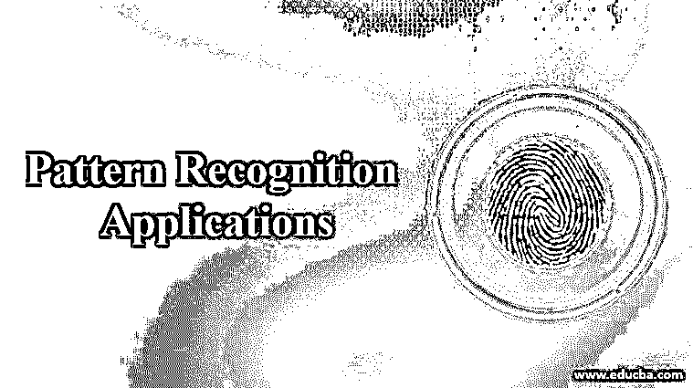

# 模式识别应用

> 原文：<https://www.educba.com/pattern-recognition-applications/>

## 模式识别应用简介

模式识别应用可以被定义为在智能机器的帮助下能够自动使用识别模式的自动识别工具。它与进行数据预处理的模式识别系统密切相关。它找到所需的模式，建议与所需数据的接近程度，然后进一步将数据块发送到腔室中以供预期使用。在我们的日常生活中，模式识别应用无处不在。有意或无意地，我们都倾向于使用公关系统及其应用。公关应用技术是机器学习和人工智能的一个子部分。

### 模式识别的应用

现在让我们详细说明模式识别的几个应用。

<small>Hadoop、数据科学、统计学&其他</small>

**1。疾病分类:**PR 系统已经被用于疾病识别和成像超过十年。

**2。自然语言处理:**[模式识别](https://www.educba.com/pattern-recognition/)算法在 NLPs 中用于构建强大的软件系统，这些软件系统在计算机和通信行业有进一步的应用。

**3。网络入侵检测:**网络入侵检测是安全的一个环节。入侵是任何数据公司面临的严重威胁之一。因此，PR 系统应用程序通过识别一段时间内的入侵模式来帮助入侵检测。这确保了如果最轻微的入侵模式在网络上显示出它们的踪迹，安全系统就会报警。

**4。图像传感与识别:**模式识别非常适合图像处理及其分割。然后进行分析。这将被转发给专家评审。PR 算法已经逐渐融入了智能，类似于人类。机器学习提高了他们在医学图像传感和识别方面的识别能力。

**5。光学字符识别:**也就是通常所说的 OCR，目前被广泛使用。

**6。数据挖掘和仓储模式或知识发现:**KDD 和其他算法用于在执行数据挖掘活动时发现模式。

**7。在计算机视觉中充当眼睛:**模式识别算法在计算机视觉中应用广泛。它们有助于从图像、视频等摘录中提取有意义的特征。在疾病的生物医学和医学成像中有应用。

**8。特定疾病患者存活率的预测:**患者的概率率也可以用模式识别算法来预测。

**9。地震分析:** PR 方法用于发现、成像和解释记录数据地震显示的顺序模式。在这个应用中，我们实现了统计模式识别技术。它们用于各种地震分析和数据模型。

10。医疗保健:随着可以戴在手上的传感器和易于使用的设备的出现，模式识别系统表现出色。几乎不需要时间，事实上，可以实时地访问和分析患者的数据。公共关系系统在医疗保健行业发展迅速。

**11。雷达信号识别与分析:**模式识别方案用于雷达信号和分类。信号处理方法用于雷达信号分类的各种应用中，如杀伤人员地雷探测和识别。

**12。石油和天然气:**石油和天然气行业也在使用公关系统。如今，各种地理地形上的矿物、能源及其模式的分析都是由公关系统完成的。

13。语音识别:在语音识别领域可以看到模式识别的巨大成功。语言学和公共关系系统正与语音和语言学识别的各个领域的研究和发展齐头并进。它使用具有竞争力的算法，能够同时处理大型数据集。

**14。纹理辨别:**纺织行业根据客户的住房需求，利用 PR 系统为其确定纹理。

15。指纹识别:指纹识别技术是生物识别市场的主导技术。许多识别方法已经被用于执行指纹匹配，其中模式识别方法被广泛使用。

16。农业:在农业行业，我们有很多应用，这些应用体现在对经济效益的贡献上。它与养殖业携手合作；研究人员正在使用多种模式识别方案进行识别、改良和培育关键性状的研究。这导致处理不断增长的生产需求，增加对各种疾病的抵抗力，通过使用更少的水、肥料等来减少对环境的威胁。

**17。染色体形状辨别:**这是 PR 系统在微观水平上的必要应用。人类将无法在染色体和基因水平上分类重排和预测变化。公关系统正在有效地完成这项工作。

18。金融服务:在金融公司中，公关系统正在帮助识别与金融市场趋势相关的数据。他们正在做的工作是确定他们能够确定关键的见解。这可能会防止金融崩溃，将社会从金融困境中拯救出来。这项技术被进一步用于投资和拓展业务。网络监控就是帮助及时识别风险并采取措施加以防范的例子之一。

**19。交通运输:**公共关系系统也正在将其应用扩展到交通运输领域。根据旅行历史，路线、套餐、目的地和费用的模式通过 PR 系统预先提供给顾客。因此，运输公司能够预测在某些路线上可能发生的潜在风险，并及时适当地建议他们的客户。

### 结论

依赖于计算机的自动模式识别系统证明比人的感觉更有效。人类的感官可能无法识别模式，因为随着年龄的增长，视力会下降，或者数据效率低下。然后，自动化系统被证明是生活各个方面的有益因素。在印度，模式识别应用正处于扩展的边缘，并且刚刚在该国及其需求的所有方面朝着配备 PR 的系统迈出了一步。模式分析和推理利用原型在各个方面和领域寻找问题的解决方案，从而分析相关的模式。

### 推荐文章

这是一个模式识别应用指南。这里我们讨论模式识别的介绍和应用，包括疾病分类，医疗保健，语音识别等。您也可以阅读以下文章，了解更多信息——

1.  [物联网有哪些组成部分？](https://www.educba.com/components-of-iot/)
2.  [模糊逻辑的不同应用](https://www.educba.com/applications-of-fuzzy-logic/)
3.  [Django 框架有哪些应用？](https://www.educba.com/applications-of-django/)
4.  [传感器的应用](https://www.educba.com/applications-of-sensors/)

