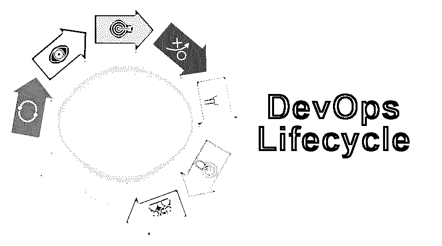
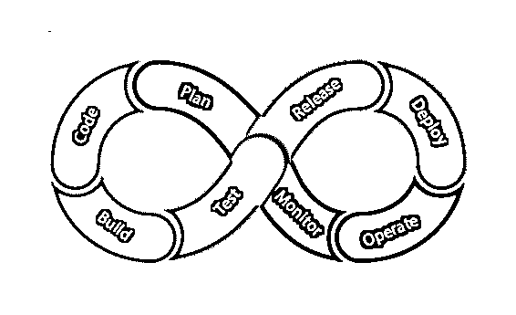
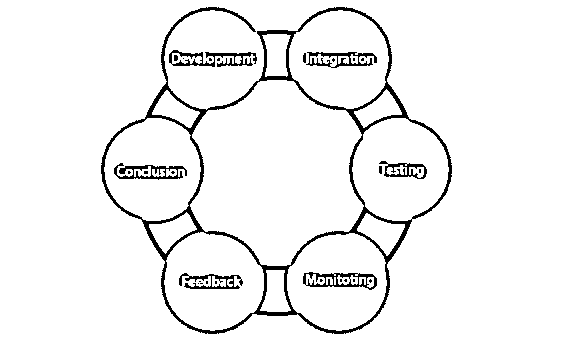

# DevOps 生命周期

> 原文：<https://www.educba.com/devops-lifecycle/>

## DevOps 生命周期简介

DevOps 生命周期是 DevOps 中涉及的一组阶段，用于协作开发和运营团队任务，以实现更快的软件交付。开发运维遵循特定的流程，包括编码、构建、测试、发布、部署、运营、监控和规划。DevOps 生命周期遵循不同的阶段，如持续开发、集成、测试、持续监控和持续反馈。DevOps 生命周期的每个阶段都与实现该过程的一些工具和技术相关联。一些常用的工具是开源的，并且是基于业务需求实现的。因此，DevOps 生命周期易于管理，并且有助于高质量的交付。

### DevOps 生命周期

让我们讨论一下 DevOps 的生命周期，以了解它究竟是如何执行所有任务的。下图显示了 DevOps 生命周期的结构。

<small>Hadoop、数据科学、统计学&其他</small>

**1。代码:**devo PS 生命周期的第一步是编码。在这一步中，开发人员在任何平台上编写代码，为客户开发产品。

**2。构建:**第二步是使用合适的[编程语言](https://www.educba.com/what-is-a-programming-language/)构建产品的基本版本。

**3。Test:** 第三步测试，使用 selenium web driver、selenium RC、Bugzilla 等自动化测试工具对构建好的产品进行测试。

**4。Release:** 这一步涉及到在不同的环境中规划、调度和控制已构建的流程。

**5。部署:**在这里，所有的部署产品和文件都在服务器上执行。

**6。操作:**产品或应用程序部署后，交付给客户使用，客户在日常生活中使用该产品或应用程序。

**7。Monitor:** 在这一步中，已经对交付给用户的产品或应用程序进行了监控，以记录任何正常运行时间和停机时间的故障和错误。

**8。计划:**在监控之后，它收集所有来自客户的信息和反馈，并计划需要做的更改以使其更好。

### DevOps 生命周期的不同阶段

下图显示了 DevOps 生命周期的各个阶段。

让我们讨论 DevOps 生命周期的各个阶段，以便更好地理解它。

*   持续发展
*   连续累计
*   连续测试
*   连续监视
*   连续反馈

#### 1.持续发展

在这个开发阶段，开发了通过应用程序交付所必须的一组目标。一旦这些项目目标最终确定，编码的开发[过程已经开始。开发完成后，转移到下一阶段。由于 DevOps 遵循持续的开发，它还对以前的应用程序进行工作，根据反馈进行更改，以满足需求。](https://www.educba.com/careers-in-coding/)

#### 2.连续累计

在持续开发之后，持续集成阶段出现，在此阶段计划了需要在下一阶段执行的各种测试。它帮助我们发现开发的应用程序是否满足期望的需求。

持续集成是一个无缝的过程，会导致下一阶段效率低下。

#### 3.连续测试

在持续测试阶段，使用自动化工具对开发的应用进行[测试。测试人员使用不同的测试用例测试应用程序，并给出关于产品或应用程序不同方面的结果。然后，这些结果被发送到开发过程，以改进产品或应用程序。](https://www.educba.com/automation-testing-tools/)

#### 4.连续监视

这是 DevOps 生命周期中的一个关键阶段，应用程序或产品的使用受到监控。在这个阶段，通过使用 Splunk、ELK Stack、Nagios 等工具，对应用程序或产品的工作进行监控和记录。之后，识别问题区域。如果有任何问题，它会给开发团队解决问题，并检测和修复错误。此阶段将关注最佳性能和服务正常运行时间。

#### 5.连续反馈

通过分析所有阶段(即监控、测试等)的结果，产品或应用程序的开发不断得到改进。这个过程就是通过这个连续的反馈阶段来进行的。这个阶段介于产品或应用程序的下一个版本的开发和操作阶段之间。

这个持续的反馈阶段在 DevOps 生命周期中非常重要，因为它在开发之后和产品交付给客户之前的较早阶段给出了关于产品或应用程序的反馈。因此更容易消除错误并提高产品或应用程序效率。它节省了组织的时间。

### 优点和缺点

下面提到了生命周期的优点和缺点。

#### 优势

1.  这种方法很容易实现，任务也很容易安排。
2.  由于其僵化的模型，DevOps 易于管理。
3.  在这里，不断地进行监视和调试；因此，它不太容易受到攻击，出错的漏洞也更少。

#### 不足之处

1.  当处理复杂的面向对象的模型时，不能使用这种方法。
2.  这种方法不能适应不断变化的需求。

### 结论

这是开发应用程序或产品的有效方式。它允许用户或客户通过共享持续的反馈对产品或应用程序的开发过程做出直接贡献，从而提高了组织的效率并节省了时间。

### 推荐文章

这是 DevOps 生命周期的指南。在这里，我们讨论详细的概念，为什么我们使用 DevOps，生命周期的各个阶段以及优缺点。您也可以浏览我们推荐的其他文章，了解更多信息——

1.  [ITIL vs 德沃普斯](https://www.educba.com/itil-vs-devops/)
2.  [GitHub 替代品](https://www.educba.com/github-alternatives/)
3.  什么是 Ansible？
4.  [在蔚蓝的职业生涯](https://www.educba.com/career-in-azure/)
5.  [DevOps 架构](https://www.educba.com/devops-architecture/)

