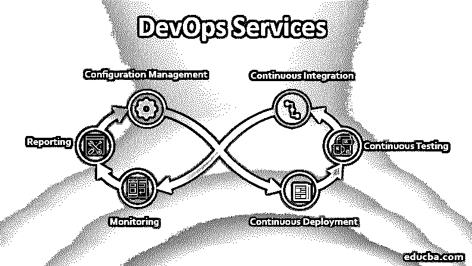

# DevOps 服务

> 原文：<https://www.educba.com/devops-services/>

## DevOps 服务简介

DevOps 基本上是创建一个利基或环境，强调将开发和运营团队结合在一起。自动化对于持续的软件开发和交付是一个很好的附加物。如果我们以增量的方式频繁而快速地处理 DevOps 服务，那么构建、测试和发布软件的主要目标可以很容易地实现。

采用 DevOps 即服务时会遇到一些主要挑战:

<small>Hadoop、数据科学、统计学&其他</small>

*   在发布管理和整个项目管理方面的时间和成本权衡。
*   部署转换，即使是在项目的部署阶段的一个单独的变更。
*   在长时间发布和由于错误导致的失败发布时，即一些不可预测的发布。
*   手动执行流程时重复的程序和缓慢的速度。
*   开发、测试和生产环境的每个阶段的系统故障，即环境中的不一致性。

### DevOps 的目标

让我们看看开发运维即服务的目标:

关键目标是专注于项目的需求或者整个业务需求。

*   **分析:**分析整个业务需求，然后收集必要的信息或数据。
*   **设计:**将所有收集到的数据整理成适当的格式，然后继续进行开发活动。
*   **开发团队应该开发代码:**优化并准备好移动代码。
*   **编译:**同时编译代码以检查代码的美观。
*   **测试:**没有这个阶段，任何软件产品都没有准备好部署；因此，非常需要在每个阶段进行测试。

### DevOps 作为一项服务有什么好处？

下面显示了开发运维服务的优势:

*   **配置管理(源代码控制):** Git、SVN、Bitbucket 是非常强大的源代码控制配置管理工具，帮助创建所有代码和脚本的存储库，以便在发布或构建时签入或签出。
*   **持续集成(构建自动化):**像 [Jenkins 这样的工具在管理所有构建方面已经取得了很大的进步](https://www.educba.com/what-is-jenkins/)。那么自动化是将所有构建与工具本身中已经可用的所有新特性和插件集成的另一个辅助工具。
*   **持续测试(测试自动化):**测试自动化还包括许多工具，如 selenium、PyCharm for Python testing 和 NG Test，因此整个构建作为输入给出，在发布之后，可以在另一个报告生成工具 allure report 的帮助下生成输出。
*   **持续部署:**这里的持续部署指的是像 Docker 和 Kubernetes 这样的工具[，它涉及到容器化来部署使用这些工具的应用。](https://www.educba.com/kubernetes-vs-docker/)
*   **环境供应:**这都与基础设施建设和资源分配有关，并且重用基础设施内的所有资源；也可以考虑在上面使用 hypervisor。Openstack、AWS 是一种用于供应资源的工具。
*   **监控:** Ansible 和 helm charts 可用于监控，同样取决于实际工具项目所需的业务需求类型。
*   报告:ray gun 是一个很好的报告工具，它有助于检查软件的健康状况，是一个崩溃报告平台。

开发运维即服务所有目标的场景

### 选择开发运维即服务的优势

下面是提到的好处:

*   质量或改进的软件:质量和改进的软件将按要求交付给最终客户。
*   **提高版本的稳定性:**如果增量或[持续集成](https://www.educba.com/what-is-continuous-integration/)完成，软件构建最终将是稳定且无缺陷的。
*   **提高部署质量:**频繁的部署有助于提高部署活动和整个开发运维即服务的质量。
*   **同步且友好的利基或环境:**同步环境这里指的是软件的开发，接下来是测试、试运行和生产就绪。
*   **减少沟通差距:**开发和运营团队之间的差距或[桥梁被这些服务抹去了。](https://www.educba.com/what-is-bridge/)
*   **提高生产力:**通过持续集成和持续部署，整体生产力是市场所需要的。

### 结论–devo PS 服务

与任何类型的云计算有点类似，在同一 DevOps 即服务上存在批评或缺点，例如最终客户对服务提供商避免服务器故障的能力的可靠性。具体到 DevOps 即服务，与传统云计算相比，这就像我们提供一些租金来执行我们使用数据即服务可以完成的所有活动。例如，Oracle 作为 DevOps 服务将创造大量跨渠道消费者。不仅如此，许多 DevSecOps 也与 DevOps 即服务相关联。因此，非常需要采用这些服务，用一个高质量的产品来临时凑合整个生产过程。

### 推荐文章

这是 DevOps 服务指南。在这里，我们讨论 DevOps 即服务的简介、目标和优势，以及一些主要挑战。您也可以阅读以下文章，了解更多信息——

1.  [什么是 DevOps？](https://www.educba.com/what-is-devops/)
2.  [DevOps 架构](https://www.educba.com/devops-architecture/)
3.  [大数据架构](https://www.educba.com/big-data-architecture/)
4.  [开发运维的优势| 16 大优势](https://www.educba.com/benefits-of-devops/)

