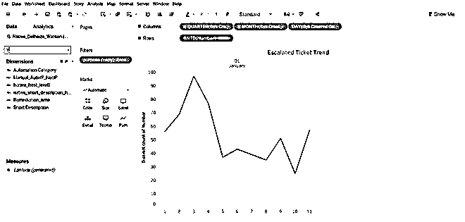

# 什么是 Tableau 服务器？

> 原文：<https://www.educba.com/what-is-tableau-server/>

## 什么是 Tableau 服务器？

一个托管和保存所有 tableau 工作簿、数据源和相关 tableau 数据的在线平台称为 Tableau Server。Tableau 开发了服务器，这样 Tableau 的所有功能都可以在服务器中使用，它有助于用可用的内存保存数据。[如果使用 tableau 功能，工作簿不需要总是用桌面打开和下载。可以给予访问和授权，以便文件可以保持安全并保护它们免受黑客攻击。服务器可以帮助员工在项目工作中进行协作，从而节省时间。](https://www.educba.com/tableau-workbook/)

### 让我们来看看关于 Tableau 的一些有趣的点:

1.  **适合各种组织:**无论是个人用户、中型组织还是大型组织，Tableau 都适合。如果它的个人用户。Tableau 桌面是你的选择。Tableau desktop 驻留在您的系统上，用于创建各种可以保存为工作表形式的视觉效果。如果您想与您的同事共享这种视觉效果，您可以共享您保存的工作表，如果您的同事有 Tableau reader/ Tableau desktop 可用，他们就可以查看该工作表。
2.  **吸引人的仪表板:**有多种选项可用于构建图表。这些图表可以帮助理解数据，创建有吸引力的仪表板，进行简单的统计分析，预测等。在 Tableau 中完成的所有开发都考虑到了用户的易用性。所有这些特性都有助于商业专业人士以高效的方式提出见解。这就是 Tableau 作为一个工具站如此独特的原因。
3.  **处理许多数据源:** Tableau 可以连接到 40 多个数据源，此外它还可以处理 excel 和 csv。在 OLAP 之上，还有 SQL Server、DB2 等。让 Tableau 赢得用户。Tableau 带有许多免费的内置数据连接器。
4.  **连接编程语言:** Tableau 连接 [R 和 Python](https://www.educba.com/r-vs-python/) 。
5.  **Tableau 社区:**你可以很容易地从 Tableau 社区和 Tableau 博主那里找到帮助。

### Tableau 服务器类型

画面有三种:

<small>Hadoop、数据科学、统计学&其他</small>

#### 桌上型电脑表格

Tableau desktop 是一个标准工具，可以帮助您准备、创建、浏览和可视化数据集。它赋予你力量，鼓励你以多种方式探索数据。交互式工作表和仪表板通过视觉模式帮助您发现数据中隐藏的洞察力。

图一。

来自我的 Tableau 工作簿

#### Tableau 服务器

当在 Tableau Desktop 上创建的仪表板需要发布时，它就出现了。它使您能够将仪表板发布给合适的利益相关者，从而简化仪表板的协作和共享。它帮助用户发布和共享他们的数据源作为一个提取器实时连接。在这里，用户不需要在他们的机器上安装 Tableau，他们仍然可以与服务器上的仪表盘进行交互。

图二。

> [顾问日记–学习 Tableau 服务器第一部分](https://www.theinformationlab.co.uk/2018/05/14/consultants-diary-learning-tableau-server-part-i/)

<iframe loading="lazy" class="wp-embedded-content" sandbox="allow-scripts" security="restricted" style="position: absolute; clip: rect(1px, 1px, 1px, 1px);" title="“Consultant’s Diary – Learning Tableau Server Part I” — The Information Lab" src="about:blank" data-secret="n3sY3ZVsew" width="500" height="282" frameborder="0" marginwidth="0" marginheight="0" scrolling="no" data-rocket-lazyload="fitvidscompatible" data-lazy-src="https://www.theinformationlab.co.uk/2018/05/14/consultants-diary-learning-tableau-server-part-i/embed/#?secret=t11vocX7XG#?secret=n3sY3ZVsew">
 
它可以连接大约 100 个数据源，包括 Marketo、SAP HANA、Salesforce.com、Google BigQuery、Oracle 等。

 
从部署角度来看，它可以部署在本地以及公共云中，如 Azure、AWS、IBM Cloud、<a href="https://www.educba.com/what-is-google-cloud-platform/"> Google Cloud Platform </a>等。它还使管理员能够轻松地跟踪和管理数据源的内容、许可证、性能和权限。
 <h4>Tableau 服务器支持</h4> <ol> <li>安卓应用</li> <li>ipad 应用程序</li> <li>移动旅行</li> <li>IE、Mozilla Firefox、Chrome 和 Safari 等网络浏览器</li> <li>安卓浏览器</li> </ol> 
有几个服务器进程在幕后指挥 Tableau 服务器:
 <ul> <li><strong>应用服务器:</strong>处理 Tableau 服务器 web 和移动接口的权限。应用服务器从用户登录到 Tableau 服务器开始工作，直到它验证许可。</li> <li><strong> VizQL 服务器</strong>:一旦视图被释放，客户端向 VizQL 进程发送一个请求。然后，VizQL 进程负责将查询直接发送到数据源，数据源返回一个结果集，该结果集以图像的形式呈现给用户。每个 VizQL 都有自己的缓存，如果需要，可以与多个用户共享。</li> <li><strong>数据服务器</strong>:为了集中控制和存储 Tableau 数据源，需要 Tableau 数据服务器。除此之外，它还管理来自 tableau 桌面的元数据，如组、定义和计算。</li> <li><strong>后台</strong>:刷新预定的摘录，加上其他后台活动。</li> <li><strong>负载均衡器</strong>:如果为任何组件配置了多个任务/程序。负载均衡器将进入画面，并将请求共享给过程。负载平衡器也称为网关。如果有一个单一的服务器配置场景，那么每个过程都将位于网关上。</li> </ul> <h4>Tableau 在线</h4> 
Tableau Online 是 Tableau Analytics，它托管在云上，完全看不到您这边的硬件和服务器维护。这可以通过手机应用程序或浏览器访问。它帮助用户发布仪表板，并与同事、客户、同事和利益相关者分享“活力”。这最终可以引导协作，使用交互式可视化来发现数据中隐藏的见解。管理员还可以像 Tableau Server 一样轻松地管理用户、数据和内容的身份验证和权限。
 

 
图三。
 
<a href="https://www.tableau.com/products/cloud-bi">https://www.tableau.com/products/cloud-bi</a>

 
Tableau online 还可以连接到许多数据源的实时连接，如 BigQuery、MySQL 等。
 

 
图 4。
 
<a href="https://www.tableau.com/about/blog/2016/4/tableau-online-tips-extracts-live-connections-cloud-data-53351">https://www . tableau . com/about/blog/2016/4/tableau-online-tips-extracts-live-connections-cloud-data-53351</a>
 <h3>推荐文章</h3> 
这是一个什么是 Tableau 服务器的指南？.这里我们已经讨论了 Tableau 服务器的基本概念、类型和一些服务器进程。您还可以浏览我们推荐的其他文章——
 <ol> <li><a href="https://www.educba.com/uses-of-tableau/">Tableau 的用途</a></li> <li><a href="https://www.educba.com/tableau-interview-questions/">优秀的 Tableau 面试问题</a></li> <li><a href="https://www.educba.com/data-visualization-with-tableau/">使用 Tableau 进行数据可视化</a></li> <li><a href="https://www.educba.com/visual-analytics-vs-tableau/">视觉分析 vs Tableau </a></li> <li><a href="https://www.educba.com/heatmap-in-matlab/">MATLAB 中的热图|如何创建|示例</a></li> </ol> &#13; &#13; &#13; &#13; 
&#13; &#13; 
&#13; <!-- Ad Unit 9 - Footer -->&#13; &#13; <!-- AI CONTENT END 1 --> 
Primary Sidebar
 
&#13; &#13; 
&#13; <!-- Ad Unit 1 -->&#13; &#13; &#13; 
&#13; &#13; 
&#13; <!-- Ad Unit 2 -->&#13; &#13; &#13; 
&#13; &#13; 
&#13; <!-- Ad Unit 3 -->&#13; &#13; &#13; 
&#13; &#13; 
&#13; <!-- Ad Unit 4 -->&#13; &#13; &#13; 
&#13; &#13; 
&#13; <!-- Ad Unit 5 -->&#13; &#13; &#13; 
&#13; &#13; 
&#13; <!-- Ad Unit 6 -->&#13; &#13; &#13; 
&#13; &#13; 
&#13; <!-- Ad Unit 7 -->&#13; &#13; &#13; 
&#13; 
&#13; <!-- Ad Unit 10 -->&#13; &#13; &#13; 
&#13; 
 
  </body> </html></iframe>