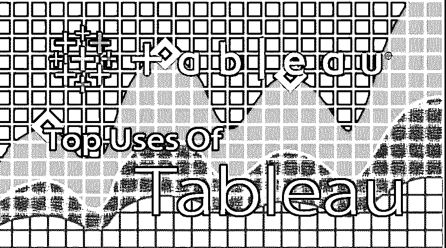

# Tableau 的使用

> 原文：<https://www.educba.com/uses-of-tableau/>

## Tableau 用法介绍

Tableau 是一个强大的数据可视化工具，通常被称为数据分析或商业智能(BI)工具。Tableau 的用途包含一组不同的过程，如可视化、探索和数据分析，并具有不同的用途。请看下面几节，Tableau 在这里得到了广泛而有效的应用。

### 活人画

*   Tableau 是一款商业智能和[分析软件](https://www.educba.com/analytics-software/)，它提供了产品的交互式数据可视化视图。它是由一家总部位于美国华盛顿州西雅图的软件开发公司 Tableau 开发的。它是由帕特·汉拉汉、克里斯蒂安·沙博特、克里斯·斯托尔特创立的。它成立于 2003 年。
*   它主要关注商业智能应用的目的。用户可以根据所需的定制偏好创建交互式仪表盘。不同种类的数据源可以配置到该工具，并可以连接。使用该工具可以轻松分析实时数据。它在商业智能和数据分析领域一直处于领先地位。

### Tableau 的主要用途

以下是 Tableau 的常用列表:

<small>Hadoop、数据科学、统计学&其他</small>

#### 1.它提供并满足组织需求的不同要求

Tableau 可以通过对数据进行深入分析来满足组织的不同类型的需求和要求。组织的需求可以基于客户的需求以及产品或程序或应用的应用。

#### 2.数据可以被有意义地理解和分析

可以轻松地分析来自不同数据源的数据，并生成一眼就能理解的报告。数据将通过提取、加载和转换以不同的方式进行分析。有多种方法、步骤和过程可以处理和分析数据。

#### 3.Tableau 轻松提供更大的可视化仪表盘

是另一种过程，其中 Tableau 的使用通过将数据集的内容或主要和关键的重要特征减少或总结为非冗余信息来执行数据分析过程。Tableau 中的可视仪表板可以提供不同种类的表示，如图形表示、饼图、条形图、表格或图形表示。

#### 4.支持许多数据源

有不同种类的数据源，例如不同类型的数据，如结构化、非结构化和半结构化数据。不同的数据源可以来自多种类型的数据库，如 Oracle、MySQL、IBM DB2、MS SQL、MongoDB、Cassandra、虚拟数据库等。,

#### 5.支持多种数据库特性

Tableau 的使用支持多种类型的数据库特性，如 RDBMS、非 SQL 数据库、面向对象的数据库等。关系型[数据库管理系统](https://www.educba.com/database-management-system/)中的数据是结构化数据，没有 SQL 和面向对象的数据库是半结构化和非结构化数据，如 JSON、文本或文档文件等。,

#### 6.它更容易处理

处理不同类型的数据的过程更容易，并且根据需求定制数据也更容易。Tableau tool 中涉及的过程不涉及任何类型的编程或编码或设计，它只需要一种拖放或工具功能，这更容易操作，也涉及较少的学习曲线。

#### 7.拥有更大的社区支持

Tableau 拥有许多知识渊博的优秀专业人员，他们热衷于学习和合作，以支持处理和管理数据的复杂问题。其社区论坛拥有不同类型的用户组、社区、论坛和用户群，拥有不同的跨职能和技术知识来帮助其他用户。

#### 8.最佳视觉分析

视觉分析可以是图形或任何种类的更容易理解或一眼就能理解的表示。这就是视觉分析如何依赖于以视觉形式表示数据的方式。

#### 9.灵活的数据提取和分析

通过使用数据源配置功能，从不同种类的数据源提取数据和分析数据的过程是灵活的，方法是连接到多个数据源，并将数据提取或抓取到 Tableau 中，以便开始处理或分析数据。

#### 10.自定义数据报告生成

报告生成过程可以通过按照客户或客户要求操纵数据表示以定制的方式来实现，这使得客户的生活更容易并且有益于进行他们的商业应用。

### 结论

在 Tableau 的这篇使用文章中，我们看到了数据分析和商业智能领域的不同应用领域和多个应用领域，以及数据可视化工具的使用情况，其中 Tableau 是使用率最高的工具，已成为顶级数据可视化或分析工具中的主要工具。这清楚地表明 Tableau 工具的更大利用存在于数据可视化领域，其中在当前市场中，即在数字数据世界的当前时代中，有许多可用的工具。大量的工具，包括第三方工具，以及用于数据可视化和报告应用程序的不同功能和选项，以处理 Tableau 工具中的数据源。将数据加载到 Tableau 工具后，有多个数据报告和可视化要素需要转换或映射。

Tableau 工具在数据分析和数据可视化领域有着广泛的应用，它提供了更大的好处，如数据处理和在最短的执行时间内动态减少数据冗余。客户业务需求或客户业务处理要求的日益增长需要一些软件应用程序或工具来安全地处理和管理他们的大规模客户内容数据，Tableau 工具是市场上可用的最佳商业智能和数据可视化工具之一，可在短时间内轻松提供高度复杂的业务解决方案，而无需费力管理数据转换功能。此外，由于客户群和日常需求或客户数据处理相关活动的增加，Tableau 工具已经成为数字世界最新领域中许多企业的理想解决方案，在数据报告的高度复杂数据可视化方面有许多创新和技术突破。

### 推荐文章

这是一个使用 Tableau 的指南。这里我们讨论了 Tableau 的不同用途，如灵活的数据拉取和分析、可视化分析、支持数据源**、**等。你也可以看看下面的文章来了解更多

1.  [c++的使用](https://www.educba.com/uses-of-c-plus-plus/)
2.  [编码在日常生活中的十大用途](https://www.educba.com/uses-of-coding/)
3.  [Python 的用途](https://www.educba.com/uses-of-python/)
4.  [詹金斯使用终极指南](https://www.educba.com/uses-of-jenkins/)

