# 如何使用 Tableau？

> 原文：<https://www.educba.com/how-to-use-tableau/>

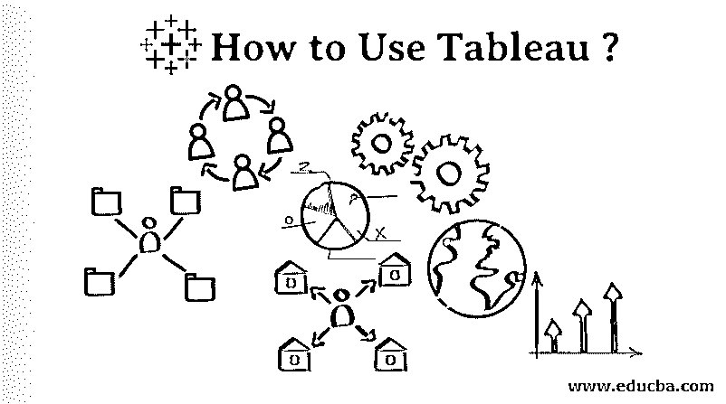

## 使用 Tableau 简介

Tableau 是 Tableau 软件创建的数据可视化工具。在理解 tableau 之前，我们应该知道什么是数据可视化。正如我们所见，数据正在快速生成。用数字来理解数据并不总是容易的。当我们得到数字的图像时，理解数据就变得容易了。我们，人类，擅长于视觉化(对某事物的心理图像)。数据可视化是指数据或信息的图形或图像表示。对于可视化，我们可以使用图形、图表或地图等视觉元素。

1.  Tableau 是理解数据、使用可视元素并将数据或信息呈现给用户的工具。
2.  连接各种类型的数据源，如 excel 文件、MySQL、google 电子表格等。
3.  它发现了数据的洞察力，比如模式、趋势。
4.  把大量的数据转换成可以理解的数据。

### 产品 Tableau 提供

1.  桌上型电脑表格
2.  Tableau 服务器
3.  Tableau 在线
4.  Tableau 阅读器
5.  Tableau 公共

### Tableau 是如何工作的？

*   Tableau 连接到数据源，将数据提取到源中，并使数据可视化。
*   有两种类型的数据提取- 1)实时 2)提取。
*   实时数据连接是指实时(在线)提取数据，分析师将处理数据并与用户共享仪表板。用户可以使用 tableau 阅读器读取数据。
*   数据提取可以从 Tableau 桌面(离线)完成，并在 Tableau 服务器上发布。用户可以从任何位置使用 Tableau 服务器访问数据。

### Tableau 的好处

1.  创建交互式仪表板
2.  处理大量数据，如大数据
3.  易于实施
4.  计划报告
5.  移动支持
6.  简单易学

### 如何使用 Tableau？

有一个使用 tableau 的程序，我们将从头开始学习。

<small>Hadoop、数据科学、统计学&其他</small>

**第一步:**从 https://www.tableau.com[下载 Tableau 桌面或 Public](https://www.tableau.com)。

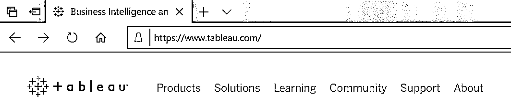

第二步:我们可以使用桌面产品 14 天(免费试用)，之后我们需要为产品的使用付费。

**第三步:**用户应在上下载、安装并保存 Tableau Desktop 或 Public。用户应该在网站上注册自己保存可视化。工作簿以(.twbx)扩展名。

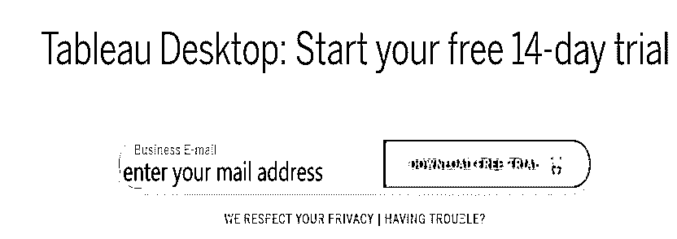

**Step 4:** Users can view the screen given below. Users can connect to file like excel, pdf, text, etc. Users can connect to the server. When we click on more data sources windows open.

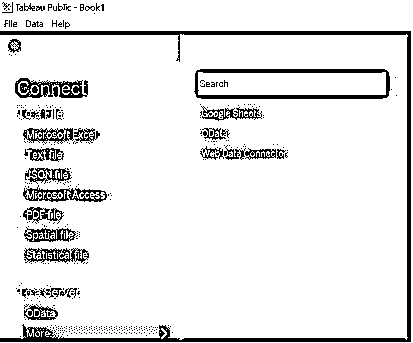

**第五步:**点击文件新建，工作区将打开。

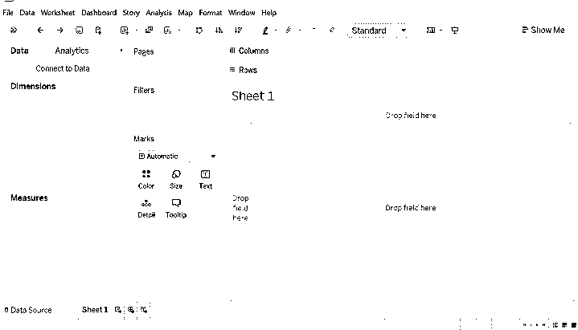

**Note: **Data Source: File you have extracted can be either offline or online given with some rows and columns, tableau can have a maximum of 32.

**第六步:**点击文件。打开 Excel 文件(示例用途)。

*   数据源窗口如下图。看看这些联系。
*   我们已经打开超市 Excel 文件，其中订单，人，返回表。
*   将左侧给出的工作表拖动到“将工作表拖动到此处”。
*   数据源顺序，我们可以按升序或降序排列数据。

**第七步:**拖动订单表后(如下图)。

*   在连接中，我们可以看到数据库名称。
*   看看数据源窗口。
*   看看#和 Abc 这样的符号。
*   右击系统，你会得到一个选项，如重命名，隐藏等。
*   重命名选项用于重命名字段名称，例如，我们可以将行 ID 重命名为行 ID1。
*   隐藏选项用于隐藏列。

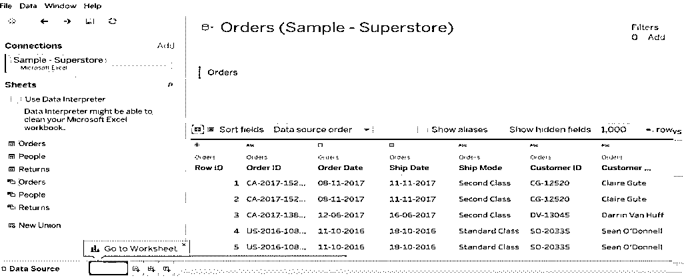

第 8 步:我们可以执行两个表之间的连接。连接类型内部、完全外部、左侧和右侧。

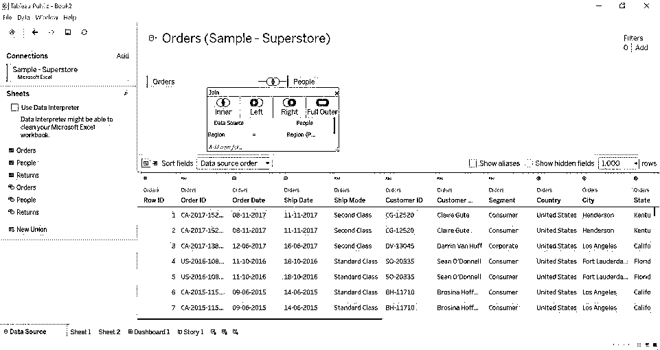

**第 9 步:**转到第 1 页，在这里可以用我们的数据开始可视化。

*   **维度**:是定性数据，在上面的例子中，我们可以排序 ID、区域、行 ID 等。这些信息重视数据的质量。
*   **度量:**是关于数据的数量。在上面的例子中，我们可以看到像折扣、利润、销售额和数量这样的值。
*   **过滤器:**用于根据需要选择数据(按值过滤)。
*   **演示**:该选项将根据从表中检索的值(测量和尺寸)显示图形。

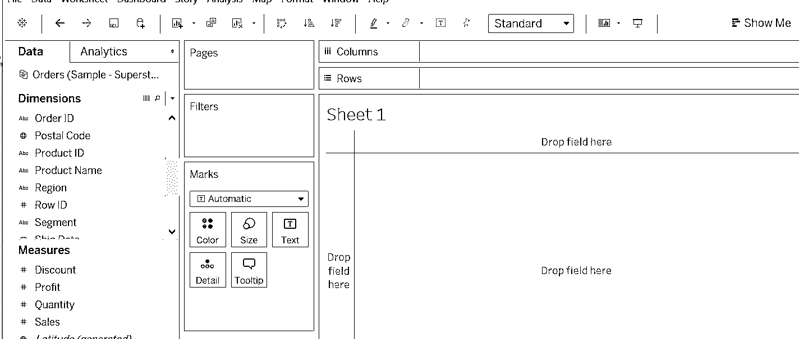

**步骤 10:** 我们将从 dimension 和 measure 中拖动值，并进行可视化。

*   我们将 Region 拖到列上，将 quantity 拖到列上，以查看数量，默认情况下计算为 SUM。
*   我们可以更改工作表的名称，点击工作表->编辑工作表窗口就会打开。
*   我们可以根据数量看到颜色的变化，因为我们将数量拖入了颜色中。
*   单击颜色。编辑颜色，调色板，选择颜色，然后应用确定。

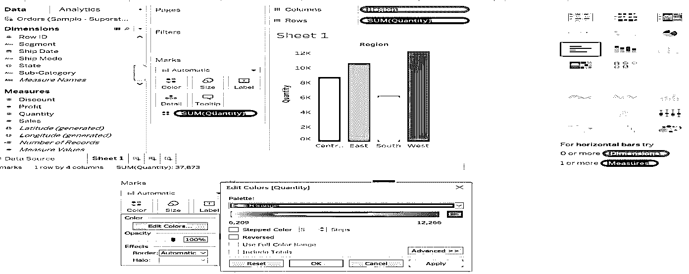

**步骤 11:** 我们可以将 SUM 改为 Average，Median，(如果需要更改计算)。

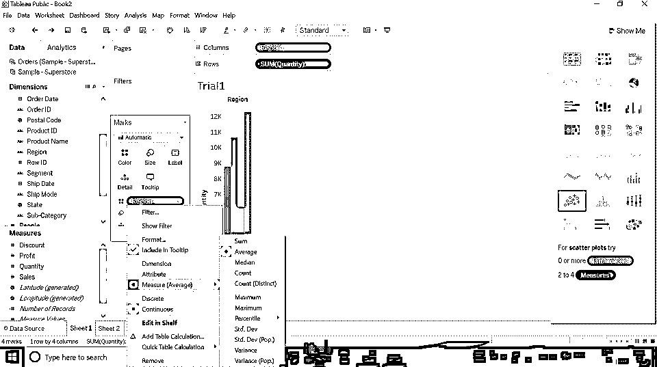

**第十二步:**我们可以改变图形的大小。(下图所示)。点击尺寸- >按照你的意愿调整尺寸。

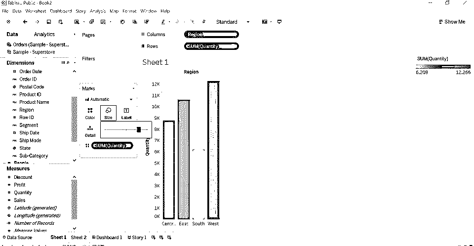

**第十三步:**我们来看看“滤镜”。将区域字段拖动到过滤器中，我们可以按区域进行过滤。(下图所示)

我们可以看到下面给出的 4 个选项。

*   **常规:**显示区域名称，我们可以选择一个或两个区域，或两个区域，或无。
*   **通配符:**包含，开头，结尾有选项可用。
*   **条件:**按场最大或最小。
*   **顶部:**按字段显示顶部或底部。

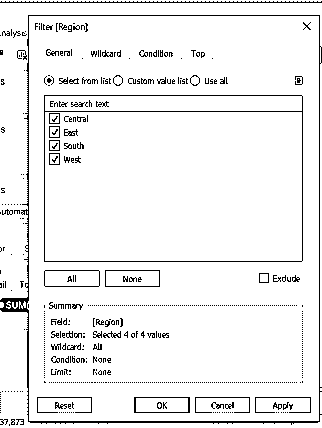

**第十四步:**快捷键玩数据。

*   我们可以用行和列交换值。
*   升序和降序排列数字。

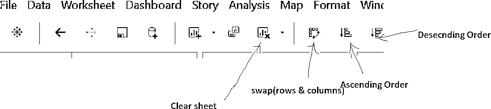

**第十五步:** [画面仪表盘](https://www.educba.com/what-is-tableau-dashboard/)

*   它包含多个工作表。我们可以将工作表拖入其中，制作一个交互式仪表板。
*   我们可以编辑仪表板标题。
*   选择显示仪表板标题->右键单击标题->编辑标题->重命名标题。
*   根据你想要设计的要求选择颜色和尺寸。

**第 16 步:**在上面的例子中，我们可以看到两个工作表(sheet 1，Sheet2)被拖动到仪表板中。在右边，我们可以看到两个条形(一个表示销售总额，另一个表示记录数)，它们属于 sheet1 和 sheet2。

### 结论

学习 Tableau 不需要有什么技术功底。我们应该有学习工具的热情。这一切都是关于处理你所拥有的数据，以一种完美的方式让人们更容易读懂。如果我们使用该工具提供的每一个功能，数据将看起来更具交互性。

### 推荐文章

这是如何使用 Tableau 的指南？在这里，我们讨论 Tableau 如何工作，它的好处，使用 Tableau 的步骤。你也可以浏览我们的文章来了解更多-

1.  [什么是 Tableau？](https://www.educba.com/what-is-tableau/)
2.  [如何安装 Tableau](https://www.educba.com/install-tableau/)
3.  [Tableau 替代方案](https://www.educba.com/tableau-alternatives/)
4.  [Tableau 日期函数](https://www.educba.com/tableau-date-functions/)

