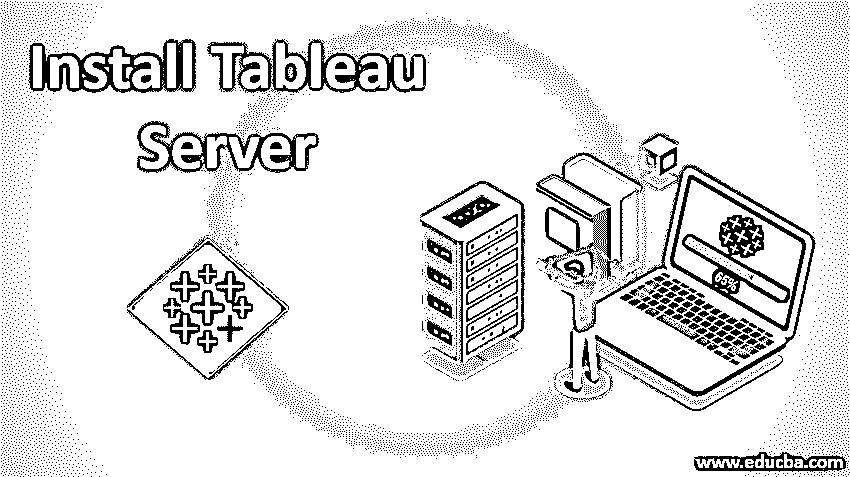
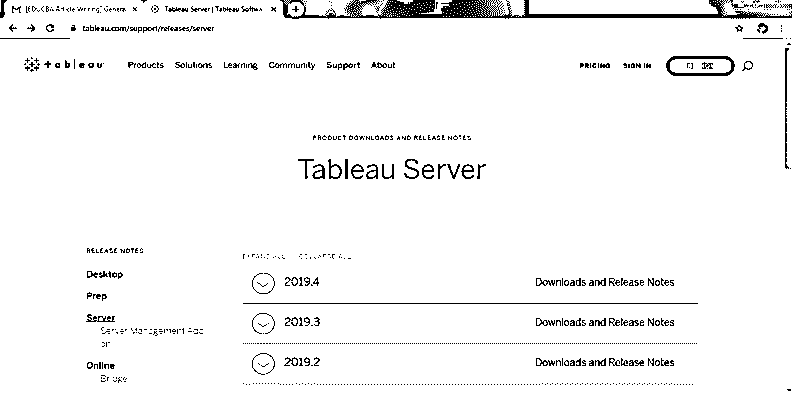
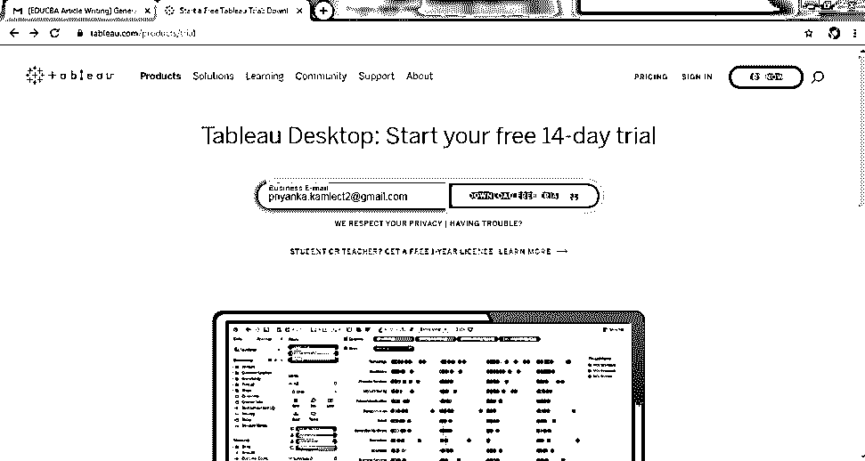
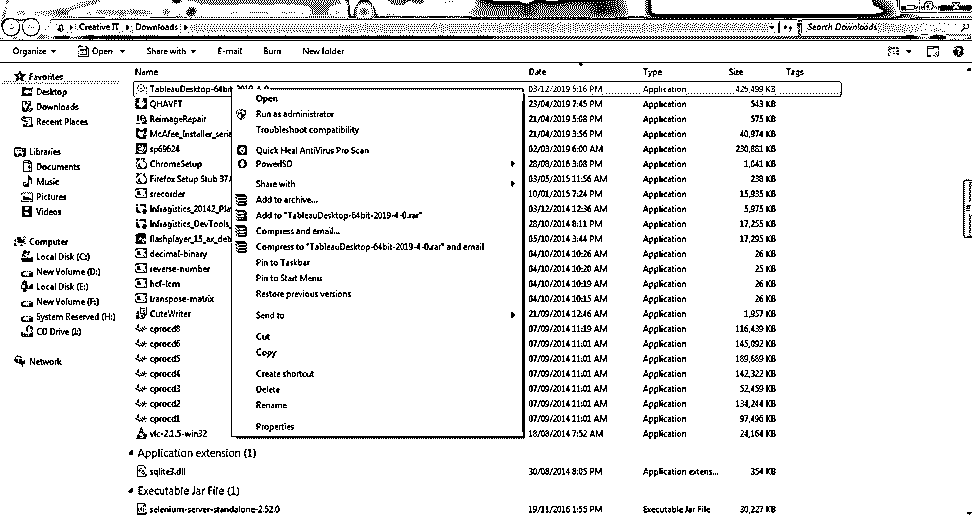
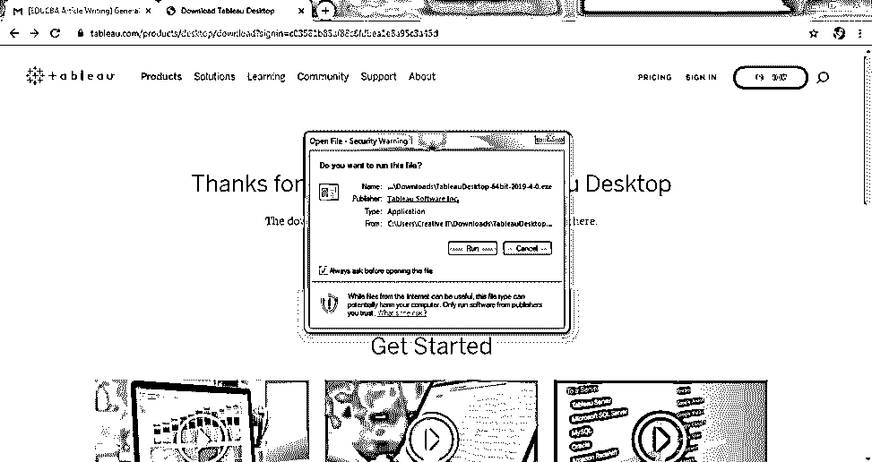
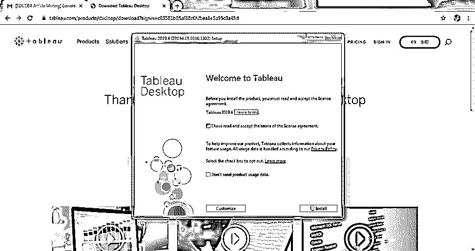

# 安装 Tableau 服务器

> 原文：<https://www.educba.com/install-tableau-server/>

## Tableau 服务器简介

Tableau Server 是著名的集中式存储设备之一，您可以将所有相关文档集中在一个中心点，这将保护您的数据并为您提供最佳结果。

在本文中，我们将学习如何[安装 Tableau 服务器](https://www.educba.com/install-tableau-server/)。Tableau 是当今非常著名的工具，它有两种处理数据的方法。

<small>Hadoop、数据科学、统计学&其他</small>

*   桌上型电脑表格
*   Tableau 服务器

### Tableau 服务器有什么用？

让我们找出为什么 [Tableau 服务器进入](https://www.educba.com/what-is-tableau-server/)画面时，我们已经有了 Tableau 桌面。Tableau 桌面与我们同行是因为以下原因:

*   如果你有大量的文件附件。
*   数据源在哪里？
*   SharePoint 文件在哪里？
*   您是否将敏感的工作簿数据转发给了某个人，这会造成一些问题？
*   如果你想在移动设备上使用它。
*   为什么这么慢？
*   我们用的是哪个版本？
*   那是附在哪个邮件里的？

### 我们什么时候需要带 Tableau 服务器？

*   当您拥有高增长、不受控制的环境，并且希望获得更高的安全性、协作、治理和性能时。
*   如果您想要控制随着仪表板和工作簿的快速增长而使用的数据源的数量，每个数据源都有自己的元数据层、摘录和副本。

### Tableau 服务器和 Tableau 桌面有什么不同？

以下几点解释了 Tableau 服务器和桌面之间的区别:

*   安全性
*   Web 创作环境
*   表演
*   费用
*   将 Tableau 扩展到企业意味着您可以根据需要扩展 Tableau 服务器(可伸缩性)
*   添加自助服务功能
*   集中管理协作
*   集中式数据源
*   tableau 服务器的另一个优势是你可以在你的 Tableau 服务器上安装 Tableau 桌面并发布你的数据。

#### 技术规范

以下是技术规格:

**1。最低硬件要求**

*   少于 25 个并发用户的小型部署
*   2 核心 64 位元 CPU
*   RAMà8 GB
*   可用磁盘空间 40 GB

**2。推荐的硬件要求**

*   小于 100 个并发用户的中型部署
*   8 核心至 64 位元 CPU
*   RAMà32 GB
*   可用磁盘空间±100 GB–500 GB

**Note:** Free Disk Space is calculated after the Tableau Server Setup program is unzipped. The setup program uses about 1 GB of space. Concurrent user means how many users can access a server at a time.

### 如何安装 Tableau 服务器？

请告诉我们，在安装 tableau 服务器之前您应该注意什么:

#### 清单

*   基于用户或核心的许可证。
*   硬件规格。
*   身份验证(域中的活动目录意味着，如果您有访问权限或使用本地身份验证，它将使用相同的凭据在 Tableau 服务器中进行登录，因为我们必须为不同的用户创建不同的凭据)

#### 安装前(认知)

*   Tableau 服务器的正确版本。
*   获取产品密钥。
*   你有管理员权限吗？
*   在“干净”的计算机上安装，即性能和安全性。

#### 装置艺术

*   **运行服务器设置:**首先通过选择“以管理员身份运行”来安装 tableau 服务器，安装后，您必须选择您实际想要 Tableau 服务器的目标位置，如果您想要更改路径，您只需单击“浏览”即可，但建议您始终保持默认路径。并且总是记下你将来用最新版本改变版本的途径。
*   **默认安装路径为 C:**\ Program Files \ Tableau \ Tableau Server。您可以通过浏览或键入新路径来选择不同的位置，包括不同的驱动器。
*   **对于升级和迁移:**当您升级已安装到非默认位置的 Tableau 服务器时，您需要在升级期间导航到该非默认路径。
*   然后，它还会显示可用磁盘空间，然后单击安装，这将需要 2-3 分钟。
*   **激活服务器**
*   **配置服务器**
*   **创建管理员用户:**为认证用户提供正确的电子邮件 Id 和密码。

### 安装 Tableau 服务器的步骤

以下是安装 tableau 服务器的步骤:

**第一步:**首先你需要在谷歌搜索，即免费下载 Tableau 服务器。

**第二步:**第二步，你必须点击第一个链接，即 https://www.tableau.com/support/releases/server 的

**步骤 3:** 现在，点击上述链接后，您将看到以下屏幕，您必须点击第一个链接，即 Tableau Server | Tableau Software。

**步骤 4:** 现在，点击上面的链接后，您将看到如下屏幕:

**第 5 步:**然后在右手边的顶部，你会看到“立即尝试”按钮，你可以用它来下载 Tableau 服务器。

**第 6 步:**点击“立即尝试”按钮后，您可以看到如下所示的屏幕，并在提供您的受保护和验证的电子邮件 id 后，点击下载。

**第 7 步:**之后，您可以免费下载 tableau 服务器，在完成特定下载后，下载软件大约需要 2-3 分钟。您可以在下载部分找到下载的文件，然后您可以进行身份验证(域中的 Active Directory 意味着如果您可以访问 Tableau 服务器或使用本地身份验证，它将使用相同的凭据进行登录，因为我们必须为不同的用户创建不同的凭据)。这里显示了您必须在“以管理员身份运行”中获得它，只需右键单击该软件，然后单击第一个选项，即“以管理员身份运行”。

第 8 步:然后你会看到下面的屏幕，你必须点击“运行”按钮。

**第 9 步:**最后，您将看到一个屏幕，在这里您必须接受某些条款和条件，以便进行改进，然后单击“安装”，就可以了。

### 管理层级

*   计算机网络服务器
*   多个站点–特定于客户或项目的用户–子服务器–服务器的子集
*   多个项目
*   子项目
*   工作簿
*   视图–工作表或仪表板
*   数据源

### 管理员的工作角色

*   添加用户。
*   创建/管理组、工作簿和项目、数据库视图、数据源和数据连接。
*   添加/编辑网站和相应的管理权限。
*   创建/修改/管理服务器任务计划。
*   监控服务器活动/使用统计数据，以确定可能的性能问题/增强功能。
*   运行清理并创建数据库备份。
*   升级服务器软件。
*   如有必要，与项目经理合作解决服务器停机、版本控制等问题。
*   为用户提供 Tableau 支持。

### 结论

综上所述，我们得出结论，Tableau Server 因其存储容量和安全性而闻名，简而言之，我们只能在一台集中式服务器上访问、修改、加载、查看和创建“N”个数据，即除了 Tableau Server 之外，没有任何东西，它有自己的认证标准，我们需要正确的用户电子邮件 id 和密码来获得正确授权的用户，这样，没有自己的凭据，任何人都无法访问服务器。如果你想你的文件应该是一个适当的地方，你应该切换到 Tableau 服务器，而不是 Tableau 桌面，如果你真的找到了 Tableau 桌面，所以你也可以在 Tableau 服务器上安装你的 Tableau 桌面，有充分的保护，这将为你的文件提供保障。

### 推荐文章

这是一个安装 Tableau 服务器的指南。在这里，我们讨论基本概念，如何使用它，为什么我们需要和如何以最简单的方式安装 Tableau 服务器。您也可以浏览我们的其他相关文章，了解更多信息——

1.  [火花功能](https://www.educba.com/spark-functions/)
2.  [安装测试](https://www.educba.com/installation-testing/)
3.  [蜂箱安装](https://www.educba.com/hive-installation/)
4.  [安装 Hadoop](https://www.educba.com/install-hadoop/)

