# Tableau 图表类型

> 原文：<https://www.educba.com/tableau-chart-types/>

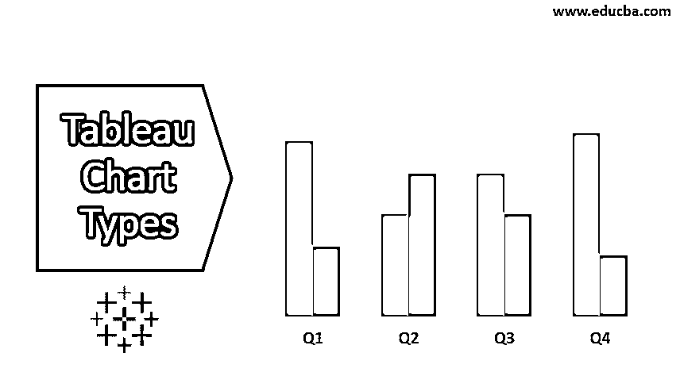

## Tableau 图表类型介绍

Tableau 是创建不同类型图表的强大工具。这是使用可视化查询语言自动完成的。tableau 中有 24 种不同类型的图表。图表是通过使用我们选择的度量和维度来创建的。

并非所有图表都以一种方式工作。当我们选择地理位置，如州、国家等，显示我将提示地图图表。当我们处理日期时，会建议使用折线图。

<small>Hadoop、数据科学、统计学&其他</small>

**Note: **Shortcut Key (Dimension/Measure +Ctrl)

如果我们先选择尺寸，然后选择测量，默认情况下将显示条形图。

如果我们先选择 Measure，然后选择 dimension，我们将得到数据的文本表示。

### Tableau 图表的类型

下面是 12 种不同的 Tableau 图表类型。

#### 1.对比图

**创建步骤**

*   打开 Tableau public 并连接到数据源。
*   转到新工作表。
*   在维度下选择订单日期->Ctrl->在度量下选择销售。
*   转到演示(用户可以看到图表)->选择图表。
*   转到标记卡，单击标记类型下拉列表并选择区域。
*   转到列->选择年份(订单日期)->下拉菜单->选择月份。

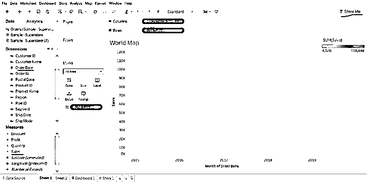

#### 2.条形图

**创建步骤**

*   打开 Tableau public 并连接到数据源。
*   转到新工作表。
*   在维度下选择类别->拖动到列->在度量下选择利润->拖动到行。
*   在“标记类型”->“选择标记”->“选择栏”下。
*   在维下选择区域->拖动到利润的左侧。
*   在维度下选择船模式->拖动到颜色，我们会在每个区域得到不同的船模式。

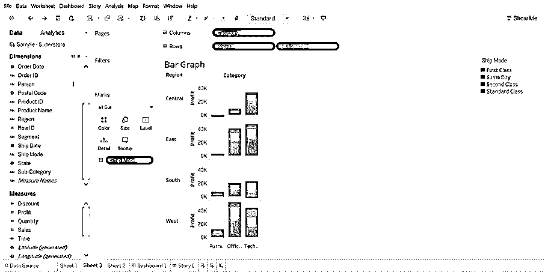

*   我们可以按区域查看数据，将区域拖到过滤器->选择我们想要的区域。

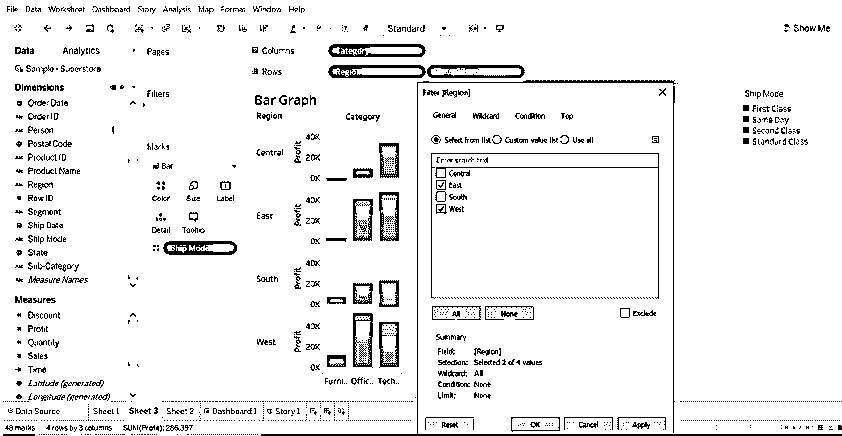

#### 3.盒须图

**创建步骤**

*   打开 Tableau public 并连接到数据源。
*   转到新工作表。
*   将线段尺寸拖到列中。
*   将折扣度量值拖到行中。

提示:-Tableau 默认创建一个条形图，因为我们将 dimension 拖动到列，measure 拖动到行。

*   将区域维拖至列，并将其放在段的右侧。
*   单击演示(工具栏右侧)，选择盒须图。
*   将区域从标记拖回到段右侧的列。
*   要分解数据，请选择分析->聚集度量。(默认情况下，tableau 中的数据是聚合的)。
*   单击交换按钮交换轴。
*   在底部轴上单击鼠标右键，然后选择“编辑参考线”。
*   在编辑参考线，填充下拉列表，选择一个有趣的配色方案。

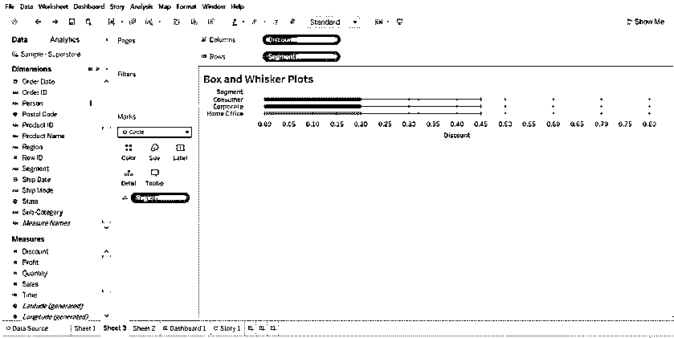

**编辑参考线**

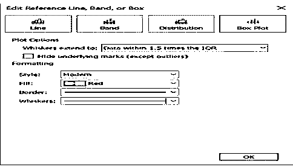

#### 4.项目符号图

(我们可以使用项目符号图来显示度量之间的性能。

可以比较两种方法。)

**创建步骤**

*   打开 Tableau public 并连接到数据源。
*   转到新工作表。
*   选择菜单栏中的“分析”。
*   从列表中选择“创建计算字段”。

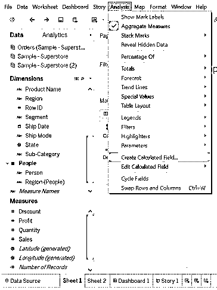

*   将打开计算字段窗口。说出它的名字。
*   键入度量的估计值。

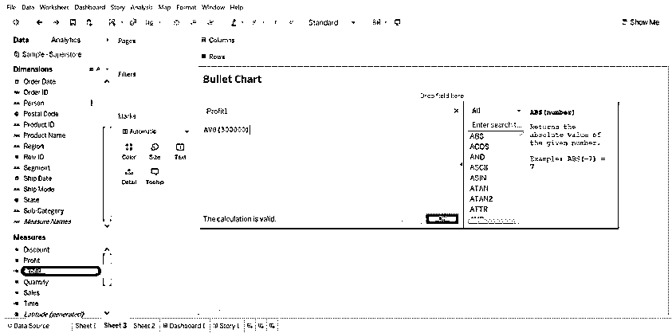

*   选择利润和利润 1(计算字段)。然后选择演示，它会向您显示一个项目符号图。
*   选择一个项目符号图。

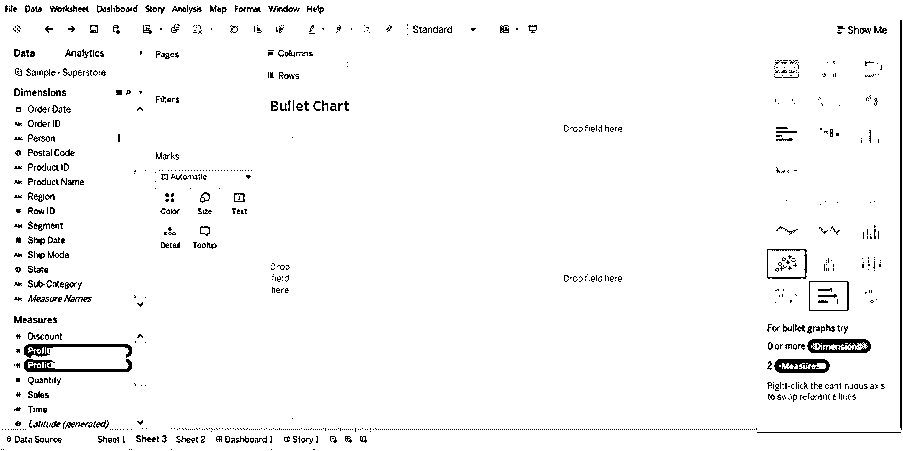

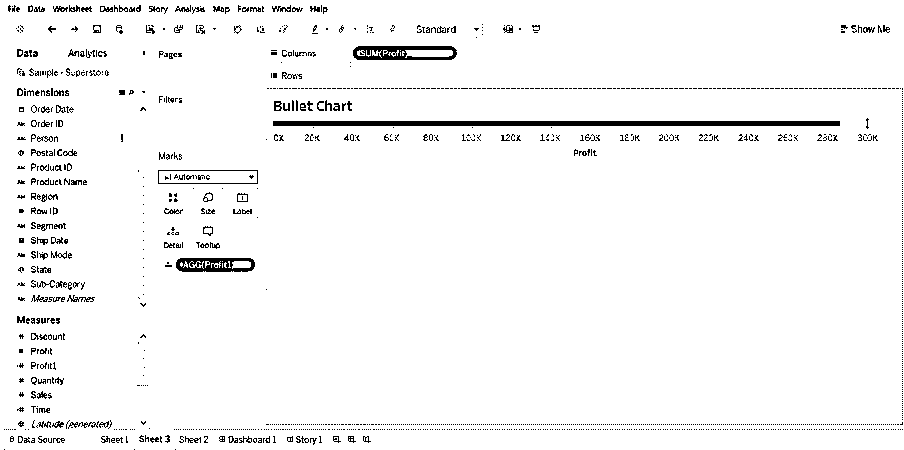

#### 5.散点图

(当我们在 x 轴和 y 轴上添加两个测量值时，散点图就会创建出来)

**创建步骤**

*   打开 Tableau public 并连接到数据源。
*   转到新工作表。
*   将利润拖到列中，将销售额拖到行中。默认情况下，这将创建一个散点图。

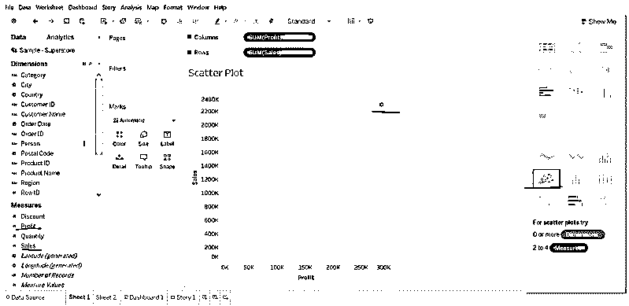

*   将“子类别”拖动到彩色(标记卡)中，它会创建一个散点图，显示每个子类别的销售额和利润之间的关系。

#### 6.圆形分格统计图表

(图表显示整体的比例)

**创建步骤**

*   打开 Tableau public 并连接到数据源。
*   转到新工作表。
*   将数量度量拖至列，将状态维度拖至行。

默认情况下将显示条形图。

*   点击“演示”，选择饼图。
*   在选择饼图之前。

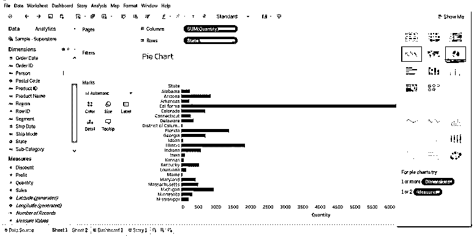

*   选择饼图后，拖动区域维度到标签(我们可以看到细节)。

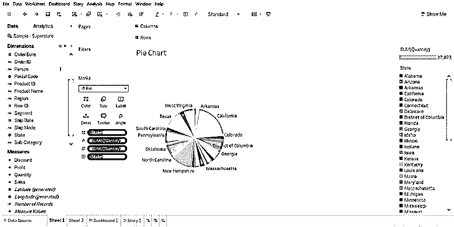

*   将状态拖到过滤器中，只选择您想要的状态。

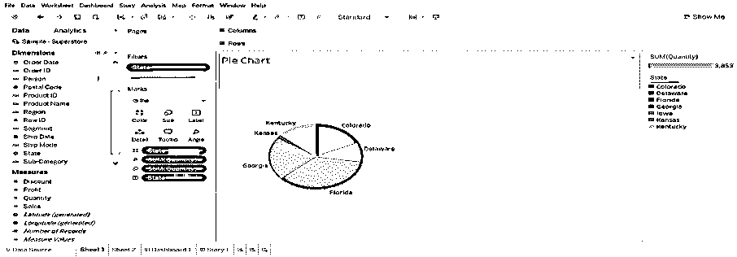

#### 7.泡泡图

(以气泡的形式显示尺寸和度量。气泡的大小显示尺寸的大小，气泡的颜色根据测量值确定)

**创建步骤**

*   打开 Tableau public 并连接到数据源。
*   转到新工作表。
*   选择产品名称(尺寸)，按 Ctrl 键选择数量(尺寸)，选择“演示”，然后单击“气泡图”。

由于产品名称的数量很大，我已经将产品名称拖动到过滤器中，并根据我的要求选择产品名称。

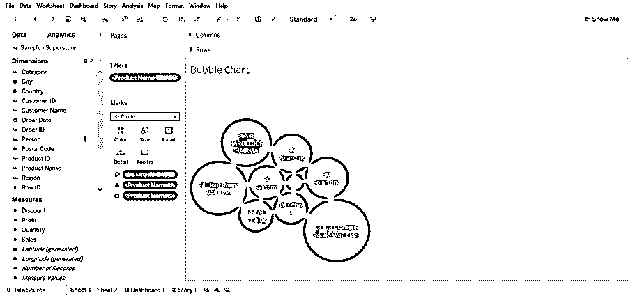

#### 8.折线图

(当我们想要查看一段时间内的趋势时，此图表非常有用。)

**创建步骤**

*   打开 Tableau public 并连接到数据源。
*   转到新工作表。
*   将“订单日期”维度拖到列中，将“销售和数量”度量拖到行中。两年的销量就不一样了。(图片如下所示)。

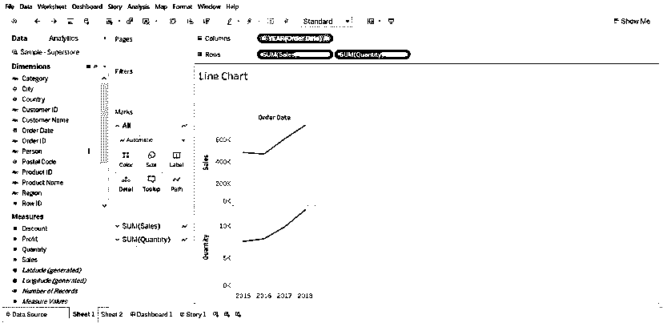

*   当行中有多个度量时，很难度量。将 measure(数量)拖到水平条中的 sales 上。

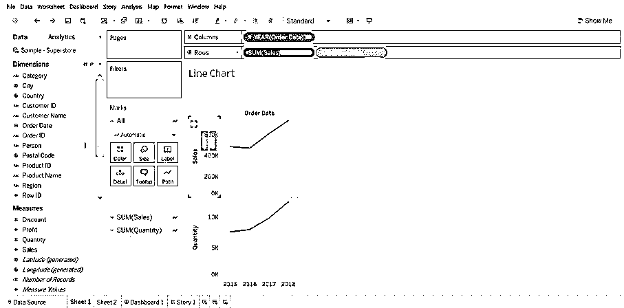

*   结果将会改变。查看工作表右侧的“测量名称”。

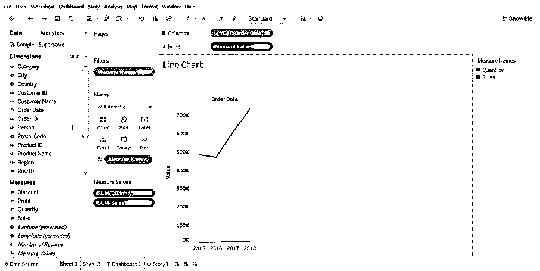

*   单击 YEAR(订单日期),并从下拉列表中选择 Month。

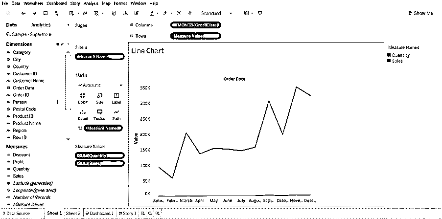

#### 9.柱状图

(它显示了数值数据的分布。默认情况下会显示频率和度量。)

**创建步骤**

*   打开 Tableau public 并连接到数据源。
*   转到新工作表
*   将折扣指标拖到列中，单击“演示”并选择直方图
*   将类别拖到颜色和标签中。
*   将折扣拖到标签中。
*   选择折扣到马克卡，并点击下拉菜单->选择快速表计算->选择总百分比

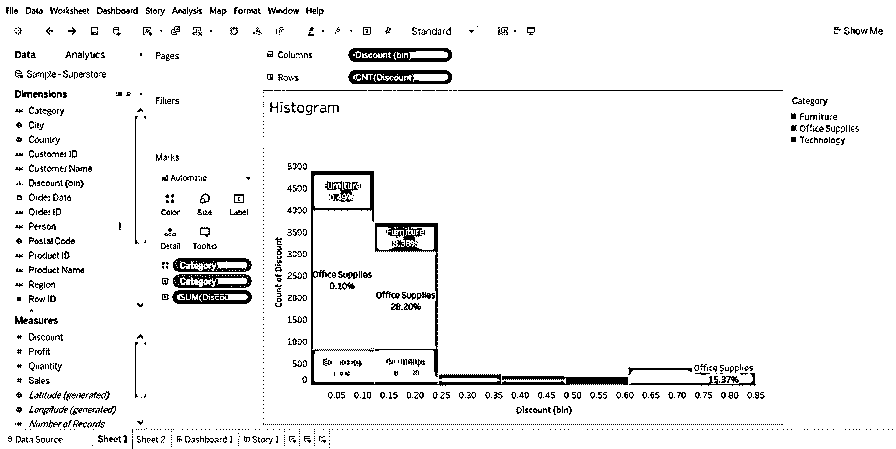

#### 10.突出显示表格

(使用颜色比较分类数据)

**创建步骤**

*   打开 Tableau public 并连接到数据源。
*   转到新工作表。
*   将发运模式维拖放到列，将区域和子类别拖放到行。
*   将利润维度拖到颜色，将销售额拖到大小(标记)。

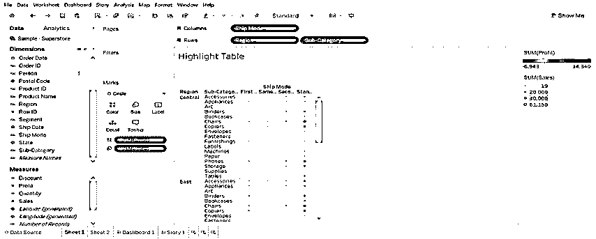

#### 11.线条图

(它用于确定每个流程所用的时间)

**创建步骤**

*   打开 Tableau public 并连接到数据源。
*   转到新工作表。
*   将订单日期维度拖至列，将区域和子类别维度拖至行。
*   点击分析->选择创建计算字段(时间)->创建公式 DATEDIFF('天'，[订单日期]，[发货日期]) ->拖动时间到大小(标记)。
*   将运输模式尺寸拖到颜色上。
*   将订单日期、地区和子类别拖到筛选器中，并选择所需数据。

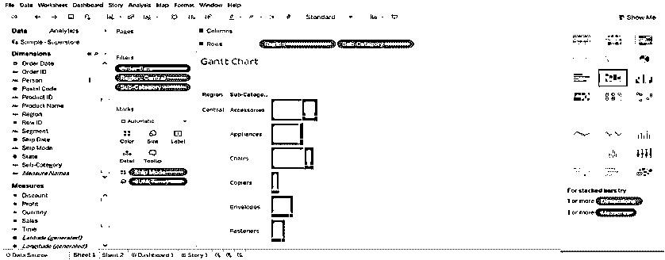

#### 12.热图

(它以不同尺寸和颜色的形式显示数据)

*   选择子类别，按控制并选择利润，然后选择热图(演示)
*   将区域拖成列，将销售额拖成大小(标志)。

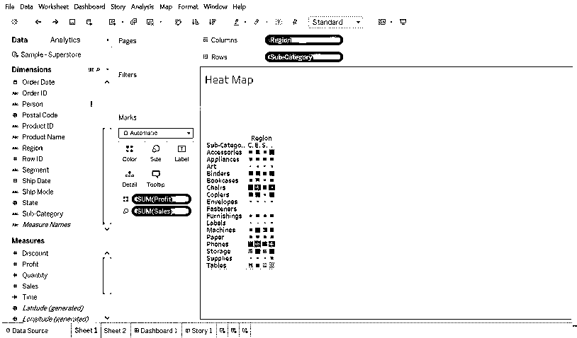

### 结论

图表在表示数据方面起着重要的作用。我们可以随心所欲地修改数据。我们给图表、过滤器、标记等越多的曝光，我们就能做得越好。

### 推荐文章

这是 Tableau 图表类型的指南。在这里，我们讨论了 12 种不同类型的 Tableau 图表，我们也解释了如何使用提供的截图一步一步地创建它们。您也可以看看以下文章，了解更多信息–

1.  [Tableau 中的数据混合](https://www.educba.com/data-blending-in-tableau/)
2.  [Tableau 图表](https://www.educba.com/tableau-charts/)
3.  [表格中的折线图](https://www.educba.com/line-chart-in-tableau/)
4.  [表格中的过滤器](https://www.educba.com/filters-in-tableau/)
5.  [Tableau 中的排名函数](https://www.educba.com/rank-function-in-tableau/)

