# Tableau 中的圆环图

> 原文：<https://www.educba.com/donut-chart-in-tableau/>

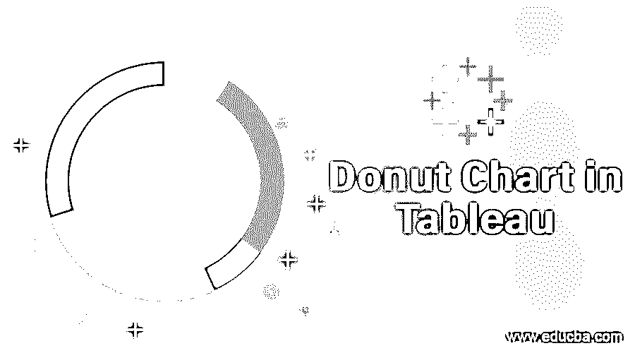

## Tableau 中的圆环图简介

在用于以有见地的方式呈现数据的各种类型的可视化中，环形图是最受欢迎的可视化工具之一。Tableau 提供了构建圆环图的功能。基本上，该功能不会直接作为现成的选项出现，但是可以使用选项的组合来构建图表。圆环图可以被认为是混合图表的类型，通过采用多种技术来构建，这些技术并不是专门为其创建而设计的。从图片上看，该图表是饼图的变体，内部有一个空白孔，使其看起来像一个环。

### 在 Tableau 中创建圆环图

在本次演示中，我们将使用分布卷数据集。这里，区域和分布体积分别是维度和度量。我们将构建圆环图来查看分布模式偏好如何基于区域而变化。

<small>Hadoop、数据科学、统计学&其他</small>

1.首先，加载必要的数据源。点击数据，然后点击“新数据源”。

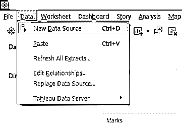

2.选择必需的数据源类型。在这种情况下，它是 Microsoft Excel。

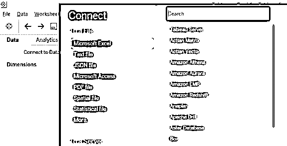

3.加载的数据如下所示。

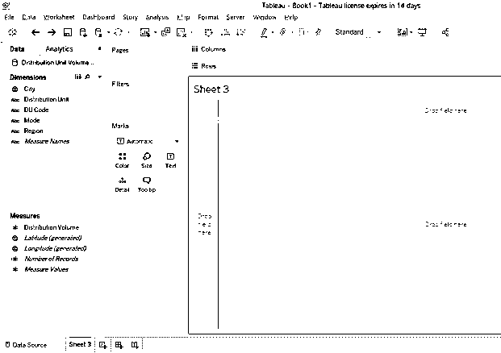

4.默认图表类型是“自动”。将其更改为“馅饼”，如下图所示。

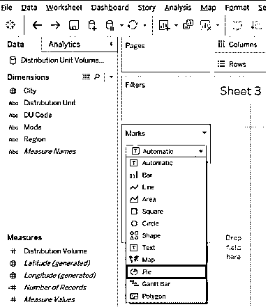

5.图表类型更改为饼图后，在标记卡中将测量分布体积拖到角度上，将模式拖到颜色上。饼图创建如下所示。

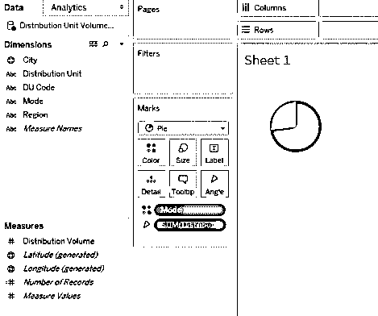

6.在饼图中，我们希望出现一个模式的百分比贡献；为此，单击 Marks 卡中的分发量下拉菜单，然后在“快速表格计算”下，单击“总百分比”，如下图所示。

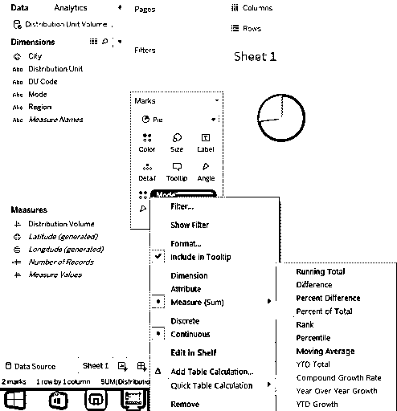

7.现在，我们到了最重要的一步。我们在测量部分有许多记录。在行区域中一个接一个地拖移它两次。可视化变化如下。

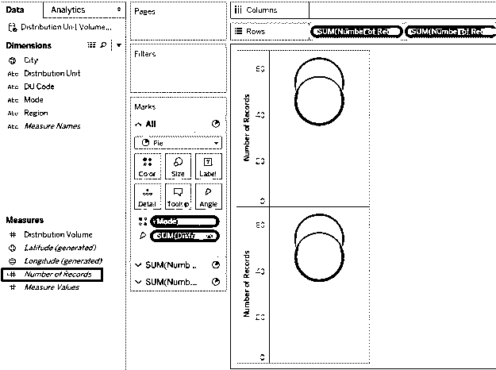

8.接下来，将记录数的聚合函数从 SUM 更改为 MIN(最小值)，如下所示。对两个记录数度量执行此步骤。

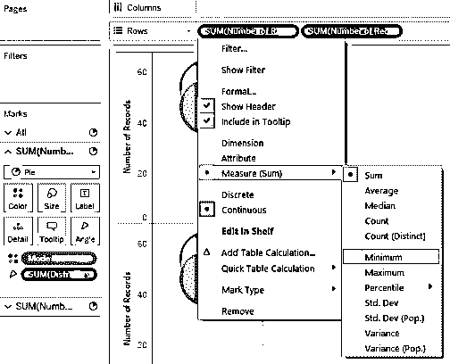

9.我们得到如下所示的两个饼图。现在，对于行区域中的第二个记录数度量，通过在其下拉菜单中选择 dual Axis 来使轴成为 Dual。

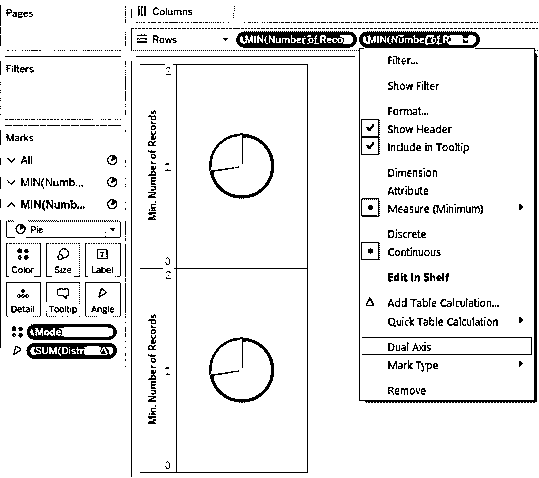

10.为第二个记录数量度量选择双轴会将两个图表相互叠加，因此它们显示为单个可视化效果，如下面的屏幕截图所示。

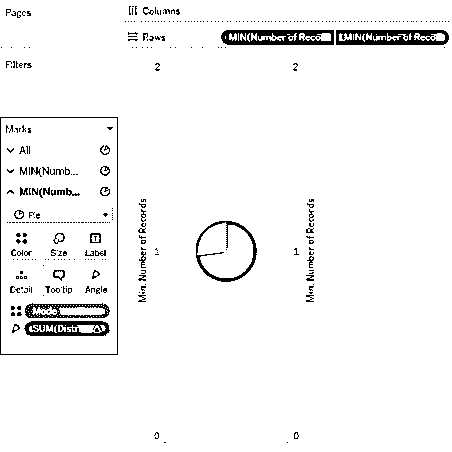

11.下一步，移除维度模式，并测量从标记卡测量的第二个记录数的分配量。我们得到一个单色饼图，如下图所示。饼图的默认颜色是灰色；改成白色，如后续截图所示。

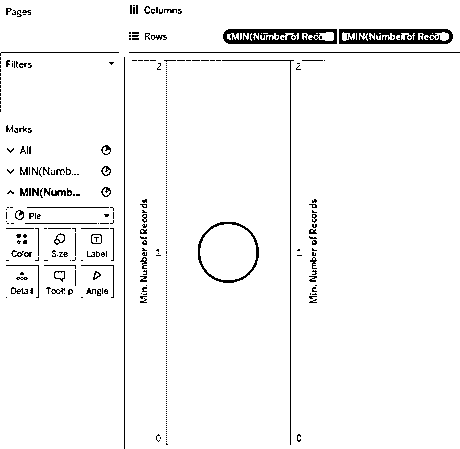

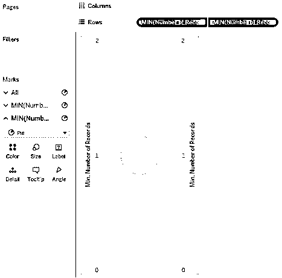

12.当两个饼图相互叠加时，根据标记卡中的大小更改饼图的大小。增大第一个记录数度量的饼图大小，而减小第二个记录数度量的饼图大小。我们得到如下所示的环形图。这个圆环图有助于我们了解一种分销模式在所有地区的总销量中所占的百分比。这里我们有两种模式，即。M1 和 L2。

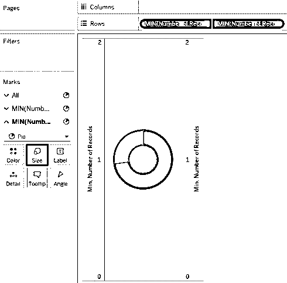

13.要获得区域式圆环图，请拖动行区域中的维区域。

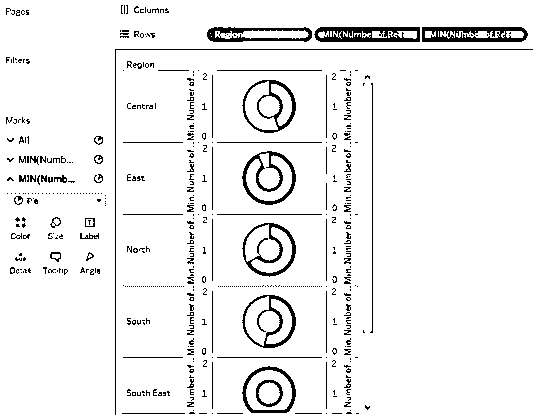

14.我们使用上述步骤成功创建了圆环图；然而，从上面的截图中可以看出，轴标签、行和列钻孔器以及网格线给可视化带来了麻烦的外观。为了克服这一点，我们将删除这些元素。为此，点击格式菜单中的边框，如下所示。

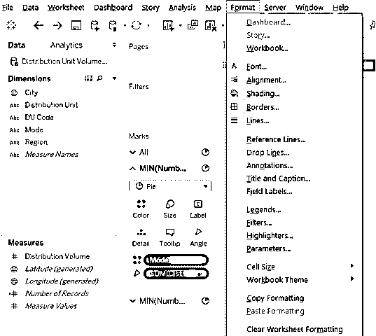

15.如下面的屏幕截图所示，在“格式边框”部分的“工作表、行和列”选项卡中，选择“窗格中的无”和“行分隔线中的标题”部分。完成后，如随后的屏幕截图所示，单击 Lines，在 Sheet，Rows，and Columns 选项卡中，为 Grid Lines 选择“None”。如果我们不希望类别标签(在这种情况下是 Mode)出现，右击标签并取消选中“显示标题”。

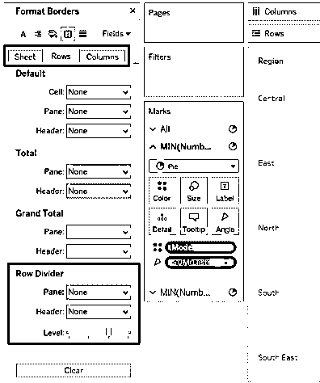

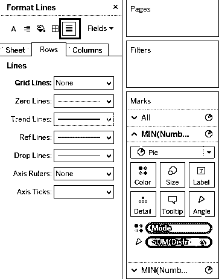

16.我们已经得到了我们想要的甜甜圈图，可以在下面的截图中看到。圆环图有助于我们了解分销模式的区域贡献。圆环图垂直放置。要进行水平排列，只需将区域维度拖到列区域中。

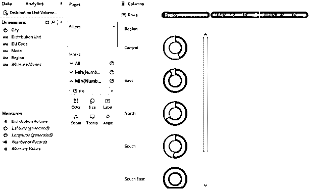

17.一旦区域维度被拖动到列区域，我们就会得到水平排列的圆环图，这使得可视化更容易理解，并且现在可以有效地进行区域间的比较。请注意，维度模式作为类别变量出现在右侧。两种对比色指示了清晰区分和快速分析的模式。颜色可以根据色卡上的颜色改变。

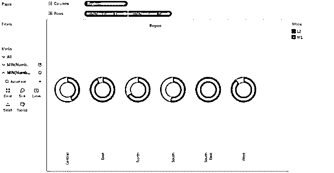

18.现在，假设我们不希望类别卡出现在屏幕上，那么在模式的下拉菜单中，单击隐藏卡，如下所示。

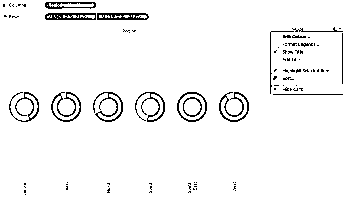

19.执行上面的步骤给了我们圆环图，如下面的截图所示。

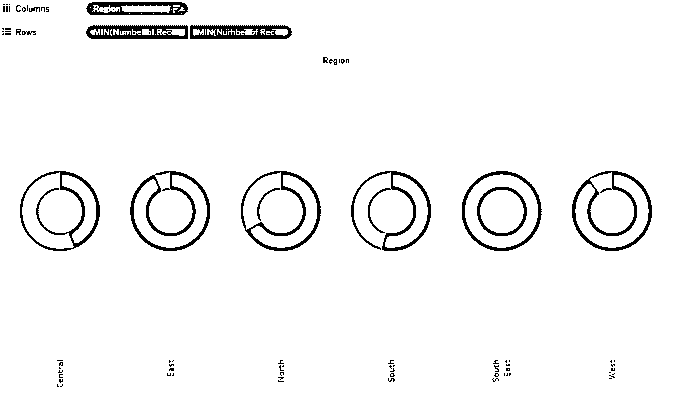

20.区域标签显示在垂直位置。要使它们水平，右键单击标签，然后单击“旋转标签”，如下图所示。

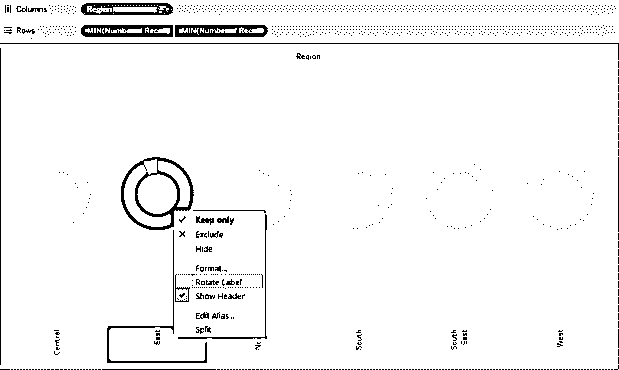

21.标签现在看起来更加系统化，可读性更强。将鼠标悬停在任何区域的环形图的一部分上会给出必要的细节。如以下截图所示，在南部地区，Mode L2 约占总销量的 54%。

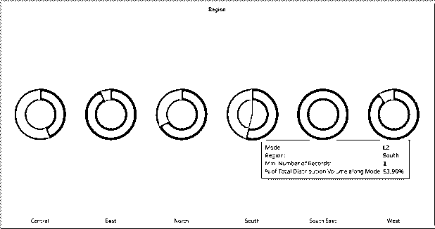

### 圆环图的重要性

圆环图类似于汽车仪表板上的各种仪表。仪表读数帮助驾驶员评估汽车性能的方式；同样，圆环图有助于跟踪与业务或活动相关的重要 KPI。基本上将饼图转换为圆环图的内部空白区域具有特殊的意义。空白处可以用来写一个有意义的、有洞察力的标签，帮助业务用户从数据中理解圆环图的洞察力。此外，与饼图相比，圆环图在视觉上更具吸引力，尤其是在比较多个类别时。

### 结论

圆环图的形状类似于圆环，是一种非常有效和强大的可视化工具，尤其是在显示多个类别的百分比贡献时。在 Tableau 中，可以构建漂亮的圆环图，这需要处理两个相似的饼图。该图表对于跟踪绩效评估非常有用。

### 推荐文章

这是一个在 Tableau 圆环图指南。这里我们讨论如何在 tableau 中创建一个圆环图及其重要性。您也可以阅读以下文章，了解更多信息——

1.  [表格中的甘特图](https://www.educba.com/gantt-chart-in-tableau/)
2.  [画面故事情节](https://www.educba.com/tableau-storyline/)
3.  [Tableau 中的气泡图](https://www.educba.com/bubble-chart-in-tableau/)
4.  [Tableau 参考线](https://www.educba.com/tableau-reference-lines/)

