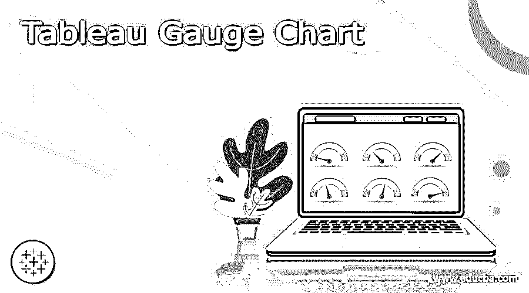
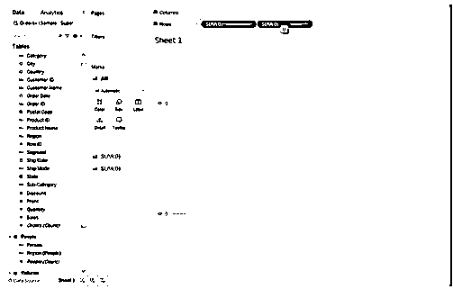
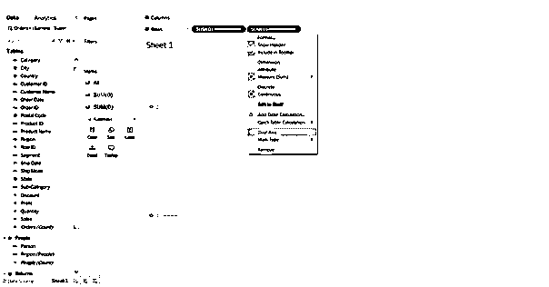
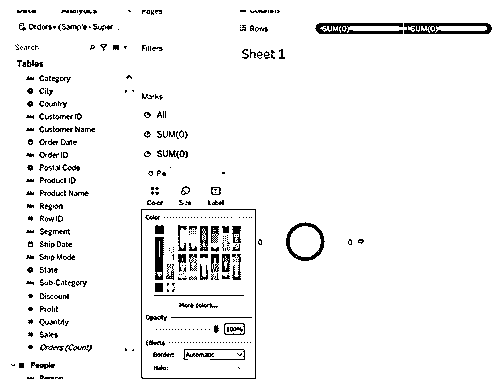
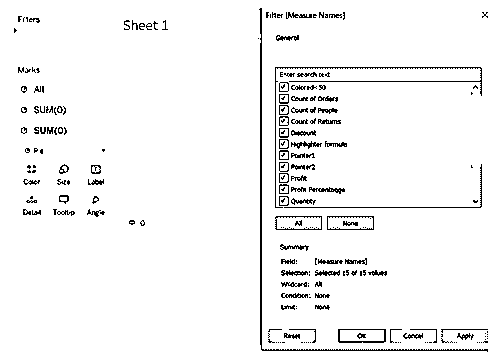
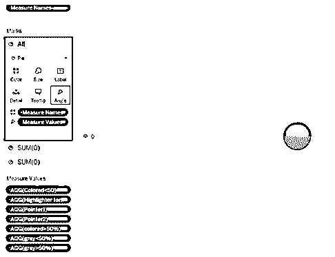

# Tableau 仪表图

> 原文：<https://www.educba.com/tableau-gauge-chart/>

## Tableau 仪表图的定义

在统计设置中，单个度量或数据元素由 Tableau 仪表图表示。仪表经常出现在行政仪表板上，通过使用指针的方向和表盘的颜色来帮助客户立即理解性能。

### 什么是 tableau 仪表图？

在 Tableau 中，仪表图类似于圆环图，圆环图类似于重叠饼图。在这种情况下，白色圆圈构成了中心区域，我们还在内部和外部馅饼上附加了一根针。仪表图最好与其他仪表图结合使用。最终消费者将能够理解关于目标的当前性能的观点。要做到这一点，了解 Tableau 中的计算字段、LOD 和圆环图是必要的。为此，需要从 Tableau 中学习计算字段、LOD 和圆环图。

<small>Hadoop、数据科学、统计学&其他</small>

### 如何创建 tableau 仪表图？

仪表图具有令人愉悦的外观。通过使用 Tableau Desktop 中的仪表图，组织可以直观地分析许多指标。速度计有助于理解商业指标的发展或价值。带有大量仪表图的仪表板有助于创建综合评估。

**创建量表的步骤:**

**包含计算字段创建的圆环图**

在台式计算机上，启动 Tableau 并将示例数据集导入用户界面。启动 Tableau 工作表，并在导入数据后建立实体之间的关系。

1.  根据需要增加列和行货架尺寸。
2.  创建一个虚拟计算字段，并将其放在值为 MIN(0)的列架上。

3.要复制计算并将其转换为双轴图表，请在单击时按住 Ctrl 键，并将药丸拖到原始图表旁边。

4.尽管这不是必需的，但出于习惯，我总是同步我的双轴。

5.通过编辑行布局和隐藏标题来删除任何不良行。

6.将右边最小(0 标记)的排序改为圆形，左边最小(0 标记)的类型改为饼图。

7.更改圆形的颜色以适合仪表板的背景，并调整大小以匹配背景颜色。此外，将其缩小以创建圆环图。完成后，通过将工作表的样式切换到整个视图，在界面上拉伸圆环。在测量名称的编辑过滤器中，只应选择我们在上面定义的 10 个 Cal 字段。此外，人们可以调整切片的颜色。

**

** 

使用我们在上一部分中创建的度量和计算字段，按照下面的说明生成一个仪表图:将度量名称放在过滤器区域中，只选择新形成的度量。分别添加第一和第二象限指针。

小倍数的计算如下所示。

列的分隔符:(Index ()-1%)百分比(Round (Sqrt (Size()))

integer((Index()-1)/(Round(Sqrt(Size())))作为行分隔符。

### 什么时候使用 tableau 仪表图？

在项目管理中，仪表图经常用于指定截止日期、模块和相关信息。量表提供了特定区域内生产率的快速指标，易于阅读和解释。可以制作 Tableau 仪表板，其中包含几个显示各种指标值的仪表图。通过各种不同颜色的动态仪表图，可以在一个集中的平台上显示许多指标。任何想要对各种指标进行深入研究的组织都可以从这种级别的信息中受益。只需使用 Tableau 仪表图来生成和修改信息丰富的分析仪表板。使用 Tableau Desktop 可以方便地创建仪表图。有了更多的知识，我们就能理解许多 Tableau 问题以及随之而来的答案。清楚地了解它们的 suc

cess，一个使业务兴旺的量表。

### 例子

从一个包含 10 个客户端及其各自百分比的样本数据文件开始，让我们开始吧。

| One | 客户 1 | One hundred and twenty |
| Two | 客户 2 | One hundred and thirty |
| Three | 客户 3 | One hundred and forty |
| Four | 客户 4 | One hundred and fifty |
| Five | 客户 5 | One hundred and sixty |
| Six | 客户 6 | One hundred and ninety |

**第一步:**

连接到数据并创建计算字段(度量、颜色)。我们需要五个额外的字段。

| **Slice1**:如果[百分比] < .5，则[百分比]ELSEIF 为 NULL([百分比])，然后为 0否则. 5结束**切片 2:**如果[百分比] < .5，则. 5-[百分比]ELSEIF 为 NULL([百分比])，然后是. 5结束**切片 3:**如果[百分比] > .5，则如果[百分比] < 1，则[百分比]–. 5 否则. 5 结束结束**切片 4:**如果[百分比] > .5，则如果[百分比] < 1，则 1-[百分比]否则 0

结束

否则. 5

结束

**切片 5:**

最小值(0)

 |

正如我们将在每个场景中看到的，我们有许多 IF 语句。这是必要的，因为我们必须记住我们正在使用的指标，以及指针是否必须可见。

**第二步:**

更改颜色以区分仪表中的度量值。将幻灯片 3 指定为白色，将其他幻灯片指定为灰色和蓝色。还必须建立一个重要的度量标准。我们将把这个值与目标值进行比较。如果需要，还可以添加标签。在添加标签之前，我们必须再次确定这些点的度数和半径。

**第三步:**

将百分比拖动到第二个轴的标签卡上以完成操作。将标签的位置调整到中间，然后调整文本的大小，直到我们准备好。仪表的构建将在此时完成。我们所要做的就是把它添加到仪表板的某个地方。

这种级别的指标可以为管理层提供关于利润增长或尚未达到的选定阈值的更准确的信息。仪表对于显示单独的 KPI 很有用，因为它们易于理解。

### 结论

这就是关于创建 Tableau 仪表图的所有信息。在许多情况下，仪表图是表示特定数据集的理想选择。例如，可以显示研究团队正在进行的工作及其完成程度。Tableau 的仪表图也可以链接到相关的数据源，以产生即时的洞察力。

### 推荐文章

这是一个 Tableau 仪表图指南。这里我们讨论了定义，什么是 tableau 仪表图，如何创建 tableau 仪表图，以及代码实现示例。您也可以浏览我们推荐的其他文章，了解更多信息——

1.  [Tableau Web 数据连接器](https://www.educba.com/tableau-web-data-connector/)
2.  [Tableau 桥](https://www.educba.com/tableau-bridge/)
3.  [Tableau BI 工具](https://www.educba.com/tableau-bi-tool/)
4.  [Tableau 仪表盘](https://www.educba.com/tableau-dashboard-with-examples/)

