# 表格中的帕累托图

> 原文：<https://www.educba.com/pareto-chart-in-tableau/>

## Tableau 中的帕累托图介绍

在本文中，我们提出了在 Tableau 中创建 Pareto 图的过程。帕累托图得名于帕累托原理，即任何事件 80%的结果来自 20%的原因*。*一般来说，我们可以说，对于任何事件，近 80%的变化来自于 20%的贡献者。这个原则有几个同义词，

*   八二十分法则
*   重要少数法则
*   因素稀疏原则

### 在 Tableau 中创建 Pareto 图的步骤

此图表(即帕累托图)内置了两种图表，一种是折线图，另一种是折线图。减少或下降的值由条形图表示，而增加或上升的数据由折线图表示。让我们从流程 4 开始。

<small>Hadoop、数据科学、统计学&其他</small>

**Note:** We have performed the process on ‘Orders – Sample Superstore’ data that comes with Tableau Desktop application.

**步骤 1:** 我们将“销售”数据拖放到“行”部分。这将给我们一个销售条形图。同样在此之后，我们将把“状态”数据从 Tableau 的“维度”部分拖放到“列”部分。这将给出一个带有销售数据(在 Y 轴上)和状态数据(在 X 轴上)的条形图。按照下面的屏幕。

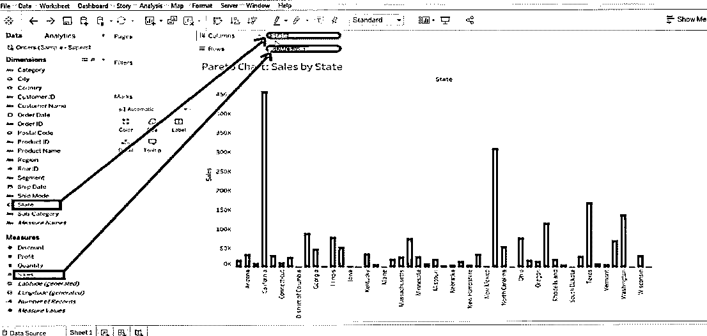

*   最好对图表进行排序(升序/降序)——我们已经按降序进行了排序。

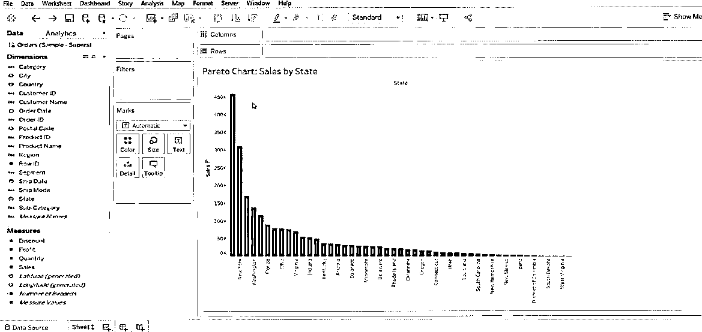

**步骤 2:** 然后转到“行”部分中的“销售”并将“快速表格计算”标记为“累计”。按照下面的屏幕。

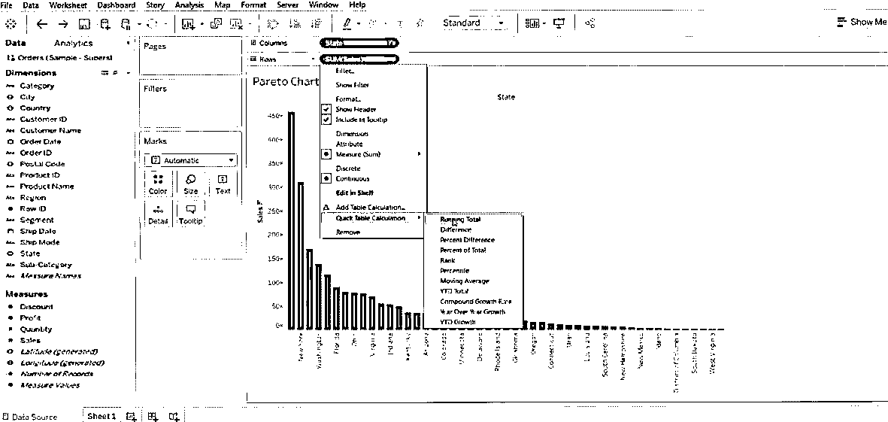

*   执行步骤 2 后，它将显示在下面的屏幕上。

**第三步:**现在，遵循同样的程序，即>销售>编辑表格计算。

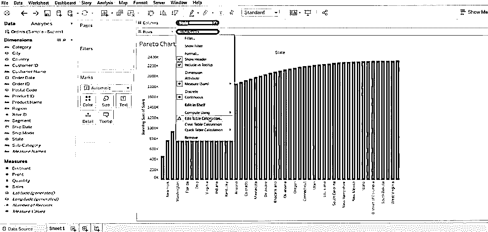

*   在这里，我们尝试按照“特定维度”和“计算类型”对表格进行排序。这样，我们将得到一个升序类型的数据模式。

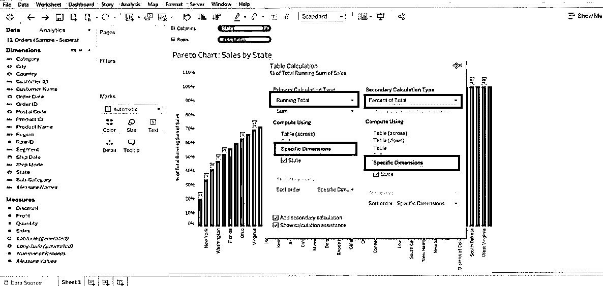

**步骤 4:** 现在我们必须创建一个新的计算字段，这可以通过右键单击“测量”部分> >“创建计算字段”来完成。这将在屏幕上显示一个计算对话框，我们必须根据自己的方便对其进行重命名并创建函数。

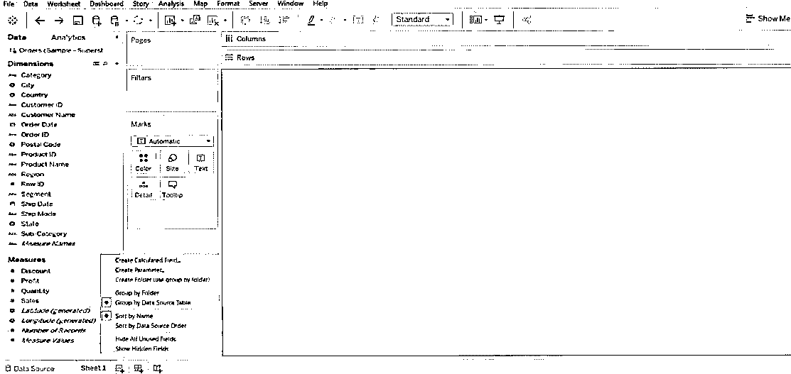

*   我们已经创建了这个函数-Index()/Size()，然后单击 OK 按钮。

**步骤 5:** 之后，我们必须将这个新创建的字段从“Measure”部分拖放到“Column”部分。一旦你做到了这一点，你必须做出一些改变。通过> >状态的‘计算使用’编辑该计算字段。之后，将“状态”从“列”拖动到“标记”部分，并将条形类型更改为“线”。这将给出工作数据的折线图。

同样，我们必须“格式化”数据，下面我们列出了我们执行的一些格式化。

*   图表> >格式> >数字(以百分比计)> >无小数。

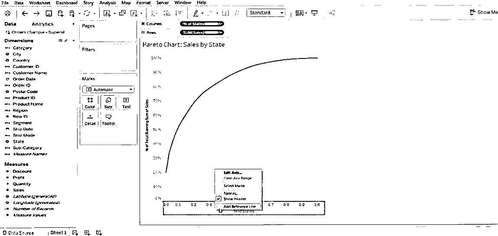

*   图表> >添加参考线> >值(. 2)和(常数)> >单击确定–对于 y 轴。

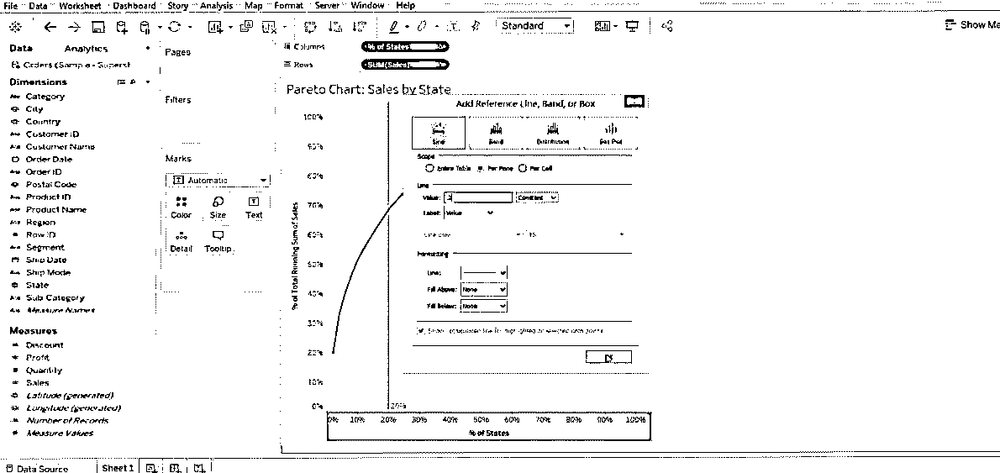

*   图形> >添加参考线。

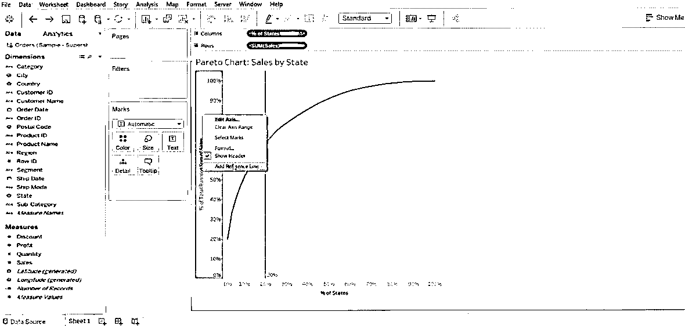

*   值(. 8)和(常数)> >单击确定–对于 x 轴。

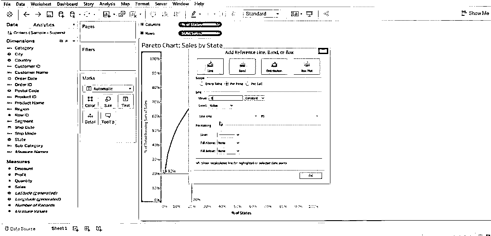

*   这样，我们在 X 和 Y 轴的 0.8 和 0.2 处得到一条参考线。请参考下面的屏幕。这是一个基本的帕累托图。

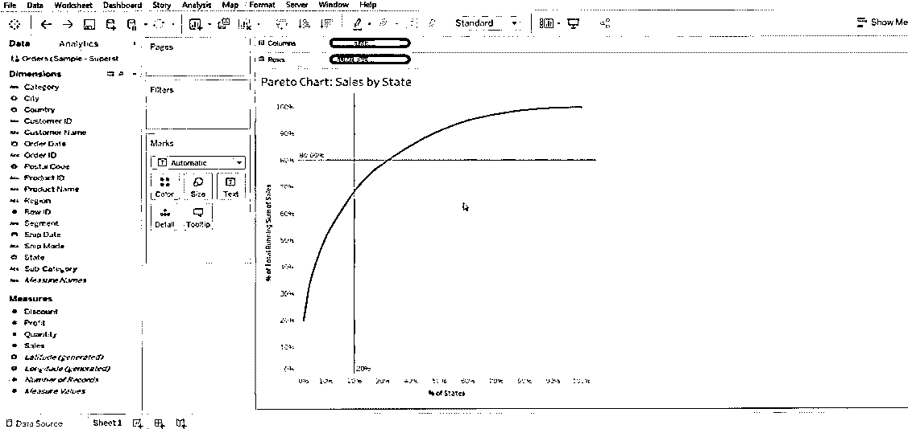

*   现在，我们必须进一步定制它，我们将再次把“销售”从“测量”部分拖到“行”部分。这将为我们提供多个图表，请参考下面的屏幕。

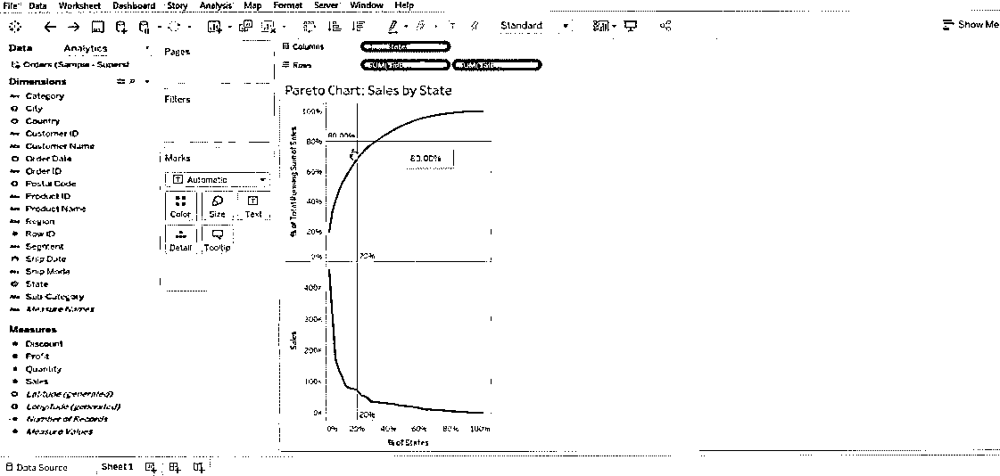

*   现在，我们将右键单击底部的图表，并选择“双轴”。

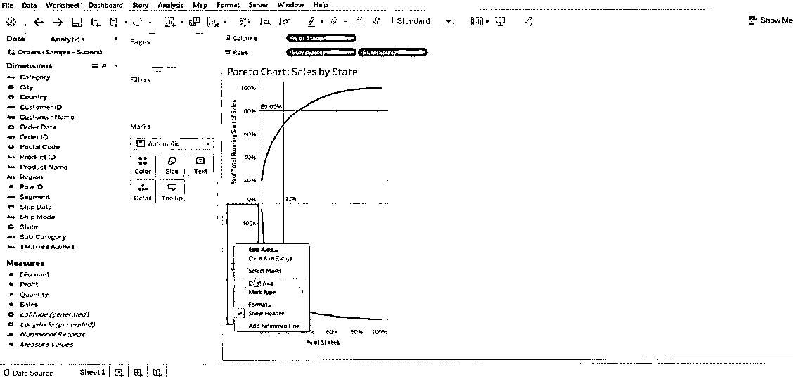

*   更改条形图的类型(即总销售额 1 和总销售额 2)。

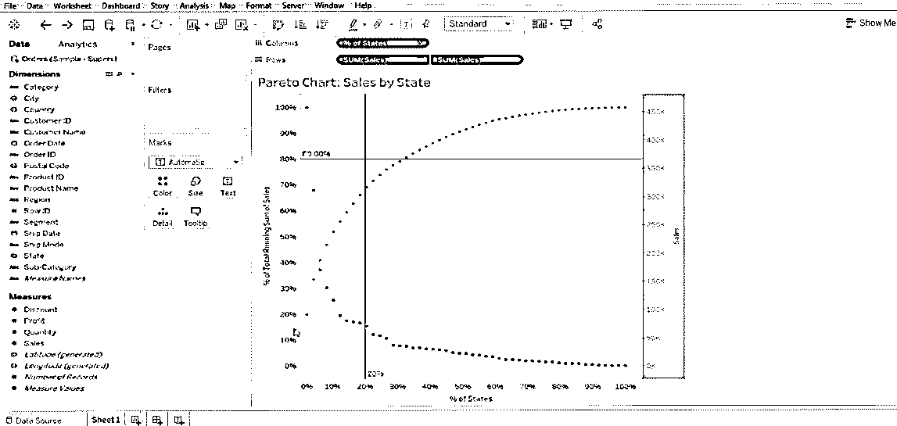

*   一个做线条图，另一个做条形图。

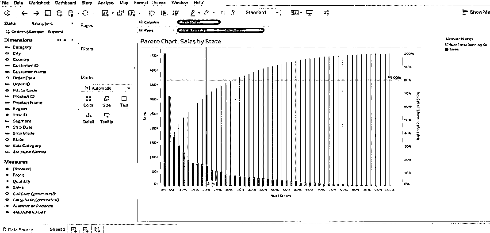

**Note:** This is how we create Pareto in Tableau. We also like to mention that data has varying complexity and also the chart. We have layed down the standard method to create a chart – the user can customize (means add color, details, axis, parameters) it as per his need.

### 总结流程步骤

1.首先，我们必须将数据库连接到 tableau。

2.将“第一次测量数据”从维度部分带到列部分。

3.将“第二次测量数据”从数据的测量部分带到行部分。

4.按照子类别对列进行排序，后面是下面讨论的一些格式，

*   选择降序排序。
*   在排序依据列下选择字段类型。

5.其他值保持不变。

6.最后，单击 OK 按钮退出排序选项。

### 帕累托图在 Tableau 中的重要性

Pareto 非常适用于任何类型的业务映射。了解任何业务流程中的绩效的高效技术。我们已经列出了采用 Pareto 来获得更好的业务数据可见性的一些好处。

*   以图形方式总结一组数据相对重要性的图表。
*   这是一个非常有用的工具，可以帮助你集中精力解决业务中的大问题。
*   该图表主要用于获取最关键的业务问题之一——哪些领域在业务中产生了更多问题？它只是意味着要更加专注。
*   它解决了这个问题——20%的投入创造了 80%的收益或问题。
*   它以%年龄值给出输出；它形成采取必要行动的有效数据。
*   它是可重复使用的，一旦我们改变数据(Tableau)可以定制。

### 结论

关于帕累托数据分析方法的结论思想非常有效，尽管它可能不适合于解决业务关键问题的每一种情况。它有助于分配时间、资源和精力。帕累托是对你的业务数据的一种观察，而不是一个定理或任何类型的定律。

### 推荐文章

这是一个引导帕累托图的表格。在这里，我们讨论在 tableau 中创建 Pareto 图的介绍和步骤及其重要性。您也可以阅读以下文章，了解更多信息——

1.  [如何在 Tableau 中创建甘特图？](https://www.educba.com/gantt-chart-in-tableau/)
2.  [圆环图在 Tableau 中的重要性](https://www.educba.com/donut-chart-in-tableau/)
3.  [使用 Tableau 中的 Rank 函数](https://www.educba.com/rank-function-in-tableau/)
4.  [不同类型的 Tableau 数据集](https://www.educba.com/tableau-data-sets/)
5.  [表格中枢轴的完整指南](https://www.educba.com/pivot-in-tableau/)
6.  [Tableau 特性和属性介绍](https://www.educba.com/tableau-new-features/)
7.  [如何创建 JavaFX 条形图](https://www.educba.com/javafx-bar-chart/)
8.  [如何在 Tableau 中创建群组？](https://www.educba.com/group-in-tableau/)
9.  [Tableau 双轴|如何应用？](https://www.educba.com/tableau-dual-axis/)

