# Tableau 中的瀑布图

> 原文：<https://www.educba.com/waterfall-chart-in-tableau/>

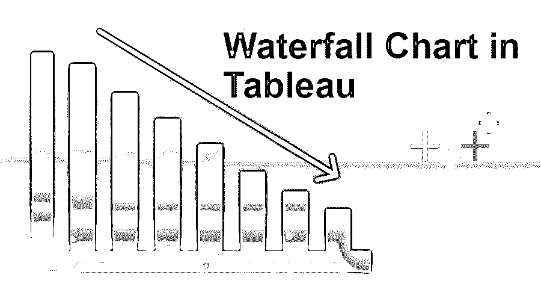

## Tableau 中瀑布图的介绍

Tableau 中的瀑布图是 Tableau 应用程序可以构建的不同图表中的一种。每个图表都有它自己的意义，我们将在导入部分讨论，但是在我们开始在 Tableau 中制作瀑布图之前，我们将向读者呈现一个场景。这个问题陈述将帮助他们理解瀑布的适用性。

**场景**–你有一家经营良好的商业企业，你需要分析你的业务数据并获得准确的损益表。时间段可以从一周到一个月或者甚至一年变化。

<small>Hadoop、数据科学、统计学&其他</small>

### Tableau 中瀑布图的处理

1.准备好您的数据；在本文中，我们创建了一个样本数据集。通过打开>>数据源将数据拉入 Tableau 应用程序。

**注意**–我们在本文中已经提到了项目 v/s 利润瀑布图。我们将根据给定的项目来衡量利润。

2.在 Tableau 应用程序中设置好数据集后，选择 SUM 类别，然后在 Rows 部分进行拖放，如下所述

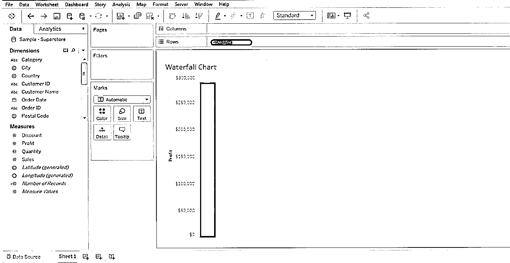

3.一旦你会做，你就可以看到盈利的条形图(蓝条)。

4.然后，您必须在仪表板的“列”部分拖放子类别(或项目名称)——看看下面的屏幕。子类别是一个测量维度，它是一个项目列表。

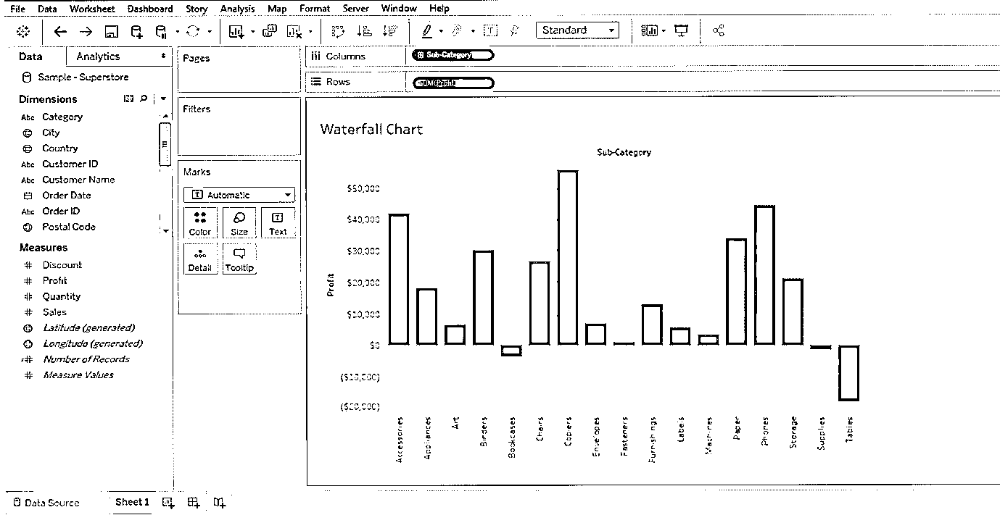

5.这样，图表的基本布局就准备好了，但这不是 Tableau 中的瀑布图，而是条形图。从现在开始我们必须控制它的形态。让我们看看事情如何发展——

6.现在，我们必须对图表进行某些更改，以使其显示“累计”详细信息。为此，我们必须右键单击“行”部分中的“SUM ”;您将获得“快速表格计算”，然后是“累计”。

因此，SUM >>快速表计算> >运行合计

遵循下面提到的屏幕–

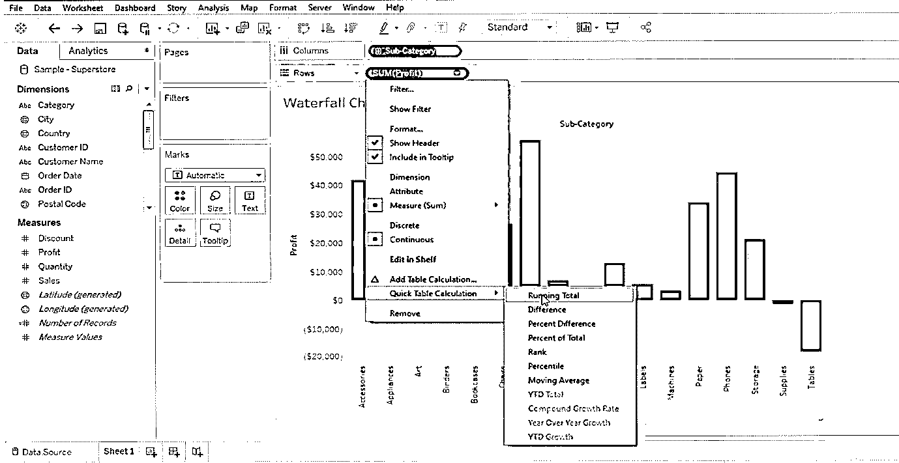

7.一旦您在图表中进行了这些更改，您将会看到类似下面提到的屏幕。

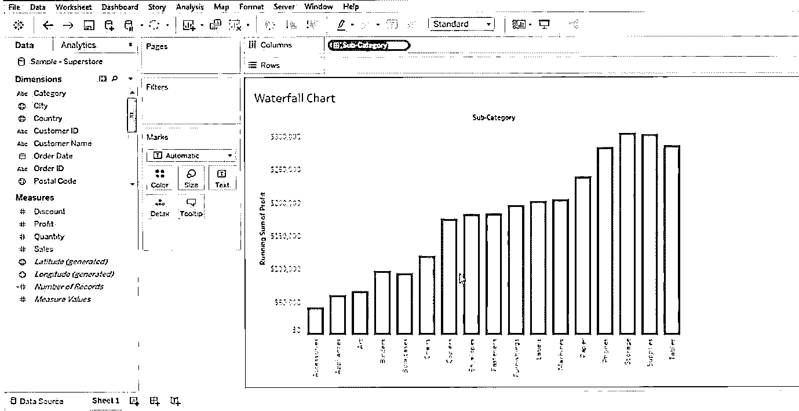

8.以上屏幕是所选项目列表的运行总计屏幕。

9.接下来要做的就是将这个图表转换成 Tableau 中的瀑布图；为此，我们将导航至控制面板的“标记”部分。“标记”部分在左手边。标记部分包含所有的数据增强技术。

*   颜色
*   大小
*   文本
*   详述
*   工具提示

10.我们必须点击“标记”下拉菜单按钮，并选择“甘特图”。请参考下面提到的屏幕。

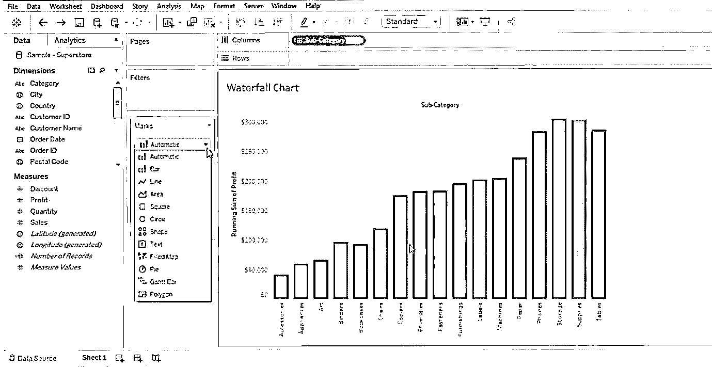

11.这样，您将获得数据的甘特图视图，但需要进行一些修正。让我们先看看下面屏幕中的甘特图——

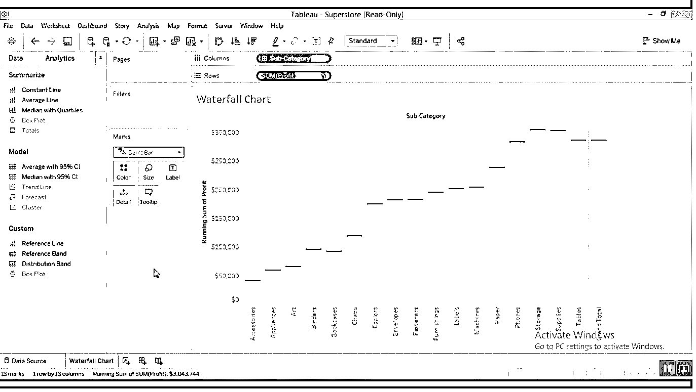

12.现在，我们需要将条形图(或数据)放在甘特图的顶部。为此，我们需要做一个简单的调整。我们需要创建一个计算好的度量；为此，我们必须右键单击“数据”字段的任意位置。之后，您必须选择“创建计算字段”。请参考 Tableau 中瀑布图的下方屏幕

**注意**–我们可以看到红色矩形中的“数据”和“分析”部分。

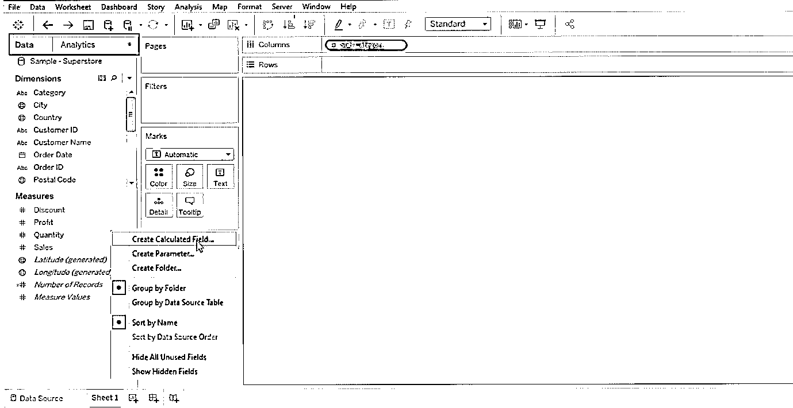

因此，我们必须右键单击“数据”列。

13.选择“计算字段”后，您将看到一个对话框，我们必须在其中对其进行重命名(通常选择一个相关的名称，如负利润)。这是对实际值的响应，然后单击“确定”按钮。参考下面的屏幕–

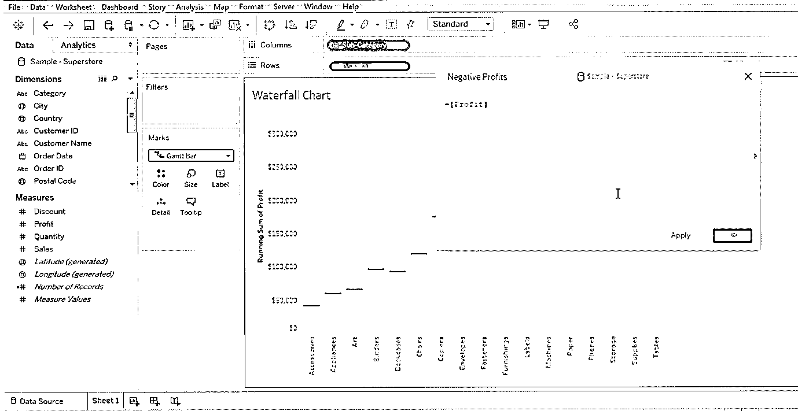

14.现在，您必须将“负值”参数(您刚刚创建的-参考上面的屏幕)拉至“大小”(位于标记部分)。您刚刚创建的这个“负值”将出现在“数据”部分。

**注意**–您只需将这个新创建的“负值”拖放到“大小”部分(用标记表示)。

请参考下面的屏幕，以便更好地理解–

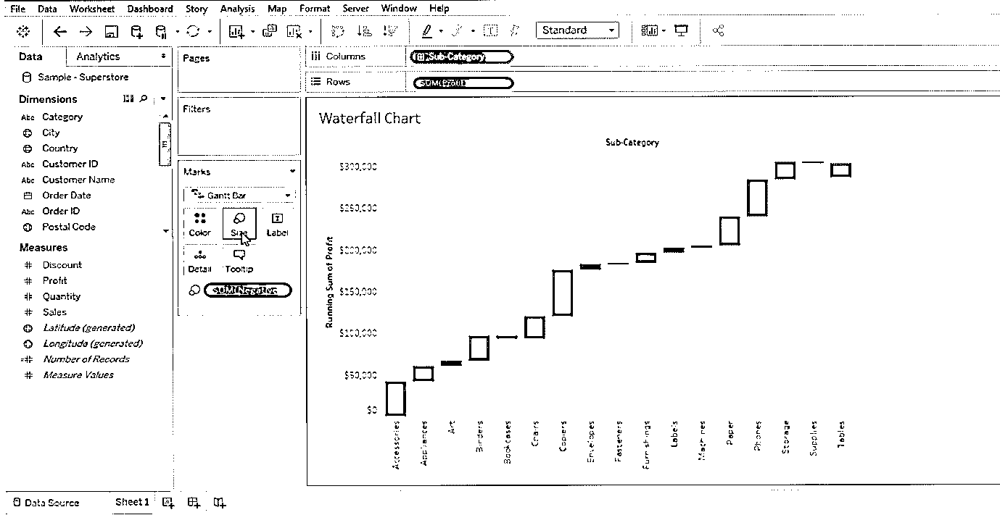

15.以上屏幕中显示的数据是一个甘特图视图。如果将光标悬停在甘特条形图上，可以看到与每个甘特条形图相关的正值/负值。图表本身就是一个很好的例子；人们很容易理解为什么这个图表被称为瀑布图(仅仅因为数据代表一个单一的值-+ve/= ve)。请参考下面的数据标记屏幕

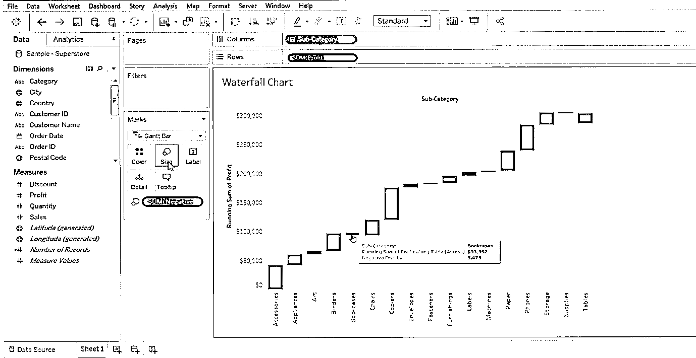

这就是 Tableau 中的瀑布甘特图。我们喜欢说，这只是瀑布图的基础，因为没有两个图表是相似的，而且，图表定制因人而异。

### 瀑布图在 Tableau 中的重要性

1.他们在相关方内部充当信息媒介。

2.团队之间的一种交流方式

3.一种更好地洞察业务数据的方法

4.数据可视化技术

5.帮助获得净值、累计值、利润值、损失值

6.这些图表在人口控制、出生率、死亡率、商业利润/损失、超市等几个方面有不同的适用性。

### 结论

这就是我们如何在 Tableau 中创建瀑布图；这些图表有时也被称为飞行图或桥牌图。总的来说，它们是研究商业兴衰的一个很好的方法。

### 推荐文章

这是 Tableau 中的瀑布图指南。在这里，我们讨论了它的基本概念，重要性，以及在 Tableau 中创建瀑布图的过程。您也可以阅读以下文章，了解更多信息——

1.  [什么是 Tableau？](https://www.educba.com/what-is-tableau/)
2.  [如何安装 Tableau](https://www.educba.com/install-tableau/)
3.  [瀑布模型](https://www.educba.com/waterfall-model/)
4.  [Tableau 中的堆叠条形图指南](https://www.educba.com/stacked-bar-chart-in-tableau/)

