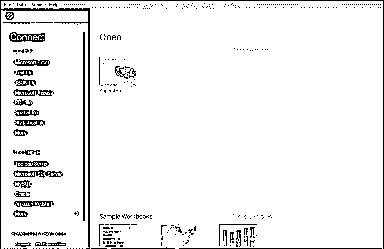
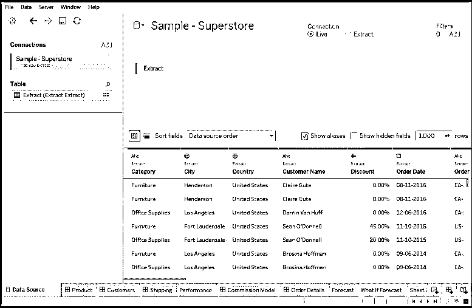
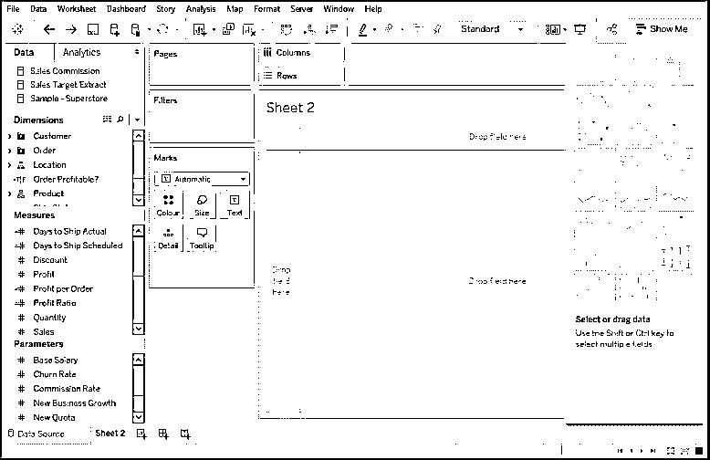
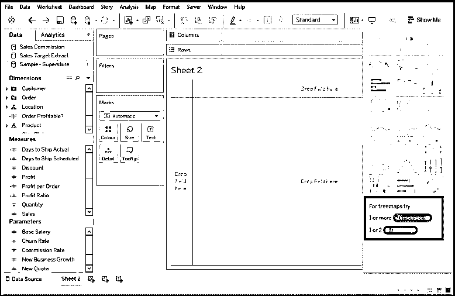
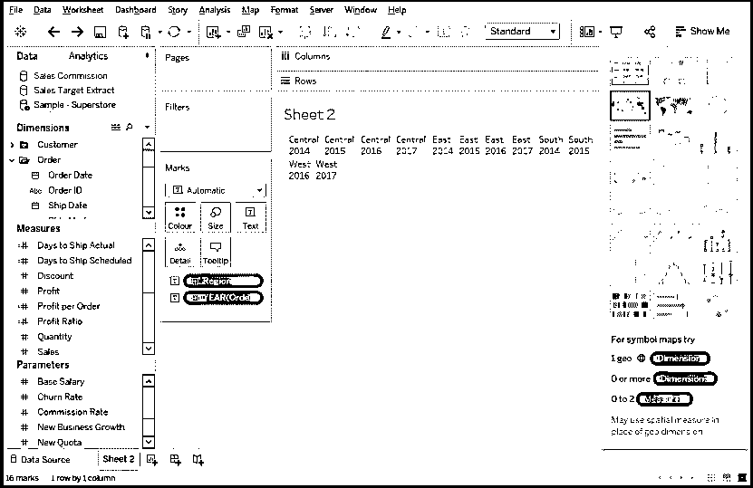
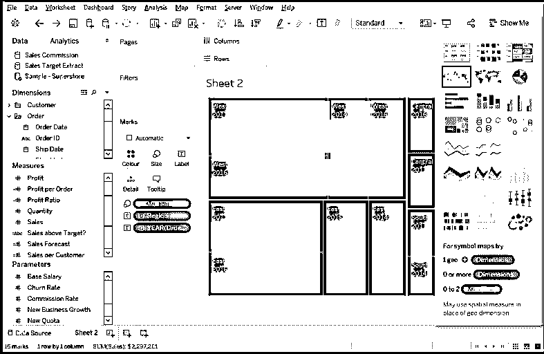
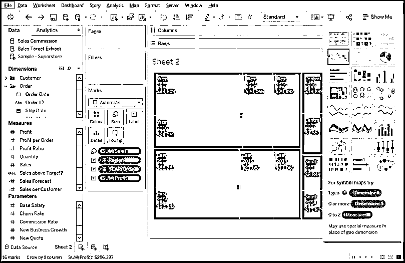
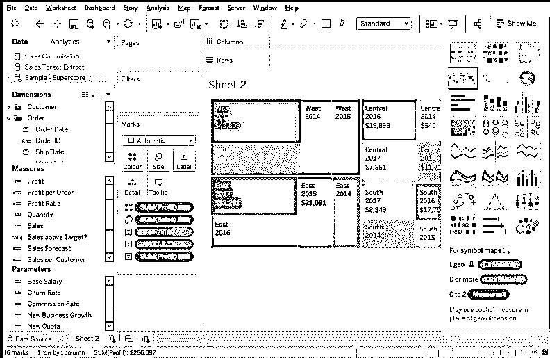
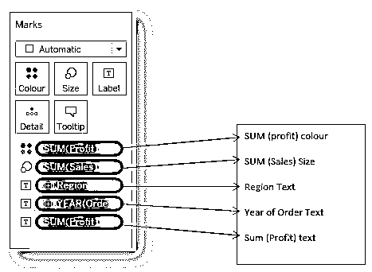

# Tableau 中的树形图

> 原文：<https://www.educba.com/treemap-in-tableau/>

## Tableau 中的 Treemap 简介

Tableau 中的 Treemap 是一种基本的图表类型，由嵌套的矩形框表示。该图表对于可视化的大型数据集非常有用。树形图是可以标记层次数据以便进行比较分析的图形。树形图是分析数据集中异常的重要图表。树形图有一些限制，例如它向用户提供非常有限的定制特征，并且它在表示数据范围时效率不高。向 Tableau 中的树形图添加适当的标签、颜色、大小和命名约定是一个很好的做法，可以创建更有意义的可视化效果。

### Tableau 中 Treemap 的优势

好处如下:

<small>Hadoop、数据科学、统计学&其他</small>

*   这个图表对于大量的数据非常有用。当数据增加时，理解它的问题也增加了。树形图不存在这样的问题，因为相关的标签与它所代表的数据相关联。
*   当你想在一个视图中传达和使用大量的标记时，树形图是非常有效的实践。有了这个重要的行为，用户可以很容易地发现模式和它们之间的关系，否则是不可能的。
*   嵌套在树状结构上的分层数据表示技术。

### Tableau 中 Treemap 的用例

一个工具/实践/技术有着相似的重要性，知道什么时候使用它同样重要。因为每个图表都有一个工作范围，所以让我们看看树状图在哪里有其重要性，以及如何

*   只有当你必须处理任意两个数量值时。
*   只有当你有一个非常巨大的分层数据与空间来决定。
*   如果您希望获得一个或多个工作数据类别中的异常和相似之处的快速和高水平的摘要。

### 处理

我们将构建一个树形图，描述在特定年份发生的无利润和无销售，以及相关的利润比率。

为此，我们需要以下数据

*   地区
*   订单年份
*   销售数量
*   利润比率

这就是空白的 [tableau 仪表板](https://www.educba.com/what-is-tableau-dashboard/)的样子，作为用户，我们必须将 tableau 应用程序连接到数据集。请参考下面提到的屏幕。

您可以在主要部分(黑色区域)看到，该应用程序预装了一个“超级商店”数据集。我们将在这个数据集上构建一个树形图。

单击示例超市数据集，您将看到如下所示的屏幕

样本超市已完全加载，在屏幕底部，我们可以看到列出了多个选项卡，这些选项卡是数据集的内容。这是一种工作数据的参考图表。现在，我们将制作自己的树形图，一旦我们在控制面板上制作了一个新的工作表，您将会看到如下所示的屏幕

**注意—**树形图只考虑和处理二维数据。我们可以在上面的屏幕左侧看到“尺寸”、“测量”和“参数”部分。所有这些都包含不同形式的数据或数据测量技术。如果你看到下面的屏幕，你会知道对于一个树形图，我们至少需要 1 个维度和 2 个度量。

我们的下一个任务是从 Dimension and Measure 部分拖放数据。从这里开始实际的图表创建。

我们希望我们的图表在基础上有年份和地区的细节。因此，我们将订购日期的地区和年份拖放到“文本”中。一旦我们这样做，我们将得到下面的屏幕。

在上面的 Tableau 中的树形图中，我们可以清楚地看到地区细节(如中部/东部/南部/西部)和订单年份细节(如 2014、2015…2017)。

现在，我们将通过将“Sales”拖放到“Size”部分(位于标记下方)来将销售详细信息添加到图表中。请参考下面提到的屏幕。

现在，我们将“利润”添加到图表中，然后图表将显示特定地区在特定时间内给定的销售数量所获得的利润。

这是树形图的基础，但我们希望按照颜色对利润进行排序。为此，我们必须将“利润”拖放到“颜色”标记部分。看看下面提到的屏幕。

“标记”部分的数据说明了它们将反映的细节类型。看一看——

这就是我们如何在 tableau 中制作树形图，可以根据需要进行一些定制，但整体过程是相同的，拖放工作数据。

### Tableau 中 Treemap 的局限性

以下是一些限制:

*   树形图无法显示不同范围的数据。
*   我们已经看到了我们在案例中使用的两个定量变量(即国家和 GDP ),树形图的限制是不能容忍负值或参数。
*   没有向用户提供关于图表的排序选项。
*   不适合打印，因为它包含大量数据点。
*   用户的定制选项非常少。

### 结论

因此，当您必须显示工作数据的累计总数时，树状图是首选。创建图表时，您还可以包含日期、时间、名称和预算等标签。

### 推荐文章

这是 Tableau 中的 Treemap 指南。这里我们讨论了 Tableau 中 Treemap 的概念和过程、用例、优点和局限性。您也可以阅读以下文章，了解更多信息——

1.  表格 vs QlikView
2.  [表格中的热图](https://www.educba.com/heat-map-in-tableau/)
3.  [HashMap vs TreeMap |最大差异](https://www.educba.com/hashmap-vs-treemap/)
4.  [Java 散列表指南](https://www.educba.com/hashmap-in-java/)
5.  [Java 中的 TreeMap 是什么？|构造函数和方法](https://www.educba.com/what-is-treemap-in-java/)

