# Tableau 双轴

> 原文：<https://www.educba.com/tableau-dual-axis/>

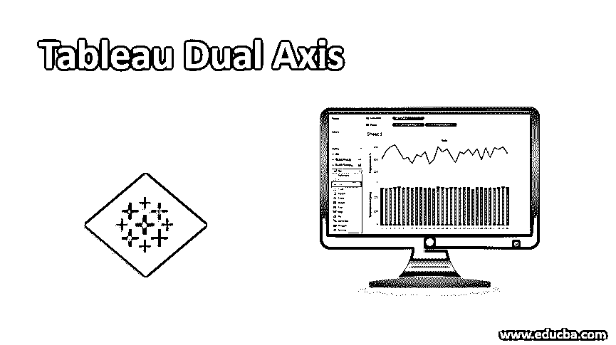

## Tableau 中的双轴介绍

双轴指的是我们在同一个图形上有两个轴。轴是任何图形的一个非常重要的组成部分，它代表了创建可视化所基于的量化度量。在某些情况下，我们可能打算同时分析多个度量。将它们绘制成不同的图形可能没有那么深刻的见解，并且从这些见解中得出合适的含义可能并不容易。双轴克服了这些问题，因为它能够在同一地块上显示多个测量值的图形。Tableau 允许以非常简单的方式应用双轴。

### 如何在 Tableau 中应用双轴？

为了理解如何应用双轴以及与之相关的其他特性，我们将进行以下演示。这里使用的数据集包含一个月的每日温度和降水数据。利用双轴概念，我们将尝试研究温度和降水的日变化模式。这可以通过使用双轴来实现。数据集中呈现的度量是“以%为单位的降水量”和“以摄氏度为单位的温度”，而城市和日期是维度。

<small>Hadoop、数据科学、统计学&其他</small>

现在让我们来理解双轴是如何应用于有意义的分析的。如下一节所述。

**步骤 1:** 首先将所需的数据集加载到 Tableau 中。为此，点击数据菜单，并在其下，点击“新数据源”选项。或者，用户也可以通过点击“连接到数据”来加载数据源。

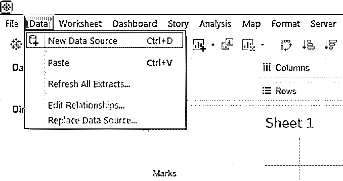

**第二步:**选择需要的数据源类型。在这种情况下，它是 Microsoft Excel。如下图所示。

**步骤 3:** 数据被加载，并可以在“数据源”选项卡中看到。在进行分析之前检查数据。下面的截图显示了这一点。

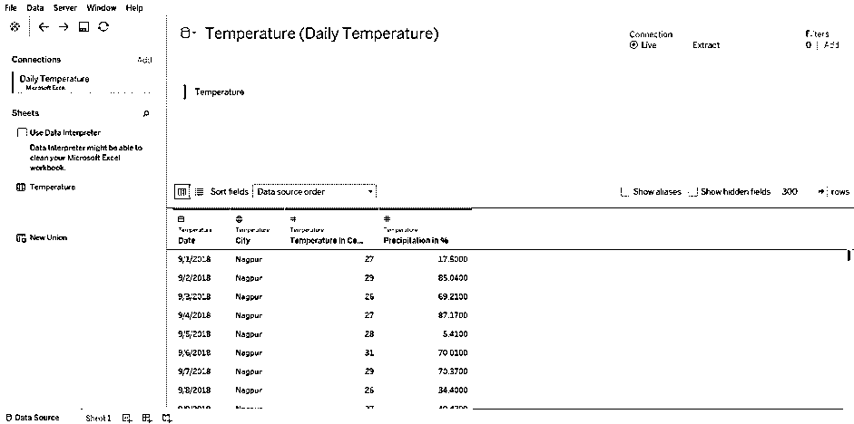

**步骤 4:** 转到工作表标签，您可以找到必要部分中的尺寸和尺寸，如下所示。

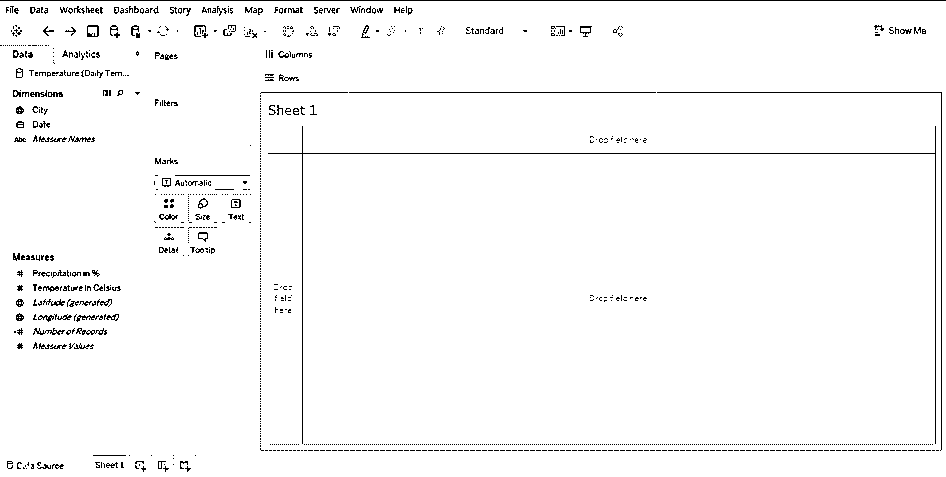

**步骤 5:** 首先将日期维度拖到列区域，或者双击它。如下面的屏幕截图所示，YEAR 函数自动应用于 Date 维度。

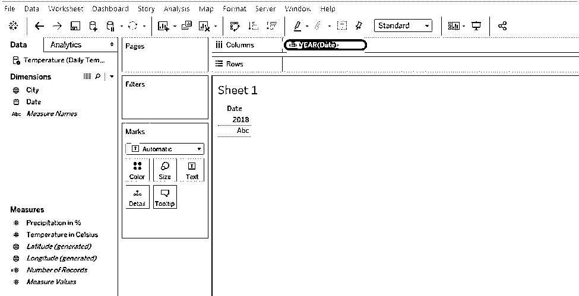

**第 6 步:**我们希望按天生成图表。因此，为了更改自动应用的 YEAR 函数，如上所示，单击 Columns 区域中 Date 维的下拉菜单。从菜单中选择“日”功能，如下图所示。

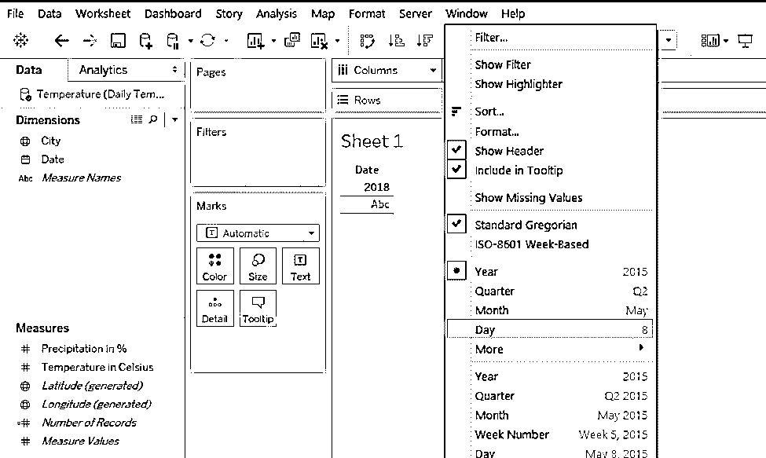

**第 7 步:**当应用 Day 函数时，如下面的截图所示，出现日数据。

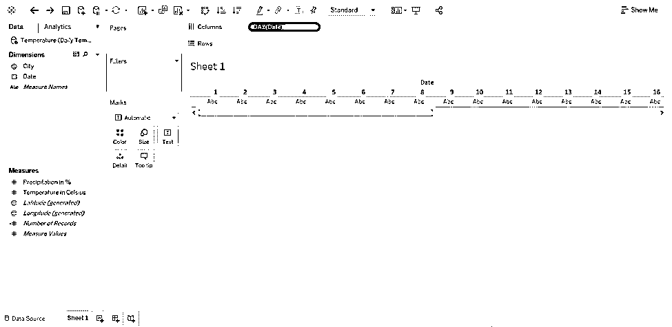

**步骤 8:** 现在，我们将把“降水量%”和“温度摄氏度”纳入分析。只需双击它们，我们就会得到一个表，给出这两个度量的日期值。如下图所示。

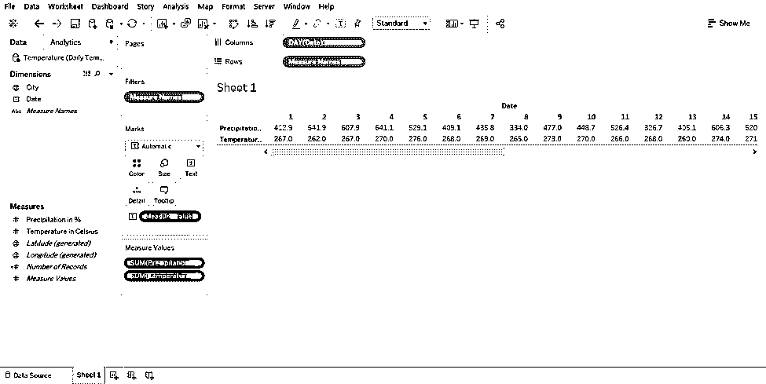

**第 9 步:**为了创建上述数据的可视化，请转到“演示”。在“演示”中，单击“水平条”符号。

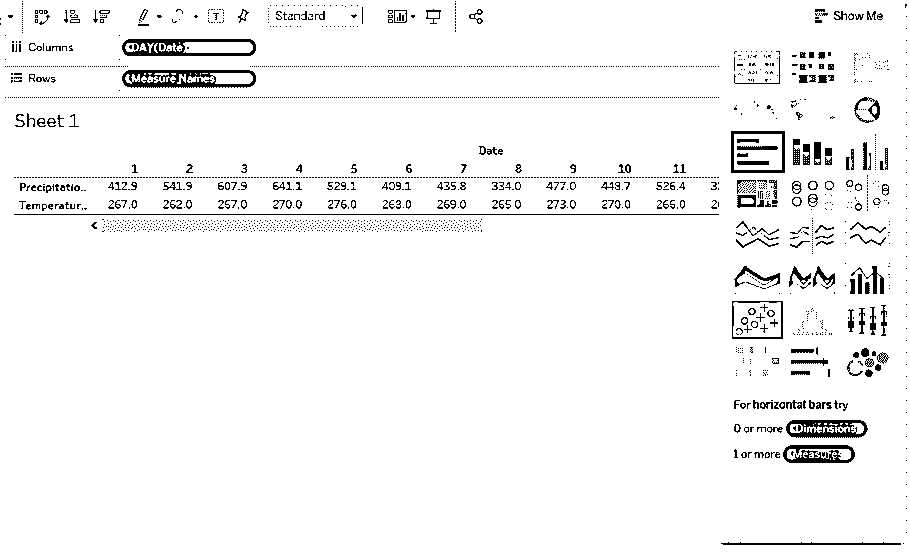

**步骤 10:** 按照上面的步骤生成两个水平条形图，如下面的截图所示。

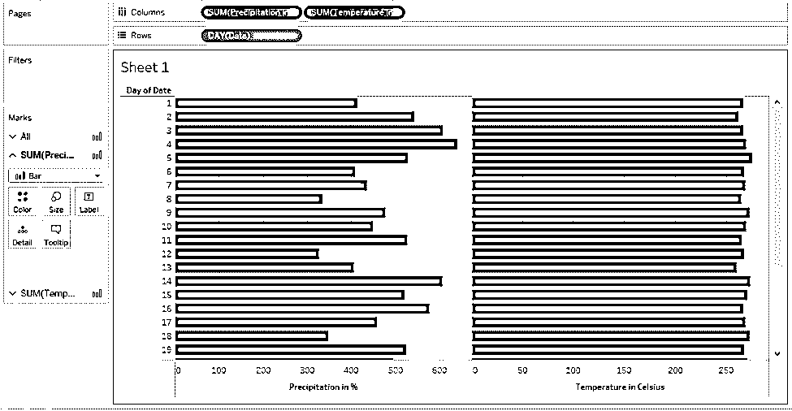

**第 11 步:**研究上面截图中的条形图比较困难。我们将使用 Ctrl + W 命令将它们转换成垂直条形图。垂直图表如下所示。现在，图表更好地展示了洞察力。

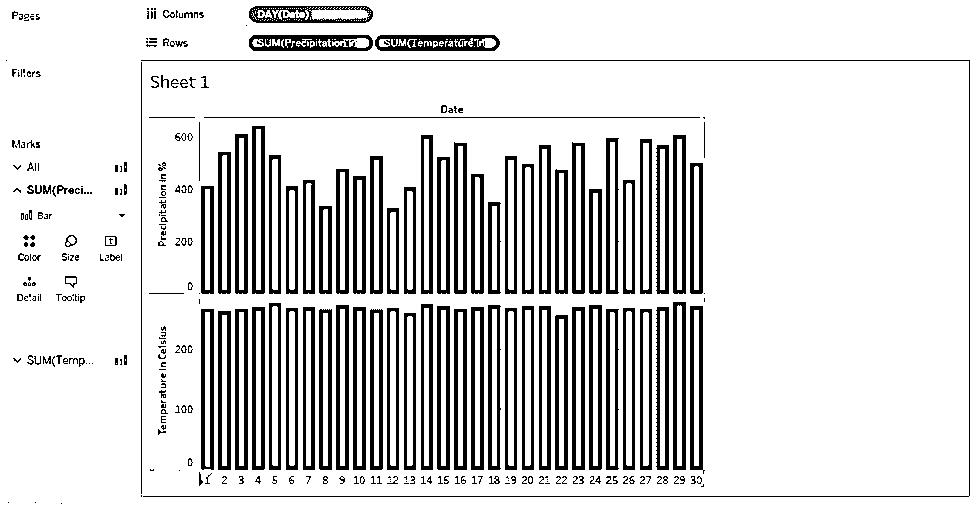

**第 12 步:**如上图所示，条形图可以更好地捕捉洞察力。然而，为了分析温度与降水趋势，折线图是最有效的。我们将把横坐标转换成折线图。这很简单。只需从 Marks 卡的菜单中将两个图表的类型都更改为“线条”。这在下面的截图中突出显示。

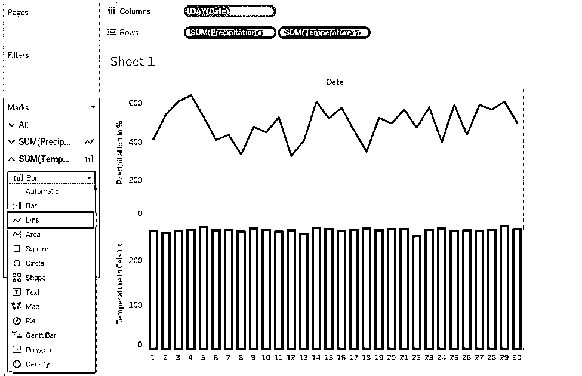

**步骤 13:** 按照上面的步骤，我们会得到下面截图所示的折线图。它们呈现为两个不同的图形，很难分析度量的模式。使用双轴，我们可以比较每日温度与降水趋势。

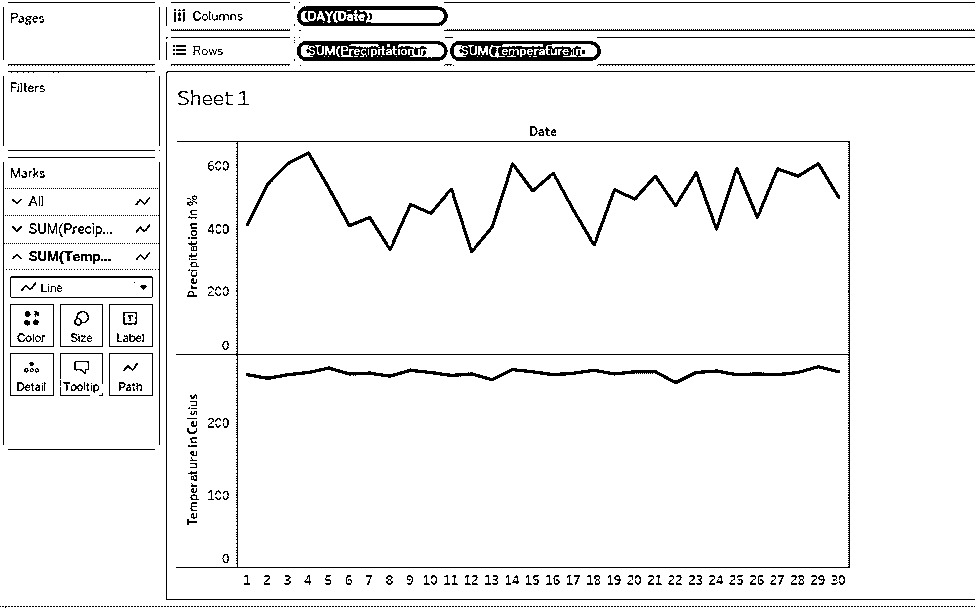

现在，我们将创建一个双轴。这里需要注意的非常重要的一点是，可以为行区域中两个度量值中右侧的度量值创建双轴。就像在这种情况下,“摄氏温度”出现在右侧，因此，我们可以为它创建一个双轴。为了有一个双轴，只需点击下拉菜单中的措施。从菜单中选择“双轴”。下面的截图说明了这一点。

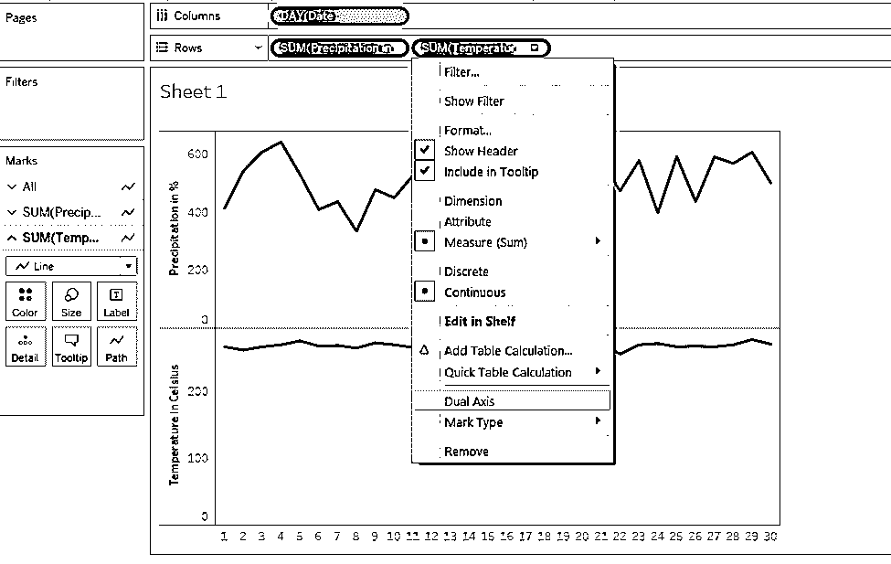

**步骤 15:** 我们已经成功创建了一个双轴，如下图所示。这里需要注意一些重要的事情:代表两个不同指标的双线图表显示为通过不同颜色表示的两个不同类别。这些类别出现在屏幕截图的右侧。已经为“摄氏温度”度量生成了一个次轴。这可以在图的右边看到。请注意，根据特定测量的值范围，决定轴的最大值。

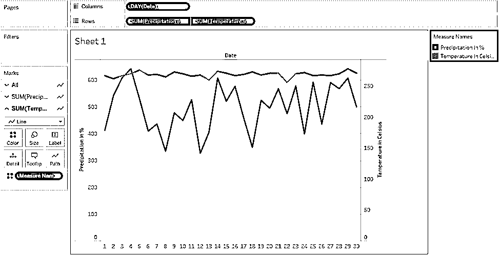

*   主轴和副轴的最大值不同。双轴克服了这一限制，允许我们一次比较两个测量值，而不考虑其值的范围。
*   使用双轴的上述分析使我们能够容易地比较温度与降水趋势。我们可以看到，尽管温度变化不大，但降雨量却在波动，如锯齿状线图所示。

**步骤 16:** 我们也可以使用面积图来分析趋势。但是，要使用面积图，请将“降水量%”拖到右侧，并为其创建一个双轴。

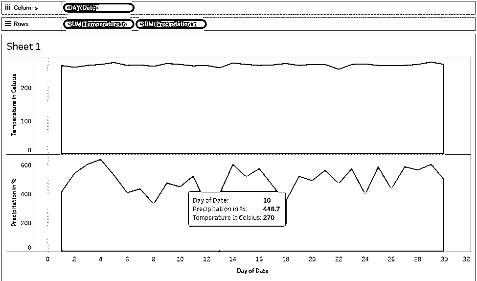

**第 17 步:**正如我们在下面的截图中看到的，我们使用双轴得到了两个度量的面积图。我们把“降水量%”放在右边，因为，否则，它会被“温度摄氏度”测量的面积图所掩盖。必须相应地设置度量在行或列区域中的位置，因为它会影响可视化效果。

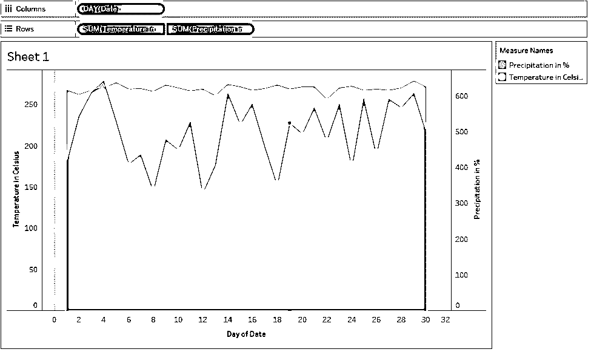

### 结论–Tableau 双轴

当涉及到同时分析多个测量时，双轴的概念证明是方便的。Tableau 为应用双轴提供了一个非常容易实现的方法。事实上，这种方法比 Excel 中可用的方法简单得多。此外，通过设置，我们可以根据需要修改轴。

### 推荐文章

这是一个 Tableau 双轴指南。在这里，我们讨论一个介绍和步骤，以了解如何应用双轴的相关功能。您也可以浏览我们的其他相关文章，了解更多信息——

1.  [Tableau 中的仪表板](https://www.educba.com/dashboard-in-tableau/)
2.  [Tableau 中的层级](https://www.educba.com/hierarchy-in-tableau/)
3.  [Tableau 中的 LOD 表达式](https://www.educba.com/lod-expressions-in-tableau/)
4.  [谷歌数据工作室 vs Tableau](https://www.educba.com/google-data-studio-vs-tableau/)
5.  [如何使用 Tableau 固定功能？](https://www.educba.com/tableau-fixed-function/)

