# 画面中的传奇

> 原文：<https://www.educba.com/legend-in-tableau/>

## Tableau 中的传奇简介

可视化完成了从数据中传达洞察力的重要工作。然而，除非数据中的各个部分有清晰的表示，否则分析的用户不可能正确地解释这些见解。数据的有意义的表示是通过图例实现的，图例是任何可视化的关键部分。图例利用颜色、形状和文本来有效地突出可视化的各个部分。Tableau 提供了与使图例变得重要的概念相关的各种选项。

### 理解 Tableau 中的传奇

现在让我们一步一步地了解与 Tableau 中的图例相关的各种操作。在本次演示中，我们将使用分布卷数据集。它包含分发到印度各个城市的数量。重要的维度是模式、分布单元和区域，而分布单元是数据集中的度量值。

<small>Hadoop、数据科学、统计学&其他</small>

**第一步:**首先加载数据集。如下所示，点击数据菜单下的“新数据源”。

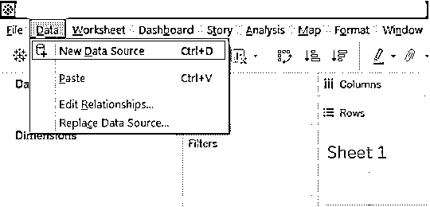

**步骤 2:** 在 Connect 部分选择所需的数据源类型。在这种情况下，它是在“MS Excel”上单击的，因此单击“Microsoft Excel ”,如下所示。

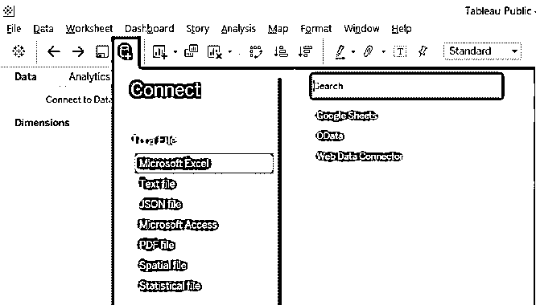

**第 3 步:**数据被加载，可以在数据源选项卡中看到，如下所示。

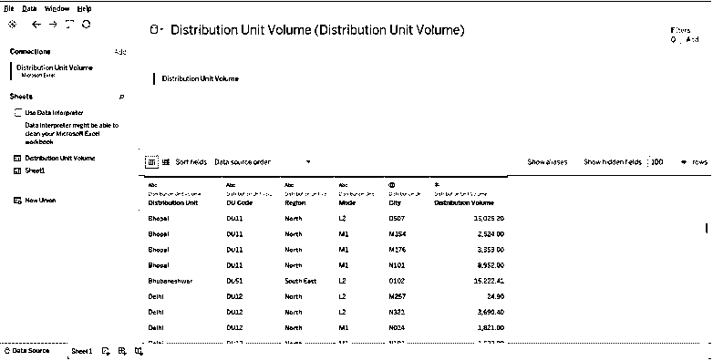

**步骤 4:** 转到工作表，我们可以在必要的部分找到尺寸和度量，如下图所示。

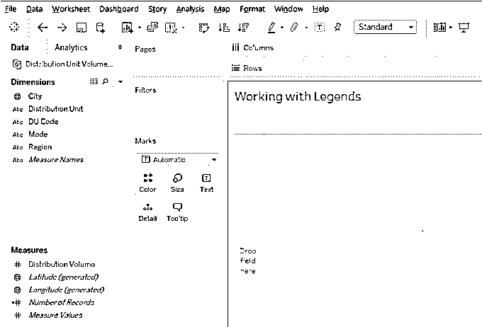

### 在 Tableau 中创建图例

首先，让我们创建一个简单的可视化。将维模式和区域引入行区域，并将分配量度量引入列区域。我们得到如下所示的水平条形图。它本质上通过两种不同的模式给出了区域分布体积。然而，由于单一的颜色使解释变得困难，可视化看起来并不深刻。所以，我们需要创造一个传奇。

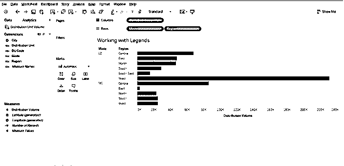

**第 2 步:**如下面的截图所示，我们只需在 Marks 卡中将区域维度拖到颜色上，区域图例就会自动创建。这一点如下所述。

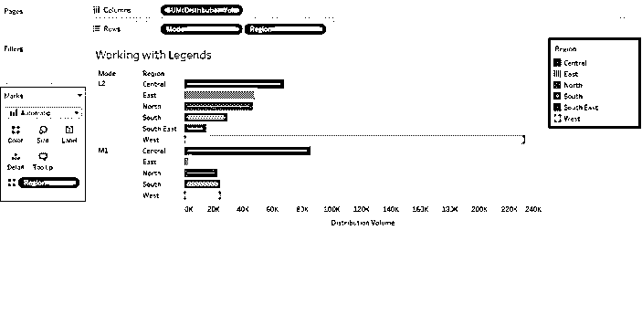

**第三步:**和区域图例一样，我们也可以为模式维度创建一个图例。如下图所示。

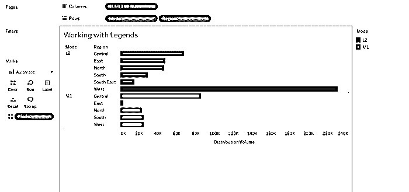

### 删除 Tableau 中的图例

**步骤 1:** 为了删除 Tableau 中的图例，从 Marks 卡的颜色中删除尺寸，图例自动消失。这已经在下面的截图中显示。

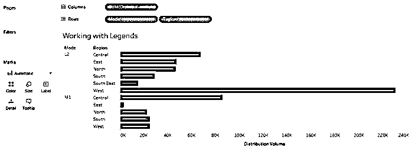

**步骤 2:** 我们还可以删除一个特定的图例条目。如下图所示，我们单击了 Central，选择“Exclude”会将其从分析中删除。

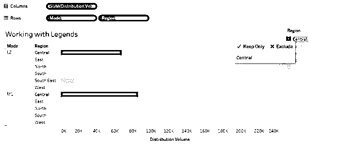

**步骤 3:** 如下图所示，中心区域已从分析中移除。

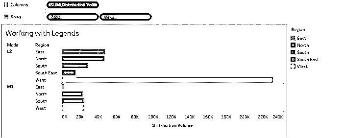

**步骤 4:** 我们可以通过选择如下所示的“从仪表板移除”选项来移除图例。

### Tableau 中的浮动图例

**步骤 1:** 浮动是 Tableau 中的一个概念，它允许可视化或图例在仪表板窗口中自由移动。下面的屏幕截图显示了可视化的图例是如何重叠在可视化上的。要启用浮动功能，必须选择浮动选项，如下图所示。

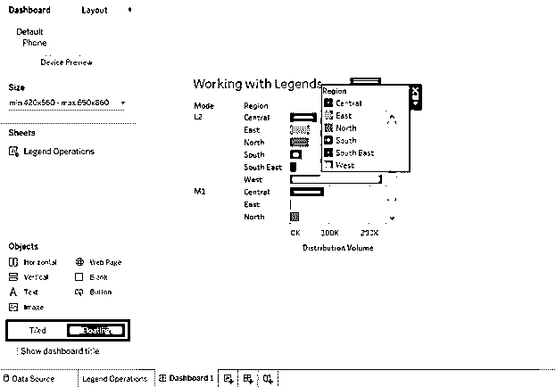

**第二步:**下面的截图举例说明了一个浮动的图例。基本上就是被鼠标随意移动。

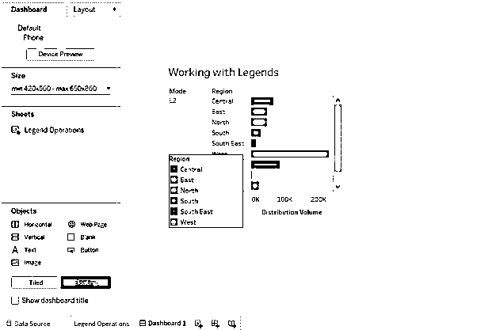

**步骤 3:** 尽管我们可以随意浮动图例，但它们必须始终以系统的方式设置在仪表板上，如下所示。

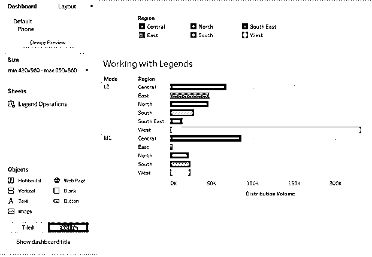

**步骤 4:** 在图例的下拉菜单中，我们有两个关于浮动的选项，即浮动和浮动顺序。浮动被检查是因为我们在前面的步骤中确保了它。在浮动顺序中，有四个选项允许我们相应地显示图例。如下图所示，选择“置于底层”会消失图例条目，如下图之后的截图所示。

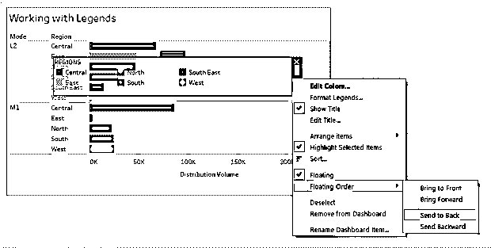

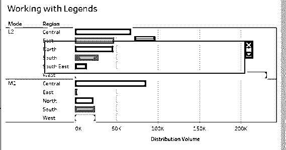

**第五步:**我们可以通过点击浮动订单中的“置于最前面”选项来恢复条目，如下所示。

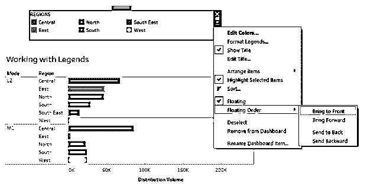

### 编辑 Tableau 中的图例

Tableau 为我们提供了众多的编辑选项。我们将在下一节中看到它们。

**第一步:**点击图例的下拉菜单。我们可以找到多个选项来编辑图例。第一个选项是编辑颜色，以粗体突出显示。点击它，弹出编辑颜色对话框，如下图截图所示。在这里，我们可以根据需要为图例条目选择颜色。

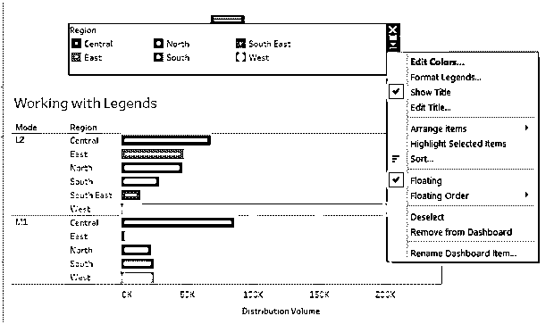

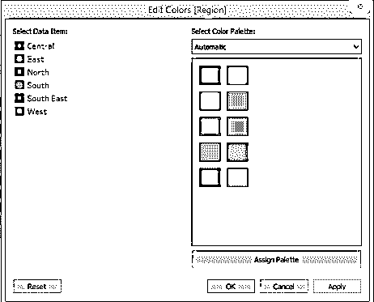

**步骤 2:** 下面的截图显示了取消选择“显示标题”是如何删除图例标题的。只需选择恢复标题的选项。我们可以编辑标题。为此，点击“编辑标题”选项，并在“编辑图例标题”框中输入所需的标题，如下图所示。

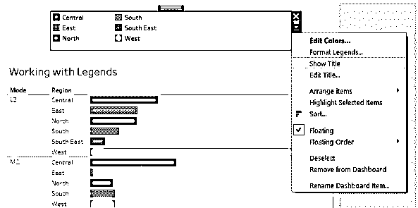

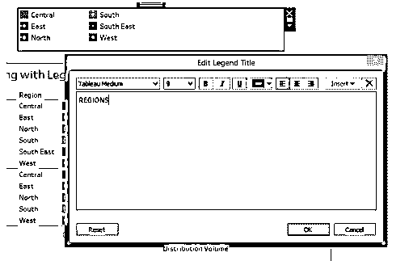

**步骤 3:** 我们可以通过点击“格式化图例”选项来格式化图例。在左侧的“格式图例”部分进行必要的更改。下面的截图显示了这一点。

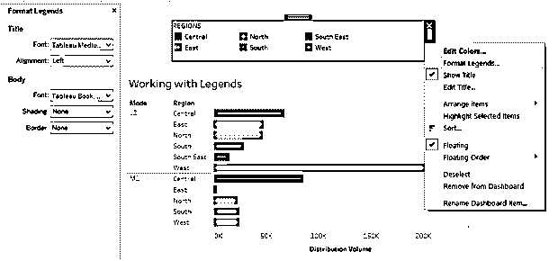

**第四步:**可以根据需要排列图例项。“排列项目”选项下的各种选项有助于实现这一点，如下所示。

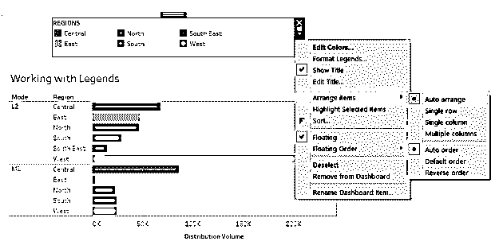

**步骤 5:** “突出显示所选项目”使我们能够选择特定条目。如果未选中此选项，则单项选择将不起作用。以下屏幕截图显示该选项已选中。

**步骤 6:** 以下截图显示了选择 West legend 如何在可视化中突出显示西部区域。

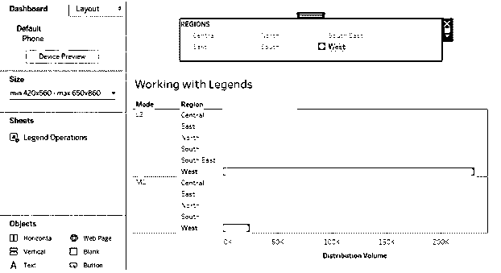

第 7 步:我们可以更改任何特定条目的名称。只需点击它，并在下拉菜单中点击“编辑别名”选项。

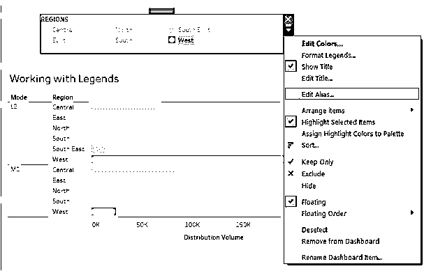

### 隐藏和取消隐藏 Tableau 中的图例

**第一步:**我们创建的图例可以隐藏并恢复。要隐藏某个特定的项目，单击它，并在下拉菜单中，单击隐藏。如下图所示。

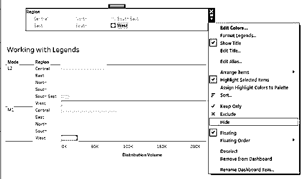

**步骤 2:** 在下面的截图中，我们按照上面的步骤隐藏了“West”的图例。

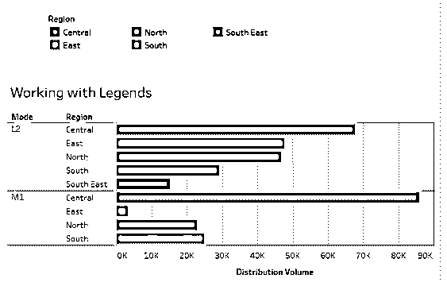

**第三步:**我们可以通过点击图例下拉菜单中的“显示隐藏数据”选项来取消隐藏图例，如下图所示。

### 显示颜色

**步骤 1:** 在分析菜单的图例中，点击颜色图例。

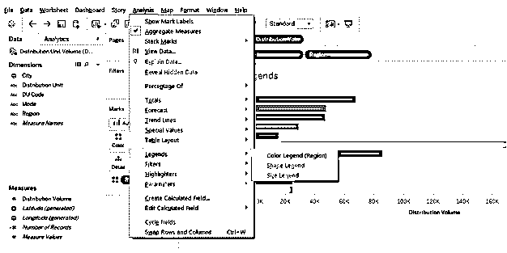

**第二步:**右键点击可视化，选择图例中的颜色图例。

**步骤 3:** 在仪表板的情况下，在下拉菜单中，点击图例中的颜色图例。

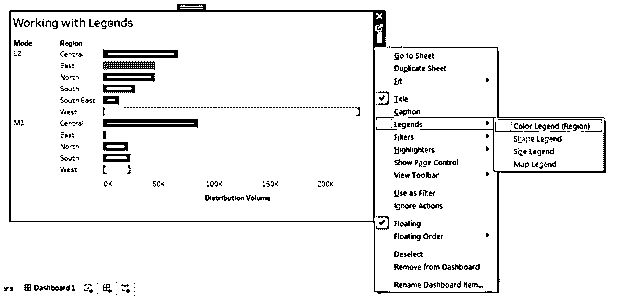

### 结论

Tableau 提供了复杂的功能来处理图例。Tableau 中的图例不仅仅是一个与可视化相关的普通元素。它是分析的一个重要部分，可以根据用户的要求进行操作。

### 推荐文章

这是一个 Tableau 传奇指南。在这里，我们讨论一步一步的过程，以了解与 Tableau 中的图例相关的各种操作。您也可以阅读以下文章，了解更多信息——

1.  [在 Tableau 中连接](https://www.educba.com/concatenate-in-tableau/)
2.  [Tableau 中的地图图层](https://www.educba.com/map-layers-in-tableau/)
3.  [Tableau 中的 LOD 表达式](https://www.educba.com/lod-expressions-in-tableau/)
4.  [Tableau 工作簿](https://www.educba.com/tableau-workbook/)
5.  [Tableau 中的自定义 SQL](https://www.educba.com/custom-sql-in-tableau/)
6.  [Matlab 图例|如何工作？|示例](https://www.educba.com/matlab-legend/)

