# Tableau 中的饼图

> 原文：<https://www.educba.com/pie-chart-in-tableau/>

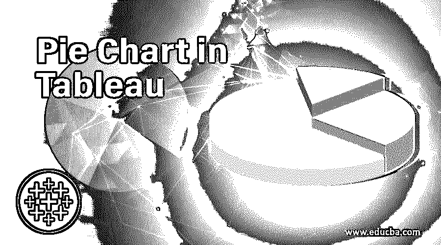

## Tableau 中的饼图介绍

饼图是一种可视化数据的交互式方式。该图表以圆形形式表示，在需要确定各种类别的份额或贡献的情况下非常有用。这些份额基本上是总贡献中的百分比份额。一个类别的份额大小与代表该类别的扇形角度相对应。在 Tableau 中，可以轻松地构建饼图。事实上，Tableau 提供了一种不言自明的方法来构建饼图。饼图可以很好地集成到仪表板中，并与其他类型的图表结合使用，从数据中产生出色的洞察力。

### 在 Tableau 中构建饼图

现在，通过一步一步的过程，我们看到如何在 Tableau 中构建一个交互式饼图。在本演示中，我们考虑按地区销售数据集。数据集中的重要维度是城市和季度，而销售额是一个度量值。该数据集包含按季度划分的区域(充当区域聚类的城市)销售额。我们打算分析各个季度主要地区的百分比贡献。这可以通过饼状图来实现。

<small>Hadoop、数据科学、统计学&其他</small>

让我们来看看在上述数据集上构建饼图的过程。如下一节所述。

**步骤 1:** 要将数据集加载到 Tableau 中，请单击“新建数据源”。或者，也可以单击“连接到数据”。
T3】

**第二步:**在弹出的窗口中，选择需要的数据源类型。如下面的截图所示，在这种情况下，数据源类型是 MS Excel，因此我们应该单击 Microsoft Excel。

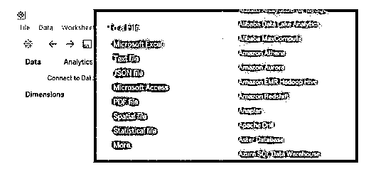

**第三步:**数据集加载后，可以在“数据源”选项卡中看到，如下图所示。研究数据集并验证是否所有的记录和字段都已正确加载而没有影响它们的表单总是有好处的。在进行分析之前，这一点很重要。

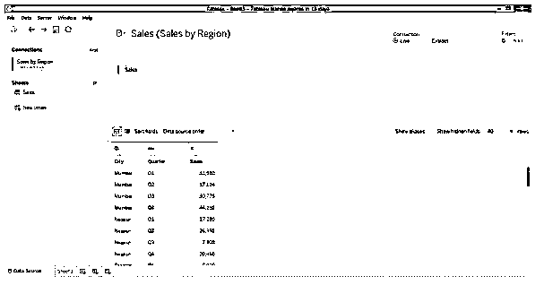

**第 4 步:**转到“工作表”选项卡，我们可以找到维度“城市”和“季度”,以及加载到必要部分的度量“销售额”,如下所示。

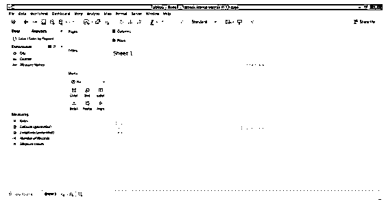

**步骤 5:** 要成为，请将“城市”维度拖到“列”区域，并将“销售额”度量到“行”区域。这样做将生成一个简单的垂直条形图，如下图所示。

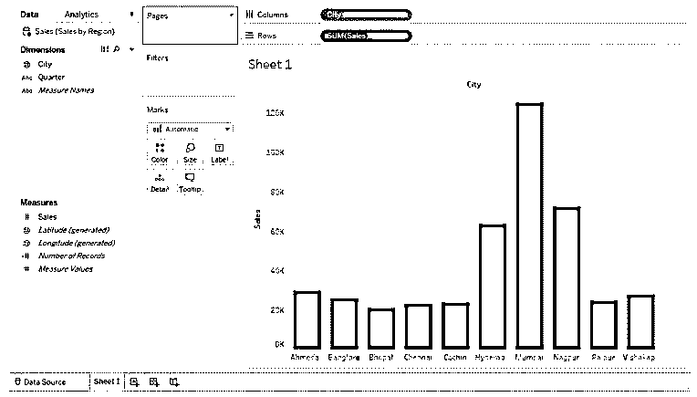

**第六步:**下一步是将条形图转换成饼状图。为此，转到“演示”,从“选项”中，单击位于“演示”中的饼图符号，如下图中突出显示的内容。

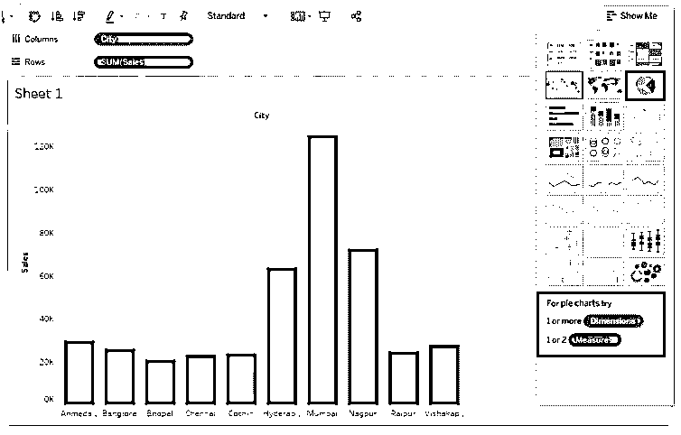

**第 7 步:**下面的屏幕截图更详细地展示了饼图选项的选择。请注意，当鼠标悬停在饼图符号上时，在下方，会出现关于维度和度量数量要求的条件。这引导用户，尤其是新用户相应地利用图表。

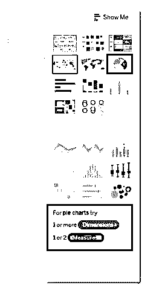

**第 8 步:**按照上面的步骤，我们得到了如下图所示的饼状图。我们可以看到饼图看起来很小，我们还需要检查扇区是否代表百分比贡献。我们将使用前面描述的步骤带来所需的变化。正如可以在标记卡中看到的，维城已经应用了颜色。“销售”这一指标已经应用了两次，第一次是角度，第二次是尺寸。当涉及到构建饼图时，理解如何在 Marks 卡中的选项上应用度量是很重要的，因为这会影响图表。

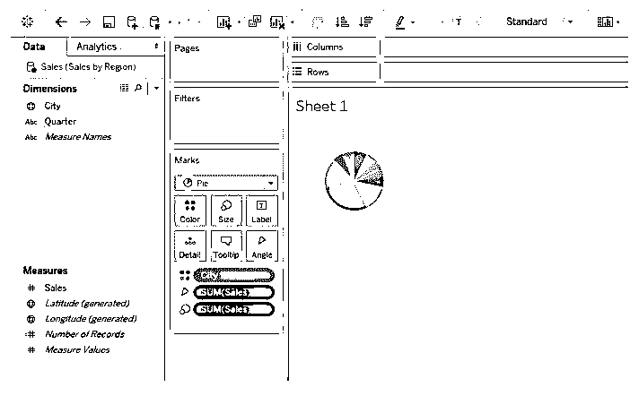

**步骤 9:** 我们可以使用标记卡上尺寸选项中的滑块来调整圆形的尺寸。注意，使用最大尺寸可能会破坏图表的形状，因此应该正确使用滑块。

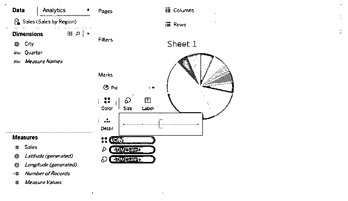

**第 10 步:**下面的屏幕截图显示，城市和销售额标签无法显示在图表中，主要贡献城市的标签出现在。所以，图表中最好不要有标签。

**步骤 11:** 我们选择没有标签，为了了解任何城市的贡献，我们可以将鼠标悬停在必要的部分上。如下图所示。

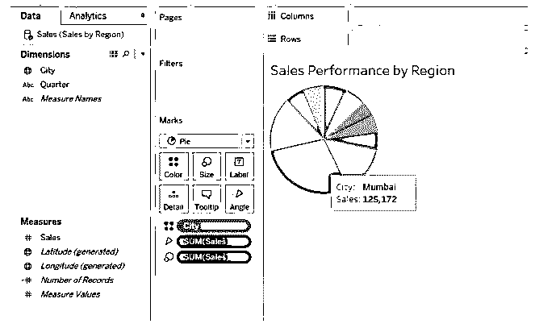

**第 12 步:**注意，在上面的截图中，我们得到了销售额相对于贡献百分比的值。饼图的本质在于它能够显示百分比贡献。这可以通过下面截图中所示的步骤来实现。对于已应用于规模的销售衡量标准，单击下拉菜单，并在衡量标准中单击“总百分比”选项。

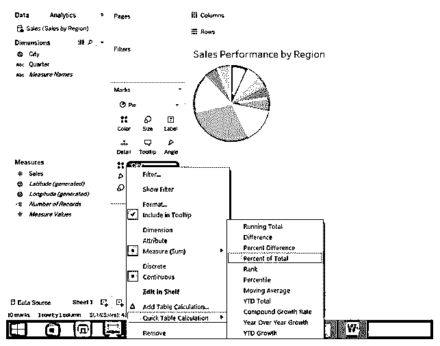

**第 13 步:**我们可以在下面的截图中看到该城市的贡献百分比和价值。这里，角度上的销售度量给出值，而大小上的销售度量给出百分比贡献。

第 14 步:我们的数据集中也有硬币。要获得季度饼图，只需将季度维度拖到列区域。从下面的截图可以看出，我们得到了四个季度的四个不同的饼图。这里需要注意的最重要的一点是，与其他季度的饼状图相比,“Q3”季度的饼状图略小。这是因为销售指标也适用于 Marks 卡中的尺寸选项。当我们只有一个饼图时，这个选项不会影响它。但是现在，这已经影响了视觉化。我们将看到如何克服这个问题。

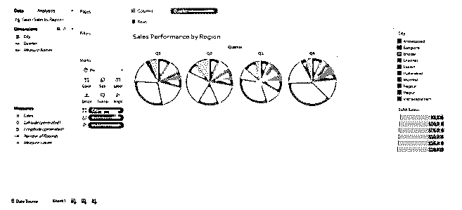

**第 15 步:**在下面的截图中，我们可以找到很好地获得的大小相等的饼状图。我们克服了上述问题，只需删除 Marks 卡中已应用的超尺寸销售措施。这给了我们同样大小的饼状图。饼图显示了不同城市在不同季度的销售额。在截图的右边，我们可以找到用不同颜色表示的城市类别。

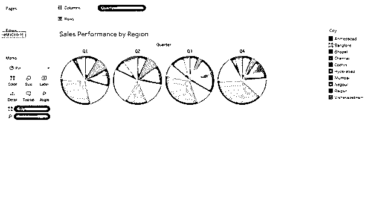

**第 16 步:**按照上一部分描述的步骤计算贡献百分比，结果如下所示。

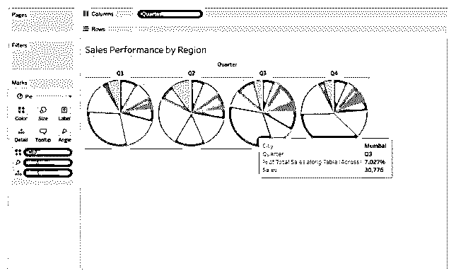

### 结论

可视化任务可以通过各种图表来执行，但是当涉及到快速分析贡献时，饼图是正确的选择。图表完成绩效监控的工作，并允许决策者提出必要的计划和战略措施来提高绩效。

### 推荐文章

这是一个在 Tableau 饼图指南。在这里，我们讨论了在 Tableau 中创建饼图的介绍和不同步骤。您也可以看看以下文章，了解更多信息–

1.  [Tableau 中的仪表板](https://www.educba.com/dashboard-in-tableau/)
2.  [QlikView 图表](https://www.educba.com/qlikview-charts/)
3.  [画面可视化](https://www.educba.com/tableau-visualization/)
4.  [表格中的热图](https://www.educba.com/heat-map-in-tableau/)
5.  [在 Tableau 中使用定制 SQL 的步骤](https://www.educba.com/custom-sql-in-tableau/)

