# Tableau 函数

> 原文：<https://www.educba.com/tableau-functions/>

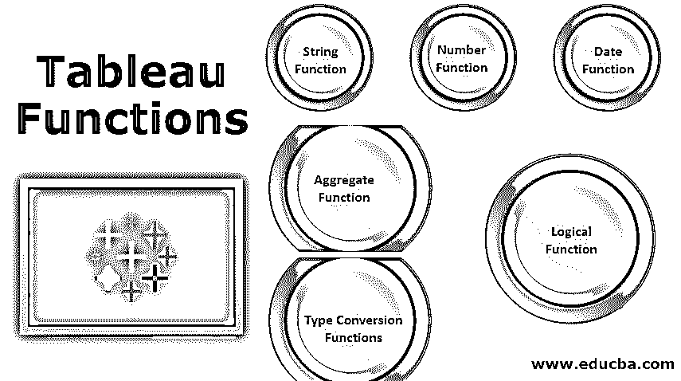

## Tableau 函数概述

因为每辆车都有各种功能，像刹车、油门、离合器、雨刷、前灯、空调、音乐系统、左右指示灯等等。这有助于我们舒适恰当地驾驶汽车。同样，在 Tableau 中，我们有不同的函数类别，在每个类别中，我们都有一些函数，可以帮助我们根据我们的要求执行计算和可视化数据，这太容易和快捷了。

根据需要可视化的数据类型、可视化所需的聚集和逻辑操作，tableau 函数被分成不同的类别。每一类都有特定用途的功能，解释如下。

<small>Hadoop、数据科学、统计学&其他</small>

### Tableau 函数的类型

*   串函数
*   数字函数
*   日期函数
*   聚合函数
*   逻辑功能
*   类型转换函数

### 如何应用 Tableau 函数？

这里我们将讨论如何应用 tableau 函数。

#### 第一步:

为此，我们需要创建一个计算字段，可通过单击 tableau 工作表中的“分析”选项卡，然后单击下拉菜单中的“创建计算字段选项”来创建，如下图 1 所示，并以红色突出显示。

#### 第二步:

单击创建计算字段选项后，您会发现一个下拉菜单，其中包含所有 tableau 函数及其说明和示例的列表。您可以从下拉菜单中选择 function，也可以在如图 2 所示的文本框中进行搜索。确保在单击“应用”和“确定”之前命名计算字段。在图 2 中，我将我的计算字段命名为“Contains”。

Tableau 计算字段编辑器也让我们知道我们的计算是否有效，你可以在编辑器的底部看到这个指示器。

#### 第三步:

单击“确定”后，您可以从工作表中的“度量/维度”中拖放计算字段以查看结果。

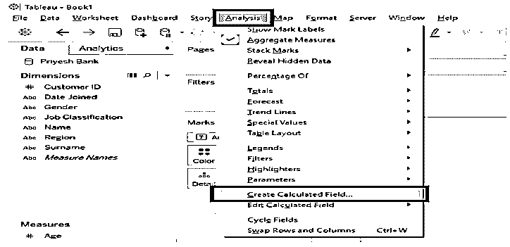

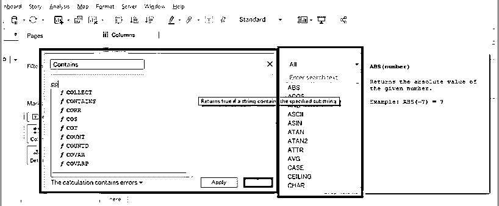

### 字符串函数

字符串函数允许我们根据自己的需求操作字符串数据。例如，我们可以使用 string 函数从 employee 表的 employee name 列中获取雇员的姓或名，并将其放入新的字段或列中。我们还可以使用这个函数来连接城市和国家的详细信息，并将其填充到一个单独的列中，等等。

Tableau 中流行的字符串函数列表如下:

| 马克斯(男子名ˌ等于 Maximilian) | 中间的 | 美国信息交换标准代码 | RTRIM | 上面的 |
| 部 | 左边的 | 茶 | LTRIM(即时通讯) | 降低 |
| 开始于 | 正确 | 发现 | 整齐 | 空间 |
| ENDSWITH | 替换 | 包含 | 低输入联网（low-entry networking 的缩写） | 使分离 |

#### 1)左侧

它返回字符串中最左边的子字符串。

**语法:** LEFT(字符串，数字)

**例**:左(" Ghoradkar 先生"，2) = "先生"。“2”表示子串的长度。

在下面的截图中，我们可以看到当计算字段“LEFT Fn”被拖放到工作表中时，我们得到的结果是 MRS only，因为 get 在我们的函数中写了“3”。

RIGHT 与 LEFT 非常相似，它返回字符串中最右边的子字符串。

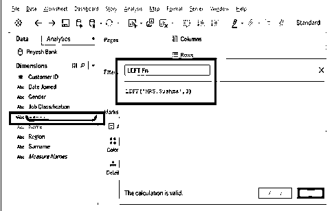

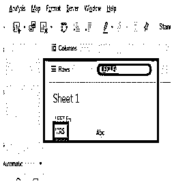

#### 2)中期

Mid 也类似于左右功能。MID 返回从指定索引位置到指定长度的子字符串。

**语法:** MID(字符串，数字，数字)

**例** : MID("雨伞"，2，4)。结果:“布雷**”**

**注:**字符串中的索引从“0”开始**。**

#### 3) ASCII 码

它返回字符串第一个字符的 ASCII 码。

**语法:** ASCII(字符串)

**举例:** ASCII("A ")。结果:65

**注意:**确保通过右键单击计算字段选择“属性”以获得所需的结果。如下图所示。

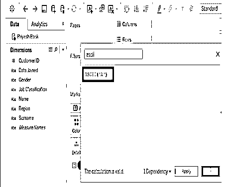

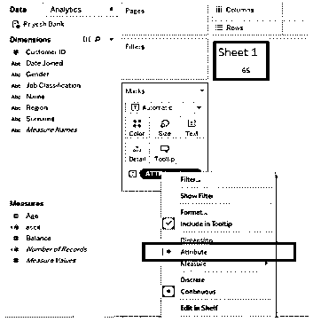

#### 4)字符

它与 ASCII 完全相反；它返回由 ASCII 码编码的字符。

**语法:** CHAR(数字)

**示例:** CHAR (65) = 'A '。

#### 5)包含

如果给定的字符串包含指定的子字符串，则返回“TRUE”。

**语法:**包含(string，substring)。

**例:**包含(《马哈拉施特拉邦》、《皮疹》)。=“真”。

**用例:**您可以在“马哈拉施特拉邦”放置一个维度，并可视化数据。例如，如果您有一个名为“NAME”的维度，其中包含您的银行的所有客户的姓名，并且如果您想要获得姓名中包含“as”的所有雇员的客户 id，那么您可以在文本编辑器中使用下面的查询。您还需要应用一个过滤器，以便获得结果为“True”的客户 id。

包含([名称]，"作为")。结果如下图所示。

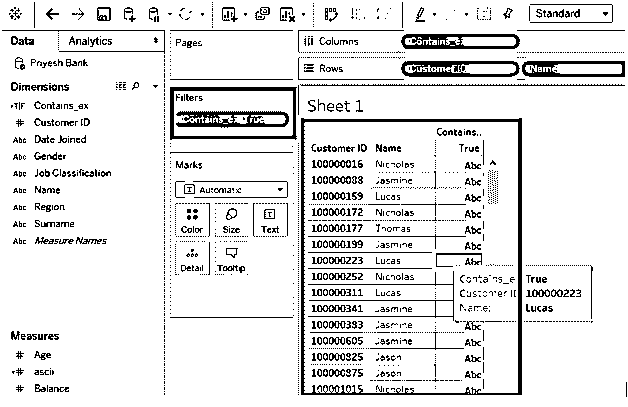

#### 6) ENDSWITH

如果给定字符串以给定子串结尾，则返回 true

**语法:** ENDSWITH (string，substring)。

**举例:** ENDSWITH("驴子"，"钥匙")= True。

STARTSWITH 与 ENDSWITH 非常相似，如果字符串以给定的子字符串开头，则返回 true。

#### 7)查找

返回子字符串在字符串中的索引位置。

**语法:** FIND (string，substring，[start])。我们需要在第三个参数中指定在字符串中搜索的起点。

**举例:** FIND("最大"，" m "，2)。= 5.

#### 8)镜头

返回字符串的长度。

**语法:** LEN(字符串)。

**例:** LEN("直升机")=10。

#### 9)上部

返回字符串，所有字符都大写。

**语法:** UPPER(字符串)。

**举例:** UPPER ("BlackHat") = "BLACKHAT "。

LOWER 与 UPPER 非常相似，它返回一个所有字符都是小写的字符串。

#### 10)最大

返回 a 和 b 的最大值。

**语法:** MAX(a，b)。

**举例:** MAX("老虎"，"猫")= "老虎"。

MIN 与 MAX 非常相似，它返回 a 和 b 的最小值。

#### 11)修剪

返回没有前导空格和尾随空格的字符串。

**语法:** TRIM(字符串)。

**举例:** TRIM("蔬菜")= "蔬菜"。

LTRIM 和 RTRIM 与 TRIM 非常相似，分别返回删除了前导空格的字符串和删除了尾随空格的字符串。

#### 12)拆分

从输入中返回一个子字符串，使用分隔符分隔它。

**语法:** SPLIT(字符串，分隔符，令牌)。

**举例:** SPLIT ('a-b-c-d '，'-'，2) ='b '

**注意:**这里的标记号是排除分隔符后的子串的位置。我们也可以使用-2 或-3 等。从字符串末尾获取结果。

### 数字函数

数字函数允许我们对数据进行计算。它只能用于测量，即包含数值的字段。数字函数可以帮助我们计算平方、平方根、幂、指数等。数字数据的。例如，如果我们有一个银行的数据集，我们想对所有客户的余额进行舍入，那么我们可以使用 round 函数。Tableau 中常用的数字函数列表如下:

| 防抱死制动装置 | 犯罪 | 印度历的 7 月 | 平方 | 轮次 |
| 马克斯(男子名ˌ等于 Maximilian) | 装货付款(Cash On Shipment) | 应用控制操作系统 | SQRT | 差异 |
| 部 | 马戏团 | 阿坦 | 经历 | 赫克宾 |
| 席琳 | 小屋 | 度 | 原木 | 力量 |
| 地面 | 产品改进(Product Improve) | 弧度 | LN | 符号 |

#### 1) ABS

返回给定数字的绝对值。

**语法:** ABS(数字)。

**举例:**ABS(【10.75】)。= 11

#### 2)最高

返回同一类型的两个参数中的最大值。

**语法:** MAX(数，数)。

**示例:**如果收入和费用是两个度量值，则 max 函数将返回它们之间的最大值。最大值(“收入”、“费用”)。下图中的另一个例子。

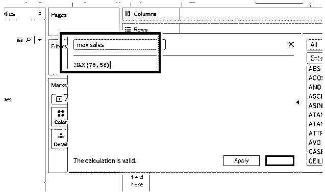

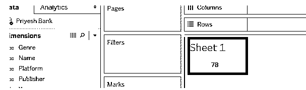

MIN 和 MAX 很像；它返回相同类型的两个参数中的最小值。

#### 3)上限

将数字舍入为最接近的等于或大于该值的整数。

**语法:**天花板(数字)。

**举例:** CEILING (4.2654) =5。

#### 4)地板

下限与上限非常相似，将数字四舍五入为最接近的整数，等于或小于该值。

**例:** FLOOR (4.2654) =4。

#### 5)圆形

将数字舍入到特定的位数。

**语法:** ROUND(数字，[小数])。

**例:** ROUND (6.66667，[2]) =6.67。

#### 6)罪

返回角度的正弦值。以弧度为单位指定角度。

**例:** SIN(PI ( ) /4) =0.707106。

COS，TAN，COT 和 SIN 很像。分别返回一个角度的余弦、正切和余切。

#### 7) PI

返回数值常数 PI: 3.14159。

**语法:** PI()。

#### 8)学位

将给定的数字从弧度转换为角度。

**语法:**度(数)。

**例:**度(PI () /4) =45。

弧度与度数非常相似。将给定的数字从度数转换为弧度。

#### 9)正方形

返回一个数的平方。

**语法:**平方(数)。

**例:**平方(5) =25。

SQRT 非常类似于 SQUARE。它返回一个数的平方根。

#### 10)实验

返回 **e** 的给定数字的幂。

**语法:** EXP(数字)。

**举例:**EXP(-[增长率]*[时间])

#### 11)电源

将数字提升到指定的幂。

**语法:**幂(数，幂)。

**例:**幂(4，2) = 4^2 =16。

#### 12) DIV

返回商的整数部分，其中整数 1 除以整数 2。

**语法:** DIV (Integer1，Integer2)。

**例:** DIV (22，2) =10。

### 日期函数

日期函数允许我们操作与时间、年份、日期和天数相关的数据。在数据可视化过程中，以小时为单位转换日期或生成“最后修改”日期可能会很方便。Tableau 中流行的日期函数列表如下:

| 今天 | 部 | 马克斯(男子名ˌ等于 Maximilian) | 现在 |
| 年 | 生产日期 | DATEDIFF | DATETRUNC |
| 天 | 抽空 | 日期部分 | 日期名称 |
| 月 | 制作日期时间 | DATEADD | ISDATE |

#### 1)今天

返回当前日期。

**语法:**今天()。

**举例:** TODAY( ) = 2019-09-26。

#### 2)天

以整数形式返回给定日期的第几天。

**语法:**日(日期)。

**例:**日(#2019-09-26#) =26。

月和年与日非常相似。它以整数形式分别返回给定日期的月份和年份。

#### 3)现在

返回当前日期和时间。

**语法:**现在()。

**例:** NOW( ) =2019-09-26 07:26:21 PM。

#### 4)日期差异

返回日期 1 和日期 2 之间的差值。

**语法:** DATEDIFF(日期部分，日期 1，日期 2，[星期开始])

**例:** DATEDIFF('周'，#2019-09-22#，#2019-09-25#，'周一')=2。

#### 5) ISDATE

如果给定的字符串是有效的日期，则返回 true。

**语法:** ISDATE(字符串)。

**示例:**is date(" 2019 年 5 月 24 日")=True。

### 类型转换函数

类型转换函数允许我们修改源数据的数据类型，并将其从一种类型转换为另一种类型。使用这些函数，我们可以将日期转换为字符串，反之亦然，我们也可以将数字转换为字符串，将字符串转换为数字，以防止或激活 Tableau 聚合。Tableau 中常用的类型转换函数列表如下:

| 日期 | 漂浮物 |
| 日期时间 | （同 Internationalorganizations）国际组织 |
| 日期解析 | 潜艇用热中子反应堆(Submarine Thermal Reactor) |

#### 1)日期

给定数字、字符串或日期，返回日期。

**语法:**日期(表达式)。

**例:**日期(" 2019 年 5 月 24 日")= # 2019 年 5 月 24 日#。

#### 2)浮动

将其参数转换为浮点数。

**语法:** FLOAT(表达式)。

**例:** FLOAT(3) =3.000。

#### 3) INT

将其参数转换为整数。

**语法:** INT(表达式)。

**举例:** INT(8.0/3.0) =2。

#### 4) STR

将其参数转换为字符串。

**语法:** STR(表达式)。

**例子:**STR(【Rank】)。在本例中，您可以将等级度量中的所有数值转换为一个字符串。完成此操作后，计算字段将显示在维度中，而不是度量值中。

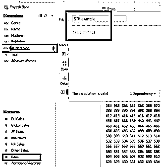

### 聚合函数

聚合函数允许我们通过执行各种操作(如求和、计数、百分位数、AVG 等)来汇总数据。它还帮助我们跨地区、国家等应用聚合函数。例如，我们可以计算平均值、总和等。特定领域的，如销售、利润、余额等。穿越一个国家或州。

| 属性 | 马克斯(男子名ˌ等于 Maximilian) | 柯伐合金 | 百分位 |
| AVG | 总和 | 科拉普 | 标准差（standarddeviation） |
| 收集 | 数数 | 马克斯(男子名ˌ等于 Maximilian) | STDEVP |
| CORR | 低输入联网（low-entry networking 的缩写） | 中位数 | 总和 |
| 数数 | 左边的 | 部 | 增值转销公司 |

#### 1) AVG

返回表达式中所有值的平均值。

**语法:** AVG(表达式)。

**举例:** AVG(天平)。如下图所示，图中显示了各地区的平均余额。

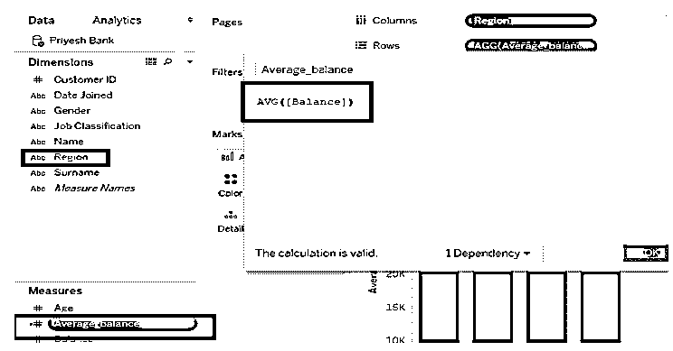

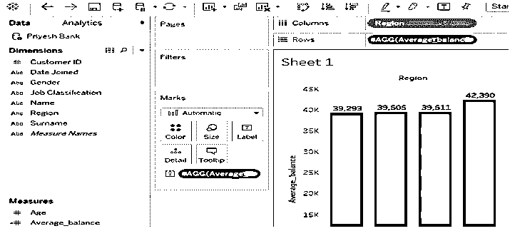

#### 2)计数

返回一个组中的项目数。

**语法:**计数(表达式)。

#### 3)最高

返回所有记录中的最大表达式。

**语法:** MAX(表达式)。

MIN 与 MAX 非常相似，返回所有记录中的最小值表达式。

**4)总和**

返回表达式中所有值的总和。

**语法:** SUM(表达式)。

### Tableau 的逻辑功能

逻辑函数允许我们基于布尔逻辑做出决定，即真或假。

| 如果 | 和 | 马克斯(男子名ˌ等于 Maximilian) |
| IFC null | 情况 | 部 |
| 间接免疫荧光 | 其他 | 不 |
| ISDATE | 否则如果 | 运筹学 |
| ISNULL | 结束 | 然后 |

#### 1)如果

测试返回真值<expr>的<then>值的表达式。</then></expr>

**语法:**IF<expr>THEN<THEN>【ELSE IF<expr 2>THEN 2>……】【ELSE<ELSE>END。

**举例:**如果【盈利】>为 0 则‘盈利’否则‘亏损’结束。

#### 2) IFNULL

如果不为空则返回<expr1>，否则返回<expr2>。</expr2></expr1>

**语法:** IFNULL(expr1，expr2)。

**示例:** IFNULL([sales]，0)。

#### 3) IFF

检查条件；如果为真，则返回第一个值，如果为假，则返回第二个值，如果未知，则返回第三个值。

**语法:** IFF(test，then，else，[unknown])。

**举例:** IFF(【利润】> 0，‘利润’，‘亏损’)。

#### 4)为空

如果表达式为空，则返回 true。

**语法:** ISNULL(表达式)。

**示例:** ISNULL(89)。=假。

#### 5)不是

对表达式执行逻辑求反。

**语法:**如果不是< expr >那么<那么>结束。

**举例:**如果【亏损】<不为 0，则“无利可图”结束。

#### 6)和

对两个表达式执行逻辑“与”运算。

**语法:**如果< expr1 >和< expr2 >那么<那么>结束。

**举例:**如果(ATTR([市场]) =“非洲”和 SUM([销售]) >【新兴门槛】那么“表现良好”)，

#### 7)其他

测试一系列返回真值<expr>的<then>值的表达式。</then></expr>

**语法:**如果< expr >那么<那么> ELSE < else >结束。

**举例:**如果【盈利】>为 0 则‘盈利’否则‘亏损’结束。

### 结论–Tableau 函数

Tableau 提供了各种函数来根据我们的要求操作数据，这些函数帮助我们执行所需的计算，做出某些决定，改变数据类型，组合不同的列等。

它在数据可视化中起着至关重要的作用，可以帮助我们增强数据的外观和感觉，还可以帮助我们高效地创建仪表板。

### 推荐文章

这是 Tableau 函数的指南。在这里，我们讨论了 Tableau 软件中内置的所有 Tableau 函数，以及如何具体应用这些函数。您也可以看看以下文章，了解更多信息–

1.  [表格中的过滤器](https://www.educba.com/filters-in-tableau/)
2.  [Tableau 建筑](https://www.educba.com/tableau-architecture/)
3.  [什么是 Tableau？](https://www.educba.com/what-is-tableau/)
4.  [Tableau 是否免费](https://www.educba.com/tableau-free/)

