# Tableau 中的秩函数

> 原文：<https://www.educba.com/rank-function-in-tableau/>

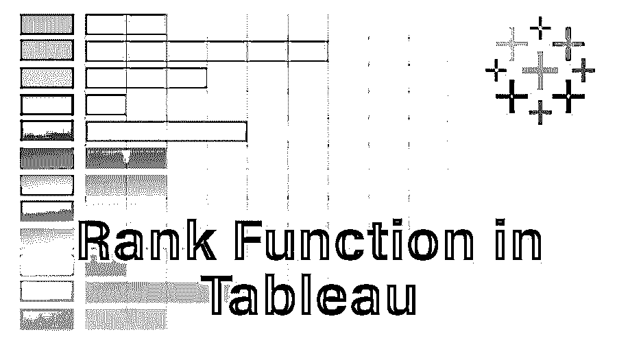

## Tableau 中的秩函数介绍

在学习 tableau 中的函数及其用例之前，让我们先来学习什么是 Tableau 以及人们为什么使用它？Tableau 是一个[数据可视化工具](https://www.educba.com/data-visualization-tools/)，可以帮助生成交互式仪表盘，帮助更好地理解数据。现在，让我们深入 Tableau 中的函数。Tableau 内置了很多函数，分为字符串函数、表格函数等。在本文中，我们将讨论 tableau 中表函数的一部分——秩函数。顾名思义，秩函数用于对数据集中存在的任何度量(与数字相关)进行排序。

### Tableau 中如何使用 Rank 函数？

现在，让我们一步步来，看看如何在 tableau 中使用 rank 函数。

<small>Hadoop、数据科学、统计学&其他</small>

1.打开 Tableau，我们将能够看到下面的屏幕。使用 Tableau 登录页面左侧的连接选项连接到文件或服务器(基于输入数据所在的位置)。

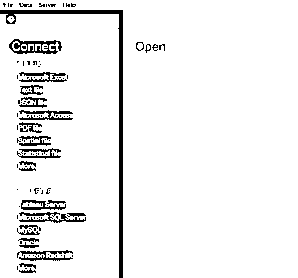

2.对于本文，我们将使用“Sample- Superstore”数据存储，下面的屏幕截图将告诉我们数据的样子。

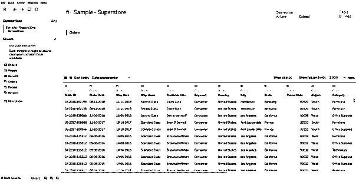

3.单击左下角的“第 1 页”选项，我们将能够看到如下所示的窗口，这是我们准备仪表板的地方。

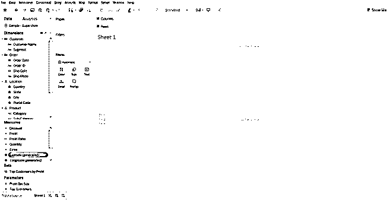

4.选择我们要对其应用秩函数的度量，在这里，我将通过将维度中的区域作为行来对销售度量应用秩函数。将区域维度拖动到行中，并将销售度量拖动到标记卡中，窗口将如下所示。

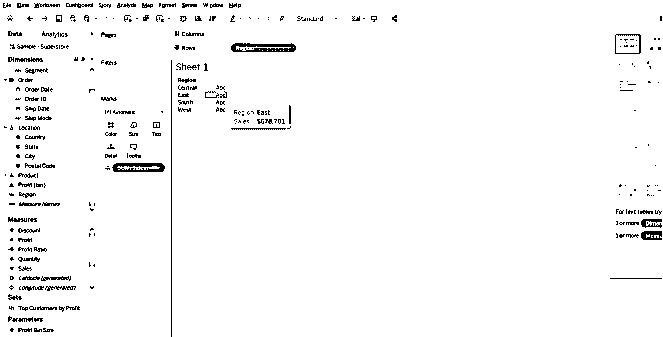

5.要对销售度量值进行排序，我们必须首先创建一个新的计算字段，方法是右键单击“度量值中的销售额”窗格。我们可以看到一个新的菜单出现，就像这里的截图。现在，我们必须转到创建，然后单击此处显示的计算字段选项。

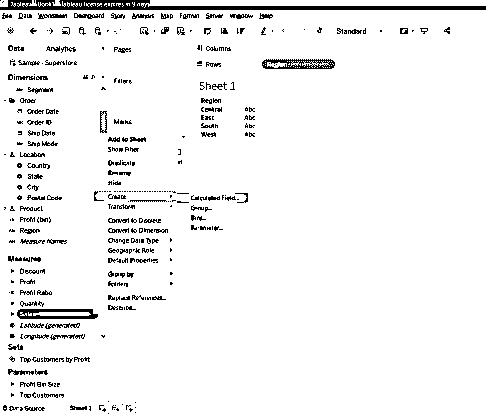

6.单击计算字段后，将弹出一个新窗口，在该窗口中，我们可以看到在右侧的下拉菜单中选择了“All”。

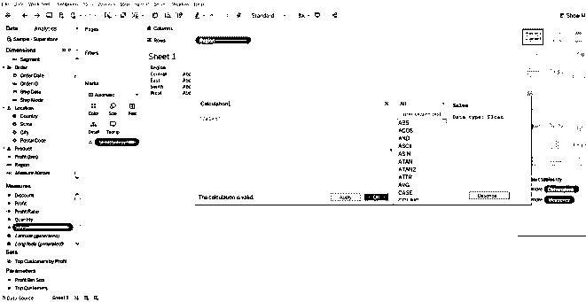

7.如前所述，等级函数将出现在表格计算中，因此我们必须打开下拉菜单并选择“表格计算”，我们将能够看到所有等级函数以及关于这些函数的少量信息，如下所示。

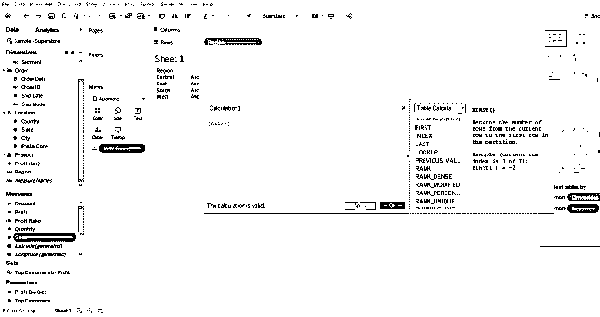

8.因为我们希望将 rank 函数应用于销售度量的聚合，所以计算结果将是“Rank(Sum([Sales])”，我们可以为该计算命名。在本例中，我将把计算命名为 Rank。

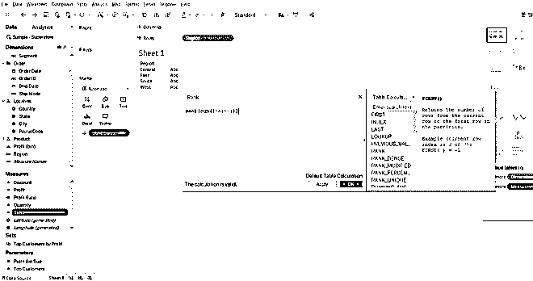

9.给出计算结果后，我们将继续操作，单击“应用”和“确定”,让该计算结果反映在“测量”部分中。在 Measures 窗格中看到 Rank 后，我们应该将它拖到显示在仪表板区域中的销售汇总上，仪表板将如下所示

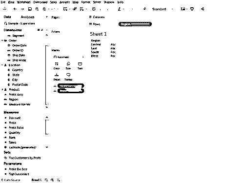

10.这里，在“marks”窗格中,“aggregate of sales”设置为“details ”,为了更好地理解，让我们将它更改为“Text”。为此，我们只需单击“marks card”中“measure”右侧的符号，它将打开一个窗口，其中有一个选项是“Text ”,选择它后，控制面板将如下所示。

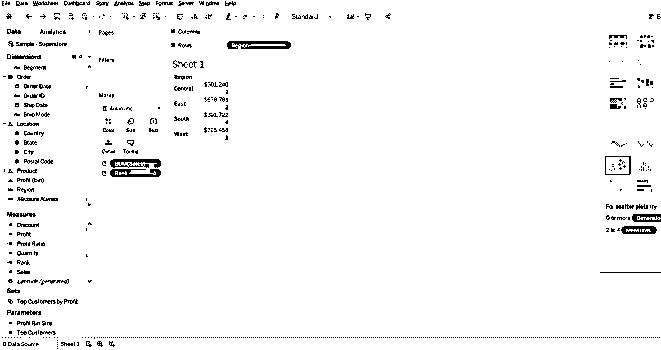

11.因此，根据所提供的值完成此操作后，我们可以看到最高等级(1)被赋予销售额最高的地区($725，458)。如果我们想在一个单独的列中显示排名，那么改变步骤的顺序，首先执行步骤 10，然后继续执行步骤 9。

12.如果我们想要对格式进行任何更改，我们必须单击“测量值”窗格中“等级”部分左侧的下拉菜单，在这里我们可以对格式(轴和窗格格式)进行所有更改，窗口将类似于下图所示。

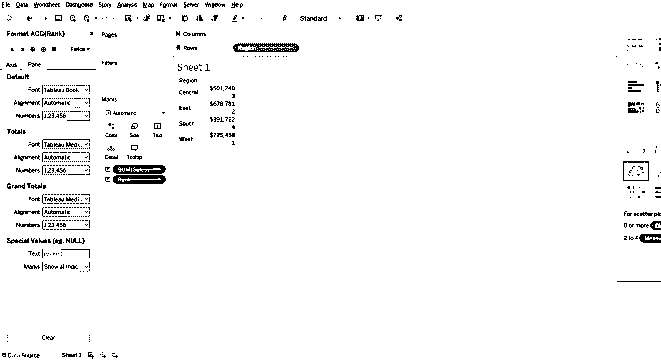

13.这里我们有所有不同的值，如果有相同的值，谁会得到更好的排名？不同的用户有不同的需求来解决这个 tableau 为我们提供了一些额外的功能排名密集，排名独特和排名修改。tableau 默认选择一些属性，其中一个是降序排序。

14.因此，让我们看看这些东西如何通过满足我们的需求来帮助我们。

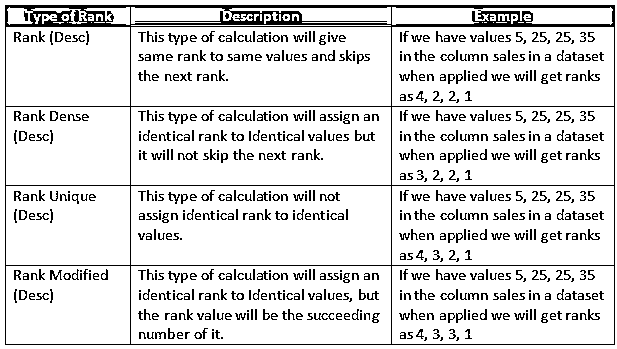

### 排序函数在 Tableau 中的重要性

从上面的计算和类型中，我们可以看到，当 Rank 函数被应用时，它返回分区中当前行的标准竞争排名。当我们使用图表来详细说明哪个类别或地区的销售情况最好时，这将非常有帮助。有了这些见解，用户或业务主管将知道他们必须在哪里改进他们的业务。

### 推荐文章

这是一个在 Tableau 中排列函数的指南。这里我们讨论如何在 tableau 中使用秩函数及其重要性。你也可以看看下面的文章来了解更多-

1.  [Tableau 参考线](https://www.educba.com/tableau-reference-lines/)
2.  [Tableau 仪表盘设计](https://www.educba.com/tableau-dashboard-design/)
3.  [Tableau 表计算](https://www.educba.com/tableau-table-calculation/)
4.  [Tableau 图表类型](https://www.educba.com/tableau-chart-types/)
5.  [Tableau 聚合函数](https://www.educba.com/tableau-aggregate-functions/)
6.  [Tableau 中的枢轴](https://www.educba.com/pivot-in-tableau/)
7.  [Tableau 上下文过滤器](https://www.educba.com/tableau-context-filter/)
8.  [Tableau 特性和属性介绍](https://www.educba.com/tableau-new-features/)

