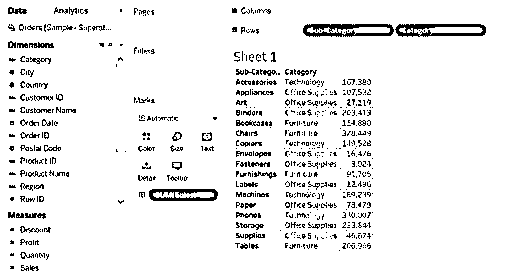
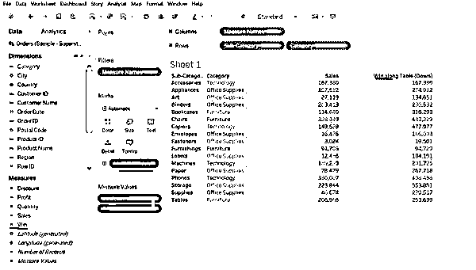
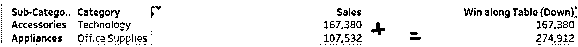
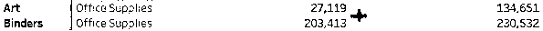
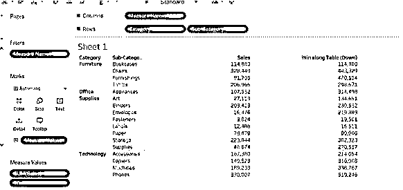
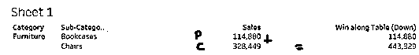
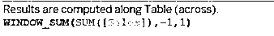
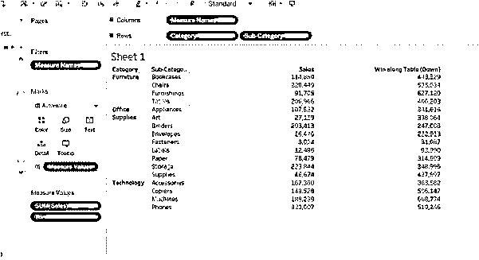
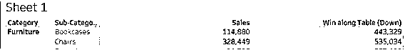
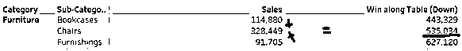

# 窗口求和表

> 原文：<https://www.educba.com/window-sum-tableau/>

## 窗口求和表介绍

Tableau 有另一个最好的函数来进行计算。SUM 只不过是块中出现的值的总和。tableau 中的窗口求和执行前一个值、当前值和未来值的合计。它将执行 tableau 表中第一级行的聚合。我们总是需要为要在 tableau 中执行的计算创建一个计算字段。其语法是–WINDOW SUM()，用于创建计算字段,您可以随意命名。tableau 中的窗口提供了不同的功能，如合计、平均、求和等。Windows SUM 就是其中之一。

### Windows Sum 在 Tableau 中是怎么做的

我将用一个 windows sum 如何执行的例子来解释这个场景。Windows 计算在数据上执行标记。

<small>Hadoop、数据科学、统计学&其他</small>

1.  连接到 tableau 公共或桌面
2.  根据您的选择提取数据库或连接到它

我们已经提取了超市数据库样本。我从其中提取了订单表到 Tableau 数据源表。

`WINDOW_SUM(SUM([Sales]),-1,0).`

Sum(sales)我们要执行 windows sum 的度量值，-1 等于以前的值，0 是当前值。

5.  在测量架上创建 Win 计算字段。
6.  双击计算出的字段 Win。

*   我们可以在下面观察到，当我们双击 Win measures 时，measures 名称会被添加到过滤器和列中

*   您可以在上面的图像中观察到我们有两列，销售和成功。

我们将了解在上面的示例中，windows sum calculated 字段是如何工作的，以及 Win 值是如何添加到。

*   首先看销售值是–167380，赢得值是 167380，这两个值是相同的，因为根据公式(-1，0) -1 是 0，0 是 167380，这就是总和是 167380 的原因，因为我们没有以前的值是，当前值是
*   设备查看下一个销售值是–107532，赢得值是 274912，之前的值是 167380，当前值是 107532，我们的总和是 274912。(167380+107532=274912)

*   艺术总和为 134651，前值为 107532，当前值为 27119。(107532+27119=134651).我们正在汇总以下数据

4.  Binders win 为 230532，前值为 27119，当前值为 203413。(27119+203413=230532)并继续在

将当前值与前一个值相加，我们得到每个类别和子类别的窗口销售额的总和。

*   我们将改变类别和子类别的位置，以便更好地理解。首先移动类别，然后移动子类别。
*   您可以在下图中看到，由于行值的可互换性，win 值发生了变化。

*   对于“家具”类别和“椅子”子类别，我们得到的赢得值为 443，329 (328449 + 114880 = 443，329) 328449 是当前值，114880 是以前值

*   现在，我们将更改 window_sum 中的前端和末端值。用-1 和 1 编辑 window_sum。-1 是上一个值，1 是下一个值。

*   Window_sum 将计算前一个值、当前值和

*   对于带有书架的家具类别–win as 443，329，前一个值为 0，当前值为 114，880，下一个值为 328，449。

*   对于以椅子为子类别的家具类别，赢得值为 535，034。前一个值是 114，880，当前值是 328，449，下一个值是 91，705 (114，880+328，449+91，705=535，034)。

Window_sum 函数将添加上一个、当前和下一个值。这样就完成了整个求和。

### 结论

我们已经学习了 tableau 中的一个窗口函数。这是一个很好的计算方法。我们需要了解公式中提到的前端值和末端值。需要为函数创建一个计算字段。SUM 函数将对行中从第一个值到当前值或下一个值的所有值求和。

### 推荐文章

这是一个窗口和表的指南。这里我们讨论窗口求和表的介绍，窗口求和是怎么做的，有例子的场景。您也可以浏览我们的其他相关文章，了解更多信息——

1.  [Tableau 参数过滤器](https://www.educba.com/tableau-parameter-filter/)
2.  [Tableau 计算字段](https://www.educba.com/tableau-calculated-field/)
3.  [Tableau 窗口功能](https://www.educba.com/tableau-window-functions/)
4.  [Tableau 固定功能](https://www.educba.com/tableau-fixed-function/)

