# Tableau 中的 LOD 表达式

> 原文：<https://www.educba.com/lod-expressions-in-tableau/>

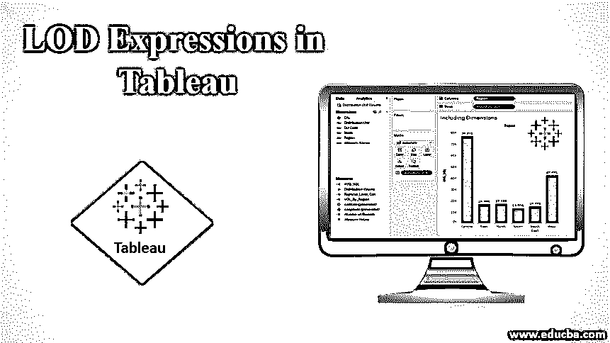

## Tableau 中的 LOD 表达式介绍

在本文中，我们将讨论 Tableau 中的 LOD 表达式。可视化分析工具不仅仅赋予用户从数据中生成可视化洞察的能力。相反，它还为他们提供了根据需求聚合数据的能力。然而，在每种情况下执行数据聚合任务并不简单，有时可能会涉及某些技术和功能上的复杂性。为了进一步执行聚合任务，视图聚合和基于计算的聚合的概念开始出现。在这里，维度充当影响聚合的级别。在 Tableau 中，LOD(细节层次)的概念允许根据需求操作度量的聚合。

### Tableau 中 LOD 表达式的类型

Tableau 中有三种 LOD 表达式，如下所示。

<small>Hadoop、数据科学、统计学&其他</small>

*   **固定 LOD 表达式:**在此类型中，聚集级别保持固定，如计算字段中所述。
*   **包含 LOD 表达式:**在这种类型中，可以在视图级别的任何维度上聚合数据，以及在计算字段中提到的维度。
*   **排除 LOD 表达式:**在此类型中，数据可以在视图级别的任何维度上聚合，除了计算字段中提到的维度。

### 在 Tableau 中创建 LOD 表达式

我们现在将研究在 Tableau 中创建和使用 LOD 表达式的过程。在本次演示中，我们将使用分布卷数据集。该数据集包含按分布单元分布在印度主要地区的数量。重要的维度是分发单元、区域、DU 代码、模式和城市，而分发量是数据集中的度量。

通过插图，我们将看到各种类型的 LOD 表达式的应用。

让我们按如下方式进行演示。

1.将必需的数据集加载到 Tableau 中。为此，请单击“数据”菜单下的“新建数据源”。或者，单击“连接到数据”。

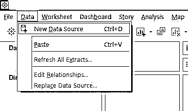

2.从弹出的窗口中，选择必需的数据源类型。在本例中，数据源类型是 MS Excel，因此单击 Microsoft Excel。

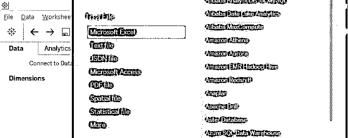

3.可以在“数据源”选项卡中看到加载的数据。在进行分析之前检查数据。

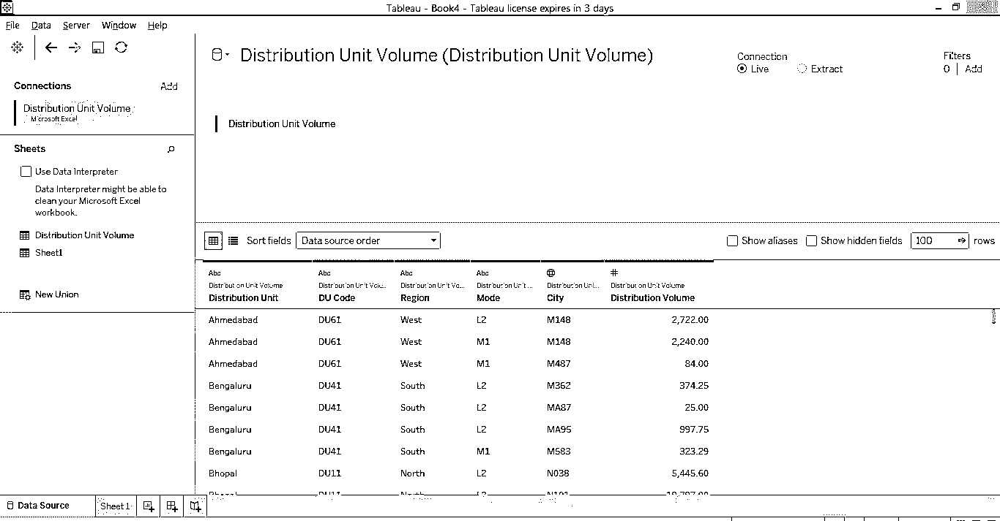

4.转到“工作表”选项卡，可以在相应的部分中看到尺寸和度量。

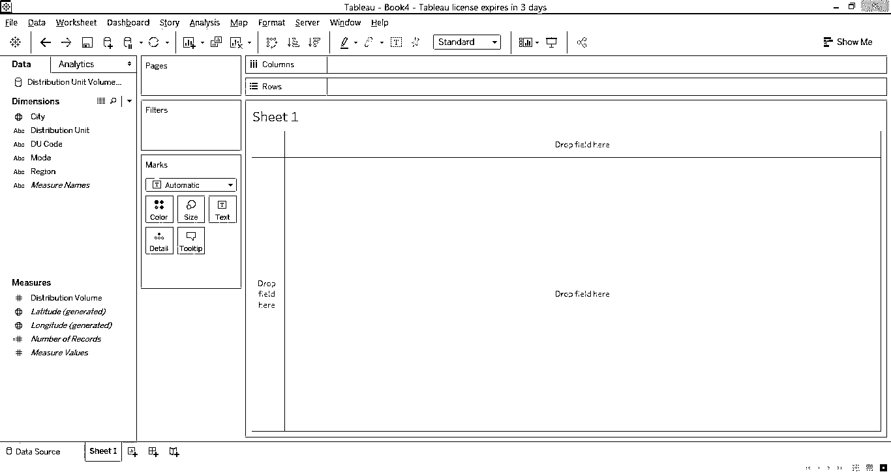

5.现在，我们将一个接一个地探索实现三个 LOD 表达式的过程。最初，只需将“尺寸”区域和“分布单位”放入“行”区域，然后将“测量分布体积”拖动到标记卡中的文本上。我们得到数据的表格表示如下。请注意，我们已经得到了按地区划分的分销单位的分销量数据。

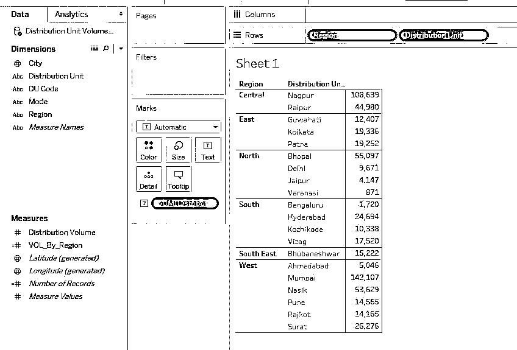

6.为了创建 LOD 表达式，首先，我们需要创建一个计算字段。因此，右键单击“数据”选项卡中空白部分的任意位置，选择“创建计算字段”，然后单击。

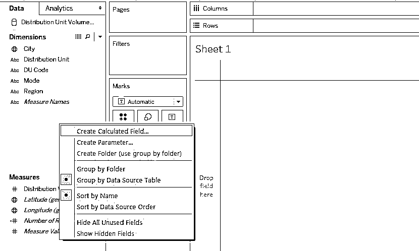

7.在“创建字段”部分，观察以下代码。“固定”仅基于指定的维度计算聚合。因此，下面的代码考虑到了这样一个事实，即无论我们在分析中包含什么维度，聚合都将只在 Region 维度上进行。

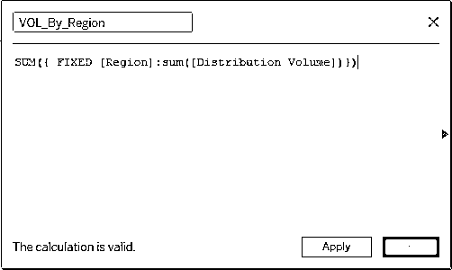

8.新创建的计算字段“VOL_By_Region”可以在 Measures 部分看到，如下所示。

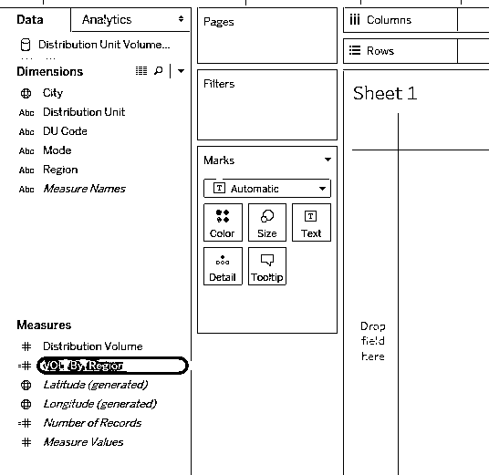

9.现在，将“区域”和“分配单元”维度放入“行”区域，并将“按区域”维度拖到标记卡中的文本上。分销区域的层次结构是地区->分销单位->城市。但是，我们可以发现，在一个区域中，分布单元具有相同的值。这是因为汇总在区域级别已经固定。

10.现在，我们希望固定聚合级别，但确保聚合可以在视图级别的其他维度上完成。这可以通过包含 LOD 表达式来实现。为此，我们创建了一个计算字段，如下所示。观察，INCLUDE [Distribution Unit]确保，现在，除了这个维度，平均聚合也可以在其他维度上进行。

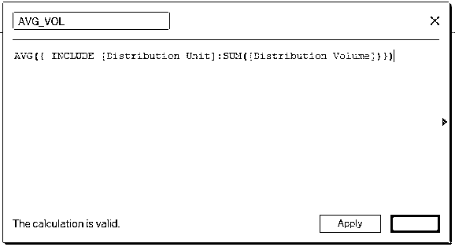

11.新创建的维度 AVG _ 体积可以在措施部分看到。AVG 体积是指所需尺寸的平均体积。

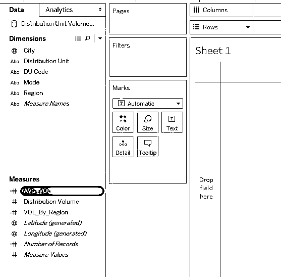

12.从下面的截图可以看出，我们创建了一个垂直条形图，给出了各地区的平均分布量。请注意，尽管在计算字段中，聚合是在较低级别维度上完成的，但在视图级别上，也可以按较高级别的维度进行聚合。这是由于包含 LOD 表达式。

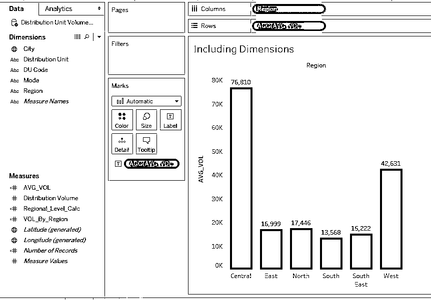

13.有时候，我们可能不感兴趣，或者强制不要求某个维度做汇总。为了满足条件，我们使用 EXCLUDE，如下所示。观察以下计算字段中的表达式。EXCLUDE [Distribution Unit]确保按分布单元的聚合不起作用。

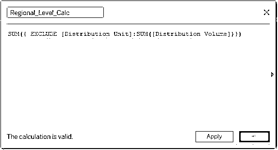

14.在 Measures 部分可以看到新创建的字段“Regional_Level_Calc”。该字段已被命名，因此不可能在分配单位维度上进行聚合，区域级别的分析将是有意义的。

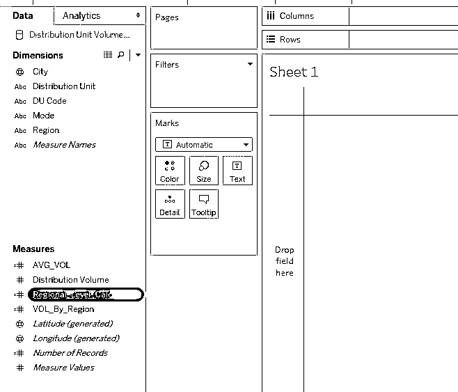

15.现在，将“维”区域和“分配单元”引入“行”区域，并将新创建的字段“Regional_Level_Calc”拖到 Marks card 中的文本上。从下面的截图中可以看出，我们得到了按地区划分的分销单位的明智数字。然而，这些数字对应于区域一级的汇总。

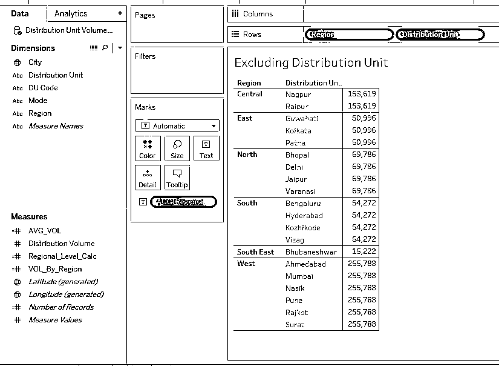

16.上图展示了 EXCLUDE 应用程序的工作方式与我们在上一节中看到的 FIXED 类似。我们将在分析中包括另一个维度，以便检查 EXCLUDE 是如何工作的。

只需观察下面的截图。我们在分析中包含了尺寸模式，并从分析中移除了尺寸区域。现在，我们可以发现，对于所有的分配单元，我们得到了相同的模式明智的数字。理想情况下，正确的结果应该是该特定分配单元的模式图。但是，在这种情况下，汇总时会考虑总配送量，并且仅按维度模式汇总。因此，从本质上讲，在分析中包含维度分布单元是没有意义的。

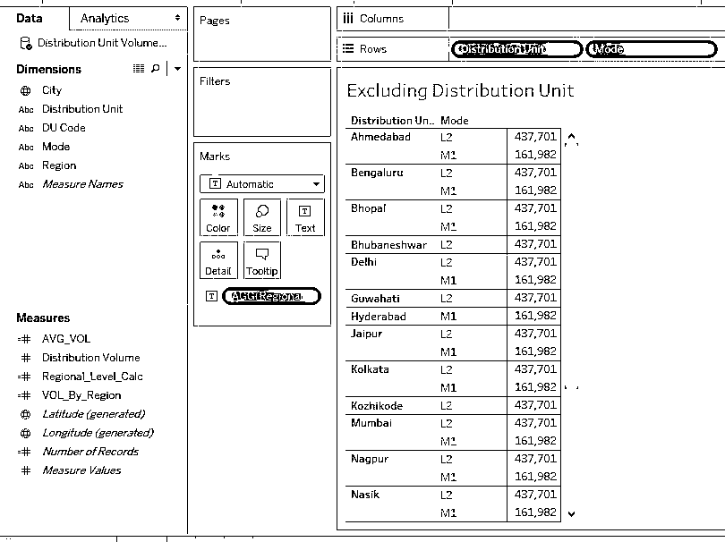

### 结论

在推动分析的同时，我们永远不知道我们可能需要执行哪种类型的数据聚合。通常，将数据导入 Tableau 之前的数据准备任务将完成大部分工作。然而，为了处理在某些情况下出现的意外聚合需求，LOD 的概念证明是方便的。

### 推荐文章

这是 Tableau 中 LOD 表达式的指南。在这里，我们讨论了介绍以及如何在 Tableau 中创建 LOD 表达式及其类型。您也可以阅读以下文章，了解更多信息——

1.  [在 Tableau 中使用地图图层](https://www.educba.com/map-layers-in-tableau/)
2.  [在 Tableau 中创建工作簿](https://www.educba.com/tableau-workbook/)
3.  [Tableau 中的新功能](https://www.educba.com/tableau-new-features/)
4.  [Tableau 中自定义 SQL 的步骤](https://www.educba.com/custom-sql-in-tableau/)

