# Tableau 固定函数

> 原文：<https://www.educba.com/tableau-fixed-function/>

## Tableau 固定函数介绍

Tableau fixed function 用于聚合仅在指定计算字段中的维度上显示的值。在聚合类别类型值的值时，固定函数不考虑视图。参照当前视图中存在的尺寸创建固定视图。固定计算是订单操作的最高优先级。这将提供维度的详细程度。这不取决于我们在画面中有什么视觉化，或者我们在画面中没有。我们可以简单地确定我们想要在 tableau 中显示的细节的级别。

**语法**

<small>Hadoop、数据科学、统计学&其他</small>

Fixed(subject):SUM(subject)

主体不过是维度的集合，价值的总和。它是按和或值的和分组的。

{已修复[主题] : [Q1 %] }

选择主题，Q1 %是按主题分组的总和。

数据在不同的级别聚合，固定值随着值或数据的变化而变化。聚合值时，计算字段很重要。

### Tableau 固定函数怎么用？

*   启动 Tableau 公共版或桌面版。
*   拖动超市数据表，或者您可以根据自己的选择添加数据表(您可以从 tableau 官方网站下载样本数据表)。
*   单击连接到数据打开数据表。

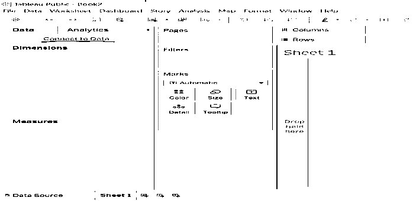

*   点击文本文件打开->从你的电脑打开文件。
*   将出现下图。

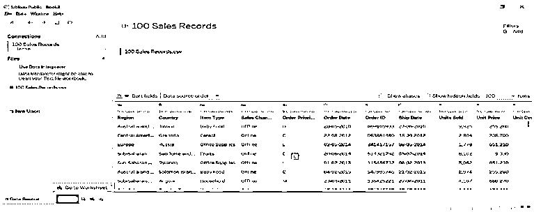

*   转到表 1，数据被分配到维度和度量中。您可以观察以下维度(定性),如国家/地区、项目类型、衡量标准(数量),如单位成本和单位销售额等。

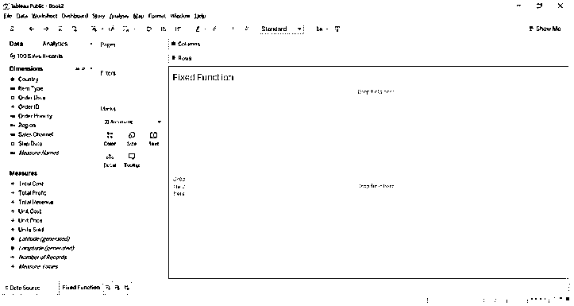

固定函数用于查找类别的特定值。

*   转到维度->的向下箭头，单击创建计算字段。

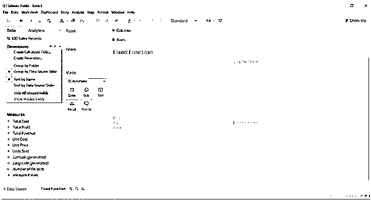

*   键入我们想要的计算公式。来聚合这些值。

**{固定【国家】，【地区】:SUM(【利润总额】)}**

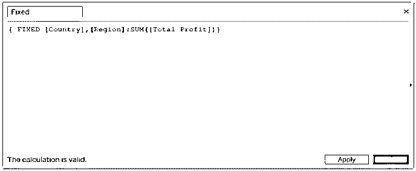

*   我们可以在度量中看到一个固定的计算字段。

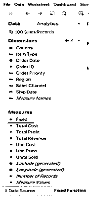

*   将度量名称拖到列中，将国家拖到行中，将度量名称拖到过滤器中，将度量值拖到文本过滤器中。您可以看到每个国家的固定值。每个固定值对于每个国家都是相同的。

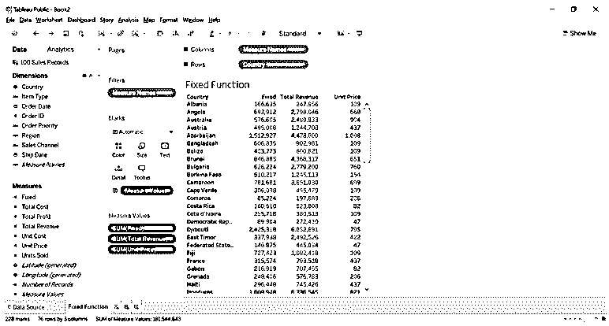

### Tableau 固定函数示例

我们将找出每个地区的销售总额，我们指的是样本超市数据文件。我们从 Tableau 社区论坛下载了。

#### 每个地区的销售总额

*   下载示例超级商店文件，并将其保存到计算机上。
*   打开 Tableau 公共版或桌面版。
*   从计算机打开示例超级存储文件。

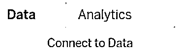

*   当你点击连接到数据，你已经显示了多个选项来打开你想要的文件。
*   当您打开一个示例超级商店文件时，您将看到三个不同的数据库。
*   我们选择了 Orders 表，并将其拖动到数据源表中。

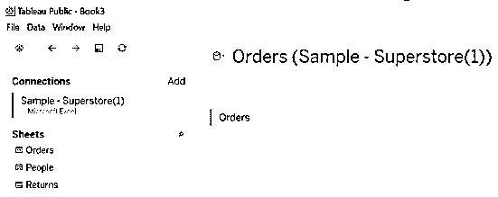

*   我们将看到数据按照数据类型排列在不同的字段中。
*   转到工作表(我的名字是销售)
*   创建一个名为“销售总额”的计算字段，并添加详细信息。

**{固定[地区]:SUM([销售额])}**

*   将区域和状态维度拖到行中。
*   将区域拖到颜色格式选项，并将销售额拖到文本格式选项。

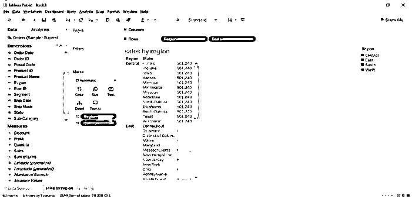

*   我们可以在上面的图像中观察到，每个地区的销售额总和对于不同的州是相同的，也就是说，该地区下的所有州的值都是固定的。
*   我们可以看到，中部地区的销售额为 501204 英镑。
*   我们可以通过拖动区域来过滤格式化窗口。

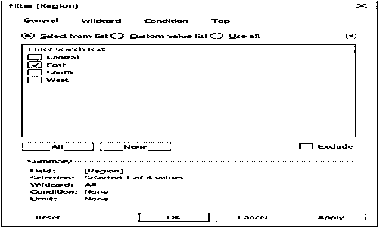

*   我们可以看到东部地区的销售情况。

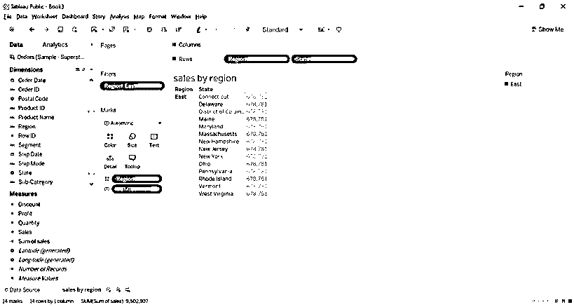

#### 每个州的利润总额及其子类别

*   创建包含详细信息的计算字段**{固定[状态]:SUM([利润])}**
*   将状态和子类别拖到行中。
*   状态转换为颜色格式选项和利润转换为文本格式选项。

*   我们可以观察到亚拉巴马州下诸如配件、艺术品、标签、电话等子类别的利润是 5787。
*   我们可以看到，我们有大量的状态和子类别选项，我们将向过滤器添加状态和子类别，并选择较少的状态，以便我们可以看到不同状态的结果。

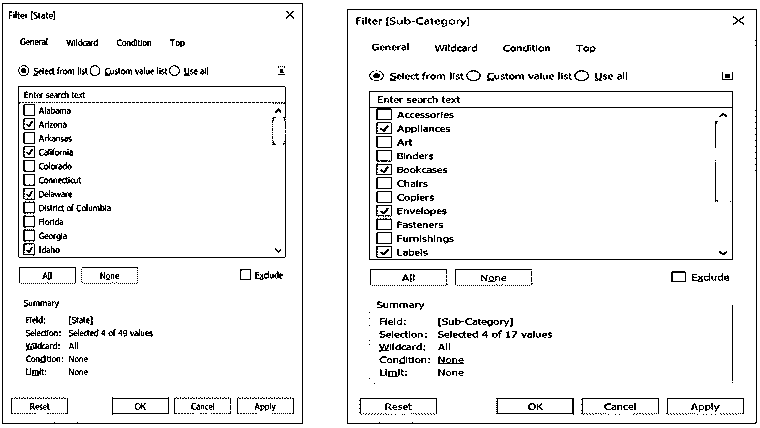

*   在下图中，我们可以看到每个州的子类别和利润值。我们看到有限的子类别，如电器、书柜、信封和标签。

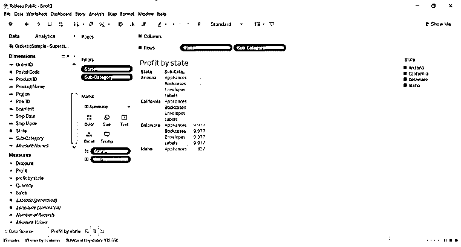

### 结论

我们已经学习了 tableau 中的固定函数，根据函数的名称，它以相同的方式工作。我们已经看到了一些固定函数的例子，如每个地区的销售总额和每个州的利润总额，这表明固定值不会因公式中给出的不同固定值而改变。

### 推荐文章

这是一个 Tableau 固定函数的指南。在这里，我们讨论如何使用 Tableau 固定函数以及例子。您也可以看看以下文章，了解更多信息–

1.  [Tableau 中的仪表板](https://www.educba.com/dashboard-in-tableau/)
2.  [Tableau 中的组](https://www.educba.com/group-in-tableau/)
3.  [在 Tableau 中连接](https://www.educba.com/concatenate-in-tableau/)
4.  [Tableau 中的地图图层](https://www.educba.com/map-layers-in-tableau/)
5.  [窗口和表指南](https://www.educba.com/window-sum-tableau/)

