# Tableau 窗口函数

> 原文：<https://www.educba.com/tableau-window-functions/>

## Tableau 窗口函数介绍

Tableau 作为 BI 工具的多功能性通过它的许多功能得到了证明。一个这样的能力是窗口功能的功能性。窗口函数是那些允许我们在处理数据计算时具有灵活性的函数。这些函数的作用类似于 Excel 中 OFFSET 函数执行的操作。这些功能真正增强了 Tableau 作为 BI 工具的能力。虽然它们的工作原理相似，但是为了理解 Windows 函数的应用，它们中的每一个都必须在不同的上下文中进行实验。

### 在 Tableau 中使用窗口函数

1.首先加载数据集。如下所示，点击数据菜单下的“新数据源”。

<small>Hadoop、数据科学、统计学&其他</small>

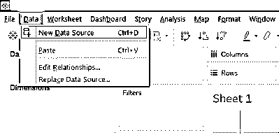

2.在“连接”部分，选择必需的数据源类型。在这种情况下，它是在“MS Excel”上单击的，因此单击“Microsoft Excel ”,如下所示。

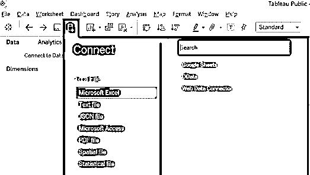

3.从存储位置选择所需的 Excel 文件，并打开它加载到 Tableau 中，如下图所示。

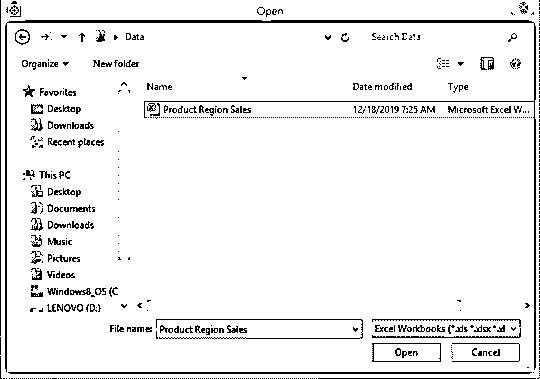

4.当正确遵循上述步骤时，数据被加载到 Tableau 中，并且可以在 data 选项卡中看到。

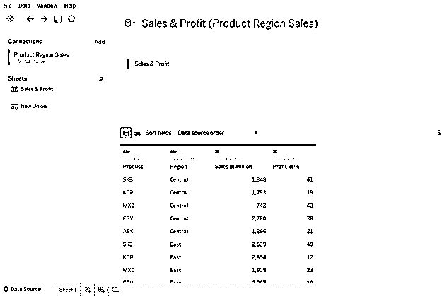

5.数据集中必需的维度和度量可以在相应的部分中看到。如下图所示。

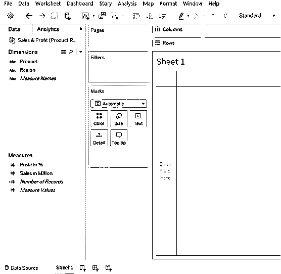

6.首先，将区域维度引入行区域，并将'销售额'度量值拖动到 marks 卡中文本上。我们得到了一个表格，给出了地区销售情况，如下图所示。

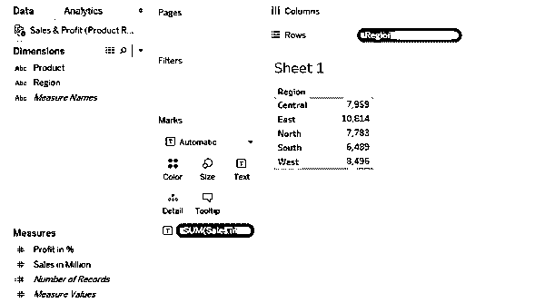

7.为了演示 Windows 函数的应用，我们首先需要创建一个计算字段。现在，右键单击数据选项卡下的空白处。在弹出菜单中，单击“创建计算字段”，如下图所示。

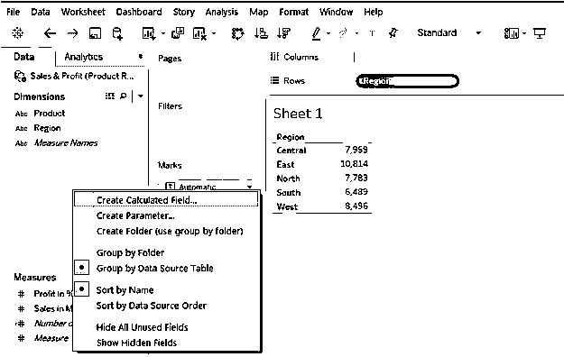

8.执行上述步骤后，我们将导航到计算字段窗格，如下所示。

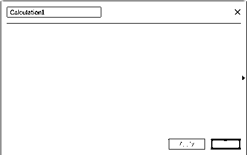

9.单击计算字段窗格中的箭头，它会将我们带到 Tableau 中所有可用的函数。向下滚动以发现所有可用的 Windows 功能。下图突出显示了 Tableau 中可用的 windows 函数。点击任何窗口功能，了解更多信息。

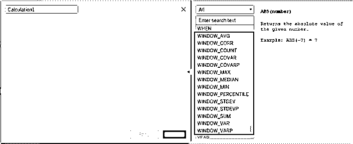

10.选择特定功能会给出其详细信息。从下图可以看出，当我们选择 WINDOW_SUM 函数时，Tableau 为我们提供了关于该函数的完整细节。

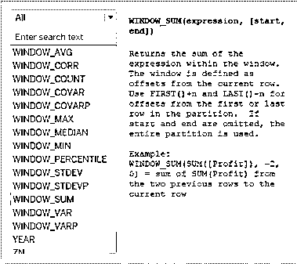

11.我们将使用这个函数并理解它的用途。双击它，它将进入计算字段窗格，如下图所示。正如我们所看到的，这个函数本质上有三个参数，即。表情，开始和结束。“表达式”是指我们要传递的任何数学表达式。开始和结束参数基本上使窗口的功能不同于正常的功能。它们允许我们选择列中必要的数据部分。在接下来的部分中，我们将详细了解这些参数的用法。仔细观察下图。

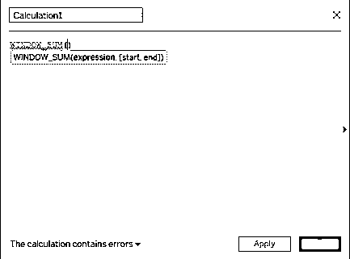

12.对于表达式参数，我们传递了 SUM(百万销售额)函数。窗口函数将聚合函数作为参数并对其进行操作。

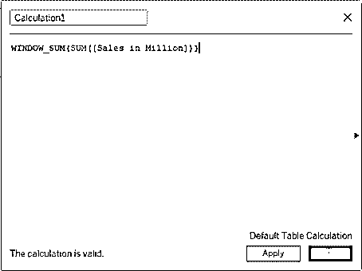

13.让我们将上面计算的字段命名为“Applied_Total ”,单击 Apply，然后单击 OK。我们可以在 measures 部分找到以绿色突出显示的新创建的计算字段。我们将对它进行分析。

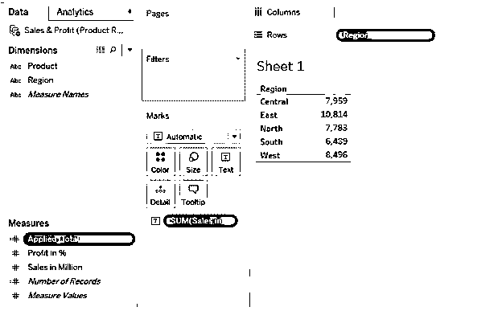

14.我们将它带入分析中，如下图所示。我们可以看到，我们得到了所有地区的总销售额，因为我们在 WINDOW_SUM 函数中嵌入了 SUM 函数。

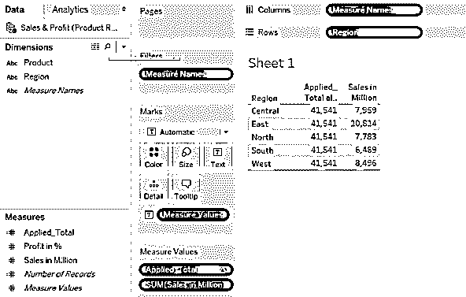

15.现在，我们想要除了中部地区以外的总销售额。我们可以使用 WINDOW_SUM 函数排除中部地区的销售额。仔细观察如下所示的实现。现在，我们传递了开始和结束参数。这里使用了 FIRST()和 LAST()函数。他们什么也不做，只是给出列中的第一个和最后一个位置。FIRST() + 1 表示求和运算将从第二行开始，即从包含 East region 数据的行开始。LAST()表示计算将一直进行到最后。所以，我们得到总销售额，不包括中部地区的销售额。

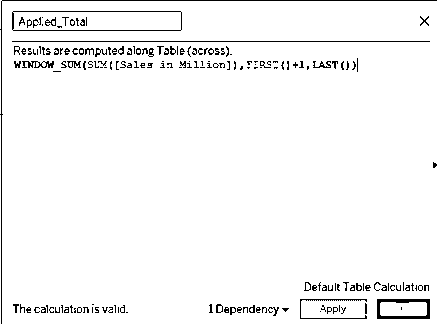

16.完成后，单击应用，然后单击确定。将更新的 Applied_Total 计算字段带入分析，我们得到如下所示的数字。

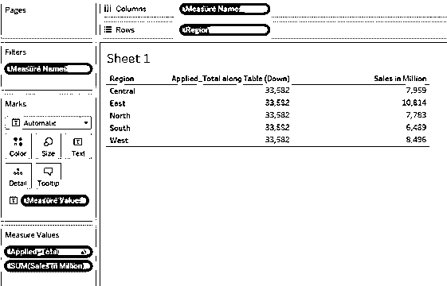

17.现在，我们感兴趣的是将五个地区的销售额与北部和南部地区的平均销售额进行比较。这里，我们将使用 Tableau 提供的窗口 AVG 函数。函数的实现如下截图所示。观察开始和结束参数。我们将上面的位置向下移动了两个位置，将下面的位置向上移动了一个位置，以便只获得北部和南部地区的销售平均值。完成后，应用计算并保存计算字段。

18.一旦该字段如上所述被更新，将其带入分析，我们就得到所需的平均值。下图显示了这一点。现在，我们可以将每个地区的销售额与南北平均销售额进行比较。

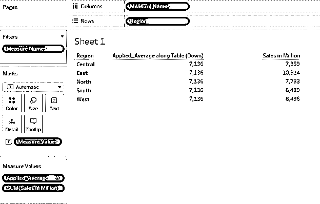

19.下图显示了 WINDOW_MAX 函数的应用程序，该程序与我们在上一节中讨论的程序相同。在这里，我们从东部、北部和南部地区获得了最大的销售额。

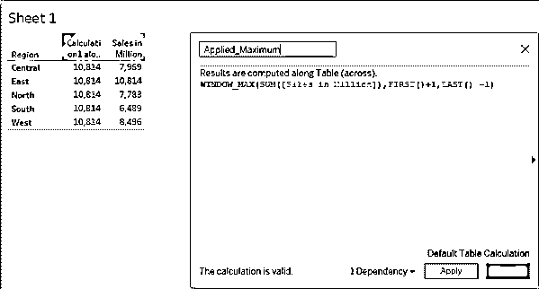

20.只要仔细观察下图。我们实现了 WINDOW_MEDIAN 函数。中位数函数给出了中间值。观察开始和结束参数。我们选择了东部和北部地区的中间值。我们应该用手动计算交叉验证结果，以验证该功能是否正常工作。这些窗口函数的实现方式与所有其他窗口函数的实现方式类似。然而，在实现之前了解概念总是好的。

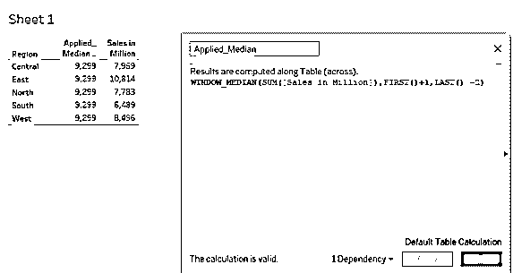

### 结论

窗口函数只是这些函数的标准形式的变体。Tableau 通过为我们提供窗口函数使事情变得更容易，特别是在涉及处理数据的选定部分的情况下。这些函数必须与各种示例一起使用才能正确理解它们。

### 推荐文章

这是一个 Tableau 窗口函数的指南。在这里，我们讨论了 tableau 中窗口函数的介绍和工作原理，并给出了详细的解释。您也可以阅读以下文章，了解更多信息——

1.  [Tableau 中的层级](https://www.educba.com/hierarchy-in-tableau/)
2.  [Tableau 中的组](https://www.educba.com/group-in-tableau/)
3.  [Tableau 版本](https://www.educba.com/tableau-versions/)
4.  [Tableau 动态参数](https://www.educba.com/tableau-dynamic-parameters/)
5.  [Python 中的 Max 函数指南](https://www.educba.com/max-function-in-python/)

