# Tableau 中的排序

> 原文：<https://www.educba.com/sorting-in-tableau/>

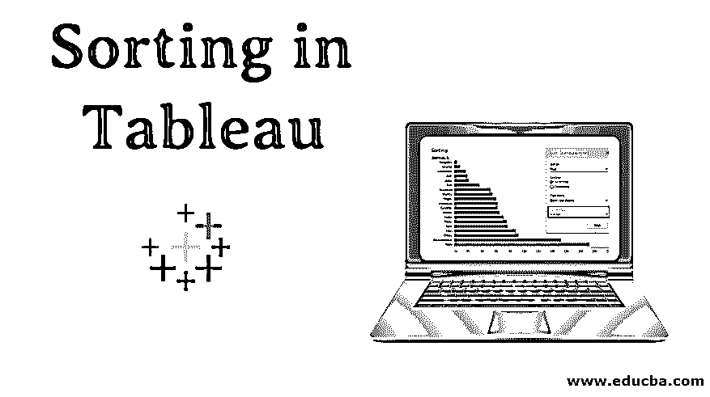

## Tableau 中的排序介绍

排序是分析数据的一个非常重要的特性。它帮助我们按要求的顺序排列数据，即。上升或下降，或基于多种因素的组合。这个看似简单的概念在 Tableau 中获得了重要性，因为可视化是基于所应用的排序方法以一种特殊的方式呈现的。在 Tableau 中，不同的排序安排通过可视化提供了对数据的不同见解。因此，Tableau 不局限于传统的数据排序方式；相反，它将它应用于可视化，并帮助我们通过视觉结果获得洞察力。在 Tableau 中，可以对多个维度进行排序。

### 分类在 Tableau 详细与插图

现在，让我们试着通过 Tableau 中的排序来理解分析的深度。在演示中，我们将使用产品的分销量数据。表中的维度是配送单位、DU 代码、区域、模式和城市。分发量是一种度量。分布单元是比区域更小的地理单元。

<small>Hadoop、数据科学、统计学&其他</small>

1.让我们先加载数据。在“数据”菜单中，单击“新建数据源”或单击“连接到数据”。这两个选项如下面两个截图所示。选择合适的数据源类型，加载数据。在这种情况下，数据源类型是 Microsoft Excel。

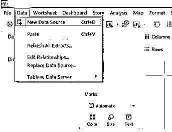

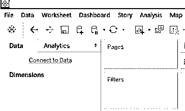

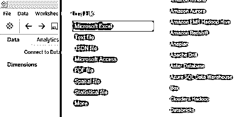

2.数据被加载，如下面的数据源选项卡所示。

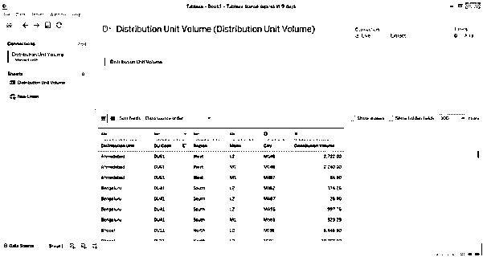

3.现在，转到工作表标签。在 sheet 选项卡中，我们可以看到各个部分下的尺寸和度量，如下所示。

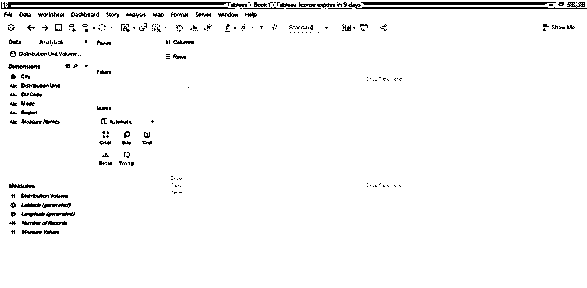

4.现在，将“分配单元”和“区域”维度拖到“行”区域，并将“分配量”度量到“列”区域。单击“演示”中的水平条形图图标。生成以下可视化，显示按分布单元的分布体积以及分布单元所属的区域。最初，结果按维度“分配单元”的字母顺序排序。

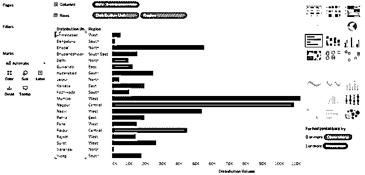

5.现在，我们将讨论各种排序方式。下面的截图展示了一种最简单的方法。单击尺寸标题附近的 AZ 符号。默认情况下，结果按尺寸值的字母顺序排序。单击该符号将按相反的字母顺序对结果进行排序。

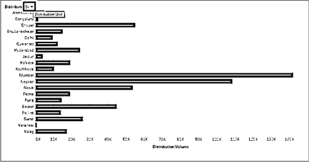

6.点击下拉按钮，如下图所示。这里有两种选择，即。字母和总和(发行卷)。因此，我们可以看到提供了所有可能的排序方式，因为结果可以按维度的字母顺序排序，也可以按升序或降序对度量进行排序。单击 SUM(分布体积)选项，以便对测量进行排序。

**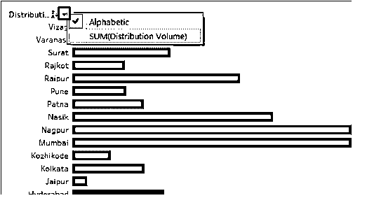

** 

7.按照上述步骤，对结果进行如下排序。可以看到，结果已经按照度量值的降序排序。

**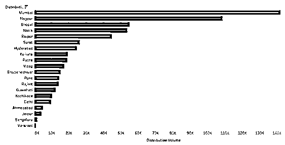

** 

8.只需再次单击排序符号，结果将按如下升序排序。再次单击排序符号将清除排序。

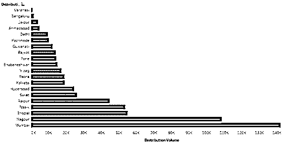

9.也可以通过单击排序符号对结果进行排序，如下所示

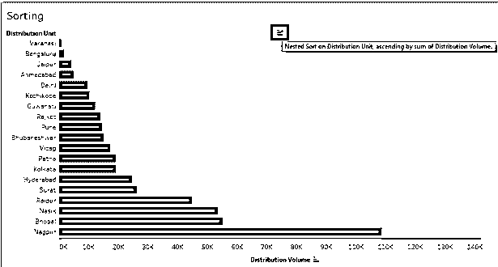

10.单击工具栏中的排序符号，如下所示。

**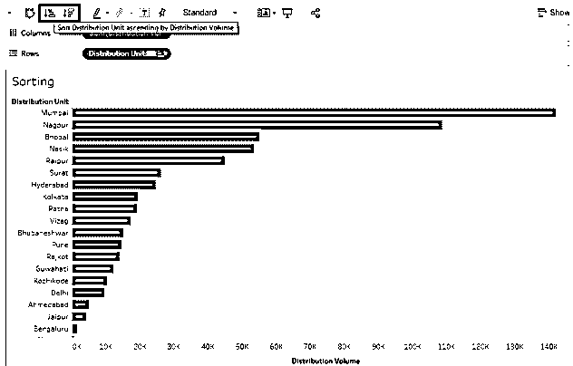

** 

11.上面的排序技术帮助我们快速方便地对数据进行排序。现在，我们将尝试发现其他选项。在维度的下拉菜单中，点击“清除排序”。它将清除之前应用的排序。

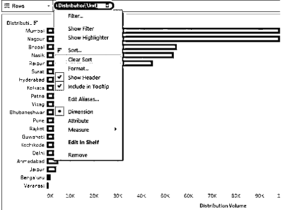

12.清除排序后，单击下拉菜单中清除排序选项正上方的排序选项。单击排序选项会生成对话框，如下图所示。这里有两种选择，即。“排序依据”和“排序顺序”。他们还会有多种选择。我们将一个一个地看到他们。

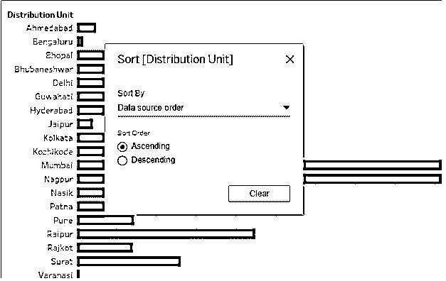

如上所示，默认的排序依据是“数据源顺序”。这个顺序基本上是字母顺序。

13.排序方式下拉菜单显示了多个选项。字母顺序按维度值的字母顺序对结果进行排序。选择“字段”选项以浏览更多选项。

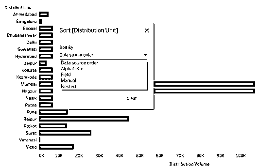

14.当我们在“排序依据”中选择“字段”时，对话框中会出现另外两个部分，即“字段名”和“聚合”。字段名意味着我们打算对哪个字段应用排序。请记住，如果一个字段不在可视化中，那么即使在字段名部分选择它也不会影响结果。在聚合中，我们可以选择所需的聚合函数。它表示我们希望如何在最终结果中聚合字段，例如平均值或中值。我们将在接下来的部分中详细了解这一点。最初，结果没有按度量排序，但是在“排序顺序”中选择升序，在“排序方式”中选择字段，结果就按升序排序了。

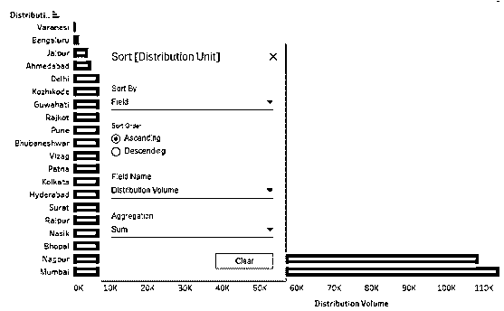

15.如下所示，结果已经按降序排序。这是对结果进行排序的另一种方式。

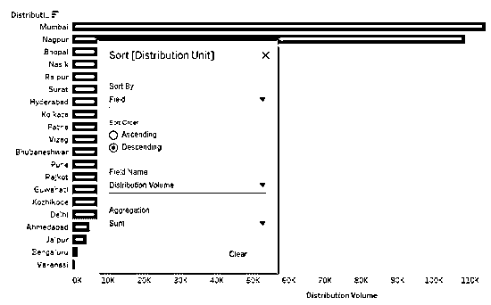

16.在字段名称部分，我们可以看到当前的分配单元被选中。我们可以根据需要选择任何领域。只需确保选择了适当的字段；否则，不正确的结果将返回如下。在这里，分配单位被选为字段名称值，排序没有按照我们想要的方式进行。这是因为分配单位是一个维度值，而不是一个度量，即数字变量。因此，Tableau 在聚合部分自动应用了 Count 函数。有时，我们可能会故意应用 Count 函数，但我们需要考虑一些事情，我们将在下面的部分看到它正确工作。

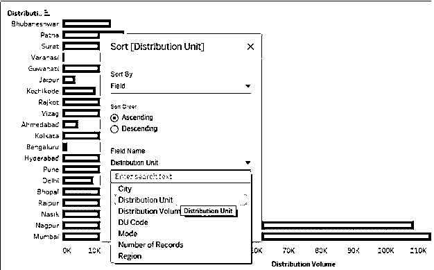

17.下面的屏幕截图显示了可以应用于字段名值的各种数学/统计函数或聚合函数(用数据库语言)。应用适当的函数只会返回正确的结果。如果我们应用下面的平均函数，将计算度量的维度(分布单元)平均值，并将其合并到输出中。可以看出，结果没有按照维度值平均值的升序排序。这是因为，在对话框中选择聚合函数时，我们需要确保对所有地方的度量应用相同的聚合函数，即在列区域和标记卡中(如果度量也出现在标记卡中)。

Median 函数将计算中值并相应地对结果进行排序。计数器将计算该字段有多少个值，并基于该计数；将进行排序。当我们选择 Count (Distinct)时，不会考虑所有值的计数，而只考虑唯一值的计数。百分比将考虑低于指定百分比的值。对列区域或标记卡中的度量应用函数时，该函数将要求指定百分比值。但是，对于聚合部分，默认的百分比值是 95%。Std。标准差和方差是统计函数。Std。标准差和方差属于样本标准差和样本方差，而标准差属于样本标准差和样本方差。开发(流行。)和方差(Pop。)关心的是人口数据。

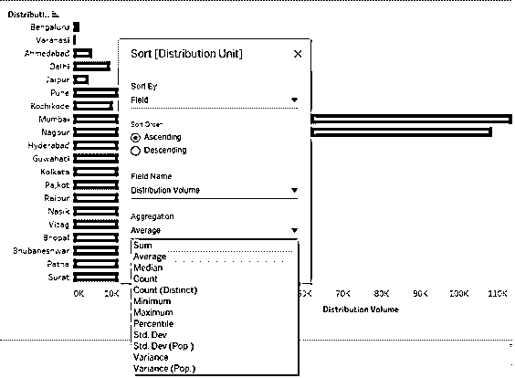

18.下面的屏幕截图显示，我们将 AVG 函数应用于“列”区域中的衡量标准(分配量)。与前面的屏幕截图一样，只有在满足此条件时，选择“聚合中的平均值”进行排序才有效。为了获得正确的结果，两个地方的聚合函数应该是相同的。

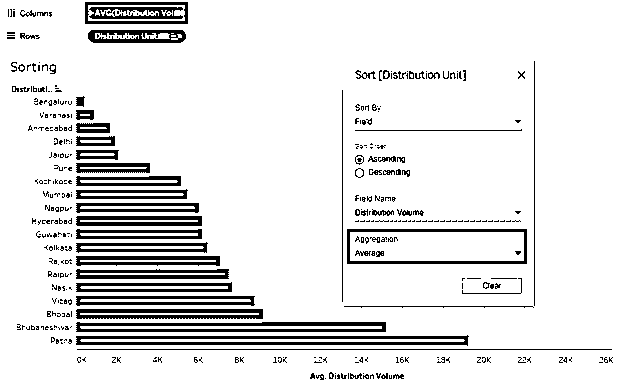

19.下面显示了如何使用不同的聚合函数进行排序的另一个示例。在这里，我们可以看到如何选择 CNT，即在“列”区域以及“排序”对话框的“聚合”部分中的度量上选择 Count 函数，从而根据分配单元的值的计数给出排序结果。

**T2】**

 **20.我们现在将在聚合部分应用标准差函数。可以看出，下面的屏幕截图显示了如何应用 STDEV(即标准差函数)对结果进行排序。如前所述，在列区域和聚合部分应用相同的函数是非常重要的。对于某些分配单元，标准偏差为零。这是因为标准差考虑了平均值的平方偏差。

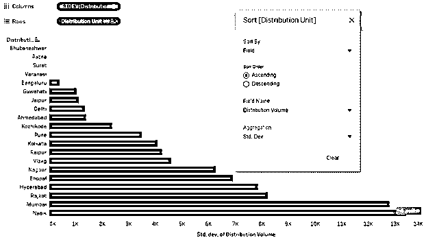

21.通过百分位函数的排序结果基于如下屏幕截图中所选的百分位值。让我们选择 10 作为百分位值。我们将看看使用百分位数函数排序是否正确。

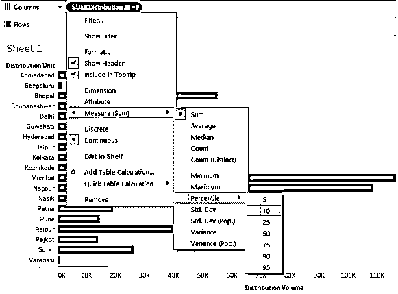

22.我们在两个位置应用了百分点函数，即列区域和聚合部分。然而，结果是不正确的。请注意，在测量中，即分布体积，我们应用了值为 10 的百分位数函数。对话框中百分位函数的默认百分位值是 95，这导致了不匹配。

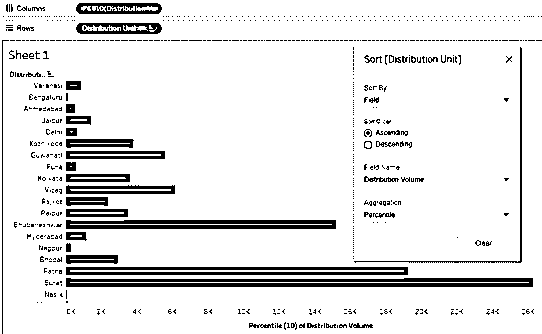

23.现在，我们选择 95 作为这两个地方的百分位值，并得到正确的结果。下面的屏幕截图显示了通过正确使用 percentile 函数获得的排序结果。

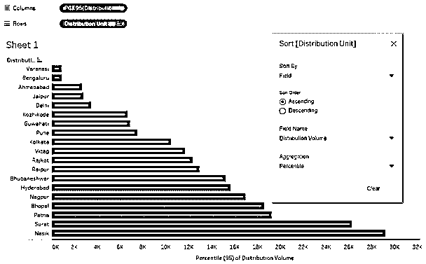

24.现在，我们将了解排序方式中的“手动”选项是如何工作的。顾名思义，使用手动选项，我们可以根据我们想要的位置向上或向下移动一个值。因此，通过向上或向下拖动尺寸值，我们可以根据需要移动它并对结果进行排序。当一个维度有多个值时，如多个类别等，手动排序可能不可行。下面的屏幕截图显示了手动排序的工作方式。排序对话框中的黑线显示尺寸值当前正被移至下方。

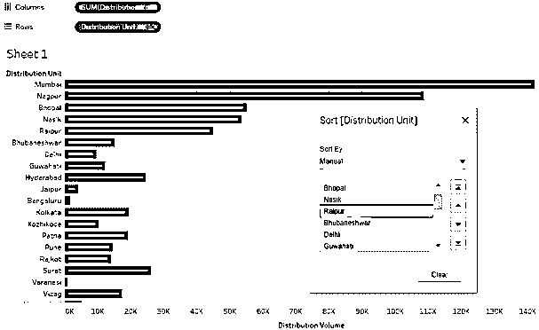

25.排序依据中的最后一个选项是“嵌套”。在 Tableau 的早期版本中，嵌套排序涉及复杂的步骤；然而，现在它是一个现成的选项，可以在下面的截图中看到。如果我们打算在一个度量值上对另一个维度中的一个维度进行排序，那么嵌套排序非常有用。像这里一样，我们将按升序或降序对地区和分销单位的分销量进行排序。

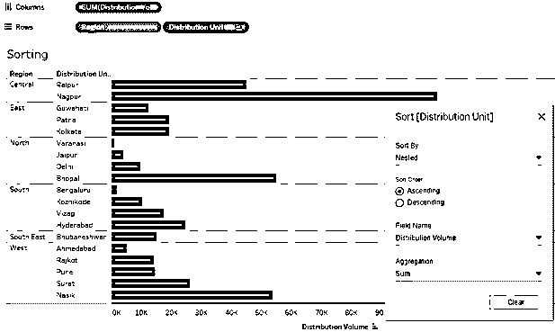

26.在前面几节中，我们看到了 Tableau 中对结果进行排序的一些标准方法。我们尝试探索每一个角度。现在，我们将看到一种非常规的排序技术。这种技术使我们能够以快速的方式对结果进行排序，就像有时我们可能对顶部和底部或者最小和最大值感兴趣一样。下面的演示说明了该方法。

首先将“维”区域和“分配单元”拖到“行”区域，将“衡量分配量”拖到“列”区域。单击“演示”选项卡中的文本表格图标；它给出了以下结果。

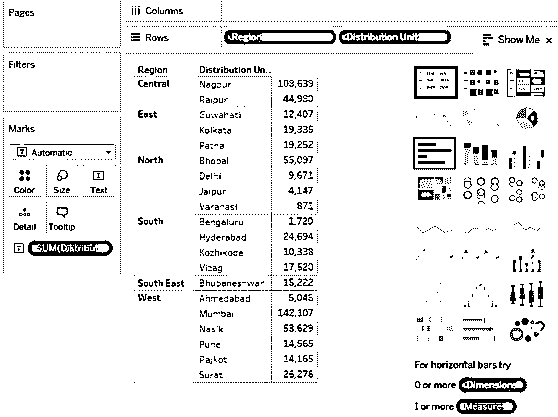

27.现在，第二次拖动分布体积。这次将它拖到 Marks 卡的细节上，如下图所示。

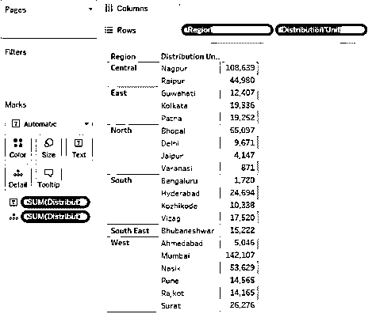

28.将测量分布体积的类型更改为“离散”,如左侧屏幕截图所示。右边的屏幕截图显示，将度量类型更改为离散将使度量以蓝色显示。现在，离散变量可以作为一个维度。

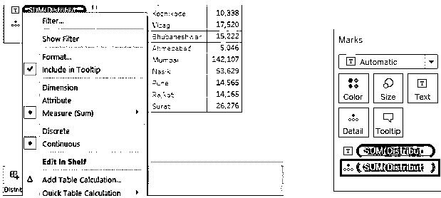

29.将新创建的离散度量拖到行区域，并将其放在区域维之前。可以看到，我们直接得到了排序后的结果。结果已按离散度量“分布体积”的升序排序。

**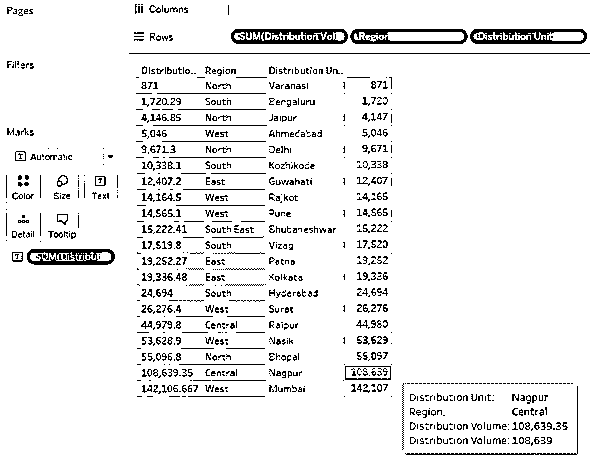

** 

30.如果我们希望根据分布单元所在的区域来可视化分布单元的分布量，并对其进行适当排序，我们可以遵循以下方式。首先，我们将“维度”区域和“分配单元”拖到“行”区域，并将“测量分配量”拖到“列”区域。这将创建区域性的组。为了区分每个组，我们将在标记卡中将区域拖到颜色上。要对每个组中的结果进行排序，我们将单击维度标题(即分配单元)附近的排序符号。结果将在每个组中单独排序，如下图所示。

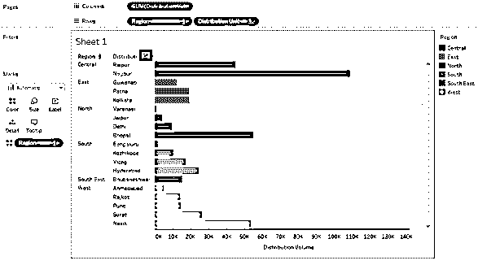

### 结论

排序是分析数据的基本工具。Tableau 结合多种因素，提供了从最简单到最复杂的多种结果排序方法。Tableau 为数据排序和以动态方式可视化数据提供了详尽的选项，这赋予了 Tableau 独特的特性。

### 推荐文章

这是一个 Tableau 排序指南。这里我们讨论 tableau 中排序的介绍和详细说明。您也可以阅读以下文章，了解更多信息——

1.  [Tableau 中的气泡图](https://www.educba.com/bubble-chart-in-tableau/)
2.  [Tableau 中的查找函数](https://www.educba.com/lookup-function-in-tableau/)
3.  [Tableau 中的堆积条形图](https://www.educba.com/stacked-bar-chart-in-tableau/)
4.  [c#排序完整指南及示例](https://www.educba.com/sorting-algorithms-in-java/)

**