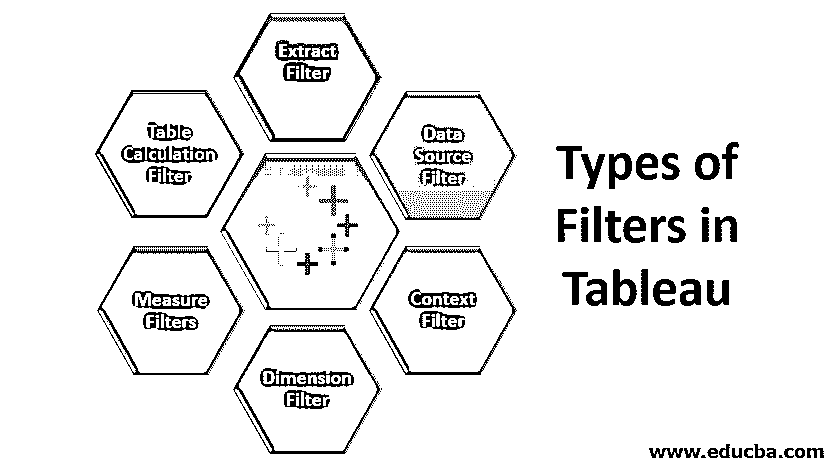
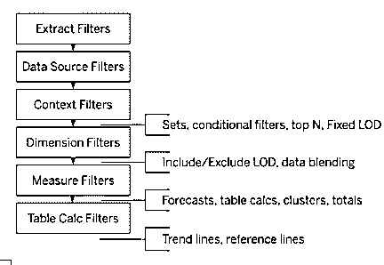
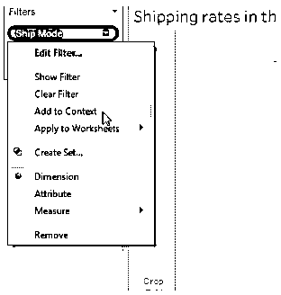
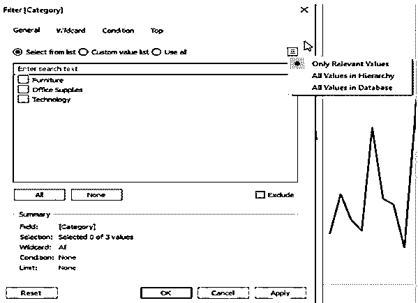
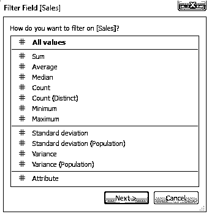

# Tableau 中的过滤器类型

> 原文：<https://www.educba.com/types-of-filters-in-tableau/>

## Tableau 中的过滤器类型介绍

Tableau 中的过滤器类型是受支持的过滤器条件，用于根据某些条件隔离数据集，并将特定数据值用于可视化。与其他可视化工具相比，Tableau 具有丰富的过滤功能。过滤器用于从 Tableau 的源数据集中移除不相关的记录。有几种类型的筛选器与 Tableau 环境中的数据处理相关联，例如提取筛选器、数据源筛选器、上下文筛选器、维度筛选器、度量筛选器和表计算筛选器。过滤器可用于保护数据集的敏感信息，同时共享公共受众。

它提供五种主要产品来满足专业人士和组织的业务需求:

<small>Hadoop、数据科学、统计学&其他</small>

*   ******Tableau Desktop****:Tableau 为个人使用打造的旗舰产品，意在开发仪表盘。**
***   ******Tableau Server****:用于任何解决方案或仪表盘的共享。*****   ******Tableau Reader****:这是一款用于读取 Tableau 文件类型的免费产品。*****   ******Tableau Online****:这是一个基于云的平台，允许用户分享、评估组织中的任何解决方案。*****   ******Tableau Public****:这是一个免费版本，可供学习专业人士用来评估和交互 Tableau 中可用的功能。**********

 ****### Tableau 中的过滤器类型

所有组织都使用过滤器来减少数据集的大小，并删除不相关的信息来提高性能或突出所需的信息。在 Tableau 中，有不同的方法来过滤数据集以提高数据效率。每个过滤器都有不同的用途，它们的执行顺序会极大地改变性能。Tableau 中使用了 6 种类型的过滤器，按执行顺序排序；

#### **1。提取过滤器**

 **我们可以在将数据集加载到 Tableau 时使用提取过滤器，这样可以减少 Tableau 查询数据源的次数。我们可以根据需要通过对提取应用过滤器来进一步减少数据的大小。

#### **2。数据源过滤器**

 **这在将数据加载到 [Tableau](https://www.educba.com/tableau-context-filter/) 时过滤掉我们想要控制的任何重要或敏感信息。它对实时连接和提取连接都有效。我们可以通过单击 add 选项在任何列上添加数据源过滤器。

单击添加选项后，将出现添加过滤器对话框，其中包含所有字段，然后我们可以选择要应用过滤器的字段。我们还可以根据需要编辑或删除数据源过滤器。

#### **3。上下文过滤器**

 **Tableau 中使用的过滤器通常是独立的过滤器，它们产生自己的结果，但也有一些过滤器被执行来处理第一个过滤器返回的记录。上下文筛选器是一个独立的筛选器，它从原始数据集中创建一个不同的工作表，并在筛选的数据集中进行计算。它可以用来提高大型数据源的性能。可以通过将维度拖动到过滤器部分框并单击添加到上下文选项来创建它们。点击此处，尺寸将变为灰色，这是上下文过滤器的指示。

它还可以用于查看任何特定类别中的前 N 名产品。我们还可以删除上下文过滤器。

#### **4。维度过滤器**

 **维度中的字段包含离散的分类数据，我们可以排除或包含要分析的值。添加维度过滤器的过程很简单，如下所示:

*   将维度从维度列表拖到筛选器节框中。
*   这将打开一个过滤器对话框，我们可以在其中选择我们想要分析的值。

“过滤器”对话框中有四个选项卡:

1.  **常规:**选择我们想要包含或排除的维度中的成员。
2.  **通配符**:根据特定模式过滤结果。例如，如果我们想要过滤特定域的电子邮件地址，那么我们可以使用以“@yahoo.com”结尾的过滤器来包含这些电子邮件地址。
3.  **条件:**根据特定条件过滤结果。
4.  **Top:** 过滤特定类别的前 N 个产品。

#### **5。测量过滤器**

 **测量字段包含定量数据，这些过滤器应用于测量字段。它可以通过以下步骤应用:

将测量字段从测量框拖动到过滤器部分，将打开一个包含各种操作的过滤器对话框。

选择需要执行的操作，然后单击下一步。在随后的对话框中，有 4 种类型的过滤器:

1.  **范围:**选择包含在结果中的数值范围。
2.  **至少:**选择一个度量的最小值来过滤数据。
3.  **最多:**选择一个度量的最大值来过滤数据。
4.  **特殊:**选择空值或非空值。

#### **6。表格计算过滤器**

 **当我们不想在不改变底层数据的情况下过滤视图时，可以使用这些过滤器。表计算是创建计算字段时使用的函数，如 LOOKUP、WINDOW_SUM、WINDOW_AVG 等。

### 结论-表格中的过滤器类型

Tableau 筛选器在许多组织中用于生成强大的结果，并以仪表板或工作表的形式向客户提供相关信息，以便做出正确的业务决策。这些过滤器还可以用来过滤敏感数据和托管可以与同事共享的信息。

### 推荐文章

这是 Tableau 中过滤器类型的指南。这里我们讨论 tableau 中的介绍和不同类型的过滤器。你也可以看看下面的文章来了解更多-

1.  [Python 中的抽象类](https://www.educba.com/abstract-class-in-python/)
2.  [Java 中的抽象类](https://www.educba.com/abstract-class-in-java/)
3.  [Tableau 聚合函数](https://www.educba.com/tableau-aggregate-functions/)
4.  [c++中的构造函数和析构函数](https://www.educba.com/constructor-and-destructor-in-c-plus-plus/)

****************